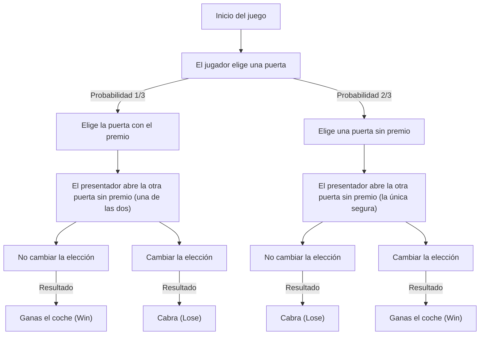
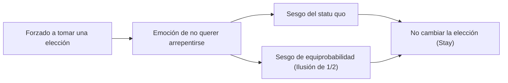

# Introducción: La trampa en la que cae la intuición humana y el mundo de la probabilidad

En nuestra vida diaria, la "intuición" funciona como una herramienta de toma de decisiones sumamente poderosa. La capacidad de juzgar instantáneamente una situación y elegir cómo actuar basándonos en reglas empíricas y heurísticas es un regalo de la evolución que la humanidad adquirió para sobrevivir en entornos naturales hostiles. Sin embargo, este excelente sistema intuitivo tiene una debilidad que provoca errores fatales bajo ciertas condiciones. El ejemplo más notable de esto es cuando nos enfrentamos a problemas relacionados con la "probabilidad".

La teoría de la probabilidad es un marco matemático para evaluar cuantitativamente eventos inciertos, pero sus conclusiones a menudo chocan violentamente con nuestra intuición. Este fenómeno ha sido estudiado durante mucho tiempo en los campos de la psicología, la economía conductual y la educación matemática como "sesgo cognitivo" y "divergencia entre intuición y lógica".

En este artículo abordaremos la paradoja más famosa que simboliza esta divergencia entre la intuición y la probabilidad: el "problema de Monty Hall". A pesar de su aparente simplicidad, este problema desató una gran controversia que involucró a reconocidos matemáticos y científicos de todo el mundo. A través de la pregunta "¿Por qué caemos en una trampa de probabilidad tan simple?", exploraremos de manera profunda y exhaustiva los límites de nuestra estructura cognitiva y la importancia del pensamiento lógico.

## Capítulo 1: ¿Qué es el problema de Monty Hall?

[El problema de Monty Hall](/es/p/monty-hall-problem/) es una paradoja de probabilidad que recibe su nombre de Monty Hall, el presentador del antiguo programa de televisión estadounidense "Let's Make a Deal". El problema se dio a conocer ampliamente al público en 1990, cuando apareció en la columna "Ask Marilyn" de la revista de noticias Parade.

### Configuración del problema

Imagina que eres un concursante en un programa de televisión. Frente a ti hay tres puertas cerradas (Puerta A, Puerta B y Puerta C).

1. Detrás de una de las puertas hay un "coche nuevo (premio)".
2. Detrás de las otras dos puertas hay "cabras (sin premio)".
3. Si adivinas dónde está el coche nuevo, te lo puedes quedar.

Las reglas y el desarrollo del juego son los siguientes:

1. Primero, eliges una de las tres puertas (por ejemplo, supongamos que eliges la **Puerta A**).
2. Monty, el presentador del programa, sabe qué hay detrás de cada puerta.
3. De las dos puertas que no elegiste (Puerta B y Puerta C), Monty **siempre abre una puerta que tiene una cabra** (por ejemplo, si la cabra está en la Puerta B, abre la Puerta B).
4. Luego, Monty te pregunta:
   **"Puedes cambiar a la Puerta C. ¿Quieres cambiar tu elección?"**

Ahora bien, aquí está la pregunta.
**¿Deberías cambiar de elección? ¿O deberías mantener tu elección inicial (Puerta A)? ¿Qué opción tiene una mayor probabilidad de ganar el coche nuevo?**

### La respuesta según la intuición

Cuando a la mayoría de las personas se les presenta este problema, razonan de la siguiente manera:

"Había tres puertas y se abrió una (la de la cabra). Solo quedan dos: la que elegí (Puerta A) y otra puerta cerrada (Puerta C). Dado que el coche nuevo está detrás de alguna de las dos, la probabilidad de cada una debe ser del 50% (1/2). Por lo tanto, cambie o no de elección, la probabilidad de ganar es la misma, y no hay necesidad de molestarse en cambiar".

Esta respuesta intuitiva es muy persuasiva, y una abrumadora mayoría de personas (alrededor del 85% o más, según algunas encuestas) responde que "cambiar la elección no cambia la probabilidad (1/2)".

Sin embargo, **la respuesta matemáticamente correcta es que "deberías cambiar de elección"**. Si cambias de elección, la probabilidad de ganar el coche nuevo salta a **2/3 (aprox. 66.7%)**, lo que es el doble de la probabilidad de **1/3 (aprox. 33.3%)** que tendrías si mantuvieras tu elección inicial.

Cuando Marilyn vos Savant (una mujer que entonces figuraba en el Libro Guinness de los Récords por tener el coeficiente intelectual más alto del mundo) presentó esta respuesta, recibió alrededor de 10,000 cartas de protesta de todo Estados Unidos. Entre ellas, había unas 1,000 cartas de matemáticos y científicos con doctorados que la atacaban duramente, con comentarios como "No entiendes las matemáticas en absoluto" o "Es una fantasía ilógica de mujer".

¿Por qué se equivocaron tantos intelectuales? En el siguiente capítulo desentrañaremos la prueba matemática.

## Capítulo 2: La verdad de la probabilidad y la prueba matemática

¿Por qué una probabilidad que parece ser "1/2" a la intuición se convierte en "2/3 si cambias de elección"? Para entender esto, necesitamos reevaluar el problema desde diferentes enfoques.

### Enfoque de prueba 1: Enumeración de todos los patrones (pensamiento de diagrama de árbol)

El método más seguro y fácil de entender es enumerar todos los patrones posibles y calcular las probabilidades.
Dado que la puerta detrás de la cual está el coche se determina aleatoriamente, cada uno de los siguientes tres casos ocurre con una probabilidad de 1/3:

- Caso 1: El coche nuevo está en la "Puerta A"
- Caso 2: El coche nuevo está en la "Puerta B"
- Caso 3: El coche nuevo está en la "Puerta C"

Suponiendo que eliges la **Puerta A** inicialmente, veamos los resultados de "mantener la elección" y "cambiar la elección" en cada caso.

| Caso | Ubicación del coche | Tu elección | Puerta que abre el presentador | Si mantienes la elección | Si cambias la elección |
|---|---|---|---|---|---|
| 1 (1/3) | Puerta A | Puerta A | B o C (Cabra) | **Ganas el coche** (Win) | Cabra (Lose) |
| 2 (1/3) | Puerta B | Puerta A | Puerta C (Cabra) | Cabra (Lose) | **Ganas el coche** (Win) |
| 3 (1/3) | Puerta C | Puerta A | Puerta B (Cabra) | Cabra (Lose) | **Ganas el coche** (Win) |

Como es evidente en esta tabla, solo ganas el coche en el Caso 1 (probabilidad de 1/3) si "mantienes la elección". Por otro lado, ganas el coche en los Casos 2 y 3 si "cambias la elección", sumando una probabilidad total de 2/3.
En otras palabras, no es más que una comparación entre **"la probabilidad de haber elegido la respuesta correcta desde el principio (1/3)"** y **"la probabilidad de haber elegido una incorrecta al principio (2/3)"**. Dado que el presentador elimina una de las opciones incorrectas, la mala suerte de "haber elegido una incorrecta al principio" se invierte en la buena suerte de "convertirse siempre en un premio" al cambiar de elección.

### Enfoque de prueba 2: Teoría de la información y un modelo extremo

Cuando la intuición interfiere con tres puertas, aumentar drásticamente el número de puertas ayuda a comprender el problema.

Imagina que hay "1 millón de puertas".
1. Eliges una puerta (Puerta número 1). En este punto, la probabilidad de acertar es de 1/1,000,000.
2. Monty, el presentador, conoce la respuesta. Abre 999,998 de las restantes 999,999 puertas, todas con cabras.
3. Las únicas puertas cerradas son la "Puerta 1" que elegiste y la "Puerta 777,777" que Monty dejó sin abrir.

En este momento, ¿qué pensarías?
Es obvio cuál probabilidad es mayor: "la probabilidad de que tu Puerta 1 elegida inicialmente fuera la correcta por casualidad (1/1,000,000)" o "la probabilidad de que te hayas equivocado, y Monty haya evitado intencionalmente la Puerta 777,777 correcta, abriendo todas las demás (999,999/1,000,000)".
Naturalmente, cambiarías a la Puerta 777,777. Incluso con tres puertas, la estructura matemática subyacente es exactamente la misma.

### Enfoque de prueba 3: Diagrama de transición de estados con Mermaid

Para profundizar en la comprensión visual, representemos el progreso del juego con un diagrama de flujo.

A partir de este diagrama, podemos ver que **si actúas de manera que "cambias tu elección" a partir del estado de "elegir una puerta sin premio inicialmente (probabilidad 2/3)", alcanzarás el "coche nuevo" con un 100% de probabilidad**. Por el contrario, si cambias de elección después de elegir inicialmente la puerta ganadora (probabilidad 1/3), definitivamente obtendrás una cabra.
Por lo tanto, la probabilidad esperada de ganar con la estrategia de cambiar la elección es de 2/3 × 100% = 2/3.

## Capítulo 3: Solución rigurosa mediante el teorema de Bayes

[El problema de Monty Hall](/es/p/monty-hall-problem/) se puede resolver matemáticamente de manera más rigurosa utilizando el "[Teorema de Bayes](/es/p/bayes-theorem/)" para calcular la probabilidad condicional. La estimación bayesiana es una herramienta poderosa que indica cómo actualizar una probabilidad previa (probabilidad a priori) cuando se obtiene nueva información (evidencia) para llegar a una probabilidad posterior (probabilidad a posteriori).

Definamos los eventos de la siguiente manera:
- $C_i$ : Evento en el que el coche nuevo está en la puerta $i$ ($i \in \{A, B, C\}$)
- $M_j$ : Evento en el que Monty abre la puerta $j$ ($j \in \{A, B, C\}$)

Supongamos que el jugador elige inicialmente la "Puerta A".
Las probabilidades a priori son equiprobables porque no tenemos información sobre en qué puerta está el coche nuevo:
$P(C_A) = 1/3$
$P(C_B) = 1/3$
$P(C_C) = 1/3$

Ahora supongamos que Monty abre la "Puerta B". Una vez obtenida esta información, calculamos la probabilidad de que el coche nuevo esté en la Puerta A (probabilidad a posteriori $P(C_A|M_B)$) y la probabilidad de que esté en la Puerta C (probabilidad a posteriori $P(C_C|M_B)$).

Las reglas de comportamiento de Monty (probabilidad condicional $P(M_B|C_i)$) son las siguientes:
1. Si el coche nuevo está en la Puerta A ($C_A$), Monty abre la B o la C al azar, por lo que $P(M_B|C_A) = 1/2$
2. Si el coche nuevo está en la Puerta B ($C_B$), Monty nunca puede abrir la B, por lo que $P(M_B|C_B) = 0$
3. Si el coche nuevo está en la Puerta C ($C_C$), Monty no puede abrir la C, ni la A porque el jugador la eligió. Por lo tanto, se ve obligado a abrir la B, lo que significa que $P(M_B|C_C) = 1$

La fórmula del [teorema de Bayes](/es/p/bayes-theorem/) es la siguiente:
$P(C_i|M_B) = \frac{P(M_B|C_i) P(C_i)}{P(M_B)}$

Calculamos el denominador $P(M_B)$ (la probabilidad total de que Monty abra la puerta B) usando el teorema de la probabilidad total:
$P(M_B) = P(M_B|C_A)P(C_A) + P(M_B|C_B)P(C_B) + P(M_B|C_C)P(C_C)$
$P(M_B) = (1/2 \times 1/3) + (0 \times 1/3) + (1 \times 1/3) = 1/6 + 0 + 1/3 = 1/2$

Ahora calculemos las probabilidades a posteriori.

**Probabilidad de que el coche nuevo esté en la Puerta A (mantener la elección):**
$P(C_A|M_B) = \frac{P(M_B|C_A) P(C_A)}{P(M_B)} = \frac{(1/2) \times (1/3)}{1/2} = 1/3$

**Probabilidad de que el coche nuevo esté en la Puerta C (cambiar la elección):**
$P(C_C|M_B) = \frac{P(M_B|C_C) P(C_C)}{P(M_B)} = \frac{1 \times (1/3)}{1/2} = 2/3$

De esta manera, usando el [teorema de Bayes](/es/p/bayes-theorem/), se demuestra matemáticamente y a la perfección que la probabilidad se actualiza mediante nueva información (el hecho de que Monty abriera la puerta B), y que la probabilidad de la Puerta C salta a 2/3.

## Capítulo 4: ¿Por qué se equivoca la intuición humana? (Factores psicológicos y cognitivos)

Sin importar cuántas veces se les muestre la prueba matemática, muchas personas sienten que "todavía no pueden aceptarlo" o "sienten que los están engañando". ¿Por qué el cerebro humano es tan vulnerable a este problema? Investigaciones en psicología y economía conductual han revelado la participación de varios sesgos cognitivos graves.

### 1. Sesgo de equiprobabilidad (Equiprobability Bias)

Los seres humanos tienen una fuerte tendencia inconsciente a asumir que "cuando hay opciones disponibles, sus probabilidades deben ser iguales" en eventos aleatorios o situaciones inciertas.
En [el problema de Monty Hall](/es/p/monty-hall-problem/), finalmente quedan dos opciones: la "Puerta A" y la "Puerta C". En el momento en que esta información visual y situacional de "dos opciones" ingresa al cerebro, se activa una heurística poderosa: "Como hay dos opciones, la probabilidad es de 1/2 para cada una".
Nuestro cerebro aísla e ignora de la "situación actual" la "información asimétrica" de su contexto histórico (el hecho de que inicialmente había tres puertas y que Monty abrió intencionalmente una incorrecta).

### 2. Confusión entre causalidad e "intención"

Tendemos a tratar de entender la causalidad de las cosas de forma lineal.
De manera similar a la "falacia del jugador" (Gambler's fallacy), donde alguien piensa "pronto saldrá negro" después de que salga rojo 5 veces seguidas en la ruleta, en [el problema de Monty Hall](/es/p/monty-hall-problem/) subestimamos la "actualización de la información".

Lo importante aquí es que **"el presentador Monty no abre una puerta al azar"**.
Si el presentador no supiera nada, abriera una puerta al azar y "resultara ser una cabra", la probabilidad de las dos puertas restantes sería realmente de 1/2 (esto se llama el "problema del presentador ignorante").
Sin embargo, Monty tiene una fuerte restricción (intención) de "siempre abrir la cabra". La intuición humana no puede procesar correctamente esta "asimetría de información debida a una elección intencional" y solo se centra en el hecho físico de que "simplemente hay una puerta menos".

### 3. Sesgo del statu quo (Status Quo Bias) y evitación del arrepentimiento

Desde la perspectiva de la economía conductual, el "sesgo del statu quo" tiene un gran impacto.
Los seres humanos son criaturas que sienten que el daño psicológico del arrepentimiento por haber actuado y fracasado (error de comisión) es mucho mayor que el arrepentimiento por no haber actuado y fracasado (error de omisión).

Imagina "si cambias tu elección y la primera puerta era la correcta". Te atormentaría un intenso arrepentimiento pensando: "¡No debería haberme molestado en cambiar!". Por otro lado, "si no cambias tu elección y pierdes", es más fácil resignarse pensando: "Bueno, no se puede evitar, tuve mala suerte".
De esta manera, el mecanismo de defensa emocional de "querer minimizar el arrepentimiento" entra en juego, creando la distorsión cognitiva de "es lo mismo si lo cambias o no (o eso quiero creer)" y, finalmente, llevándote a elegir "mantener el statu quo" (Stay).

## Capítulo 5: Las lecciones de la paradoja en la vida diaria

[El problema de Monty Hall](/es/p/monty-hall-problem/) es más que un simple concurso de preguntas o un acertijo matemático. Las lecciones que nos enseña esta paradoja tienen un valor universal que se puede aplicar a varios campos, como nuestra vida cotidiana, los negocios, la medicina y el desarrollo de IA.

### Conflicto entre datos e intuición (el problema de los falsos positivos en medicina)

La interpretación de la "precisión de las pruebas" en el campo de la medicina es también un ejemplo clásico de cómo divergen la intuición y la probabilidad bayesiana.
Por ejemplo, supongamos que hay "una enfermedad intratable que afecta a 1 de cada 10,000 personas" y la precisión de la prueba es del "99% (identifica correctamente al 99% de las personas positivas como positivas y al 99% de las personas negativas como negativas)".
Si te haces esta prueba y das "positivo", ¿cuál es la probabilidad de que realmente tengas la enfermedad intratable?

Intuitivamente, puedes desesperarte y pensar: "Como la precisión es del 99%, la probabilidad de que esté enfermo también debe ser del 99%".
Sin embargo, al calcularlo con el [teorema de Bayes](/es/p/bayes-theorem/), la probabilidad de estar realmente enfermo es **solo un poco menos del 1% (alrededor del 0.98%)**. Como el 1% (alrededor de 100 personas) de la abrumadora mayoría de "personas sanas (9,999 personas)" serán "falsos positivos", dentro del grupo de personas que dieron positivo, los pacientes reales (casi 1 persona) serán una minoría absoluta.

Esta enorme divergencia entre la evaluación de probabilidad intuitiva (99%) y la verdad matemática (1%) corre el riesgo de causar pánico innecesario y decisiones médicas erróneas en las personas. Entender [el problema de Monty Hall](/es/p/monty-hall-problem/) es el primer paso para adquirir los conocimientos necesarios para evaluar correctamente esta "asimetría de información y probabilidad a priori".

### El valor de la información en la estrategia empresarial

En los negocios, los movimientos de la competencia y las reacciones del mercado son equivalentes a "la puerta que abre Monty".
Supongamos que tu empresa elige cierta estrategia (Puerta A). Luego, recibes nueva información, como cambios en el entorno del mercado o fracasos de tus competidores (se abre una puerta incorrecta).
En ese momento, ¿"te aferras obstinadamente a la estrategia original (sesgo del statu quo)" o "evalúas la nueva información bayesianamente y cambias tu estrategia (cambias tu elección)"? Esto puede interpretarse como una lección de que las empresas que pueden cambiar de estrategia con flexibilidad tienen una mayor probabilidad de éxito (2/3) a largo plazo. Es importante tomar decisiones basadas siempre en la "probabilidad a posteriori", sin dejarse atrapar por los costos hundidos.

## Conclusión: La inteligencia es el coraje de "dudar de tu intuición"

Lo que hace que [el problema de Monty Hall](/es/p/monty-hall-problem/) sea tan fascinante y aterrador es que resalta maravillosamente "los límites de la inteligencia humana". Incluso expertos con doctorados se dejaron engañar por su primera intuición y reaccionaron emocionalmente contra la prueba correcta.

Vivimos dependiendo de una poderosa arma llamada "intuición" que hemos adquirido en nuestro proceso evolutivo. Sin embargo, en la sociedad moderna compleja y llena de datos, debemos darnos cuenta de que nuestra intuición a veces puede tendernos una trampa.

[El problema de Monty Hall](/es/p/monty-hall-problem/) nos transmite un mensaje importante.
Ese mensaje es **"la importancia de no confiar ciegamente en nuestra intuición, sino detenernos y reconsiderar utilizando las herramientas de la lógica y las matemáticas"**. Aceptar verdades que a primera vista parecen contraintuitivas requiere humildad intelectual y el coraje para actualizar nuestras propias suposiciones.

La próxima vez que te enfrentes a una decisión crucial en la vida y obtengas nueva información (una puerta abierta), por favor, recuerda este problema de Monty Hall. ¿No ha cambiado la probabilidad con esa información? ¿No estás atrapado por el sesgo del statu quo?
La decisión lógica de "cambiar tu elección" podría traerte el coche nuevo que está justo frente a ti.
