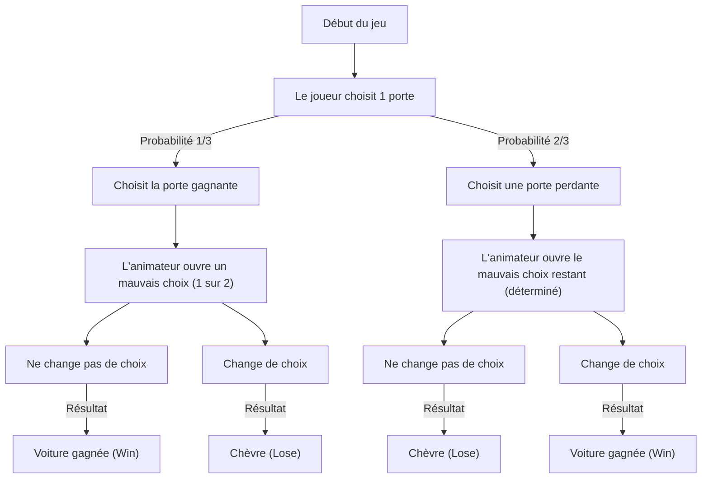
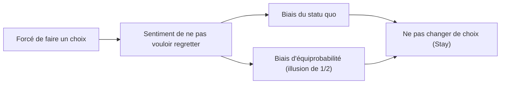

# Introduction : Le piège de l'intuition humaine et le monde des probabilités

Dans notre vie quotidienne, l'« intuition » fonctionne comme un outil de prise de décision extrêmement puissant. La capacité à juger instantanément une situation et à choisir une action, basée sur l'expérience et l'heuristique (méthode de simplification), est un don de l'évolution que l'humanité a acquis pour survivre dans un environnement naturel hostile. Cependant, cet excellent système intuitif a pour faiblesse de provoquer des erreurs fatales dans certaines conditions. L'exemple le plus frappant se produit lorsque l'on est confronté à des problèmes liés aux « probabilités ».

La théorie des probabilités est un cadre mathématique permettant d'évaluer quantitativement des événements incertains, mais ses conclusions entrent souvent en collision violente avec notre intuition. Ce phénomène est étudié depuis longtemps dans les domaines de la psychologie, de l'économie comportementale et de l'enseignement des mathématiques sous les noms de « biais cognitif » et de « divergence entre intuition et logique ».

Cet article aborde le paradoxe le plus célèbre symbolisant cette divergence entre intuition et probabilité : le « problème de Monty Hall ». Ce problème, malgré son apparente simplicité, a suscité d'énormes controverses impliquant d'éminents mathématiciens et scientifiques du monde entier. À travers la question « Pourquoi tombons-nous dans un piège de probabilité aussi simple ? », nous explorerons en profondeur et de manière exhaustive les limites de la structure cognitive humaine et l'importance de la pensée logique.

## Chapitre 1 : Qu'est-ce que le problème de Monty Hall ?

Le problème de Monty Hall est un paradoxe probabiliste nommé d'après Monty Hall, le présentateur de la célèbre émission de télévision américaine *Let's Make a Deal*. Ce problème a été largement connu du public en 1990 lorsqu'il a été présenté dans la chronique « Ask Marilyn » du magazine d'information *Parade*.

### Paramètres du problème

Imaginez que vous êtes un candidat à un jeu télévisé. Devant vous se trouvent trois portes fermées (Porte A, Porte B et Porte C).

1. Derrière une porte se trouve une « voiture neuve (le bon choix) ».
2. Derrière les deux autres portes se trouvent des « chèvres (les mauvais choix) ».
3. Si vous devinez où se trouve la voiture, vous la gagnez.

Les règles et le déroulement du jeu sont les suivants :

1. Tout d'abord, vous choisissez l'une des trois portes (supposons par exemple que vous choisissiez la **Porte A**).
2. L'animateur de l'émission, Monty, sait derrière quelle porte se trouve la voiture.
3. Monty ouvre **toujours l'une des portes derrière laquelle se trouve une chèvre** parmi les deux portes que vous n'avez pas choisies (Porte B et Porte C). (Par exemple, s'il y a une chèvre derrière la Porte B, il ouvre la Porte B).
4. Ensuite, Monty vous demande :
   **« Voulez-vous changer pour la Porte C ? Changez-vous votre choix ? »**

Voici maintenant le problème :
**Devez-vous changer votre choix ? Ou devez-vous conserver votre choix initial (Porte A) ? Laquelle de ces options a la plus grande probabilité de gagner la voiture ?**

### Réponse basée sur l'intuition

Lorsque ce problème est posé à la plupart des gens, ils raisonnent de la manière suivante :

« Il y avait trois portes et l'une d'elles (la porte de la chèvre) a été ouverte. Il ne reste que deux portes : celle que j'ai choisie (Porte A) et l'autre porte fermée (Porte C). La voiture étant derrière l'une d'elles, les probabilités doivent être de 50 % (1/2) pour chacune. Par conséquent, que je change de choix ou non, les chances de gagner sont les mêmes, il n'est donc pas nécessaire de changer. »

Cette réponse intuitive est très convaincante, et une écrasante majorité de personnes (environ 85 % ou plus selon certaines études) répondent : « Même si je change de choix, la probabilité ne change pas (1/2). »

Cependant, **la réponse mathématiquement correcte est : « Vous devriez changer de choix »**. Si vous changez de choix, la probabilité d'obtenir la voiture bondit à **2/3 (environ 66,7 %)**, ce qui est le double de la probabilité de **1/3 (environ 33,3 %)** si vous conservez votre choix initial.

Lorsque cette réponse a été présentée par Marilyn vos Savant (une femme reconnue par le Livre Guinness des records à l'époque comme ayant le QI le plus élevé au monde), environ 10 000 lettres de réfutation ont afflué de tous les États-Unis. Parmi elles se trouvaient environ 1 000 lettres de mathématiciens et scientifiques titulaires de doctorats, l'accusant violemment de « ne rien comprendre aux mathématiques » ou d'être une « illusion illogique de femme ».

Pourquoi tant d'intellectuels se sont-ils trompés ? Nous allons démêler la preuve mathématique dans le chapitre suivant.

## Chapitre 2 : La vérité sur les probabilités et la preuve mathématique

Pourquoi une probabilité qui semble être de « 1/2 » intuitivement devient-elle « 2/3 si vous changez de choix » ? Pour comprendre cela, nous devons réexaminer le problème sous différents angles.

### Approche de preuve 1 : Énumération de tous les cas (pensée en diagramme en arbre)

La méthode la plus sûre et la plus facile à comprendre consiste à énumérer tous les cas possibles et à calculer les probabilités.
L'emplacement de la voiture étant déterminé au hasard, les trois cas suivants se produisent chacun avec une probabilité de 1/3.

- Cas 1 : La voiture est derrière la « Porte A »
- Cas 2 : La voiture est derrière la « Porte B »
- Cas 3 : La voiture est derrière la « Porte C »

En supposant que vous ayez initialement choisi la **Porte A**, examinons les résultats de « conserver le choix » et de « changer le choix » dans chaque cas.

| Cas | Emplacement de la voiture | Votre choix | Porte ouverte par l'animateur | Si vous conservez le choix | Si vous changez de choix |
|---|---|---|---|---|---|
| 1 (1/3) | Porte A | Porte A | B ou C (chèvre) | **Voiture gagnée** (Win) | Chèvre (Lose) |
| 2 (1/3) | Porte B | Porte A | Porte C (chèvre) | Chèvre (Lose) | **Voiture gagnée** (Win) |
| 3 (1/3) | Porte C | Porte A | Porte B (chèvre) | Chèvre (Lose) | **Voiture gagnée** (Win) |

Comme le montre clairement ce tableau, vous ne pouvez gagner la voiture en « conservant le choix » que dans le Cas 1 (probabilité 1/3). En revanche, vous pouvez gagner la voiture en « changeant de choix » dans deux cas, le Cas 2 et le Cas 3, pour une probabilité totale de 2/3.
En d'autres termes, il ne s'agit ni plus ni moins que de comparer la **« probabilité de choisir la bonne réponse dès le début (1/3) »** et la **« probabilité de choisir une mauvaise réponse au début (2/3) »**. L'animateur éliminant un mauvais choix, la malchance de « choisir une mauvaise réponse au début » est structurellement inversée en la chance que cela se transforme « toujours en bon choix » en changeant de choix.

### Approche de preuve 2 : Théorie de l'information et modèle extrême

Lorsque l'intuition vous fait défaut avec 3 portes, il est plus facile de comprendre si vous augmentez considérablement le nombre de portes.

Imaginez qu'il y ait « un million de portes ».
1. Vous choisissez une porte (Porte 1). À ce stade, la probabilité de gagner est de 1/1 000 000.
2. L'animateur Monty connaît la réponse. Parmi les 999 999 portes restantes, il ouvre toutes les 999 998 portes qui cachent des chèvres.
3. Les seules portes fermées sont la « Porte 1 » que vous avez choisie et la « Porte 777 777 » que Monty a laissée fermée.

À ce moment-là, que pensez-vous ?
Il est évident de savoir laquelle est la plus élevée entre « la probabilité que la Porte 1 que vous avez choisie au début soit la bonne par hasard (1/1 000 000) » et « la probabilité que vous ayez eu tort et que Monty ait intentionnellement évité la Porte 777 777 qui est la bonne pour ouvrir toutes les autres (999 999/1 000 000) ».
Naturellement, vous devriez changer pour la Porte 777 777. La structure mathématique essentielle est exactement la même même s'il n'y a que 3 portes.

### Approche de preuve 3 : Diagramme de transition d'état avec Mermaid

Pour approfondir la compréhension visuelle, représentons le déroulement du jeu sous forme de diagramme.

Ce diagramme montre que **si vous prenez l'action de « changer de choix » à partir de l'état de « choisir d'abord une porte perdante (probabilité 2/3) », vous arriverez à « Voiture gagnée » avec une probabilité de 100 %**. Inversement, si vous changez de choix après avoir initialement choisi la porte gagnante (probabilité 1/3), vous obtiendrez certainement une chèvre.
Par conséquent, la probabilité de victoire attendue pour la stratégie consistant à changer de choix est de 2/3 × 100 % = 2/3.

## Chapitre 3 : Solution stricte par le théorème de Bayes

Le problème de Monty Hall peut être résolu mathématiquement de manière plus rigoureuse à l'aide du « théorème de Bayes » pour le calcul des probabilités conditionnelles. L'inférence bayésienne est un outil puissant montrant comment mettre à jour une probabilité préalable (probabilité a priori) lorsqu'une nouvelle information (preuve) est obtenue (probabilité a posteriori).

Définissons les événements comme suit :
- $C_i$ : L'événement où la voiture est derrière la porte $i$ ($i \in \{A, B, C\}$)
- $M_j$ : L'événement où Monty ouvre la porte $j$ ($j \in \{A, B, C\}$)

Supposons que le joueur ait d'abord choisi la « Porte A ».
Les probabilités a priori, sans aucune information sur la porte cachant la voiture, sont équiprobables comme suit :
$P(C_A) = 1/3$
$P(C_B) = 1/3$
$P(C_C) = 1/3$

Maintenant, supposons que Monty ouvre la « Porte B ». Après avoir obtenu cette information, nous allons calculer la probabilité que la voiture soit derrière la Porte A (probabilité a posteriori $P(C_A|M_B)$) et la probabilité que la voiture soit derrière la Porte C (probabilité a posteriori $P(C_C|M_B)$).

Les règles de comportement de Monty (probabilité conditionnelle $P(M_B|C_i)$) sont les suivantes :
1. Si la voiture est derrière la Porte A ($C_A$), Monty peut ouvrir la B ou la C au hasard, donc $P(M_B|C_A) = 1/2$
2. Si la voiture est derrière la Porte B ($C_B$), Monty ne peut absolument pas ouvrir la B, donc $P(M_B|C_B) = 0$
3. Si la voiture est derrière la Porte C ($C_C$), Monty ne peut pas ouvrir la C, et la A a été choisie par le joueur, donc il ne peut pas l'ouvrir non plus. Il est donc obligé d'ouvrir la B, donc $P(M_B|C_C) = 1$

La formule du théorème de Bayes est la suivante :
$P(C_i|M_B) = \frac{P(M_B|C_i) P(C_i)}{P(M_B)}$

Nous calculons le dénominateur $P(M_B)$ (la probabilité totale que Monty ouvre la Porte B) (théorème des probabilités totales) :
$P(M_B) = P(M_B|C_A)P(C_A) + P(M_B|C_B)P(C_B) + P(M_B|C_C)P(C_C)$
$P(M_B) = (1/2 \times 1/3) + (0 \times 1/3) + (1 \times 1/3) = 1/6 + 0 + 1/3 = 1/2$

Calculons maintenant les probabilités a posteriori.

**Probabilité que la voiture soit derrière la Porte A (conserver le choix) :**
$P(C_A|M_B) = \frac{P(M_B|C_A) P(C_A)}{P(M_B)} = \frac{(1/2) \times (1/3)}{1/2} = 1/3$

**Probabilité que la voiture soit derrière la Porte C (changer de choix) :**
$P(C_C|M_B) = \frac{P(M_B|C_C) P(C_C)}{P(M_B)} = \frac{1 \times (1/3)}{1/2} = 2/3$

Ainsi, en utilisant le théorème de Bayes, il est mathématiquement prouvé de manière exhaustive que les probabilités sont mises à jour par la nouvelle information (le fait que Monty ouvre la Porte B), faisant grimper la probabilité pour la Porte C à 2/3.

## Chapitre 4 : Pourquoi l'intuition humaine se trompe-t-elle ? (Facteurs psychologiques et cognitifs)

Peu importe combien de fois on leur montre la preuve mathématique, beaucoup de gens continuent de penser : « Je n'arrive toujours pas à m'en convaincre » ou « J'ai l'impression d'avoir été ensorcelé par un renard ». Pourquoi le cerveau humain est-il si vulnérable à ce problème ? Des recherches en psychologie et en économie comportementale ont révélé que plusieurs biais cognitifs profonds sont impliqués.

### 1. Biais d'équiprobabilité (Equiprobability Bias)

Les humains ont une forte tendance inconsciente à supposer dans des situations incertaines ou aléatoires que « s'il reste des options disponibles, leurs probabilités doivent toutes être égales ».
Dans le problème de Monty Hall, deux options, la « Porte A » et la « Porte C », restent à la fin. Au moment où cette information visuelle et situationnelle de « deux options » est saisie par le cerveau, une puissante heuristique se déclenche : « Puisqu'il y en a deux, la probabilité est de 1/2 chacune ».
Notre cerveau sépare l'historique (le fait qu'il y en avait trois au départ, et que Monty a intentionnellement ouvert un mauvais choix), qui est une « information asymétrique », de la « situation actuelle » et l'ignore.

### 2. Relation de cause à effet et perception erronée de « l'intention »

Nous essayons de comprendre les relations de cause à effet de manière linéaire.
Ceci s'apparente à l'« erreur du parieur » (Gambler's fallacy) qui fait penser « Le noir devrait bientôt sortir » après que le rouge est sorti 5 fois de suite à la roulette. Dans le problème de Monty Hall, nous sous-évaluons au contraire la « mise à jour de l'information ».

Le point crucial est que **« l'animateur Monty n'ouvre pas les portes au hasard »**.
Si l'animateur ouvrait une porte au hasard sans rien savoir, et qu'elle « s'avérait être une chèvre », la probabilité des deux portes restantes serait véritablement de 1/2 (c'est ce qu'on appelle le « problème de l'animateur ignorant »).
Cependant, Monty a la contrainte forte (l'intention) de « toujours ouvrir une chèvre ». L'intuition humaine ne peut pas traiter correctement cette « asymétrie de l'information due à un choix intentionnel » et ne perçoit que le fait physique selon lequel « il y a juste une porte en moins ».

### 3. Biais du statu quo (Status Quo Bias) et évitement des regrets

Du point de vue de l'économie comportementale, le « biais du statu quo » a un impact majeur.
Les humains sont des créatures qui ressentent des dommages psychologiques beaucoup plus importants face au regret d'avoir agi et échoué (erreur de commission) que face au regret de ne pas avoir agi et échoué (erreur d'omission).

Imaginez le scénario : « Et si je changeais de choix, et que la première porte était la bonne ? » Vous seriez tourmenté par un regret intense : « Je n'aurais pas dû changer ! » En revanche, « si vous perdez sans changer de choix », il est plus facile d'abandonner en se disant : « Tant pis, je n'ai pas eu de chance. »
Ainsi, le mécanisme de défense émotionnel visant à « minimiser les regrets » entre en jeu, créant une distorsion cognitive qui nous fait penser (ou vouloir penser) que « cela revient au même de changer ou de ne pas changer », et finalement nous pousse à choisir de « maintenir le statu quo (Stay) ».

## Chapitre 5 : Leçons du paradoxe dans la vie quotidienne

Le problème de Monty Hall va bien au-delà d'un simple quiz ou d'un puzzle mathématique. Les leçons enseignées par ce paradoxe ont une valeur universelle qui peut être appliquée à divers domaines, y compris notre vie quotidienne, les affaires, la médecine et le développement de l'IA.

### Le conflit entre les données et l'intuition (Le problème des faux positifs en médecine)

L'interprétation de l'« exactitude des tests » dans le domaine médical est également un exemple typique où l'intuition et la probabilité bayésienne divergent.
Par exemple, supposons qu'il y ait « une maladie incurable touchant 1 personne sur 10 000 », et que la précision du test pour cette maladie soit de « 99 % (identifie correctement comme positifs 99 % des malades, et comme négatifs 99 % des personnes saines) ».
Si vous passez ce test et qu'il est déclaré « positif », quelle est la probabilité que vous soyez réellement atteint de cette maladie incurable ?

Intuitivement, vous pourriez désespérer en pensant : « Puisque la précision est de 99 %, la probabilité que je sois malade doit être de 99 % ».
Cependant, lorsqu'elle est calculée par le théorème de Bayes, la probabilité d'être réellement atteint n'est que d'**un peu moins de 1 % (environ 0,98 %)**. En effet, 1 % (environ 100 personnes) de la très grande majorité des « personnes en bonne santé (9 999 personnes) » produiront un « faux positif », de sorte que les vrais patients (environ 1 personne) constituent une infime minorité au sein du groupe de personnes testées positives.

Ainsi, l'écart considérable entre l'évaluation intuitive de la probabilité (99 %) et la vérité mathématique (1 %) risque de provoquer une panique inutile ou de mauvaises décisions médicales. Comprendre le problème de Monty Hall est la première étape pour acquérir les compétences nécessaires à l'évaluation correcte de cette « asymétrie de l'information et des probabilités a priori ».

### La valeur de l'information dans la stratégie d'entreprise

En affaires, les mouvements des concurrents et les réactions du marché correspondent exactement à la « porte ouverte par Monty ».
Supposons que votre entreprise choisisse une certaine stratégie (Porte A). Par la suite, de nouvelles informations arrivent concernant des changements dans l'environnement du marché ou des échecs des concurrents (l'ouverture d'une mauvaise porte).
À ce moment-là, allez-vous « persévérer obstinément dans votre stratégie initiale (biais du statu quo) » ou « évaluer les nouvelles informations de manière bayésienne et pivoter votre stratégie (changer de choix) » ? On peut l'interpréter comme la leçon selon laquelle les entreprises capables de modifier leur stratégie de manière flexible ont plus de chances de réussir à long terme (2/3). Il est important de toujours prendre des décisions fondées sur la « probabilité a posteriori » sans se laisser piéger par les coûts irrécupérables (sunk costs).

## Conclusion : L'intelligence, c'est le courage de « douter de son intuition »

Si le problème de Monty Hall est si fascinant et si terrifiant, c'est parce qu'il met brillamment en évidence les « limites de l'intelligence humaine ». Même les experts titulaires de doctorats se sont laissé tromper par leur intuition initiale et ont réagi émotionnellement face à la preuve correcte.

Nous vivons en nous appuyant sur notre « intuition », une arme puissante que nous avons acquise au cours de l'évolution. Cependant, dans notre société moderne, complexe et inondée de données, nous devons réaliser que cette intuition peut parfois nous piéger.

Le problème de Monty Hall nous livre un message important :
C'est **« l'importance de ne pas croire aveuglément en son intuition, mais de s'arrêter pour y repenser en utilisant les outils de la logique et des mathématiques »**. Accepter une vérité qui semble intuitivement contraire exige une humilité intellectuelle et le courage de mettre à jour ses propres idées préconçues.

La prochaine fois que vous serez confronté à un choix crucial dans votre vie et que vous recevrez de nouvelles informations (une porte ouverte), s'il vous plaît, souvenez-vous du problème de Monty Hall. La probabilité a-t-elle changé en raison de cette information ? Êtes-vous prisonnier du biais du statu quo ?
La décision logiquement déduite de « changer de choix » pourrait bien vous apporter une nouvelle voiture.
