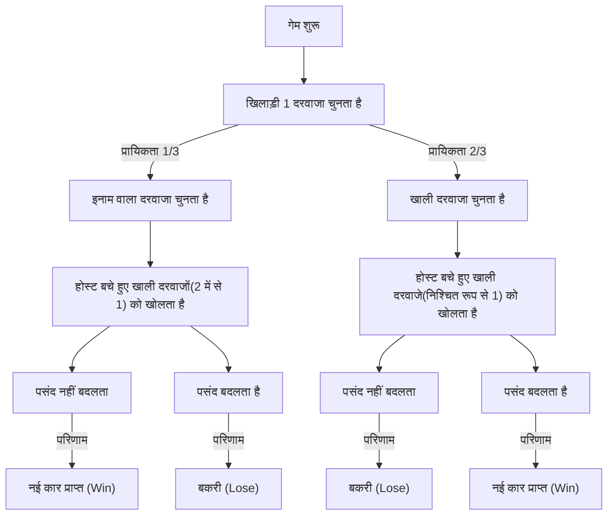
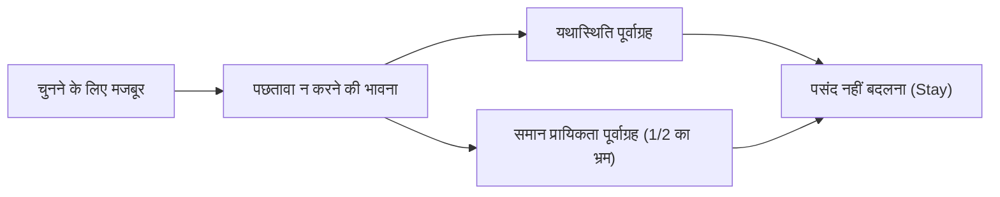

# प्रस्तावना: मानव अंतर्ज्ञान का जाल और प्रायिकता की दुनिया

हमारे दैनिक जीवन में, "अंतर्ज्ञान" निर्णय लेने के एक बहुत ही शक्तिशाली उपकरण के रूप में कार्य करता है। अनुभव और ह्युरिस्टिक्स (सुविधाजनक तरीके) के आधार पर तुरंत स्थिति का आकलन करने और कार्रवाई चुनने की क्षमता, कठोर प्राकृतिक वातावरण में जीवित रहने के लिए मानव जाति द्वारा प्राप्त विकास का एक उपहार है। हालाँकि, इस उत्कृष्ट अंतर्ज्ञान प्रणाली में एक कमजोरी है कि यह विशिष्ट परिस्थितियों में घातक त्रुटियों का कारण बन सकती है। इसका सबसे प्रमुख उदाहरण तब होता है जब हम "प्रायिकता" से संबंधित समस्याओं का सामना करते हैं।

प्रायिकता सिद्धांत अनिश्चित घटनाओं का मात्रात्मक मूल्यांकन करने के लिए एक गणितीय रूपरेखा है, लेकिन इसके निष्कर्ष अक्सर हमारे अंतर्ज्ञान से बुरी तरह टकराते हैं। इस घटना को "संज्ञानात्मक पूर्वाग्रह (cognitive bias)" और "अंतर्ज्ञान और तर्क के बीच का अंतर" के रूप में मनोविज्ञान, व्यवहारिक अर्थशास्त्र और गणित शिक्षा के क्षेत्रों में लंबे समय से शोध किया गया है।

इस लेख में, हम इस अंतर्ज्ञान और प्रायिकता के अंतर का प्रतीक सबसे प्रसिद्ध विरोधाभास (paradox), "मोंटी हॉल समस्या (Monty Hall problem)" पर चर्चा करेंगे। यह समस्या अपनी स्पष्ट सरलता के बावजूद, दुनिया भर के प्रसिद्ध गणितज्ञों और वैज्ञानिकों को शामिल करते हुए एक बड़े विवाद का कारण बनी। "हम इतने आसान प्रायिकता के जाल में क्यों फँस जाते हैं?" इस प्रश्न के माध्यम से, हम मानव संज्ञानात्मक संरचनाओं की सीमाओं और तार्किक सोच के महत्व का गहराई से और पूरी तरह से पता लगाएंगे।

## अध्याय 1: मोंटी हॉल समस्या क्या है?

मोंटी हॉल समस्या एक प्रायिकता विरोधाभास है जिसका नाम अमेरिका के लंबे समय तक चलने वाले टेलीविजन कार्यक्रम 'लेट्स मेक अ डील (Let's Make a Deal)' के होस्ट, मोंटी हॉल (Monty Hall) के नाम पर रखा गया है। यह समस्या आम जनता के बीच तब व्यापक रूप से जानी जाने लगी जब इसे 1990 में समाचार पत्रिका 'परेड' के कॉलम "आस्क मर्लिन (Ask Marilyn)" में प्रदर्शित किया गया था।

### समस्या की रूपरेखा

कल्पना करें कि आप एक टेलीविजन गेम शो में एक प्रतियोगी हैं। आपके सामने तीन बंद दरवाजे (दरवाजा A, दरवाजा B, और दरवाजा C) हैं।

1. 1 दरवाजे के पीछे एक "नई कार (इनाम)" है।
2. बाकी 2 दरवाजों के पीछे "बकरियां (खाली)" हैं।
3. यदि आप नई कार को चुनते हैं, तो आप उसे प्राप्त कर सकते हैं।

खेल के नियम और प्रक्रिया इस प्रकार है:

1. सबसे पहले, आप 3 दरवाजों में से 1 चुनते हैं (उदाहरण के लिए, मान लें कि आपने **दरवाजा A** चुना)।
2. इस कार्यक्रम के होस्ट, मोंटी, जानते हैं कि किस दरवाजे के पीछे नई कार है।
3. मोंटी बचे हुए 2 दरवाजों (दरवाजा B और दरवाजा C) में से, जो आपने नहीं चुने हैं, **हमेशा एक दरवाजा खोलकर दिखाते हैं जिसके पीछे बकरी होती है**। (उदाहरण के लिए, यदि दरवाजा B के पीछे बकरी है, तो वह दरवाजा B खोलेंगे)।
4. और फिर, मोंटी आपसे पूछते हैं:
   **"क्या आप दरवाजा C में बदलना चाहेंगे? क्या आप अपनी पसंद बदलना चाहते हैं?"**

अब, यहाँ सवाल है:
**क्या आपको अपनी पसंद बदलनी चाहिए? या, क्या आपको अपनी पहली पसंद (दरवाजा A) पर टिके रहना चाहिए? नई कार जीतने की प्रायिकता किसमें अधिक है?**

### अंतर्ज्ञान द्वारा उत्तर

जब ज्यादातर लोगों के सामने यह समस्या रखी जाती है, तो वे कुछ इस तरह से तर्क करते हैं:

"तीन दरवाजे थे, और एक (बकरी वाला दरवाजा) खोल दिया गया। अब केवल दो दरवाजे बचे हैं: जो दरवाजा मैंने चुना था (दरवाजा A) और दूसरा बंद दरवाजा (दरवाजा C)। चूँकि नई कार इन दोनों में से किसी एक के पीछे है, इसलिए प्रायिकता 50% (1/2) होनी चाहिए। इसलिए, पसंद बदलने या न बदलने से जीतने के अवसर समान हैं, और इसे बदलने का कोई मतलब नहीं है।"

यह सहज उत्तर बहुत आश्वस्त करने वाला है, और अधिकांश लोग (कुछ सर्वेक्षणों के अनुसार लगभग 85% या अधिक) जवाब देते हैं कि "पसंद बदलने से प्रायिकता नहीं बदलती है (1/2)"।

हालाँकि, **गणितीय रूप से सही उत्तर यह है कि "आपको अपनी पसंद बदलनी चाहिए"**। यदि आप अपनी पसंद बदलते हैं, तो नई कार जीतने की प्रायिकता **2/3 (लगभग 66.7%)** तक उछल जाती है, जो आपकी पहली पसंद पर बने रहने की प्रायिकता **1/3 (लगभग 33.3%)** का दोगुना है।

जब यह उत्तर मर्लिन वोस सावांत (एक महिला जिन्हें उस समय दुनिया में सबसे अधिक IQ होने के लिए गिनीज बुक द्वारा मान्यता प्राप्त थी) द्वारा प्रस्तुत किया गया था, तो पूरे अमेरिका से लगभग 10,000 विरोध पत्र आए। उनमें से लगभग 1,000 पत्र पीएचडी वाले गणितज्ञों और वैज्ञानिकों के थे, जिनमें कड़ी आलोचना थी जैसे "आप गणित को बिल्कुल नहीं समझती हैं" और "यह एक महिला का अतार्किक भ्रम है"।

इतने सारे बुद्धिजीवियों ने गलती क्यों की? अगले अध्याय में हम गणितीय प्रमाण को सुलझाएंगे।

## अध्याय 2: प्रायिकता का सच और गणितीय प्रमाण

जो प्रायिकता सहज रूप से "1/2" लगती है, वह "पसंद बदलने पर 2/3" क्यों हो जाती है? इसे समझने के लिए हमें कई अलग-अलग दृष्टिकोणों से समस्या को देखने की जरूरत है।

### प्रमाण दृष्टिकोण 1: सभी संभावित पैटर्न सूचीबद्ध करना (ट्री डायग्राम सोच)

सबसे विश्वसनीय और समझने में आसान तरीका यह है कि सभी संभावित परिणामों को सूचीबद्ध किया जाए और प्रायिकता की गणना की जाए।
चूँकि नई कार किस दरवाजे के पीछे होगी यह बेतरतीब ढंग से तय होता है, निम्नलिखित 3 मामले प्रत्येक 1/3 की प्रायिकता के साथ होते हैं।

- मामला 1: नई कार "दरवाजा A" में है
- मामला 2: नई कार "दरवाजा B" में है
- मामला 3: नई कार "दरवाजा C" में है

यह मानते हुए कि आपने शुरुआत में **दरवाजा A** चुना है, आइए प्रत्येक मामले में "पसंद न बदलने" और "पसंद बदलने" के परिणाम देखें।

| मामला | नई कार का स्थान | आपकी पसंद | होस्ट द्वारा खोला गया दरवाजा | पसंद न बदलने पर | पसंद बदलने पर |
|---|---|---|---|---|---|
| 1 (1/3) | दरवाजा A | दरवाजा A | B या C (बकरी) | **नई कार प्राप्त** (Win) | बकरी (Lose) |
| 2 (1/3) | दरवाजा B | दरवाजा A | दरवाजा C (बकरी) | बकरी (Lose) | **नई कार प्राप्त** (Win) |
| 3 (1/3) | दरवाजा C | दरवाजा A | दरवाजा B (बकरी) | बकरी (Lose) | **नई कार प्राप्त** (Win) |

इस तालिका से यह स्पष्ट है कि यदि आप "पसंद नहीं बदलते हैं" तो नई कार जीतने का मौका केवल मामला 1 (प्रायिकता 1/3) में है। दूसरी ओर, यदि आप "पसंद बदलते हैं", तो दो पैटर्न, मामला 2 और मामला 3 में आप नई कार जीत सकते हैं, और कुल प्रायिकता 2/3 हो जाती है।
दूसरे शब्दों में, यह **"शुरुआत से ही सही उत्तर चुनने की प्रायिकता (1/3)"** और **"शुरुआत में गलत उत्तर चुनने की प्रायिकता (2/3)"** के बीच की तुलना के अलावा और कुछ नहीं है। चूँकि होस्ट एक गलत विकल्प को हटा देता है, "शुरुआत में गलत चुनने" का दुर्भाग्य, पसंद बदलने से "हमेशा जीत में बदल जाने" के सौभाग्य में बदल जाता है।

### प्रमाण दृष्टिकोण 2: सूचना सिद्धांत और चरम मॉडल

यदि 3 दरवाजों के मामले में आपका अंतर्ज्ञान आपके रास्ते में आता है, तो दरवाजों की संख्या को चरम रूप से बढ़ाकर इसे समझना आसान हो जाता है।

कल्पना करें कि "10 लाख (1,000,000) दरवाजे हैं"।
1. आप 1 दरवाजा (दरवाजा नंबर 1) चुनते हैं। इस बिंदु पर जीतने की प्रायिकता 1/1,000,000 है।
2. होस्ट मोंटी को उत्तर पता है। वह शेष 999,999 दरवाजों में से 999,998 दरवाजे खोलता है जिनके पीछे बकरियां हैं।
3. अब केवल दो दरवाजे बंद हैं: आपका चुना हुआ "दरवाजा 1", और "दरवाजा 777,777" जिसे मोंटी ने नहीं खोला।

इस समय, आप क्या सोचते हैं?
यह स्पष्ट होना चाहिए कि "क्या यह अधिक संभावित है कि आपका पहला चुना हुआ दरवाजा 1 संयोग से सही था (1/1,000,000)" या "कि आप गलत थे, और मोंटी ने जानबूझकर सही दरवाजा 777,777 को छोड़ दिया और बाकी सब खोल दिए (999,999/1,000,000)"।
स्वाभाविक रूप से, आप दरवाजा 777,777 में बदल लेंगे। यहां तक कि जब केवल 3 दरवाजे हों, तो भी आवश्यक गणितीय संरचना बिल्कुल वैसी ही होती है।

### प्रमाण दृष्टिकोण 3: मरमेड (Mermaid) द्वारा स्टेट ट्रांज़िशन डायग्राम

दृश्य रूप से समझ को गहरा करने के लिए, आइए एक फ्लोचार्ट के साथ खेल की प्रगति को व्यक्त करें।

इस चित्र से, यह देखा जा सकता है कि **"शुरुआत में खाली दरवाजा चुनने (प्रायिकता 2/3)" की स्थिति से "पसंद बदलने" की कार्रवाई करने पर, 100% प्रायिकता के साथ "नई कार प्राप्त" की जा सकती है**। इसके विपरीत, यदि आप शुरुआत में इनाम वाला दरवाजा (प्रायिकता 1/3) चुनने की स्थिति से अपनी पसंद बदलते हैं, तो आपको निश्चित रूप से बकरी मिलेगी।
इसलिए, पसंद बदलने की रणनीति की अपेक्षित जीत दर 2/3 × 100% = 2/3 है।

## अध्याय 3: बेयस के प्रमेय (Bayes' theorem) के साथ कठोर समाधान

मोंटी हॉल समस्या को "बेयस के प्रमेय (Bayes' theorem)" का उपयोग करके अधिक गणितीय रूप से कठोर तरीके से हल किया जा सकता है, जो सशर्त प्रायिकता की गणना करने के लिए है। बेयस अनुमान एक शक्तिशाली उपकरण है जो यह दर्शाता है कि जब नई जानकारी (सबूत) प्राप्त होती है, तो पूर्व प्रायिकता (prior probability) को कैसे अपडेट किया जाना चाहिए (उत्तर प्रायिकता / posterior probability)।

हम घटनाओं को इस प्रकार परिभाषित करते हैं:
- $C_i$ : यह घटना कि नई कार दरवाजे $i$ में है ($i \in \{A, B, C\}$)
- $M_j$ : यह घटना कि मोंटी दरवाजा $j$ खोलता है ($j \in \{A, B, C\}$)

मान लीजिए कि खिलाड़ी ने शुरुआत में "दरवाजा A" चुना है।
पूर्व प्रायिकता समान प्रायिकता है, क्योंकि इस बात की कोई जानकारी नहीं है कि किस दरवाजे के पीछे नई कार है:
$P(C_A) = 1/3$
$P(C_B) = 1/3$
$P(C_C) = 1/3$

यहाँ, मान लीजिए कि मोंटी "दरवाजा B" खोलता है। इस जानकारी को प्राप्त करने接 करने के बाद, हम प्रायिकता की गणना करते हैं कि नई कार दरवाजा A (उत्तर प्रायिकता $P(C_A|M_B)$) में है, और प्रायिकता कि नई कार दरवाजा C (उत्तर प्रायिकता $P(C_C|M_B)$) में है।

मोंटी का क्रिया नियम (सशर्त प्रायिकता $P(M_B|C_i)$) इस प्रकार है:
1. यदि नई कार दरवाजा A में है ($C_A$), तो मोंटी यादृच्छिक (randomly) रूप से B या C खोलेगा, इसलिए $P(M_B|C_A) = 1/2$
2. यदि नई कार दरवाजा B में है ($C_B$), तो मोंटी कभी भी B नहीं खोल सकता, इसलिए $P(M_B|C_B) = 0$
3. यदि नई कार दरवाजा C में है ($C_C$), तो मोंटी C नहीं खोल सकता, और A खिलाड़ी द्वारा चुना गया है इसलिए वह उसे भी नहीं खोल सकता। इसलिए, उसे मजबूरन B खोलना पड़ता है, इसलिए $P(M_B|C_C) = 1$

बेयस के प्रमेय का सूत्र इस प्रकार है:
$P(C_i|M_B) = \frac{P(M_B|C_i) P(C_i)}{P(M_B)}$

हम हर (denominator) $P(M_B)$ (मोंटी के दरवाजा B खोलने की कुल प्रायिकता) की गणना करते हैं (कुल प्रायिकता का प्रमेय):
$P(M_B) = P(M_B|C_A)P(C_A) + P(M_B|C_B)P(C_B) + P(M_B|C_C)P(C_C)$
$P(M_B) = (1/2 \times 1/3) + (0 \times 1/3) + (1 \times 1/3) = 1/6 + 0 + 1/3 = 1/2$

अब, आइए उत्तर प्रायिकता की गणना करें।

**दरवाजा A (पसंद न बदलने) में नई कार होने की प्रायिकता:**
$P(C_A|M_B) = \frac{P(M_B|C_A) P(C_A)}{P(M_B)} = \frac{(1/2) \times (1/3)}{1/2} = 1/3$

**दरवाजा C (पसंद बदलने) में नई कार होने की प्रायिकता:**
$P(C_C|M_B) = \frac{P(M_B|C_C) P(C_C)}{P(M_B)} = \frac{1 \times (1/3)}{1/2} = 2/3$

इस प्रकार, बेयस के प्रमेय का उपयोग करते हुए, यह गणितीय रूप से पूरी तरह से सिद्ध हो जाता है कि नई जानकारी (मोंटी ने दरवाजा B खोला) के कारण प्रायिकताएं अपडेट हो जाती हैं, और दरवाजा C की प्रायिकता 2/3 तक उछल जाती है।

## अध्याय 4: मानव अंतर्ज्ञान गलत क्यों होता है? (मनोवैज्ञानिक और संज्ञानात्मक कारक)

गणितीय प्रमाणों को कितनी भी बार दिखाया जाए, कई लोग अभी भी महसूस करते हैं, "मैं अभी भी आश्वस्त नहीं हूँ" या "मुझे ठगा हुआ सा महसूस हो रहा है"। इस समस्या के प्रति मानव मस्तिष्क इतना कमजोर क्यों है? मनोविज्ञान और व्यवहारिक अर्थशास्त्र के शोध से पता चला है कि इसमें कई गंभीर संज्ञानात्मक पूर्वाग्रह शामिल हैं।

### 1. समान प्रायिकता पूर्वाग्रह (Equiprobability Bias)

मनुष्यों में यादृच्छिक घटनाओं या अनिश्चित स्थितियों में अनजाने में यह मानने की एक मजबूत प्रवृत्ति होती है कि "यदि उपलब्ध विकल्प बचे हैं, तो उनकी प्रायिकताएं समान होनी चाहिए।"
मोंटी हॉल समस्या में, अंततः दो विकल्प, "दरवाजा A" और "दरवाजा C" रह जाते हैं। जिस क्षण यह "दो विकल्प" वाली दृश्य और स्थितिजन्य जानकारी मस्तिष्क में इनपुट होती है, एक मजबूत ह्युरिस्टिक (heuristic) सक्रिय हो जाता है कि "चूंकि दो हैं, इसलिए प्रायिकता प्रत्येक की 1/2 होनी चाहिए।"
हमारा मस्तिष्क ऐतिहासिक पृष्ठभूमि (कि शुरुआत में 3 थे, और मोंटी ने जानबूझकर एक खाली दरवाजा खोला) की "असममित जानकारी (asymmetric information)" को "वर्तमान स्थिति" से अलग कर देता है और उसे नजरअंदाज कर देता है।

### 2. कारण-प्रभाव और "इरादे" की गलतफहमी

हम चीजों के कारण और प्रभाव को रैखिक रूप से समझने की कोशिश करते हैं।
यह "जुआरी की भ्रांति (Gambler's fallacy)" के समान है, जहाँ एक रूले में लगातार 5 बार लाल आने के बाद व्यक्ति सोचता है, "अगली बार काला आना चाहिए", लेकिन मोंटी हॉल समस्या में, इसके विपरीत, हम "जानकारी के अद्यतन (update)" को कम आंकते हैं।

महत्वपूर्ण बिंदु यह है कि **"होस्ट मोंटी बेतरतीब ढंग से दरवाजे नहीं खोल रहे हैं"**।
यदि होस्ट को कुछ नहीं पता होता और उसने बेतरतीब ढंग से एक दरवाजा खोला होता, और वह "संयोग से बकरी निकला", तो शेष दो दरवाजों की प्रायिकता वास्तव में 1/2 होती (इसे "अज्ञानी होस्ट समस्या" कहा जाता है)।
हालाँकि, मोंटी पर एक कड़ा प्रतिबंध (इरादा) है कि "हमेशा एक बकरी वाला दरवाजा खोलना है"। मानव अंतर्ज्ञान इस "इरादतन पसंद के कारण सूचना की विषमता" को सही ढंग से संसाधित नहीं कर सकता है, और केवल भौतिक तथ्य पर ध्यान केंद्रित करता है कि "बस एक दरवाजा कम हो गया है।"

### 3. यथास्थिति पूर्वाग्रह (Status Quo Bias) और पछतावे से बचना

व्यवहारिक अर्थशास्त्र के दृष्टिकोण से, "यथास्थिति पूर्वाग्रह" का एक बड़ा प्रभाव है।
मनुष्य ऐसे प्राणी हैं जो महसूस करते हैं कि कोई कार्रवाई करके असफल होने का पछतावा (commission error), कोई कार्रवाई न करके असफल होने के पछतावे (omission error) से मानसिक रूप से अधिक नुकसानदेह है।

कल्पना करें "यदि आपने अपनी पसंद बदल दी, और आपका पहला दरवाजा सही उत्तर होता।" आप मजबूत पछतावे से पीड़ित होंगे: "मुझे इसे नहीं बदलना चाहिए था!" दूसरी ओर, "यदि आप बिना पसंद बदले हार जाते हैं", तो इसे स्वीकार करना आसान है: "खैर, इसमें कुछ नहीं किया जा सकता, मेरी किस्मत खराब थी।"
इस तरह, "पछतावे को कम करने" का भावनात्मक रक्षा तंत्र काम करता है, जो "इसे बदलने या न बदलने से कोई फर्क नहीं पड़ता (मैं ऐसा मानना चाहता हूँ)" का संज्ञानात्मक विरूपण (cognitive distortion) पैदा करता है, और अंततः लोगों को "यथास्थिति (Stay)" चुनने के लिए प्रेरित करता है।

## अध्याय 5: दैनिक जीवन में विरोधाभास के सबक

मोंटी हॉल समस्या केवल एक प्रश्नोत्तरी या गणितीय पहेली नहीं है। यह विरोधाभास जो सबक सिखाता है, उसका एक सार्वभौमिक मूल्य है जिसे हमारे दैनिक जीवन, व्यापार, चिकित्सा और एआई विकास जैसे विभिन्न क्षेत्रों में लागू किया जा सकता है।

### डेटा और अंतर्ज्ञान का टकराव (चिकित्सा में झूठी सकारात्मकता / False Positive की समस्या)

चिकित्सा क्षेत्र में "परीक्षण सटीकता" की व्याख्या एक क्लासिक उदाहरण है जहाँ अंतर्ज्ञान और बेयसियन प्रायिकता में अंतर होता है।
उदाहरण के लिए, मान लें कि "एक दुर्लभ बीमारी है जो 10,000 में से 1 व्यक्ति को प्रभावित करती है", और इसके लिए परीक्षण दवा की सटीकता "99% (99% सकारात्मक लोगों की सही पहचान सकारात्मक के रूप में करती है, और 99% नकारात्मक लोगों की सही पहचान नकारात्मक के रूप में करती है)" है।
यदि आप यह परीक्षण लेते हैं और "सकारात्मक (positive)" पाए जाते हैं, तो आपको वास्तव में उस दुर्लभ बीमारी के होने की कितनी प्रायिकता है?

सहज रूप से, आप यह सोचकर निराश हो सकते हैं, "चूंकि सटीकता 99% है, इसलिए मेरे बीमार होने की प्रायिकता भी 99% होनी चाहिए।"
हालाँकि, बेयस के प्रमेय के साथ गणना करने पर, वास्तव में बीमार होने की प्रायिकता **केवल लगभग 1% (लगभग 0.98%)** है। ऐसा इसलिए है क्योंकि विशाल बहुमत वाले "स्वस्थ लोगों (9,999 लोगों)" में से 1% (लगभग 100 लोग) "झूठे सकारात्मक" होंगे, इसलिए सकारात्मक परीक्षण वाले लोगों के समूह में, वास्तविक रोगी (लगभग 1 व्यक्ति) बहुत कम संख्या में होंगे।

इस प्रकार, सहज प्रायिकता मूल्यांकन (99%) और गणितीय सत्य (1%) के बीच यह भारी अंतर लोगों में अनावश्यक घबराहट और गलत चिकित्सा निर्णय पैदा करने का जोखिम रखता है। मोंटी हॉल समस्या को समझना इन "सूचना विषमताओं और पूर्व प्रायिकताओं" का सही ढंग से मूल्यांकन करने के लिए साक्षरता प्राप्त करने का पहला कदम है।

### व्यापार रणनीति में सूचना का मूल्य

व्यापार में, प्रतिस्पर्धियों के रुझान और बाजार की प्रतिक्रियाएं वास्तव में "मोंटी द्वारा खोले गए दरवाजे" के बराबर हैं।
मान लीजिए आपकी कंपनी ने एक निश्चित रणनीति (दरवाजा A) चुनी है। उसके बाद, बाजार के माहौल में बदलाव या प्रतिस्पर्धियों की विफलता (खाली दरवाजा खुलना) जैसी नई जानकारी आती है।
इस समय, क्या आप "शुरुआती रणनीति पर जिद्दी बने रहते हैं (यथास्थिति पूर्वाग्रह)" या क्या आप "नई जानकारी का बेयसियन मूल्यांकन करते हैं और रणनीति को पिवट करते हैं (पसंद बदलते हैं)"? इसे एक सबक के रूप में समझा जा सकता है कि जो कंपनियां लचीले ढंग से अपनी रणनीतियों को बदल सकती हैं, उनके पास लंबी अवधि में उच्च सफलता दर (2/3) प्राप्त करने का बेहतर मौका है। सनक कॉस्ट (Sunk cost / डूबी हुई लागत) में फंसे बिना, "उत्तर प्रायिकता (posterior probability)" के आधार पर हमेशा निर्णय लेना महत्वपूर्ण है।

## निष्कर्ष: बुद्धिमत्ता का अर्थ है "अंतर्ज्ञान पर संदेह करने" का साहस

मोंटी हॉल समस्या इतनी आकर्षक और डरावनी इसलिए है क्योंकि यह खूबसूरती से "मानव बुद्धिमत्ता की सीमाओं" को उजागर करती है। यहां तक कि पीएचडी वाले विशेषज्ञ भी अपनी प्रारंभिक वृत्ति से धोखा खा गए, और उन्होंने सही प्रमाण के प्रति भावनात्मक रूप से प्रतिक्रिया व्यक्त की।

हम सभी उस शक्तिशाली हथियार पर भरोसा करके जीवित रहते हैं जिसे हमने विकास की प्रक्रिया में प्राप्त किया है, जिसे "अंतर्ज्ञान" कहा जाता है। हालाँकि, आज के जटिल और डेटा-संचालित समाज में, हमें इस बात से अवगत होना चाहिए कि हमारा अंतर्ज्ञान कभी-कभी हमें जाल में फंसा सकता है।

मोंटी हॉल समस्या हमें एक महत्वपूर्ण संदेश देती है।
वह यह है कि **"अपने अंतर्ज्ञान पर आँख बंद करके भरोसा न करें, बल्कि तर्क और गणित के उपकरणों का उपयोग करके रुकने और पुनर्विचार करने का महत्व"**। ऐसी सच्चाई को स्वीकार करने के लिए जो पहली नज़र में सहज-विरोधी लगती है, बौद्धिक विनम्रता और अपनी मान्यताओं को अद्यतन करने के साहस की आवश्यकता होती है।

अगली बार जब आपको अपने जीवन में कोई बड़ा विकल्प चुनने के लिए मजबूर किया जाए, और आपको नई जानकारी (खुला दरवाजा) मिले, तो कृपया इस मोंटी हॉल समस्या को याद रखें। क्या उस जानकारी के कारण प्रायिकता बदल गई है? क्या आप यथास्थिति पूर्वाग्रह में फंसे हैं?
"अपनी पसंद बदलने" का तार्किक रूप से निकाला गया निर्णय आपके सामने एक नई कार ला सकता है।
