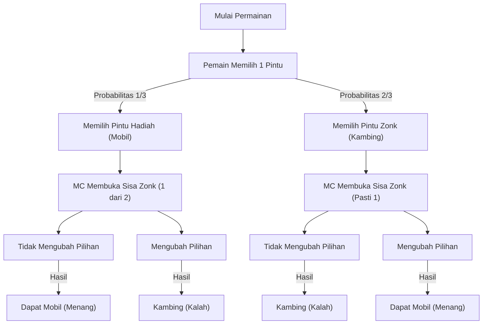
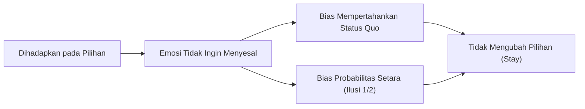

# Pendahuluan: Jebakan yang Menjerat Intuisi Manusia dan Dunia Probabilitas

Dalam kehidupan sehari-hari, "intuisi" berfungsi sebagai alat pengambilan keputusan yang sangat kuat. Kemampuan untuk menilai situasi secara instan dan memilih tindakan berdasarkan pengalaman dan heuristik (metode jalan pintas) adalah anugerah evolusi yang diperoleh umat manusia untuk bertahan hidup di lingkungan alam yang keras. Namun, sistem intuisi yang unggul ini memiliki kelemahan, yaitu dapat menyebabkan kesalahan fatal pada kondisi tertentu. Contoh yang paling nyata adalah ketika berhadapan dengan masalah yang berkaitan dengan "probabilitas".

Teori probabilitas adalah kerangka matematis untuk mengevaluasi kejadian yang tidak pasti secara kuantitatif, namun kesimpulannya sering kali bertentangan keras dengan intuisi kita. Fenomena ini telah lama diteliti di bidang psikologi, ekonomi perilaku, dan pendidikan matematika sebagai "bias kognitif" atau "kesenjangan antara intuisi dan logika".

Dalam artikel ini, kami akan mengangkat paradoks paling terkenal yang melambangkan kesenjangan antara intuisi dan probabilitas ini, yaitu "Masalah Monty Hall (Monty Hall problem)". Meskipun terlihat sederhana, masalah ini telah memicu perdebatan besar yang melibatkan matematikawan dan ilmuwan ternama di seluruh dunia. Melalui pertanyaan "Mengapa kita bisa jatuh ke dalam jebakan probabilitas yang begitu sederhana?", kita akan mengeksplorasi secara mendalam dan tuntas tentang keterbatasan struktur kognitif manusia serta pentingnya pemikiran logis.

## Bab 1: Apa itu Masalah Monty Hall?

Masalah Monty Hall adalah paradoks probabilitas yang dinamai dari pembawa acara program televisi Amerika yang berumur panjang 'Let's Make a Deal', Monty Hall. Masalah ini mulai dikenal luas oleh publik setelah diangkat pada tahun 1990 dalam kolom "Ask Marilyn" di majalah berita Parade.

### Pengaturan Masalah

Bayangkan Anda adalah seorang peserta dalam sebuah acara permainan televisi. Di depan Anda terdapat 3 pintu yang tertutup (Pintu A, Pintu B, Pintu C).

1. Di belakang satu pintu terdapat "mobil baru (hadiah utama)".
2. Di belakang 2 pintu lainnya terdapat "kambing (zonk)".
3. Jika Anda menebak mobil baru dengan benar, Anda bisa mendapatkannya.

Aturan dan jalannya permainan adalah sebagai berikut:

1. Pertama, Anda memilih 1 dari 3 pintu (sebagai contoh, katakanlah Anda memilih **Pintu A**).
2. Pembawa acara program ini, Monty, tahu persis di balik pintu mana mobil baru tersebut berada.
3. Dari 2 pintu tersisa yang tidak Anda pilih (Pintu B dan Pintu C), Monty akan **selalu membuka 1 pintu yang sudah pasti berisi kambing**. (Misalnya, jika ada kambing di Pintu B, ia akan membuka Pintu B).
4. Kemudian, Monty akan bertanya kepada Anda:
   **"Anda boleh mengubah pilihan ke Pintu C. Apakah Anda ingin mengubah pilihan Anda?"**

Nah, inilah pertanyaannya.
**Apakah Anda harus mengubah pilihan? Atau, haruskah Anda mempertahankan pilihan pertama Anda (Pintu A)? Mana yang memiliki probabilitas lebih tinggi untuk memenangkan mobil baru?**

### Jawaban Berdasarkan Intuisi

Ketika dihadapkan pada masalah ini, banyak orang akan menyimpulkan sebagai berikut:

"Ada 3 pintu, dan 1 pintu (berisi kambing) telah dibuka. Yang tersisa hanyalah 2 pintu: pintu yang saya pilih (Pintu A) dan satu pintu lain yang masih tertutup (Pintu C). Karena mobil baru ada di balik salah satunya, probabilitas masing-masing pastilah 50% (1/2). Oleh karena itu, probabilitas menangnya sama saja, baik saya mengubah pilihan maupun tidak, jadi tidak ada gunanya mengubah pilihan."

Jawaban intuitif ini sangat meyakinkan, dan sebagian besar orang (sekitar 85% lebih menurut beberapa survei) menjawab "meskipun pilihan diubah, probabilitasnya tidak berubah (1/2)".

Namun, **jawaban yang benar secara matematis adalah "harus mengubah pilihan"**. Jika Anda mengubah pilihan, probabilitas untuk mendapatkan mobil baru melonjak menjadi **2/3 (sekitar 66,7%)**, yaitu dua kali lipat dari probabilitas **1/3 (sekitar 33,3%)** jika Anda mempertahankan pilihan awal.

Ketika jawaban ini disajikan oleh Marilyn vos Savant (wanita yang saat itu tercatat di Guinness Book of Records karena memiliki IQ tertinggi di dunia), sekitar 10.000 surat sanggahan membanjiri dari seluruh penjuru Amerika Serikat. Di antaranya terdapat sekitar 1.000 surat dari matematikawan dan ilmuwan bergelar Ph.D., yang melontarkan kecaman keras seperti "Anda sama sekali tidak mengerti matematika" dan "Itu hanyalah khayalan tidak logis seorang wanita".

Mengapa begitu banyak kaum intelektual bisa melakukan kesalahan? Pada bab berikutnya, kita akan mengungkap pembuktian matematisnya.

## Bab 2: Kebenaran Probabilitas dan Pembuktian Matematis

Mengapa probabilitas yang secara intuitif tampak "1/2" bisa menjadi "2/3 jika mengubah pilihan"? Untuk memahaminya, kita perlu melihat kembali masalah ini dari beberapa pendekatan yang berbeda.

### Pendekatan Pembuktian 1: Menjabarkan Semua Pola (Pemikiran Diagram Pohon)

Cara yang paling pasti dan mudah dipahami adalah dengan menjabarkan semua kemungkinan pola yang bisa terjadi dan menghitung probabilitasnya.
Karena posisi mobil baru ditentukan secara acak, ketiga kasus berikut ini masing-masing terjadi dengan probabilitas 1/3.

- Kasus 1: Mobil baru ada di "Pintu A"
- Kasus 2: Mobil baru ada di "Pintu B"
- Kasus 3: Mobil baru ada di "Pintu C"

Misalkan Anda pertama kali memilih **Pintu A**, mari kita lihat hasil dari "kasus mempertahankan pilihan" dan "kasus mengubah pilihan" untuk setiap kemungkinan.

| Kasus | Posisi Mobil | Pilihan Anda | Pintu yang Dibuka MC | Jika Mempertahankan Pilihan | Jika Mengubah Pilihan |
|---|---|---|---|---|---|
| 1 (1/3) | Pintu A | Pintu A | B atau C (Kambing) | **Dapat Mobil** (Menang) | Kambing (Kalah) |
| 2 (1/3) | Pintu B | Pintu A | Pintu C (Kambing) | Kambing (Kalah) | **Dapat Mobil** (Menang) |
| 3 (1/3) | Pintu C | Pintu A | Pintu B (Kambing) | Kambing (Kalah) | **Dapat Mobil** (Menang) |

Seperti yang terlihat jelas dari tabel ini, "Jika Mempertahankan Pilihan" hanya akan memberikan mobil baru pada Kasus 1 (probabilitas 1/3). Di sisi lain, "Jika Mengubah Pilihan" akan memberikan mobil baru pada 2 pola, yaitu Kasus 2 dan Kasus 3, sehingga total probabilitasnya menjadi 2/3.

Dengan kata lain, ini tidak lain adalah perbandingan antara **"probabilitas telah memilih jawaban yang benar sejak awal (1/3)"** dan **"probabilitas awalnya memilih yang salah (2/3)"**. Karena pembawa acara menghilangkan 1 pilihan salah, struktur permainan ini membuat kesialan "awalnya memilih yang salah" berbalik menjadi keberuntungan "pasti berubah menjadi benar" dengan cara mengubah pilihan.

### Pendekatan Pembuktian 2: Teori Informasi dan Model Ekstrem

Jika angka 3 pintu membuat intuisi Anda terganggu, cobalah menambah jumlah pintu secara ekstrem agar lebih mudah dipahami.

Bayangkan "ada 1.000.000 pintu".
1. Anda memilih 1 pintu (Pintu Nomor 1). Pada saat ini, probabilitas menangnya adalah 1/1.000.000.
2. Pembawa acara, Monty, mengetahui jawabannya. Dari sisa 999.999 pintu, ia membuka semua 999.998 pintu yang berisi kambing.
3. Yang tertutup sekarang hanya tersisa 2, yaitu "Pintu 1" yang Anda pilih, dan "Pintu 777.777" yang sengaja disisakan oleh Monty.

Pada saat ini, apa pendapat Anda?
Sangat jelas mana yang lebih tinggi antara "probabilitas Pintu 1 yang Anda pilih pertama kali kebetulan benar (1/1.000.000)" atau "probabilitas bahwa Anda awalnya salah, dan Monty secara sengaja menghindari Pintu 777.777 yang benar dengan membuka semua sisa pintu lainnya (999.999/1.000.000)".

Tentu saja Anda akan beralih ke Pintu 777.777. Meskipun jumlah pintunya hanya 3, struktur matematis esensialnya sama persis.

### Pendekatan Pembuktian 3: Diagram Transisi State menggunakan Mermaid

Untuk memperdalam pemahaman secara visual, mari kita gambarkan jalannya permainan menggunakan flowchart.

Dari gambar ini, terlihat jelas bahwa **jika Anda mengambil tindakan "mengubah pilihan" dari keadaan "awalnya memilih pintu yang salah (probabilitas 2/3)", Anda akan mencapai "Dapat Mobil" dengan probabilitas 100%**. Sebaliknya, jika Anda mengubah pilihan dari keadaan awalnya memilih pintu yang benar (probabilitas 1/3), Anda pasti akan mendapatkan kambing.

Oleh karena itu, probabilitas kemenangan yang diharapkan dari strategi mengubah pilihan adalah 2/3 × 100% = 2/3.

## Bab 3: Solusi Eksak dengan Teorema Bayes

Masalah Monty Hall dapat diselesaikan dengan lebih matematis dan eksak dengan menggunakan "Teorema Bayes (Bayes' theorem)" untuk menghitung probabilitas bersyarat. Estimasi Bayes adalah alat yang sangat kuat yang menunjukkan bagaimana probabilitas sebelumnya (probabilitas apriori) harus diperbarui (probabilitas aposteriori) ketika informasi (bukti) baru diperoleh.

Mari kita definisikan peristiwanya sebagai berikut:
- $C_i$ : Kejadian mobil baru berada di pintu $i$ ($i \in \{A, B, C\}$)
- $M_j$ : Kejadian Monty membuka pintu $j$ ($j \in \{A, B, C\}$)

Asumsikan pemain pertama kali memilih "Pintu A".
Probabilitas apriori adalah probabilitas yang setara karena tidak ada informasi sama sekali tentang di mana mobil baru berada:
$P(C_A) = 1/3$
$P(C_B) = 1/3$
$P(C_C) = 1/3$

Di sini, anggaplah Monty membuka "Pintu B". Setelah informasi ini diperoleh, kita akan menghitung probabilitas bahwa mobil baru ada di Pintu A (probabilitas aposteriori $P(C_A|M_B)$) dan probabilitas bahwa mobil baru ada di Pintu C (probabilitas aposteriori $P(C_C|M_B)$).

Aturan tindakan Monty (probabilitas bersyarat $P(M_B|C_i)$) adalah sebagai berikut:
1. Jika mobil baru ada di Pintu A ($C_A$), Monty akan membuka B atau C secara acak, sehingga $P(M_B|C_A) = 1/2$
2. Jika mobil baru ada di Pintu B ($C_B$), Monty sama sekali tidak bisa membuka B, sehingga $P(M_B|C_B) = 0$
3. Jika mobil baru ada di Pintu C ($C_C$), Monty tidak bisa membuka C, dan A tidak bisa dibuka karena dipilih oleh pemain. Oleh karena itu, ia terpaksa harus membuka B, sehingga $P(M_B|C_C) = 1$

Rumus Teorema Bayes adalah sebagai berikut:
$P(C_i|M_B) = \frac{P(M_B|C_i) P(C_i)}{P(M_B)}$

Mari kita hitung penyebut $P(M_B)$ (probabilitas total Monty membuka Pintu B) (Teorema Probabilitas Total).
$P(M_B) = P(M_B|C_A)P(C_A) + P(M_B|C_B)P(C_B) + P(M_B|C_C)P(C_C)$
$P(M_B) = (1/2 \times 1/3) + (0 \times 1/3) + (1 \times 1/3) = 1/6 + 0 + 1/3 = 1/2$

Sekarang, mari kita hitung probabilitas aposteriori.

**Probabilitas mobil baru ada di Pintu A (mempertahankan pilihan):**
$P(C_A|M_B) = \frac{P(M_B|C_A) P(C_A)}{P(M_B)} = \frac{(1/2) \times (1/3)}{1/2} = 1/3$

**Probabilitas mobil baru ada di Pintu C (mengubah pilihan):**
$P(C_C|M_B) = \frac{P(M_B|C_C) P(C_C)}{P(M_B)} = \frac{1 \times (1/3)}{1/2} = 2/3$

Dengan cara ini, menggunakan Teorema Bayes, secara matematis terbukti dengan sempurna bahwa probabilitas diperbarui oleh informasi baru (fakta bahwa Monty membuka Pintu B), dan probabilitas Pintu C melonjak menjadi 2/3.

## Bab 4: Mengapa Intuisi Manusia Salah? (Faktor Psikologis dan Kognitif)

Meskipun diperlihatkan pembuktian matematis berulang kali, banyak orang masih merasa "saya tetap tidak bisa menerimanya" atau "saya merasa seperti sedang ditipu". Mengapa otak manusia begitu rapuh terhadap masalah ini? Penelitian dari psikologi dan ekonomi perilaku telah mengungkapkan bahwa terdapat beberapa bias kognitif yang serius yang terlibat.

### 1. Bias Probabilitas Setara (Equiprobability Bias)

Manusia memiliki kecenderungan kuat secara tak sadar untuk menganggap bahwa dalam situasi acak atau tidak pasti, "jika ada pilihan yang tersisa, maka probabilitas semuanya pasti setara".
Dalam Masalah Monty Hall, pada akhirnya tersisa 2 pilihan: "Pintu A" dan "Pintu C". Begitu informasi visual dan situasional "2 pilihan" ini masuk ke otak, heuristik yang kuat "karena ada 2 pilihan, probabilitasnya masing-masing 1/2" langsung terpicu.
Otak kita memisahkan dan mengabaikan "informasi asimetris" dari kronologi masa lalu (fakta bahwa awalnya ada 3 pilihan dan Monty secara sengaja membuka zonk) dari "situasi saat ini".

### 2. Kesalahpahaman Tentang Hubungan Kausalitas dan "Niat"

Kita cenderung mencoba memahami hubungan kausalitas suatu hal secara linear.
Ini mirip dengan "Kekeliruan Penjudi (Gambler's fallacy)" di mana seseorang berpikir "selanjutnya pasti hitam yang akan keluar" setelah warna merah keluar 5 kali berturut-turut pada rolet, namun pada masalah Monty Hall yang terjadi sebaliknya, kita justru meremehkan "pembaruan informasi".

Yang penting adalah fakta bahwa **"Pembawa acara Monty tidak membuka pintu secara acak"**.
Jika pembawa acara membuka pintu secara acak tanpa mengetahui apa-apa dan "kebetulan itu adalah kambing", maka probabilitas dari 2 pintu yang tersisa memang benar-benar menjadi 1/2 (ini disebut "Masalah Pembawa Acara yang Bodoh").
Namun, Monty memiliki batasan (niat) yang kuat untuk "selalu membuka pintu kambing". Intuisi manusia tidak bisa memproses dengan benar "asimetri informasi akibat pilihan yang disengaja" ini, sehingga hanya berfokus pada fakta fisik bahwa "hanya ada 1 pintu yang berkurang".

### 3. Bias Mempertahankan Status Quo (Status Quo Bias) dan Menghindari Penyesalan

Dari perspektif ekonomi perilaku, "Bias Mempertahankan Status Quo" memiliki pengaruh yang besar.
Manusia adalah makhluk yang merasa bahwa kerusakan mental akibat penyesalan setelah mengambil tindakan dan gagal (error of commission) lebih besar daripada penyesalan karena gagal tanpa mengambil tindakan (error of omission).

Bayangkan "jika Anda mengubah pilihan, dan ternyata pintu pertama Anda adalah jawaban yang benar". Anda akan disiksa oleh penyesalan yang mendalam seperti "Seharusnya aku tidak mengubahnya!". Di sisi lain, jika Anda "gagal tanpa mengubah pilihan", akan lebih mudah untuk menyerah dan berpikir "Yah, mau bagaimana lagi, aku kurang beruntung".
Dengan demikian, mekanisme pertahanan emosional untuk "meminimalkan penyesalan" pun bekerja, menciptakan distorsi kognitif "sama saja mau diubah atau tidak (atau setidaknya ingin mempercayai hal itu)", yang pada akhirnya membuat orang memilih untuk "mempertahankan status quo (Stay)".

## Bab 5: Pelajaran dari Paradoks dalam Kehidupan Sehari-hari

Masalah Monty Hall tidak terbatas hanya pada kuis atau teka-teki matematika belaka. Pelajaran yang diajarkan oleh paradoks ini memiliki nilai universal yang dapat diterapkan pada berbagai bidang seperti kehidupan kita sehari-hari, bisnis, dunia medis, hingga pengembangan AI.

### Konflik Antara Data dan Intuisi (Masalah Positif Palsu dalam Dunia Medis)

Interpretasi dari "akurasi tes" di dunia medis juga merupakan contoh klasik dari kesenjangan antara intuisi dan probabilitas Bayes.
Sebagai contoh, misalkan ada "penyakit langka yang diderita oleh 1 dari 10.000 orang", dan akurasi alat tesnya adalah "99% (99% mengidentifikasi orang yang positif dengan benar sebagai positif, dan 99% mengidentifikasi orang yang negatif dengan benar sebagai negatif)".
Jika Anda menjalani tes ini dan dinyatakan "positif", berapakah probabilitas Anda benar-benar menderita penyakit langka tersebut?

Secara intuitif, Anda mungkin akan merasa putus asa dan berpikir, "Karena akurasinya 99%, probabilitas saya sakit pasti 99% juga."
Namun, jika dihitung dengan Teorema Bayes, probabilitas Anda benar-benar menderita penyakit tersebut **hanya kurang dari 1% (sekitar 0,98%)**. Hal ini karena 1% (sekitar 100 orang) dari mayoritas mutlak "orang sehat (9.999 orang)" akan menjadi "positif palsu", sehingga di dalam kelompok orang yang dinyatakan positif, pasien yang sebenarnya (hampir 1 orang) akan menjadi minoritas yang sangat kecil.

Seperti ini, perbedaan yang luar biasa antara evaluasi probabilitas intuitif (99%) dan kebenaran matematis (1%) memiliki bahaya menimbulkan kepanikan yang tidak perlu atau keputusan medis yang salah bagi orang-orang. Memahami masalah Monty Hall adalah langkah pertama untuk membangun literasi dalam mengevaluasi "asimetri informasi dan probabilitas apriori" dengan benar.

### Nilai Informasi dalam Strategi Bisnis

Dalam dunia bisnis, tren pesaing dan reaksi pasar benar-benar setara dengan "pintu yang dibuka oleh Monty".
Katakanlah perusahaan Anda memilih suatu strategi (Pintu A). Setelah itu, masuklah informasi baru berupa perubahan lingkungan pasar atau kegagalan pesaing (pintu zonk dibuka).
Pada saat ini, apakah Anda akan "keras kepala mempertahankan strategi awal (Bias Mempertahankan Status Quo)", atau "mengevaluasi informasi baru secara Bayesian dan melakukan pivot strategi (mengubah pilihan)"? Hal ini bisa ditafsirkan sebagai pelajaran bahwa perusahaan yang mampu mengubah strategi secara fleksibel akan lebih mampu meraih probabilitas sukses yang lebih tinggi (2/3) dalam jangka panjang. Sangat penting untuk selalu membuat keputusan berdasarkan "probabilitas aposteriori" tanpa terjebak oleh sunk cost (biaya yang sudah tenggelam).

## Penutup: Kecerdasan adalah Keberanian untuk "Meragukan Intuisi"

Apa yang membuat Masalah Monty Hall begitu menarik, dan sekaligus menakutkan, adalah karena ia menyoroti "keterbatasan kecerdasan manusia" dengan sangat brilian. Bahkan para ahli bergelar Ph.D. pun tertipu oleh intuisi awal mereka dan bereaksi secara emosional menentang pembuktian yang benar.

Kita hidup dengan mengandalkan senjata ampuh bernama "intuisi" yang kita peroleh selama proses evolusi. Namun, dalam masyarakat modern yang semakin kompleks dan dibanjiri data, kita harus sadar bahwa intuisi tersebut terkadang bisa menjerumuskan kita ke dalam jebakan.

Masalah Monty Hall menyampaikan satu pesan penting kepada kita.
Yaitu, **"pentingnya untuk tidak mempercayai intuisi sendiri secara buta, melainkan berhenti sejenak dan berpikir ulang menggunakan alat berupa logika dan matematika"**. Untuk menerima kebenaran yang sekilas tampak berlawanan dengan intuisi, dibutuhkan kerendahan hati intelektual dan keberanian untuk memperbarui asumsi kita sendiri.

Lain kali saat Anda dihadapkan pada pilihan penting dalam hidup, dan Anda mendapatkan informasi baru (pintu yang terbuka), tolong ingatlah masalah Monty Hall ini. Apakah probabilitasnya telah berubah akibat informasi tersebut? Apakah Anda sedang terjebak oleh Bias Mempertahankan Status Quo? 
Keputusan logis untuk "mengubah pilihan" mungkin saja akan menghadirkan mobil baru tepat di depan mata Anda.
