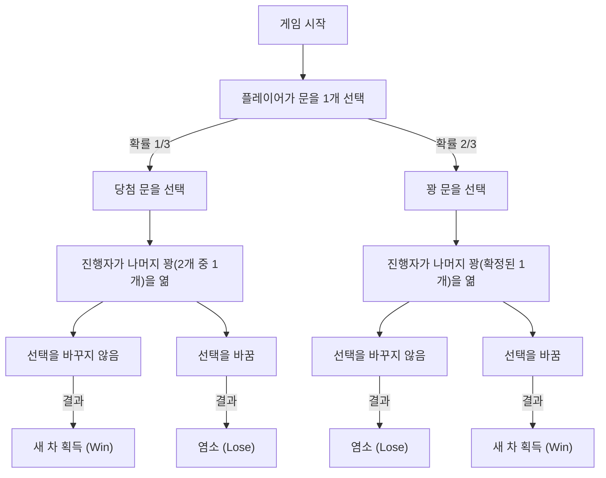
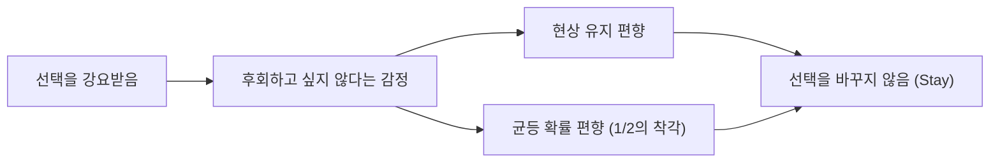

# 서론: 인간의 직관이 빠지는 함정과 확률의 세계

우리의 일상생활에서 '직관'은 매우 강력한 의사결정 도구로 기능합니다. 경험칙이나 휴리스틱(어림짐작)에 기반하여 순식간에 상황을 판단하고 행동을 선택하는 능력은 인류가 가혹한 자연환경을 살아남기 위해 획득한 진화의 산물입니다. 하지만 이 뛰어난 직관 시스템에는 특정 조건하에서 치명적인 오류를 일으킨다는 약점이 존재합니다. 그 가장 두드러진 예가 '확률'에 관한 문제에 직면했을 때입니다.

확률론은 불확실한 사건을 정량적으로 평가하기 위한 수학적 틀이지만, 그 결론은 종종 우리의 직관과 격렬하게 충돌합니다. 이 현상은 '인지 편향'이나 '직관과 논리의 괴리'로서 심리학, 행동경제학, 그리고 수학교육 분야에서 오랫동안 연구되어 왔습니다.

본 기사에서는 이 직관과 확률의 괴리를 상징하는 가장 유명한 역설, '몬티 홀 문제(Monty Hall problem)'를 다룹니다. 이 문제는 겉보기의 단순함과는 달리, 전 세계의 내로라하는 수학자와 과학자들마저 끌어들인 대논쟁을 일으켰습니다. "왜 우리는 이토록 간단한 확률의 함정에 빠져버리는 것일까?"라는 질문을 통해 인간의 인지 구조의 한계와 논리적 사고의 중요성에 대해 깊고 철저하게 탐구해 보겠습니다.

## 제1장: 몬티 홀 문제란 무엇인가?

몬티 홀 문제는 미국의 장수 TV 프로그램 『Let's Make a Deal』의 진행자인 몬티 홀(Monty Hall)의 이름을 딴 확률의 역설입니다. 이 문제가 대중에게 널리 알려지게 된 것은 1990년 뉴스 잡지 『퍼레이드』의 칼럼 '마릴린에게 물어보세요(Ask Marilyn)'에서 다루어진 것이 계기였습니다.

### 문제의 설정

당신이 TV 게임 쇼의 참가자라고 상상해 보십시오. 당신 앞에는 닫힌 3개의 문(문 A, 문 B, 문 C)이 있습니다.

1. 1개의 문 뒤에는 '새 차(당첨)'가 있습니다.
2. 나머지 2개의 문 뒤에는 '염소(꽝)'가 있습니다.
3. 당신은 새 차를 맞히면 그것을 가질 수 있습니다.

게임의 규칙과 진행은 다음과 같습니다.

1. 먼저, 당신은 3개의 문 중에서 1개를 선택합니다 (예를 들어, **문 A**를 선택했다고 가정합시다).
2. 이 프로그램의 진행자인 몬티는 어느 문 뒤에 새 차가 있는지 알고 있습니다.
3. 몬티는 당신이 선택하지 않은 나머지 2개의 문(문 B와 문 C) 중, **반드시 염소가 있는 문을 하나 열어서 보여줍니다**. (예를 들어, 문 B에 염소가 있다면 문 B를 엽니다).
4. 그리고 몬티는 당신에게 이렇게 묻습니다.
   **"문 C로 변경해도 됩니다. 선택을 바꾸시겠습니까?"**

자, 여기서 문제입니다.
**당신은 선택을 바꾸어야 할까요? 아니면 첫 번째 선택(문 A)을 유지해야 할까요? 어느 쪽이 새 차를 획득할 확률이 높을까요?**

### 직관에 의한 답변

많은 사람이 이 문제를 받았을 때 다음과 같이 추론합니다.

"문은 3개가 있고, 1개(염소의 문)가 열렸다. 남아있는 것은 자신이 선택한 문(문 A)과 또 다른 닫혀있는 문(문 C) 두 개뿐이다. 새 차는 둘 중 하나의 뒤에 있으므로, 확률은 각각 50%(1/2)씩일 것이다. 따라서 선택을 바꾸든 바꾸지 않든 승률은 같으며, 굳이 바꿀 필요는 없다."

이 직관적인 답변은 매우 설득력이 있으며, 압도적인 다수의 사람들(조사에 따라서는 약 85% 이상)이 "선택을 바꿔도 확률은 변하지 않는다(1/2)"고 답합니다.

하지만, **수학적으로 올바른 답변은 '선택을 바꾸어야 한다'**입니다. 선택을 바꿨을 때 새 차를 획득할 확률은 **2/3(약 66.7%)**로 뛰어오르며, 첫 번째 선택을 유지했을 때의 확률인 **1/3(약 33.3%)**의 2배가 됩니다.

이 해답이 마릴린 보스 사반트(당시 세계 최고의 IQ를 가진 것으로 기네스북에 등재된 여성)에 의해 제시되었을 때, 미 전역에서 약 1만 통의 반론 편지가 쇄도했습니다. 그중에는 박사 학위를 가진 수학자나 과학자의 편지도 약 1,000통 포함되어 있었으며, "당신은 수학을 전혀 이해하지 못하고 있다", "여성의 비논리적인 망상이다"라는 거센 비난이 쏟아졌습니다.

왜 이토록 많은 지식인들이 틀렸던 것일까요? 다음 장에서 그 수학적 증명을 밝혀냅니다.

## 제2장: 확률의 진실과 수학적 증명

직관으로는 '1/2'로 생각되는 확률이, 왜 '선택을 바꾸면 2/3'가 되는 것일까. 이를 이해하기 위해서는 몇 가지 다른 접근법에서 문제를 다시 바라볼 필요가 있습니다.

### 증명 접근법 1: 모든 패턴의 나열 (수형도적 사고)

가장 확실하고 알기 쉬운 방법은 일어날 수 있는 모든 패턴을 나열하고 확률을 계산하는 것입니다.
새 차가 어느 문에 있는지는 무작위로 결정되므로, 다음 3가지 경우가 각각 1/3의 확률로 발생합니다.

- 경우 1: 새 차는 '문 A'에 있다
- 경우 2: 새 차는 '문 B'에 있다
- 경우 3: 새 차는 '문 C'에 있다

당신이 처음에 **문 A**를 선택했다고 가정하고, 각각의 경우에 '선택을 유지했을 때'와 '선택을 바꿨을 때'의 결과를 살펴보겠습니다.

| 경우 | 새 차의 위치 | 당신의 선택 | 진행자가 여는 문 | 선택을 유지했을 때 | 선택을 바꿨을 때 |
|---|---|---|---|---|---|
| 1 (1/3) | 문 A | 문 A | B 또는 C (염소) | **새 차 획득** (Win) | 염소 (Lose) |
| 2 (1/3) | 문 B | 문 A | 문 C (염소) | 염소 (Lose) | **새 차 획득** (Win) |
| 3 (1/3) | 문 C | 문 A | 문 B (염소) | 염소 (Lose) | **새 차 획득** (Win) |

이 표에서 명백하듯이, '선택을 유지했을 때' 새 차를 획득할 수 있는 것은 경우 1뿐(확률 1/3)입니다. 반면, '선택을 바꿨을 때' 새 차를 획득할 수 있는 것은 경우 2와 경우 3의 두 패턴이며, 그 합계 확률은 2/3가 됩니다.
즉, **"처음부터 정답을 선택했을 확률(1/3)"**과 **"처음에는 오답을 선택했을 확률(2/3)"**의 비교에 다름 아닙니다. 진행자가 오답을 하나 지워주기 때문에, '처음에는 오답을 선택했다'는 불운이 선택을 바꿈으로써 '반드시 정답으로 바뀐다'는 행운으로 반전되는 구조로 되어 있습니다.

### 증명 접근법 2: 정보 이론과 극단적인 모델

3개의 문에서 직관이 방해를 할 경우, 문의 수를 극단적으로 늘려보면 이해하기 쉬워집니다.

"문이 100만 개 있다"고 상상해 보십시오.
1. 당신은 1개의 문(문 번호 1)을 선택합니다. 이 시점에서 당첨될 확률은 1/1,000,000입니다.
2. 진행자인 몬티는 정답을 알고 있습니다. 그는 나머지 999,999개의 문 중, 염소가 있는 999,998개의 문을 전부 열어버립니다.
3. 닫혀있는 것은 당신이 선택한 '문 1'과 몬티가 열지 않고 남겨둔 '문 777,777' 단 두 개뿐입니다.

이때, 당신은 어떻게 생각하시나요?
"자신이 처음에 선택한 문 1이 우연히 정답이었을 확률(1/1,000,000)"과 "자신이 틀렸고, 몬티가 의도적으로 정답인 문 777,777을 피해서 나머지 전부를 열었을 확률(999,999/1,000,000)", 어느 쪽이 높은지는 명백할 것입니다.
당연히 문 777,777로 변경할 것입니다. 문이 3개인 경우라도 본질적인 수학적 구조는 완전히 같습니다.

### 증명 접근법 3: Mermaid를 이용한 상태 전이도

시각적으로 이해를 돕기 위해, 게임의 진행을 플로우차트로 표현해 보겠습니다.

이 그림에서 **"처음에 꽝인 문을 선택한다(확률 2/3)"는 상태에서 "선택을 바꾼다"는 행동을 취하면 100%의 확률로 "새 차 획득"에 도달한다**는 것을 알 수 있습니다. 반대로, 처음에 당첨 문을 선택하는(확률 1/3) 상태에서 선택을 바꾸면 확실하게 염소를 뽑게 됩니다.
따라서 선택을 바꾸는 전략의 기대 승률은 2/3 × 100% = 2/3가 됩니다.

## 제3장: 베이즈 정리에 의한 엄밀한 해법

몬티 홀 문제는 조건부 확률을 계산하기 위한 '베이즈 정리(Bayes' theorem)'를 사용함으로써 보다 수학적으로 엄밀하게 풀 수 있습니다. 베이즈 추론은 새로운 정보(증거)를 얻었을 때 사전의 확률(사전 확률)을 어떻게 업데이트해야 하는지(사후 확률)를 보여주는 강력한 도구입니다.

사건을 다음과 같이 정의합니다.
- $C_i$ : 새 차가 문 $i$에 있는 사건 ($i \in \{A, B, C\}$)
- $M_j$ : 몬티가 문 $j$를 여는 사건 ($j \in \{A, B, C\}$)

플레이어는 처음에 '문 A'를 선택했다고 가정합니다.
사전 확률은 어느 문에 새 차가 있는지 전혀 정보가 없으므로, 다음과 같이 동일한 확률이 됩니다.
$P(C_A) = 1/3$
$P(C_B) = 1/3$
$P(C_C) = 1/3$

여기서 몬티가 '문 B'를 열었다고 합시다. 이 정보가 주어진 후, 새 차가 문 A에 있을 확률(사후 확률 $P(C_A|M_B)$)과 새 차가 문 C에 있을 확률(사후 확률 $P(C_C|M_B)$)을 계산합니다.

몬티의 행동 규칙(조건부 확률 $P(M_B|C_i)$)은 다음과 같습니다.
1. 새 차가 문 A에 있을 경우($C_A$), 몬티는 B나 C를 무작위로 열기 때문에 $P(M_B|C_A) = 1/2$
2. 새 차가 문 B에 있을 경우($C_B$), 몬티는 절대로 B를 열 수 없으므로 $P(M_B|C_B) = 0$
3. 새 차가 문 C에 있을 경우($C_C$), 몬티는 C를 열 수 없고 A는 플레이어가 선택했으므로 열 수 없다. 따라서 강제적으로 B를 열게 되므로 $P(M_B|C_C) = 1$

베이즈 정리의 공식은 다음과 같습니다.
$P(C_i|M_B) = \frac{P(M_B|C_i) P(C_i)}{P(M_B)}$

분모인 $P(M_B)$(몬티가 문 B를 열 전체 확률)를 계산합니다(전체 확률의 법칙).
$P(M_B) = P(M_B|C_A)P(C_A) + P(M_B|C_B)P(C_B) + P(M_B|C_C)P(C_C)$
$P(M_B) = (1/2 \times 1/3) + (0 \times 1/3) + (1 \times 1/3) = 1/6 + 0 + 1/3 = 1/2$

그러면 사후 확률을 계산해 봅시다.

**문 A(선택 유지)에 새 차가 있을 확률:**
$P(C_A|M_B) = \frac{P(M_B|C_A) P(C_A)}{P(M_B)} = \frac{(1/2) \times (1/3)}{1/2} = 1/3$

**문 C(선택 변경)에 새 차가 있을 확률:**
$P(C_C|M_B) = \frac{P(M_B|C_C) P(C_C)}{P(M_B)} = \frac{1 \times (1/3)}{1/2} = 2/3$

이와 같이 베이즈 정리를 사용하면, 새로운 정보(몬티가 문 B를 열었다는 것)에 의해 확률이 업데이트되어, 문 C의 확률이 2/3로 뛰어오르는 것이 수학적으로 완벽하게 증명됩니다.

## 제4장: 왜 인간의 직관은 틀리는가? (심리학적·인지적 요인)

수학적인 증명을 몇 번이나 보여줘도, 많은 사람은 "그래도 역시 납득할 수 없다", "귀신에 홀린 것 같다"고 느낍니다. 왜 인간의 뇌는 이 문제에 대해 이토록 취약한 것일까요? 심리학이나 행동경제학 연구에서 몇 가지 심각한 인지 편향이 관여하고 있다는 것이 밝혀졌습니다.

### 1. 균등 확률 편향 (Equiprobability Bias)

인간은 무작위적인 사건이나 불확실한 상황에서 "이용 가능한 선택지가 남아있는 경우, 그것들의 확률은 모두 같을 것이다"라고 무의식적으로 간주하는 강한 경향이 있습니다.
몬티 홀 문제에서는 최종적으로 '문 A'와 '문 C'의 두 가지 선택지가 남습니다. 이 '두 가지 선택지'라는 시각적·상황적 정보가 뇌에 입력되는 순간, "두 개니까 확률은 1/2씩이다"라는 강력한 휴리스틱이 발동합니다.
과거의 역사적 경위(처음에 3개 있었다는 것, 몬티가 의도적으로 꽝을 열었다는 것)라는 '비대칭적인 정보'를 우리의 뇌는 '현재의 상황'과 분리하여 무시해 버리는 것입니다.

### 2. 인과관계와 '의도'의 오인

우리는 사물의 인과관계를 직선적으로 이해하려고 합니다.
룰렛에서 빨간색이 5번 연속 나온 후에 "다음에는 슬슬 검은색이 나오겠지"라고 생각해버리는 '도박사의 오류(Gambler's fallacy)'와 비슷하지만, 몬티 홀 문제에서는 반대로 '정보의 업데이트'를 과소평가합니다.

중요한 것은 **"진행자인 몬티는 무작위로 문을 여는 것이 아니다"**라는 점입니다.
만약 진행자가 아무것도 모른 채 무작위로 문을 열었고, 그것이 '우연히 염소였다'면, 남은 두 문의 확률은 정말로 1/2이 됩니다 (이것을 '무지한 진행자 문제'라고 부릅니다).
하지만 몬티는 '반드시 염소를 연다'는 강력한 제약(의도)을 가지고 있습니다. 이 '의도적인 선택에 의한 정보의 비대칭성'을 인간의 직관은 올바르게 처리하지 못하고, "그저 문이 1개 줄었을 뿐"이라는 물리적인 사실에만 눈이 가는 것입니다.

### 3. 현상 유지 편향 (Status Quo Bias)과 후회의 회피

행동경제학의 관점에서는 '현상 유지 편향'이 크게 영향을 미치고 있습니다.
인간은 행동을 일으켜서 실패했을 때의 후회(작위의 오류)가 행동을 일으키지 않고 실패했을 때의 후회(부작위의 오류)보다 정신적 타격이 더 크다고 느끼는 생물입니다.

"만약 선택을 바꿨는데 첫 번째 문이 정답이었을 경우"를 상상해 보십시오. "괜히 바꿨어!"라는 강렬한 후회에 시달릴 것입니다. 반면 "선택을 바꾸지 않고 틀렸을 경우"는 "뭐 어쩔 수 없지, 운이 나빴어"라고 체념하기 쉽습니다.
이처럼 "후회를 최소화하고 싶다"는 감정적인 방어 기제가 작용하여 "바꾸든 안 바꾸든 같다(고 믿고 싶다)"는 인지의 왜곡을 낳고, 최종적으로 '현상 유지(Stay)'를 선택하게 만드는 것입니다.

## 제5장: 일상생활 속 역설의 교훈

몬티 홀 문제는 단순한 퀴즈나 수학 퍼즐에 그치지 않습니다. 이 역설이 가르쳐주는 교훈은 우리의 일상생활, 비즈니스, 의료, AI 개발 등 다양한 분야에 응용할 수 있는 보편적인 가치를 지니고 있습니다.

### 데이터와 직관의 대립 (의료에서의 위양성 문제)

의료 현장에서의 '검사의 정확성'에 대한 해석도 직관과 베이즈 확률이 괴리되는 전형적인 예입니다.
예를 들어, "10,000명 중 1명이 걸리는 난치병"이 있고, 그 검사약의 정확도가 "99%(양성인 사람을 99% 정확하게 양성으로 판정하고, 음성인 사람을 99% 정확하게 음성으로 판정한다)"라고 가정해 봅시다.
당신이 이 검사를 받고 '양성'으로 판정받았을 때, 당신이 정말로 그 난치병에 걸렸을 확률은 얼마일까요?

직관적으로는 "정확도 99%니까 내가 병에 걸렸을 확률도 99%겠지"라며 절망할지도 모릅니다.
하지만 베이즈 정리로 계산하면, 실제로 병에 걸렸을 확률은 **불과 약 1% 미만(약 0.98%)**에 지나지 않습니다. 압도적 다수인 '건강한 사람(9,999명)' 중 1%(약 100명)가 '위양성'이 되기 때문에, 양성 반응이 나온 사람들의 집단 안에서는 진짜 환자(약 1명)가 극소수파가 되기 때문입니다.

이처럼 직관적인 확률 평가(99%)와 수학적인 진실(1%) 사이의 압도적인 괴리는 사람들에게 불필요한 패닉이나 잘못된 의료적 결단을 초래할 위험성이 있습니다. 몬티 홀 문제를 이해하는 것은 이러한 '정보의 비대칭성과 사전 확률'을 올바르게 평가하는 리터러시를 기르는 첫걸음인 것입니다.

### 비즈니스 전략에서의 정보의 가치

비즈니스에서 경쟁사의 동향이나 시장의 반응은 바로 '몬티가 연 문'에 해당합니다.
자사가 어떤 전략(문 A)을 선택했다고 가정해 봅시다. 그 후, 시장 환경의 변화나 경쟁사의 실패(꽝인 문이 열리는 것)라는 새로운 정보가 들어옵니다.
이때, "당초의 전략을 고집스럽게 밀고 나갈 것(현상 유지 편향)"인가, 아니면 "새로운 정보를 베이즈적으로 평가하여 전략을 피벗(선택을 변경)할 것"인가. 유연하게 전략을 변경할 수 있는 기업이 장기적으로는 높은 성공 확률(2/3)을 거머쥘 수 있다는 교훈으로 해석할 수 있습니다. 매몰 비용(sunk cost)에 얽매이지 않고 항상 '사후 확률'로 의사결정을 내리는 것이 중요합니다.

## 맺음말: 지성이란 '직관을 의심하는' 용기이다

몬티 홀 문제가 이토록 매력적이고 또 두려운 이유는, 그것이 '인간 지성의 한계'를 훌륭하게 부각시키고 있기 때문입니다. 박사 학위를 가진 전문가조차 첫 직관에 속아 올바른 증명에 대해 감정적으로 반발하고 말았습니다.

우리는 자신이 진화 과정에서 몸에 익힌 '직관'이라는 강력한 무기에 의지해 살아가고 있습니다. 하지만 복잡해지고 데이터가 넘쳐나는 현대 사회에서는 그 직관이 때로는 우리를 함정에 빠뜨린다는 것을 자각해야 합니다.

몬티 홀 문제는 우리에게 하나의 중요한 메시지를 전하고 있습니다.
그것은 **"자신의 직관을 맹신하지 않고, 논리와 수학이라는 도구를 사용하여 멈춰 서서 다시 생각해보는 것의 중요성"**입니다. 언뜻 보기에 직관에 반하는 듯한 진실(진리)을 받아들이려면 지적인 겸손과 자신의 고정관념을 업데이트할 용기가 필요합니다.

다음에 당신이 인생의 중대한 선택을 강요받고, 그리고 새로운 정보(열린 문)를 얻었을 때, 부디 이 몬티 홀 문제를 떠올려 주십시오. 그 정보에 의해 확률이 변하지는 않았는가? 현상 유지 편향에 사로잡혀 있지는 않은가?
논리적으로 도출된 '선택을 바꾼다'는 결단이 당신의 눈앞에 새 차를 가져다줄지도 모릅니다.
