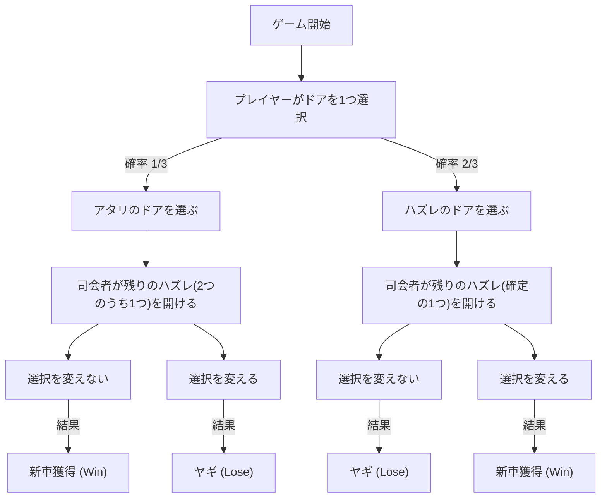
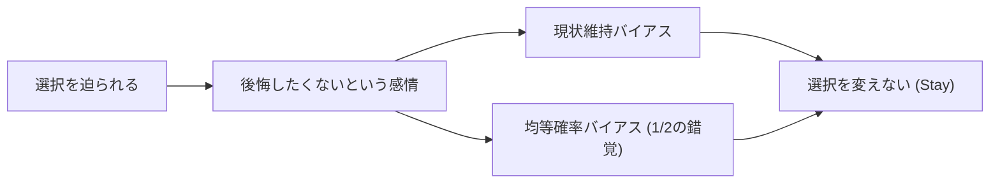

# 序論：人間の直感が陥る罠と確率の世界

私たちの日常生活において、「直感」は非常に強力な意思決定ツールとして機能します。経験則やヒューリスティクス（簡便法）に基づき、瞬時に状況を判断し、行動を選択する能力は、人類が過酷な自然環境を生き抜くために獲得した進化の賜物です。しかし、この優れた直感システムには、特定の条件下で致命的なエラーを引き起こすという弱点が存在します。その最も顕著な例が、「確率」に関する問題に直面したときです。

確率論は、不確実な事象を定量的に評価するための数学的枠組みですが、その結論はしばしば私たちの直感と激しく衝突します。この現象は「認知バイアス」や「直感と論理の乖離」として、心理学、行動経済学、そして数学教育の分野で長らく研究されてきました。

本記事では、この直感と確率の乖離を象徴する最も有名なパラドックス、「[モンティ・ホール問題](/p/monty-hall-problem/)（Monty Hall problem）」を取り上げます。この問題は、その見かけの単純さとは裏腹に、世界中の名だたる数学者や科学者たちをも巻き込んだ大論争を引き起こしました。「なぜ私たちは、これほどまでに簡単な確率の罠に陥ってしまうのか？」という問いを通じて、人間の認知構造の限界と、論理的思考の重要性について、深く、そして徹底的に探求していきます。

## 第1章：モンティ・ホール問題とは何か？

[モンティ・ホール問題](/p/monty-hall-problem/)は、アメリカの長寿テレビ番組『Let's Make a Deal』の司会者、モンティ・ホール（Monty Hall）の名にちなんで名付けられた確率のパラドックスです。この問題が一般に広く知られるようになったのは、1990年にニュース雑誌『パレード』のコラム「マリリンに聞け（Ask Marilyn）」で取り上げられたことがきっかけでした。

### 問題の設定

あなたがテレビのゲーム番組の解答者であると想像してください。あなたの前には、閉ざされた3つのドア（ドアA、ドアB、ドアC）があります。

1. 1つのドアの後ろには「新車（アタリ）」があります。
2. 残りの2つのドアの後ろには「ヤギ（ハズレ）」がいます。
3. あなたは新車を当てれば、それをもらうことができます。

ゲームのルールと進行は以下の通りです。

1. まず、あなたは3つのドアの中から1つを選びます（例として、**ドアA**を選んだとしましょう）。
2. この番組の司会者であるモンティは、どのドアの後ろに新車があるかを知っています。
3. モンティは、あなたが選ばなかった残りの2つのドア（ドアBとドアC）のうち、**必ずヤギがいるドアを1つ開けて見せます**。（例えば、ドアBにヤギがいた場合、ドアBを開けます）。
4. そして、モンティはあなたにこう尋ねます。
   **「ドアCに変更してもいいですよ。選択を変えますか？」**

さて、ここで問題です。
**あなたは選択を変えるべきでしょうか？ それとも、最初の選択（ドアA）を維持するべきでしょうか？ どちらが新車を獲得する確率が高いでしょうか？**

### 直感による回答

多くの人がこの問題を出されたとき、次のように推論します。

「ドアは3つあり、1つ（ヤギのドア）が開けられた。残っているのは、自分が選んだドア（ドアA）と、もう1つの閉まっているドア（ドアC）の2つだけだ。新車はどちらかの後ろにあるのだから、確率はそれぞれ50%（1/2）ずつのはずだ。したがって、選択を変えても変えなくても勝率は同じであり、わざわざ変える必要はない。」

この直感的な答えは非常に説得力があり、圧倒的多数の人々（調査によっては約85%以上）が「選択を変えても確率は変わらない（1/2）」と答えます。

しかし、**数学的に正しい答えは「選択を変えるべき」**なのです。選択を変えた場合、新車を獲得する確率は**2/3（約66.7%）**に跳ね上がり、最初の選択を維持した場合の確率**1/3（約33.3%）**の2倍になります。

この解答がマリリン・ボス・サバント（当時、世界最高のIQを持つとしてギネスブックに認定されていた女性）によって提示されたとき、全米から約1万通もの反論の手紙が殺到しました。その中には、博士号を持つ数学者や科学者からの手紙も約1,000通含まれており、「あなたは数学を全く理解していない」「女性の非論理的な妄想だ」といった激しい非難が浴びせられました。

なぜ、これほどまでに多くの知識人たちが間違えたのでしょうか。次章でその数学的証明を解き明かします。

## 第2章：確率の真実と数学的証明

直感では「1/2」に思える確率が、なぜ「選択を変えれば2/3」になるのか。これを理解するためには、いくつかの異なるアプローチから問題を見つめ直す必要があります。

### 証明アプローチ1：全パターンの列挙（樹形図的思考）

最も確実でわかりやすい方法は、起こりうるすべてのパターンを列挙し、確率を計算することです。
新車がどのドアにあるかは、ランダムに決定されるため、以下の3つのケースがそれぞれ 1/3 の確率で発生します。

- ケース1：新車は「ドアA」にある
- ケース2：新車は「ドアB」にある
- ケース3：新車は「ドアC」にある

あなたが最初に**ドアA**を選んだと仮定して、それぞれのケースで「選択を維持した場合」と「選択を変えた場合」の結果を見てみましょう。

| ケース | 新車の位置 | あなたの選択 | 司会者が開けるドア | 選択を維持した場合 | 選択を変えた場合 |
|---|---|---|---|---|---|
| 1 (1/3) | ドアA | ドアA | BまたはC（ヤギ） | **新車獲得** (Win) | ヤギ (Lose) |
| 2 (1/3) | ドアB | ドアA | ドアC（ヤギ） | ヤギ (Lose) | **新車獲得** (Win) |
| 3 (1/3) | ドアC | ドアA | ドアB（ヤギ） | ヤギ (Lose) | **新車獲得** (Win) |

この表から明らかなように、「選択を維持した場合」に新車を獲得できるのはケース1のみ（確率1/3）です。一方、「選択を変えた場合」に新車を獲得できるのはケース2とケース3の2パターンであり、その合計確率は 2/3 となります。
つまり、**「最初から正解を選んでいる確率（1/3）」**と**「最初はハズレを選んでいる確率（2/3）」**の比較に他ならないのです。司会者がハズレを1つ消してくれるため、「最初はハズレを選んでいる」という不運が、選択を変えることによって「必ずアタリに変わる」という幸運に反転する構造になっています。

### 証明アプローチ2：情報理論と極端なモデル

3つのドアでは直感が邪魔をする場合、ドアの数を極端に増やしてみると理解しやすくなります。

「ドアが100万枚ある」と想像してください。
1. あなたは1枚のドア（ドア番号1）を選びます。この時点で当たる確率は 1/1,000,000 です。
2. 司会者のモンティは、答えを知っています。彼は残りの 999,999 枚のドアのうち、ヤギがいる 999,998 枚のドアをすべて開けてしまいます。
3. 閉まっているのは、あなたが選んだ「ドア1」と、モンティが開け残した「ドア777,777」の2つだけです。

このとき、あなたはどう思いますか？
「自分が最初に選んだドア1が偶然正解だった確率（1/1,000,000）」と、「自分が外れていて、モンティが意図的に正解であるドア777,777を避けて残りの全部を開けた確率（999,999/1,000,000）」、どちらが高いかは明白でしょう。
当然、ドア777,777に変更するはずです。ドアが3枚の場合でも、本質的な数学的構造は全く同じなのです。

### 証明アプローチ3：Mermaidによる状態遷移図

視覚的に理解を深めるために、ゲームの進行をフローチャートで表現してみましょう。

この図から、**「最初にハズレのドアを選ぶ（確率2/3）」という状態から「選択を変える」行動をとれば、100%の確率で「新車獲得」に到達する**ことがわかります。逆に、最初にアタリのドアを選ぶ（確率1/3）という状態から選択を変えると、確実にヤギを引いてしまいます。
したがって、選択を変える戦略の期待勝率は、2/3 × 100% = 2/3 となります。

## 第3章：ベイズの定理による厳密な解法

[モンティ・ホール問題](/p/monty-hall-problem/)は、条件付き確率を計算するための「[ベイズの定理](/p/bayes-theorem/)（Bayes' theorem）」を用いることで、より数学的に厳密に解くことができます。ベイズ推定は、新しい情報（証拠）が得られたときに、事前の確率（事前確率）をどのように更新すべきか（事後確率）を示す強力なツールです。

事象を以下のように定義します。
- $C_i$ : 新車がドア $i$ にある事象（$i \in \{A, B, C\}$）
- $M_j$ : モンティがドア $j$ を開ける事象（$j \in \{A, B, C\}$）

プレイヤーは最初に「ドアA」を選んだと仮定します。
事前確率は、どのドアに新車があるか全く情報がないため、以下のように等確率になります。
$P(C_A) = 1/3$
$P(C_B) = 1/3$
$P(C_C) = 1/3$

ここで、モンティが「ドアB」を開けたとします。この情報が得られた後で、新車がドアAにある確率（事後確率 $P(C_A|M_B)$）と、新車がドアCにある確率（事後確率 $P(C_C|M_B)$）を計算します。

モンティの行動規則（条件付き確率 $P(M_B|C_i)$）は以下の通りです。
1. 新車がドアAにある場合（$C_A$）、モンティはBかCをランダムに開けるため、$P(M_B|C_A) = 1/2$
2. 新車がドアBにある場合（$C_B$）、モンティは絶対にBを開けられないため、$P(M_B|C_B) = 0$
3. 新車がドアCにある場合（$C_C$）、モンティはCを開けられず、Aはプレイヤーが選んでいるので開けられない。したがって、強制的にBを開けることになるため、$P(M_B|C_C) = 1$

[ベイズの定理](/p/bayes-theorem/)の公式は以下の通りです。
$P(C_i|M_B) = \frac{P(M_B|C_i) P(C_i)}{P(M_B)}$

分母である $P(M_B)$ （モンティがドアBを開ける全確率）を計算します（全確率の定理）。
$P(M_B) = P(M_B|C_A)P(C_A) + P(M_B|C_B)P(C_B) + P(M_B|C_C)P(C_C)$
$P(M_B) = (1/2 \times 1/3) + (0 \times 1/3) + (1 \times 1/3) = 1/6 + 0 + 1/3 = 1/2$

それでは、事後確率を計算しましょう。

**ドアA（選択を維持）に新車がある確率：**
$P(C_A|M_B) = \frac{P(M_B|C_A) P(C_A)}{P(M_B)} = \frac{(1/2) \times (1/3)}{1/2} = 1/3$

**ドアC（選択を変更）に新車がある確率：**
$P(C_C|M_B) = \frac{P(M_B|C_C) P(C_C)}{P(M_B)} = \frac{1 \times (1/3)}{1/2} = 2/3$

このように、[ベイズの定理](/p/bayes-theorem/)を用いれば、新しい情報（モンティがドアBを開けたこと）によって確率が更新され、ドアCの確率が 2/3 に跳ね上がることが数学的に完璧に証明されます。

## 第4章：なぜ人間の直感は間違うのか？（心理学的・認知的要因）

数学的な証明を何度見せられても、多くの人は「それでもやっぱり納得できない」「狐につままれたようだ」と感じます。なぜ、人間の脳はこの問題に対してこれほどまでに脆弱なのでしょうか。心理学や行動経済学の研究から、いくつかの深刻な認知バイアスが関与していることが明らかになっています。

### 1. 均等確率バイアス（Equiprobability Bias）

人間は、ランダムな事象や不確実な状況において、「利用可能な選択肢が残されている場合、それらの確率はすべて等しいはずだ」と無意識に見なす強い傾向があります。
[モンティ・ホール問題](/p/monty-hall-problem/)では、最終的に「ドアA」と「ドアC」の2つの選択肢が残されます。この「2つの選択肢」という視覚的・状況的情報が脳にインプットされた瞬間、「2つなのだから確率は1/2ずつだ」という強烈なヒューリスティックが発動します。
過去の歴史的経緯（最初に3つあったこと、モンティが意図的にハズレを開けたこと）という「非対称な情報」を、私たちの脳は「現在の状況」から切り離して無視してしまうのです。

### 2. 因果関係と「意図」の誤認

私たちは、物事の因果関係を直線的に理解しようとします。
ルーレットで赤が5回連続で出た後に「次はそろそろ黒が出るだろう」と考えてしまう「ギャンブラーの誤謬（Gambler's fallacy）」に似ていますが、[モンティ・ホール問題](/p/monty-hall-problem/)では逆に「情報の更新」を過小評価します。

重要なのは、<strong>「司会者のモンティはランダムにドアを開けているわけではない」</strong>という点です。
もし司会者が何も知らずにランダムにドアを開け、それが「たまたまヤギだった」場合であれば、残った2つのドアの確率は本当に 1/2 になります（これを「無知な司会者問題」と呼びます）。
しかし、モンティは「必ずヤギを開ける」という強い制約（意図）を持っています。この「意図的な選択による情報の非対称性」を、人間の直感は正しく処理できず、「ただドアが1つ減っただけ」という物理的な事実にしか目が向かないのです。

### 3. 現状維持バイアス（Status Quo Bias）と後悔の回避

行動経済学の観点からは、「現状維持バイアス」が大きく影響しています。
人間は、行動を起こして失敗したときの後悔（コミッション・エラー）のほうが、行動を起こさずに失敗したときの後悔（オミッション・エラー）よりも精神的ダメージが大きいと感じる生き物です。

「もし選択を変えて、最初のドアが正解だった場合」を想像してみてください。「わざわざ変えなければよかった！」という強烈な後悔に苛まれるでしょう。一方で「選択を変えずにハズレた場合」は、「まあ仕方ない、運が悪かった」と諦めがつきやすいのです。
このように、「後悔を最小化したい」という感情的な防衛機制が働き、「変えても変えなくても同じ（と思い込みたい）」という認知の歪みを生み出し、最終的に「現状維持（Stay）」を選択させてしまうのです。

## 第5章：日常生活におけるパラドックスの教訓

[モンティ・ホール問題](/p/monty-hall-problem/)は、単なるクイズや数学のパズルにとどまりません。このパラドックスが教えてくれる教訓は、私たちの日常生活、ビジネス、医療、AI開発など、さまざまな分野に応用できる普遍的な価値を持っています。

### データと直感の対立（医療における偽陽性の問題）

医療現場における「検査の正確性」の解釈も、直感とベイズ確率が乖離する典型例です。
例えば、「10,000人に1人が罹患する難病」があり、その検査薬の精度が「99%（陽性の人を99%正しく陽性と判定し、陰性の人を99%正しく陰性と判定する）」だったとします。
あなたがこの検査を受けて「陽性」と判定された場合、あなたが本当にその難病に罹患している確率はどれくらいでしょうか？

直感的には「精度99%なのだから、自分が病気である確率も99%だろう」と絶望するかもしれません。
しかし、[ベイズの定理](/p/bayes-theorem/)で計算すると、実際に罹患している確率は<strong>わずか約1%弱（約0.98%）</strong>に過ぎません。圧倒的多数の「健康な人（9,999人）」のうちの1%（約100人）が「偽陽性」となるため、陽性反応が出た人の集団の中では、本物の患者（ほぼ1人）はごく少数派になるからです。

このように、直感的な確率評価（99%）と数学的な真実（1%）の間の圧倒的な乖離は、人々に不必要なパニックや誤った医療決断をもたらす危険性があります。[モンティ・ホール問題](/p/monty-hall-problem/)を理解することは、こうした「情報の非対称性と事前確率」を正しく評価するリテラシーを身につける第一歩なのです。

### ビジネス戦略における情報の価値

ビジネスにおいて、競合他社の動向や市場の反応は、まさに「モンティが開けたドア」に相当します。
自社がある戦略（ドアA）を選択したとします。その後、市場環境の変化や競合の失敗（ハズレのドアが開くこと）という新しい情報が入ってきます。
このとき、「当初の戦略を意地でも貫く（現状維持バイアス）」のか、それとも「新しい情報をベイズ的に評価し、戦略をピボット（選択を変更）する」のか。柔軟に戦略を変更できる企業の方が、長期的には高い成功確率（2/3）を掴み取ることができるという教訓として解釈できます。サンクコスト（埋没費用）に囚われず、常に「事後確率」で意思決定を行うことが重要です。

## 終わりに：知性とは「直感を疑う」勇気である

[モンティ・ホール問題](/p/monty-hall-problem/)がこれほどまでに魅力的で、そして恐ろしいのは、それが「人間の知性の限界」を見事に浮き彫りにしているからです。博士号を持つ専門家でさえ、最初の直感に騙され、正しい証明に対して感情的に反発してしまいました。

私たちは、自分が進化の過程で身につけた「直感」という強力な武器に頼って生きています。しかし、複雑化し、データが溢れる現代社会においては、その直感が時に私たちを罠に陥れることを自覚しなければなりません。

[モンティ・ホール問題](/p/monty-hall-problem/)は、私たちに一つの重要なメッセージを伝えています。
それは、<strong>「自分の直感を盲信せず、論理と数学という道具を使って、立ち止まって考え直すことの重要性」</strong>です。一見すると直感に反するような真実（真理）を受け入れるには、知的謙遜と、自分の思い込みをアップデートする勇気が必要です。

次にあなたが人生の重大な選択を迫られ、そして新しい情報（開かれたドア）を手にしたとき、どうかこの[モンティ・ホール問題](/p/monty-hall-problem/)を思い出してください。その情報によって確率は変化していないか？ 現状維持バイアスに囚われていないか？ 
論理的に導き出された「選択を変える」という決断が、あなたの目の前に新車をもたらすかもしれません。
