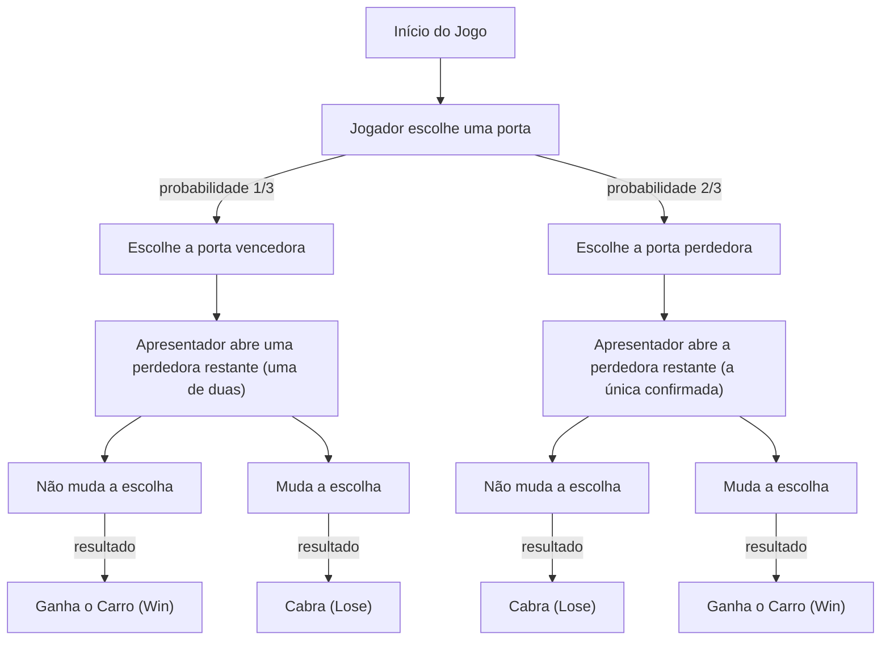
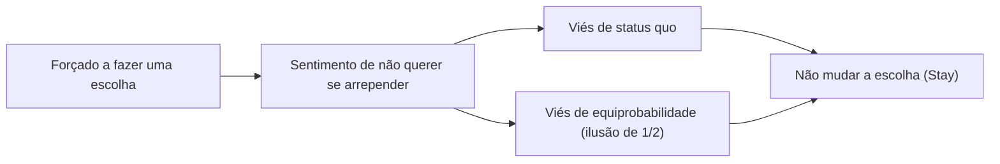

# Introdução: A Armadilha em que Nossa Intuição Cai e o Mundo da Probabilidade

Em nossa vida cotidiana, a "intuição" atua como uma ferramenta de tomada de decisão incrivelmente poderosa. A habilidade de julgar instantaneamente uma situação e escolher uma ação com base em regras empíricas e heurísticas é uma dádiva evolutiva adquirida para ajudar a humanidade a sobreviver em ambientes naturais hostis. No entanto, esse excelente sistema intuitivo tem uma fraqueza: sob certas condições, pode causar erros fatais. O exemplo mais notável disso ocorre quando nos deparamos com problemas envolvendo "probabilidade".

A teoria das probabilidades é uma estrutura matemática para avaliar quantitativamente eventos incertos, mas suas conclusões muitas vezes entram em conflito severo com nossa intuição. Esse fenômeno tem sido amplamente estudado nos campos da psicologia, economia comportamental e educação matemática como "viés cognitivo" ou "divergência entre intuição e lógica".

Neste artigo, abordaremos o paradoxo mais famoso que simboliza essa divergência entre intuição e probabilidade: o "Problema de Monty Hall". Apesar de sua aparente simplicidade, este problema provocou grandes debates envolvendo renomados matemáticos e cientistas de todo o mundo. Através da pergunta "Por que caímos em uma armadilha probabilística tão simples?", exploraremos profunda e exaustivamente as limitações da estrutura cognitiva humana e a importância do pensamento lógico.

## Capítulo 1: O Que é o Problema de Monty Hall?

O Problema de Monty Hall é um paradoxo probabilístico que leva o nome de Monty Hall, o apresentador do antigo programa de televisão americano *Let's Make a Deal*. O problema tornou-se amplamente conhecido do público após ser apresentado em 1990 na coluna "Ask Marilyn" da revista de notícias *Parade*.

### Configuração do Problema

Imagine que você é um participante em um programa de auditório na TV. À sua frente, há três portas fechadas (Porta A, Porta B e Porta C).

1. Atrás de uma das portas há um "carro novo" (o prêmio).
2. Atrás das outras duas portas há "cabras" (os perdedores).
3. Se você acertar o carro novo, pode ficar com ele.

As regras e o andamento do jogo são os seguintes:

1. Primeiro, você escolhe uma das três portas (vamos assumir que você escolheu a **Porta A**).
2. O apresentador do programa, Monty, sabe o que há atrás de cada porta.
3. Das duas portas que você não escolheu (Porta B e Porta C), Monty **sempre abre uma que tem uma cabra**. (Por exemplo, se houver uma cabra na Porta B, ele abre a Porta B).
4. Então, Monty pergunta a você:
   **"Você gostaria de trocar para a Porta C? Quer mudar de ideia?"**

Aqui está o problema:
**Você deve mudar sua escolha? Ou deve manter sua escolha inicial (Porta A)? Qual tem a maior probabilidade de ganhar o carro novo?**

### A Resposta Intuitiva

Quando questionadas sobre esse problema, muitas pessoas raciocinam da seguinte forma:

"Existem três portas, e uma (a da cabra) foi aberta. Restam apenas duas: a porta que escolhi (Porta A) e a outra porta fechada (Porta C). Como o carro novo está atrás de uma delas, a probabilidade deve ser de 50% (1/2) para cada uma. Portanto, a chance de ganhar é a mesma, mudando ou não a escolha, então não há necessidade de mudar."

Essa resposta intuitiva é muito convincente, e uma esmagadora maioria (cerca de 85% ou mais, dependendo da pesquisa) responde que "a probabilidade não muda mesmo se eu mudar a escolha (1/2)".

No entanto, **a resposta matematicamente correta é "você deve mudar a escolha"**. Se você mudar sua escolha, a probabilidade de ganhar o carro novo salta para **2/3 (cerca de 66,7%)**, que é o dobro da probabilidade de **1/3 (cerca de 33,3%)** se você mantiver sua escolha inicial.

Quando essa resposta foi apresentada por Marilyn vos Savant (uma mulher que na época tinha o QI mais alto do mundo segundo o Guinness Book), ela recebeu cerca de 10.000 cartas de objeção de todo os Estados Unidos. Entre elas, havia cerca de 1.000 cartas de matemáticos e cientistas com doutorado, dirigindo-lhe duras críticas como "Você não entende nada de matemática" e "Isso é uma ilusão ilógica de mulher".

Por que tantos intelectuais erraram? O próximo capítulo desvendará a prova matemática.

## Capítulo 2: A Verdade da Probabilidade e a Prova Matemática

Por que a probabilidade que intuitivamente parece "1/2" se torna "2/3 se você mudar a escolha"? Para entender isso, precisamos reexaminar o problema por meio de várias abordagens diferentes.

### Abordagem de Prova 1: Enumerando Todos os Padrões (Pensamento em Diagrama de Árvore)

O método mais confiável e fácil de entender é listar todos os padrões possíveis e calcular as probabilidades.
Como a porta atrás da qual está o carro novo é escolhida aleatoriamente, os três casos a seguir ocorrem com 1/3 de probabilidade cada:

- Caso 1: O carro novo está na "Porta A"
- Caso 2: O carro novo está na "Porta B"
- Caso 3: O carro novo está na "Porta C"

Supondo que você escolheu a **Porta A** inicialmente, vamos ver os resultados de "manter a escolha" e "mudar a escolha" em cada caso.

| Caso | Posição do Carro | Sua Escolha | Porta que o Apresentador Abre | Se Mantiver a Escolha | Se Mudar a Escolha |
|---|---|---|---|---|---|
| 1 (1/3) | Porta A | Porta A | B ou C (Cabra) | **Ganha o Carro** (Win) | Cabra (Lose) |
| 2 (1/3) | Porta B | Porta A | Porta C (Cabra) | Cabra (Lose) | **Ganha o Carro** (Win) |
| 3 (1/3) | Porta C | Porta A | Porta B (Cabra) | Cabra (Lose) | **Ganha o Carro** (Win) |

Como a tabela deixa claro, você só ganha o carro novo no Caso 1 (probabilidade 1/3) se "manter a escolha". Por outro lado, há dois padrões (Caso 2 e Caso 3) em que você ganha o carro novo se "mudar a escolha", resultando em uma probabilidade total de 2/3.
Em outras palavras, não passa de uma comparação entre a **"probabilidade de escolher a resposta certa desde o início (1/3)"** e a **"probabilidade de escolher a resposta errada no início (2/3)"**. Como o apresentador elimina uma opção errada para você, a má sorte de "escolher a resposta errada no início" se transforma estruturalmente na boa sorte de "transformar-se garantidamente em um acerto" ao mudar a escolha.

### Abordagem de Prova 2: Teoria da Informação e um Modelo Extremo

Se a intuição atrapalha com 3 portas, aumentar drasticamente o número de portas facilita a compreensão.

Imagine que "existem 1 milhão de portas".
1. Você escolhe uma porta (Porta Número 1). Neste momento, a probabilidade de acerto é 1/1.000.000.
2. Monty, o apresentador, sabe a resposta. Das 999.999 portas restantes, ele abre todas as 999.998 portas que têm cabras.
3. As únicas portas fechadas são a "Porta 1" que você escolheu, e a "Porta 777.777" que Monty deixou fechada.

Neste momento, o que você acha?
É óbvio qual probabilidade é maior: "a probabilidade de a Porta 1 que escolhi primeiro ser a correta por acaso (1/1.000.000)" ou "a probabilidade de eu ter errado, e Monty ter evitado intencionalmente a Porta 777.777 correta, abrindo todas as outras (999.999/1.000.000)".
Naturalmente, você mudaria para a Porta 777.777. Mesmo no caso de 3 portas, a estrutura matemática essencial é exatamente a mesma.

### Abordagem de Prova 3: Diagrama de Transição de Estado usando Mermaid

Para aprofundar a compreensão visual, vamos representar o fluxo do jogo com um fluxograma.

Deste diagrama, pode-se ver que **se você tomar a ação de "mudar a escolha" a partir do estado de "escolher a porta perdedora inicialmente (probabilidade 2/3)", você chegará a "Ganhar o Carro" com 100% de probabilidade**. Por outro lado, se você mudar a escolha a partir do estado de escolher a porta vencedora inicialmente (probabilidade 1/3), você certamente ganhará uma cabra.
Portanto, a taxa de vitória esperada para a estratégia de mudar a escolha é 2/3 × 100% = 2/3.

## Capítulo 3: Solução Rigorosa pelo Teorema de Bayes

O Problema de Monty Hall pode ser resolvido de forma matemática mais rigorosa usando o "Teorema de Bayes" (Bayes' theorem) para calcular probabilidades condicionais. A inferência bayesiana é uma ferramenta poderosa que mostra como atualizar a probabilidade anterior (probabilidade a priori) quando novas informações (evidências) são obtidas (probabilidade a posteriori).

Definimos os eventos da seguinte forma:
- $C_i$ : O evento de o carro novo estar na porta $i$ ($i \in \{A, B, C\}$)
- $M_j$ : O evento de Monty abrir a porta $j$ ($j \in \{A, B, C\}$)

Vamos assumir que o jogador escolheu a "Porta A" primeiro.
A probabilidade a priori, sem nenhuma informação sobre qual porta tem o carro novo, é equiprovável:
$P(C_A) = 1/3$
$P(C_B) = 1/3$
$P(C_C) = 1/3$

Agora, suponha que Monty abriu a "Porta B". Depois de obter essa informação, calculamos a probabilidade de o carro novo estar na Porta A (probabilidade a posteriori $P(C_A|M_B)$) e a probabilidade de estar na Porta C (probabilidade a posteriori $P(C_C|M_B)$).

As regras de comportamento de Monty (probabilidade condicional $P(M_B|C_i)$) são as seguintes:
1. Se o carro novo estiver na Porta A ($C_A$), Monty abre B ou C aleatoriamente, então $P(M_B|C_A) = 1/2$
2. Se o carro novo estiver na Porta B ($C_B$), Monty nunca poderá abrir B, então $P(M_B|C_B) = 0$
3. Se o carro novo estiver na Porta C ($C_C$), Monty não pode abrir C, e não pode abrir A porque o jogador a escolheu. Portanto, ele é forçado a abrir B, logo $P(M_B|C_C) = 1$

A fórmula do Teorema de Bayes é:
$P(C_i|M_B) = \frac{P(M_B|C_i) P(C_i)}{P(M_B)}$

Vamos calcular o denominador $P(M_B)$ (a probabilidade total de Monty abrir a Porta B) (Teorema da Probabilidade Total).
$P(M_B) = P(M_B|C_A)P(C_A) + P(M_B|C_B)P(C_B) + P(M_B|C_C)P(C_C)$
$P(M_B) = (1/2 \times 1/3) + (0 \times 1/3) + (1 \times 1/3) = 1/6 + 0 + 1/3 = 1/2$

Agora, vamos calcular as probabilidades a posteriori.

**Probabilidade de o carro novo estar na Porta A (manter a escolha):**
$P(C_A|M_B) = \frac{P(M_B|C_A) P(C_A)}{P(M_B)} = \frac{(1/2) \times (1/3)}{1/2} = 1/3$

**Probabilidade de o carro novo estar na Porta C (mudar a escolha):**
$P(C_C|M_B) = \frac{P(M_B|C_C) P(C_C)}{P(M_B)} = \frac{1 \times (1/3)}{1/2} = 2/3$

Assim, usando o Teorema de Bayes, está matematicamente comprovado que a probabilidade salta para 2/3 na Porta C porque a probabilidade é atualizada pela nova informação (Monty abrindo a Porta B).

## Capítulo 4: Por Que a Intuição Humana Falha? (Fatores Psicológicos e Cognitivos)

Não importa quantas vezes a prova matemática lhes seja mostrada, muitas pessoas ainda sentem: "Eu ainda não consigo aceitar" ou "Parece que fui enganado". Por que o cérebro humano é tão vulnerável a este problema? Pesquisas em psicologia e economia comportamental revelaram que vários vieses cognitivos sérios estão envolvidos.

### 1. Viés de Equiprobabilidade (Equiprobability Bias)

Os humanos têm uma forte tendência a assumir inconscientemente que, em eventos aleatórios e situações incertas, "se houver opções disponíveis, todas as suas probabilidades devem ser iguais".
No problema de Monty Hall, duas opções, "Porta A" e "Porta C", são finalmente deixadas. No momento em que essa informação visual e situacional de "duas opções" é inserida no cérebro, uma heurística poderosa de "como há duas, a probabilidade é 1/2 para cada" é acionada.
Nosso cérebro separa e ignora a "informação assimétrica" do histórico passado (havia três inicialmente e Monty abriu intencionalmente uma porta com cabra) da "situação atual".

### 2. Má Interpretação de Causalidade e "Intenção"

Tentamos entender as relações de causa e efeito de forma linear.
Isso é semelhante à "falácia do apostador" (Gambler's fallacy), onde se pensa "o preto deve sair em breve" depois que o vermelho sai 5 vezes seguidas na roleta, mas no Problema de Monty Hall, pelo contrário, subestimamos a "atualização da informação".

O que é importante é que **"Monty, o apresentador, não está abrindo as portas aleatoriamente"**.
Se o apresentador não soubesse nada, abrisse uma porta aleatoriamente, e "acontecesse de ser uma cabra", então a probabilidade das duas portas restantes seria realmente 1/2 (isso é chamado de "problema do apresentador ignorante").
No entanto, Monty tem uma forte restrição (intenção) de "sempre abrir uma cabra". A intuição humana não consegue processar corretamente essa "assimetria de informação devido a uma escolha intencional", e nossos olhos só conseguem focar no fato físico de que "uma porta apenas foi removida".

### 3. Viés de Status Quo (Status Quo Bias) e Evitação do Arrependimento

Da perspectiva da economia comportamental, o "viés de status quo" tem um grande impacto.
Os seres humanos são criaturas que sentem que o dano psicológico do arrependimento quando tomam uma atitude e falham (erro de comissão) é maior que o arrependimento quando falham por inação (erro de omissão).

Imagine "E se eu mudasse minha escolha e a primeira porta estivesse certa?". Você seria atormentado por um arrependimento intenso, pensando: "Eu não deveria ter mudado!". Por outro lado, se você disser "Errei sem mudar a escolha", é mais fácil desistir e pensar "Bem, não teve jeito, não tive sorte".
Dessa forma, o mecanismo de defesa emocional de "querer minimizar o arrependimento" entra em ação, criando uma distorção cognitiva de "é o mesmo mudando ou não (eu quero acreditar nisso)" e, finalmente, faz você escolher "manter (Stay)".

## Capítulo 5: Lições do Paradoxo na Vida Cotidiana

O Problema de Monty Hall é mais do que apenas um quiz ou um quebra-cabeça matemático. A lição que este paradoxo ensina tem valor universal que pode ser aplicado a vários campos, como vida cotidiana, negócios, medicina e desenvolvimento de IA.

### O Conflito Entre Dados e Intuição (O Problema dos Falsos Positivos na Medicina)

A interpretação da "precisão do teste" no campo médico também é um exemplo típico em que a intuição e as probabilidades bayesianas divergem.
Por exemplo, suponha que exista uma "doença intratável que afeta 1 em cada 10.000 pessoas", e a precisão de seu teste é de "99% (identifica corretamente 99% das pessoas positivas como positivas, e 99% das pessoas negativas como negativas)".
Se você fizer este teste e der "positivo", qual é a probabilidade de você realmente ter essa doença intratável?

Intuitivamente, você pode se desesperar, pensando, "A precisão é de 99%, então a probabilidade de eu estar doente também deve ser de 99%".
No entanto, calculado pelo Teorema de Bayes, a probabilidade real de ter a doença é de **menos de 1% (cerca de 0,98%)**. Como 1% (cerca de 100 pessoas) da esmagadora maioria de "pessoas saudáveis (9.999 pessoas)" se tornam "falsos positivos", pacientes reais (quase 1) são uma pequena minoria no grupo de pessoas com teste positivo.

Essa diferença esmagadora entre avaliações probabilísticas intuitivas (99%) e verdades matemáticas (1%) carrega o risco de causar pânico desnecessário e decisões médicas incorretas. Entender o Problema de Monty Hall é o primeiro passo para adquirir o letramento de avaliar corretamente essa "assimetria de informação e probabilidades a priori".

### O Valor da Informação na Estratégia de Negócios

Nos negócios, os movimentos dos concorrentes e a resposta do mercado são exatamente como a "porta que Monty abriu".
Suponha que sua empresa escolha uma certa estratégia (Porta A). Mais tarde, novas informações entram, como mudanças no ambiente de mercado e falhas da concorrência (uma porta com cabra se abrindo).
Neste momento, você deve "persistir na estratégia original a qualquer custo (viés de status quo)" ou "avaliar bayesianamente as novas informações e pivotar (mudar) a estratégia"? Isso pode ser interpretado como uma lição de que empresas capazes de mudar flexivelmente suas estratégias podem ter uma maior probabilidade de sucesso (2/3) no longo prazo. É importante não ficar preso a custos afundados (sunk costs) e sempre tomar decisões com base em "probabilidades a posteriori".

## Conclusão: Inteligência é a Coragem de "Duvidar da Sua Intuição"

A razão pela qual o Problema de Monty Hall é tão fascinante e aterrorizante é porque destaca perfeitamente as "limitações da inteligência humana". Até mesmo especialistas com doutorado foram enganados por suas intuições iniciais e reagiram emocionalmente contra a prova correta.

Vivemos confiando na poderosa arma da "intuição" que adquirimos ao longo da evolução. No entanto, em uma sociedade moderna que está se tornando cada vez mais complexa e inundada de dados, devemos estar cientes de que essa mesma intuição às vezes pode nos levar a armadilhas.

O Problema de Monty Hall transmite uma mensagem importante para nós.
Isto é, **"A importância de parar e repensar usando ferramentas de lógica e matemática, em vez de confiar cegamente na própria intuição"**. Requer humildade intelectual e coragem para atualizar as próprias suposições, a fim de aceitar uma verdade que, à primeira vista, vai contra a intuição.

Da próxima vez que você for forçado a fazer uma escolha importante na vida e tiver novas informações (uma porta aberta) em mãos, por favor, lembre-se deste Problema de Monty Hall. Essa informação mudou a probabilidade? Você está preso pelo viés de status quo?
A decisão logicamente derivada de "mudar a escolha" pode trazer um carro novo bem diante dos seus olhos.
