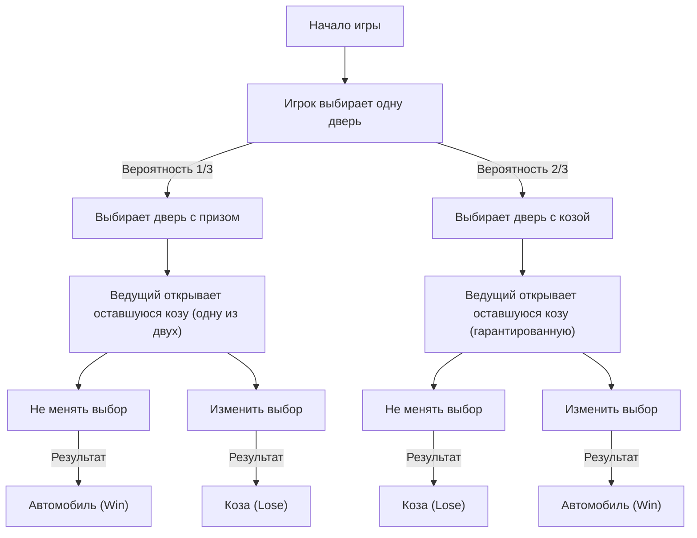
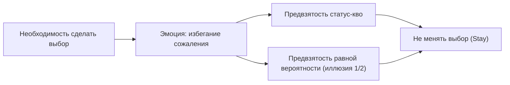

# Введение: ловушки человеческой интуиции и мир вероятностей

В нашей повседневной жизни «интуиция» служит очень мощным инструментом принятия решений. Способность мгновенно оценивать ситуацию и выбирать действия на основе опыта и эвристики — это дар эволюции, который человечество приобрело, чтобы выжить в суровых природных условиях. Однако у этой превосходной интуитивной системы есть слабое место: при определенных условиях она вызывает фатальные ошибки. Наиболее ярким примером этого является столкновение с проблемами, связанными с «вероятностью».

Теория вероятностей — это математическая основа для количественной оценки неопределенных событий, но ее выводы часто вступают в резкое противоречие с нашей интуицией. Это явление, известное как «когнитивное искажение» или «расхождение между интуицией и логикой», уже давно изучается в психологии, поведенческой экономике и математическом образовании.

В этой статье рассматривается самый известный парадокс, символизирующий это расхождение, — «парадокс Монти Холла» (Monty Hall problem). Эта задача, несмотря на свою кажущуюся простоту, вызвала огромные споры с участием выдающихся математиков и ученых со всего мира. Задаваясь вопросом: «Почему мы попадаем в такую простую вероятностную ловушку?», мы глубоко и всесторонне исследуем ограничения когнитивных структур человека и важность логического мышления.

## Глава 1: Что такое парадокс Монти Холла?

Парадокс Монти Холла — это парадокс теории вероятностей, названный в честь Монти Холла, ведущего американского телешоу «Let's Make a Deal» (Давай заключим сделку). Проблема получила широкую известность в 1990 году, когда была опубликована в колонке Мэрилин вос Савант «Спросите Мэрилин» (Ask Marilyn) в журнале Parade.

### Условия задачи

Представьте, что вы участник телевизионного игрового шоу. Перед вами три закрытые двери (дверь A, дверь B и дверь C).

1. За одной из дверей находится «новый автомобиль» (выигрыш).
2. За двумя оставшимися дверями находятся «козы» (проигрыш).
3. Если вы угадаете дверь с автомобилем, вы его получите.

Правила и ход игры следующие:

1. Сначала вы выбираете одну из трех дверей (допустим, вы выбрали **дверь A**).
2. Ведущий программы, Монти, знает, за какой дверью находится автомобиль.
3. Из оставшихся двух дверей (B и C), которые вы не выбрали, Монти **обязательно открывает одну дверь, за которой находится коза**. (Например, если коза за дверью B, он открывает дверь B).
4. Затем Монти спрашивает вас:
   **«Вы можете поменять свой выбор на дверь C. Хотите ли вы изменить решение?»**

А теперь вопрос.
**Стоит ли вам менять выбор? Или нужно остаться при своем первоначальном выборе (дверь A)? При каком решении вероятность выиграть автомобиль выше?**

### Интуитивный ответ

Многие люди, сталкиваясь с этой задачей, рассуждают так:

«Было 3 двери, одну (с козой) открыли. Осталось только две: та, которую выбрал я (дверь A), и еще одна закрытая (дверь C). Поскольку автомобиль находится за одной из них, вероятность для каждой должна быть 50% (1/2). Следовательно, изменю я выбор или нет, шансы на победу одинаковы, и нет смысла ничего менять».

Этот интуитивный ответ звучит очень убедительно, и подавляющее большинство людей (по некоторым опросам более 85%) отвечают: «Вероятность не изменится (1/2), если поменять выбор».

Однако **математически правильный ответ — «выбор нужно менять»**. Если вы измените решение, вероятность выигрыша автомобиля возрастает до **2/3 (около 66,7%)**, что в два раза превышает вероятность **1/3 (около 33,3%)** при сохранении первоначального выбора.

Когда этот ответ был представлен Мэрилин вос Савант (в то время занесенной в Книгу рекордов Гиннесса как женщина с самым высоким IQ в мире), в редакцию пришло около 10 000 гневных писем со всей Америки. Среди них было около 1 000 писем от докторов наук и математиков, в которых на нее обрушилась резкая критика: «Вы совершенно не понимаете математику», «Это нелогичный женский бред».

Почему так много интеллектуалов ошиблись? В следующей главе мы разберем математическое доказательство.

## Глава 2: Истина о вероятности и математическое доказательство

Почему вероятность, которая интуитивно кажется «1/2», превращается в «2/3 при изменении выбора»? Чтобы понять это, необходимо взглянуть на проблему с нескольких разных точек зрения.

### Метод доказательства 1: Перечисление всех вариантов (построение дерева вероятностей)

Самый надежный и простой для понимания способ — перечислить все возможные сценарии и подсчитать вероятность.
Поскольку дверь с автомобилем выбирается случайным образом, каждый из трех следующих вариантов имеет вероятность 1/3:

- Вариант 1: Автомобиль находится за «дверью A»
- Вариант 2: Автомобиль находится за «дверью B»
- Вариант 3: Автомобиль находится за «дверью C»

Предположим, что вы сначала выбрали **дверь A**. Давайте посмотрим на результаты «сохранения выбора» и «изменения выбора» для каждого сценария.

| Вариант | Где авто | Ваш выбор | Какую дверь открывает ведущий | Если не менять выбор | Если изменить выбор |
|---|---|---|---|---|---|
| 1 (1/3) | Дверь A | Дверь A | B или C (коза) | **Автомобиль** (Win) | Коза (Lose) |
| 2 (1/3) | Дверь B | Дверь A | Дверь C (коза) | Коза (Lose) | **Автомобиль** (Win) |
| 3 (1/3) | Дверь C | Дверь A | Дверь B (коза) | Коза (Lose) | **Автомобиль** (Win) |

Из этой таблицы ясно видно, что при «сохранении выбора» вы получаете автомобиль только в варианте 1 (вероятность 1/3). С другой стороны, при «изменении выбора» вы получаете автомобиль в вариантах 2 и 3, общая вероятность которых составляет 2/3.
Другими словами, это просто сравнение **«вероятности выбрать правильный ответ с самого начала (1/3)»** и **«вероятности выбрать неверный ответ с самого начала (2/3)»**. Поскольку ведущий устраняет один неверный вариант, неудача «изначально неправильного выбора» благодаря изменению решения оборачивается удачей — вы «гарантированно попадаете в выигрыш».

### Метод доказательства 2: Теория информации и экстремальные модели

Если интуиция мешает в случае с тремя дверями, проблему легче понять, если экстремально увеличить их количество.

Представьте, что перед вами «1 000 000 дверей».
1. Вы выбираете одну дверь (дверь 1). На этом этапе вероятность выигрыша составляет 1/1 000 000.
2. Ведущий Монти знает, где приз. Из оставшихся 999 999 дверей он открывает 999 998 дверей, за которыми находятся козы.
3. Закрытыми остаются только две: «дверь 1», которую выбрали вы, и «дверь 777 777», которую Монти оставил закрытой.

Что вы подумаете в этот момент?
Очевидно, что вероятность того, что «Монти, зная правильный ответ, намеренно обошел дверь 777 777 и открыл все остальные (999 999/1 000 000)», намного выше, чем вероятность того, что «выбранная вами с самого начала дверь 1 случайно оказалась выигрышной (1/1 000 000)».
Естественно, вы поменяете выбор на дверь 777 777. В случае с тремя дверями базовая математическая структура абсолютно идентична.

### Метод доказательства 3: Диаграмма переходов состояний в Mermaid

Для лучшего визуального понимания давайте представим ход игры в виде блок-схемы.

Из этой диаграммы видно, что **если вы находитесь в состоянии «сначала выбрана дверь с козой (вероятность 2/3)» и принимаете решение «изменить выбор», то вы со 100% вероятностью приходите к результату «Автомобиль»**. И наоборот, если вы находитесь в состоянии «сначала выбрана дверь с призом (вероятность 1/3)» и меняете выбор, вы гарантированно получаете козу.
Таким образом, ожидаемая вероятность выигрыша при стратегии изменения выбора составляет 2/3 × 100% = 2/3.

## Глава 3: Строгое решение на основе теоремы Байеса

Парадокс Монти Холла можно решить математически более строго с помощью «Теоремы Байеса» (Bayes' theorem), которая используется для вычисления условной вероятности. Байесовский вывод — это мощный инструмент, показывающий, как нужно обновлять априорную вероятность (вероятность до получения данных) при появлении новой информации (доказательств), превращая ее в апостериорную вероятность.

Определим события следующим образом:
- $C_i$ : событие, при котором автомобиль находится за дверью $i$ ($i \in \{A, B, C\}$)
- $M_j$ : событие, при котором Монти открывает дверь $j$ ($j \in \{A, B, C\}$)

Предположим, что игрок сначала выбрал «дверь A».
Априорная вероятность одинакова для всех дверей, так как у нас нет никакой информации о том, где находится автомобиль:
$P(C_A) = 1/3$
$P(C_B) = 1/3$
$P(C_C) = 1/3$

Теперь предположим, что Монти открыл «дверь B». После получения этой информации мы рассчитываем вероятность того, что автомобиль находится за дверью A (апостериорная вероятность $P(C_A|M_B)$), и вероятность того, что он находится за дверью C (апостериорная вероятность $P(C_C|M_B)$).

Правила поведения Монти (условная вероятность $P(M_B|C_i)$) следующие:
1. Если автомобиль за дверью A ($C_A$), Монти открывает B или C случайным образом, поэтому $P(M_B|C_A) = 1/2$
2. Если автомобиль за дверью B ($C_B$), Монти ни в коем случае не может открыть B, поэтому $P(M_B|C_B) = 0$
3. Если автомобиль за дверью C ($C_C$), Монти не может открыть C, а дверь A выбрана игроком, поэтому он тоже не может ее открыть. Следовательно, он вынужден открыть B, поэтому $P(M_B|C_C) = 1$

Формула теоремы Байеса выглядит так:
$P(C_i|M_B) = \frac{P(M_B|C_i) P(C_i)}{P(M_B)}$

Рассчитаем знаменатель $P(M_B)$ (полная вероятность того, что Монти откроет дверь B) по формуле полной вероятности:
$P(M_B) = P(M_B|C_A)P(C_A) + P(M_B|C_B)P(C_B) + P(M_B|C_C)P(C_C)$
$P(M_B) = (1/2 \times 1/3) + (0 \times 1/3) + (1 \times 1/3) = 1/6 + 0 + 1/3 = 1/2$

Теперь рассчитаем апостериорные вероятности.

**Вероятность того, что авто за дверью A (оставить выбор):**
$P(C_A|M_B) = \frac{P(M_B|C_A) P(C_A)}{P(M_B)} = \frac{(1/2) \times (1/3)}{1/2} = 1/3$

**Вероятность того, что авто за дверью C (изменить выбор):**
$P(C_C|M_B) = \frac{P(M_B|C_C) P(C_C)}{P(M_B)} = \frac{1 \times (1/3)}{1/2} = 2/3$

Таким образом, теорема Байеса математически безупречно доказывает, что новая информация (то, что Монти открыл дверь B) обновляет вероятности, и вероятность для двери C возрастает до 2/3.

## Глава 4: Почему человеческая интуиция ошибается? (Психологические и когнитивные факторы)

Сколько бы раз людям ни показывали математические доказательства, многие все равно чувствуют: «Я все еще не могу этого понять» или «Звучит как какой-то обман». Почему человеческий мозг так уязвим перед этой проблемой? Исследования в области психологии и поведенческой экономики выявили несколько серьезных когнитивных искажений.

### 1. Предвзятость равной вероятности (Equiprobability Bias)

Люди имеют сильную подсознательную тенденцию полагать, что в случайных событиях или неопределенных ситуациях, «если остаются доступные варианты, их вероятности должны быть равными».
В задаче Монти Холла в конечном итоге остаются два варианта: «дверь A» и «дверь C». В тот момент, когда эта визуальная и ситуативная информация («два варианта») поступает в мозг, срабатывает мощная эвристика: «Раз их два, значит, шансы 50 на 50».
Наш мозг просто отсекает от «текущей ситуации» и игнорирует всю историческую предысторию («несимметричную информацию» о том, что изначально их было три и что Монти намеренно открыл неверную дверь).

### 2. Причинно-следственные связи и неверное восприятие «намерения»

Мы склонны понимать причинно-следственные связи линейно.
Это похоже на «ошибку игрока» (Gambler's fallacy), когда после того, как красное выпадает в рулетке 5 раз подряд, человек думает: «Теперь уж точно выпадет черное». Однако в задаче Монти Холла мы, наоборот, недооцениваем «обновление информации».

Важно то, что **«ведущий Монти не открывает двери случайным образом»**.
Если бы ведущий ничего не знал и открывал дверь наугад, и там «случайно оказалась бы коза», вероятность оставшихся двух дверей действительно была бы 1/2 (это называется «вариант с несведущим ведущим»).
Однако у Монти есть жесткое ограничение (намерение): он «обязательно должен открыть козу». Человеческая интуиция не способна правильно обработать эту «информационную асимметрию, вызванную преднамеренным выбором», и сосредотачивается лишь на физическом факте: «просто дверей стало на одну меньше».

### 3. Предвзятость статус-кво (Status Quo Bias) и избегание сожалений

С точки зрения поведенческой экономики здесь сильно влияет «предвзятость статус-кво».
Люди так устроены, что психологический ущерб от сожаления об ошибке при совершении действия (ошибка действия) воспринимается гораздо острее, чем сожаление об ошибке из-за бездействия (ошибка бездействия).

Представьте: «что если вы поменяете выбор, а первоначальная дверь была правильной?» Вас будет мучить невыносимое сожаление: «Зачем я только поменял!». С другой стороны, если «вы не измените решение и проиграете», смириться будет проще: «Ну что ж, не повезло».
Таким образом, срабатывает эмоциональный защитный механизм «минимизации сожалений», создавая когнитивное искажение: «Поменяю я или нет — разницы нет (мне хочется в это верить)», что в конечном итоге заставляет человека выбрать «статус-кво» (Stay).

## Глава 5: Уроки парадокса в повседневной жизни

Парадокс Монти Холла — это больше, чем просто викторина или математическая головоломка. Уроки, которые дает этот парадокс, обладают универсальной ценностью, применимой во многих областях, таких как повседневная жизнь, бизнес, медицина и разработка ИИ.

### Конфликт данных и интуиции (Проблема ложноположительных результатов в медицине)

Интерпретация «точности тестов» в медицинской практике является классическим примером расхождения между интуицией и байесовской вероятностью.
Например, существует «редкое заболевание, которым страдает 1 из 10 000 человек», и точность диагностического теста составляет «99%» (он правильно выявляет 99% больных и правильно определяет 99% здоровых).
Если вы сдадите этот анализ и получите «положительный» результат, какова вероятность того, что вы действительно больны этим редким заболеванием?

Интуитивно вы можете прийти в отчаяние, подумав: «Точность теста 99%, значит, вероятность того, что я болен, тоже 99%».
Однако при расчете по теореме Байеса вероятность реального заболевания составляет **всего лишь менее 1% (около 0,98%)**. Поскольку 1% (около 100 человек) от подавляющего большинства «здоровых людей (9 999 человек)» получат «ложноположительный» результат, в группе людей с положительным тестом настоящие пациенты (всего около 1 человека) окажутся в абсолютном меньшинстве.

Таким образом, колоссальный разрыв между интуитивной оценкой вероятности (99%) и математической истиной (1%) может привести к ненужной панике или неправильным медицинским решениям. Понимание парадокса Монти Холла — это первый шаг к приобретению грамотности в вопросе правильной оценки «асимметрии информации и априорных вероятностей».

### Ценность информации в бизнес-стратегии

В бизнесе тенденции конкурентов и реакция рынка — это, по сути, та самая «открытая Монти дверь».
Предположим, ваша компания выбрала определенную стратегию (дверь A). Затем поступает новая информация: изменения в рыночной среде или провал конкурента (открытие двери с козой).
В этот момент перед вами выбор: «упорно придерживаться первоначальной стратегии (предвзятость статус-кво)» или «оценить новую информацию с позиции Байеса и изменить стратегию (изменить выбор)». Можно сделать вывод, что компании, способные гибко менять свою стратегию, в долгосрочной перспективе достигают более высокой вероятности успеха (2/3). Крайне важно не зацикливаться на невозвратных затратах, а всегда принимать решения на основе «апостериорной вероятности».

## Заключение: Интеллект — это смелость «сомневаться в интуиции»

Парадокс Монти Холла настолько притягателен и одновременно пугающ тем, что он блестяще обнажает «ограничения человеческого интеллекта». Даже специалисты с докторскими степенями попадались на удочку первоначальной интуиции и эмоционально отвергали правильные доказательства.

Мы живем, опираясь на «интуицию» — мощное оружие, которое мы приобрели в процессе эволюции. Однако в современном обществе, становящемся все более сложным и переполненным данными, мы должны осознавать, что эта интуиция иногда заводит нас в ловушку.

Парадокс Монти Холла несет в себе одно важное послание.
Это **«важность того, чтобы не слепо верить своей интуиции, а остановиться и подумать, используя инструменты логики и математики»**. Чтобы принять истину, которая на первый взгляд противоречит интуиции, требуются интеллектуальная скромность и смелость пересмотреть свои убеждения.

Когда в следующий раз вы окажетесь перед важным жизненным выбором и получите новую информацию (открытую дверь), пожалуйста, вспомните парадокс Монти Холла. Не изменила ли эта информация вероятности? Не находитесь ли вы в плену предвзятости статус-кво?
Возможно, логически обоснованное решение «изменить выбор» принесет вам ключи от нового автомобиля.
