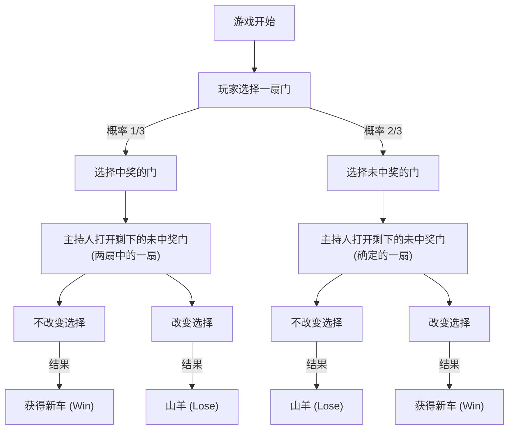
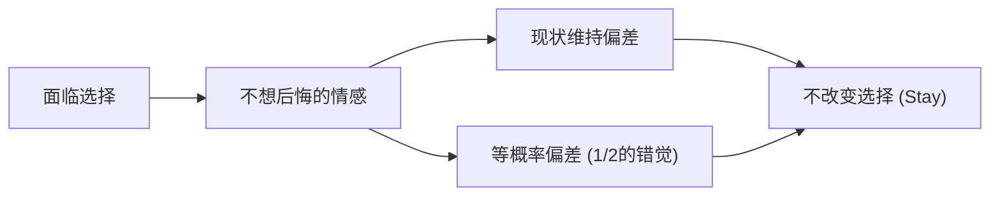

# 引言：人类直觉陷入的陷阱与概率世界

在我们的日常生活中，“直觉”作为一种非常强大的决策工具发挥着作用。基于经验法则和启发式（捷径），瞬间判断情况并选择行动的能力，是人类为了在严酷的自然环境中生存而获得的进化恩赐。然而，这种优秀的直觉系统存在一个弱点，即在特定条件下会引发致命的错误。其中最显著的例子，就是当我们面临关于“概率”的问题时。

概率论是用于定量评估不确定事件的数学框架，但其结论常常与我们的直觉发生激烈冲突。这种现象作为“认知偏差”或“直觉与逻辑的偏离”，长期以来在心理学、行为经济学和数学教育领域受到研究。

本文将探讨象征这种直觉与概率偏离的最著名悖论——“蒙提霍尔问题（Monty Hall problem）”。这个问题尽管看似简单，却引发了一场卷入全世界著名数学家和科学家的巨大争议。通过“为什么我们会陷入如此简单的概率陷阱？”这一问题，我们将深刻且彻底地探究人类认知结构的局限性和逻辑思维的重要性。

## 第1章：什么是蒙提霍尔问题？

蒙提霍尔问题是一个概率悖论，以美国长寿电视节目《Let's Make a Deal》的主持人蒙提·霍尔（Monty Hall）的名字命名。这个问题被大众广泛知晓，起因于1990年新闻杂志《Parade》的专栏“问玛丽莲（Ask Marilyn）”对其进行的报道。

### 问题设定

请想象你是电视游戏节目的参赛者。在你的面前，有三扇关闭的门（门A、门B、门C）。

1. 1扇门后面有一辆“新车（中奖）”。
2. 剩下的2扇门后面是“山羊（未中奖）”。
3. 如果你猜中新车，你就可以得到它。

游戏的规则和流程如下：

1. 首先，你从3扇门中选择1扇（例如，假设你选择了**门A**）。
2. 这个节目的主持人蒙提知道哪扇门后面有新车。
3. 蒙提会在你没有选择的剩下两扇门（门B和门C）中，**一定会打开一扇后面有山羊的门**。（例如，如果门B后面有山羊，他就打开门B）。
4. 然后，蒙提问你：
   **“你可以换成门C。你要改变选择吗？”**

那么，问题来了。
**你应该改变选择吗？还是应该保持最初的选择（门A）？哪种情况获得新车的概率更高？**

### 基于直觉的回答

当许多人被问到这个问题时，他们会这样推理：

“有3扇门，打开了1扇（山羊的门）。剩下的只有自己选的门（门A）和另一扇关着的门（门C）。因为新车在其中一扇门后面，所以概率应该分别是50%（1/2）。因此，无论换不换选择，胜率都是一样的，没必要特意去换。”

这个直觉性的答案非常有说服力，绝大多数人（根据不同调查，约85%以上）都会回答“即使改变选择，概率也不会改变（1/2）”。

然而，**数学上正确的答案是“应该改变选择”**。如果改变选择，获得新车的概率会跃升至**2/3（约66.7%）**，是保持最初选择时的概率**1/3（约33.3%）**的两倍。

当这个解答由玛丽莲·沃斯·莎凡特（当时被吉尼斯世界纪录认证为世界上智商最高的女性）提出时，全美涌入了约1万封反驳信。其中包含了约1000封来自拥有博士学位的数学家和科学家的信，他们进行了激烈的指责，如“你完全不懂数学”、“这是女性不合逻辑的妄想”等。

为什么会有这么多知识分子犯错呢？下一章我们将揭开其数学证明。

## 第2章：概率的真相与数学证明

直觉上认为是“1/2”的概率，为什么“改变选择就会变成2/3”呢？为了理解这一点，我们需要从几个不同的角度重新审视这个问题。

### 证明方法1：列举所有情况（树状图思维）

最可靠且易懂的方法是列举所有可能发生的情况，并计算概率。
新车在哪扇门后面是随机决定的，因此以下3种情况发生的概率各为 1/3。

- 情况1：新车在“门A”
- 情况2：新车在“门B”
- 情况3：新车在“门C”

假设你最初选择了**门A**，让我们来看看在每种情况下“保持选择”和“改变选择”的结果。

| 情况 | 新车位置 | 你的选择 | 主持人打开的门 | 保持选择的情况 | 改变选择的情况 |
|---|---|---|---|---|---|
| 1 (1/3) | 门A | 门A | B或C（山羊） | **获得新车** (Win) | 山羊 (Lose) |
| 2 (1/3) | 门B | 门A | 门C（山羊） | 山羊 (Lose) | **获得新车** (Win) |
| 3 (1/3) | 门C | 门A | 门B（山羊） | 山羊 (Lose) | **获得新车** (Win) |

从这张表可以明显看出，在“保持选择的情况”下，能获得新车的只有情况1（概率1/3）。另一方面，在“改变选择的情况”下，能获得新车的是情况2和情况3这两种模式，其总概率为 2/3。
也就是说，这无非是**“从一开始就选对的概率（1/3）”**与**“一开始选错的概率（2/3）”**的比较。因为主持人会帮你排除一个错误答案，所以“一开始选错”的不幸，通过改变选择，在结构上反转成了“必定变成中奖”的幸运。

### 证明方法2：信息论与极端模型

如果在3扇门的情况下直觉会造成干扰，那么极端地增加门的数量就会变得容易理解。

请想象“有100万扇门”。
1. 你选择了1扇门（1号门）。此时中奖的概率是 1/1,000,000。
2. 主持人蒙提知道答案。在剩下的 999,999 扇门中，他把有山羊的 999,998 扇门全部打开。
3. 关着的只有你选择的“1号门”和蒙提留下没打开的“777,777号门”。

这时候，你怎么想？
“自己最初选择的1号门碰巧是正确答案的概率（1/1,000,000）”和“自己选错了，蒙提故意避开正确答案777,777号门而打开剩余所有门的概率（999,999/1,000,000）”，哪一个更高是显而易见的。
当然，你应该换成777,777号门。即使在只有3扇门的情况下，其本质的数学结构也是完全一样的。

### 证明方法3：使用Mermaid的状态转移图

为了加深直观理解，让我们用流程图来表示游戏的进行。

从这张图中我们可以看出，**如果从“一开始选择未中奖的门（概率2/3）”的状态采取“改变选择”的行动，就会以100%的概率达到“获得新车”**。反之，如果从一开始选择中奖的门（概率1/3）的状态改变选择，则必定会抽到山羊。
因此，改变选择这一策略的期望胜率为 2/3 × 100% = 2/3。

## 第3章：基于贝叶斯定理的严格解法

蒙提霍尔问题可以通过使用计算条件概率的“[贝叶斯定理](/zh-cn/p/bayes-theorem/)（Bayes' theorem）”来得到更严格的数学解答。贝叶斯推断是一个强大的工具，用于指示在获得新信息（证据）时，应如何更新先验概率（事后概率）。

我们将事件定义如下：
- $C_i$ : 新车在门 $i$ 的事件（$i \in \{A, B, C\}$）
- $M_j$ : 蒙提打开门 $j$ 的事件（$j \in \{A, B, C\}$）

假设玩家最初选择了“门A”。
先验概率，由于完全没有关于新车在哪扇门的信息，因此概率均等如下：
$P(C_A) = 1/3$
$P(C_B) = 1/3$
$P(C_C) = 1/3$

此时，假设蒙提打开了“门B”。在获得这个信息后，我们来计算新车在门A的概率（后验概率 $P(C_A|M_B)$）和新车在门C的概率（后验概率 $P(C_C|M_B)$）。

蒙提的行为规则（条件概率 $P(M_B|C_i)$）如下：
1. 如果新车在门A（$C_A$），蒙提会随机打开B或C，因此 $P(M_B|C_A) = 1/2$
2. 如果新车在门B（$C_B$），蒙提绝对不能打开B，因此 $P(M_B|C_B) = 0$
3. 如果新车在门C（$C_C$），蒙提不能打开C，而且A已被玩家选择所以不能打开。因此，他被迫只能打开B，所以 $P(M_B|C_C) = 1$

[贝叶斯定理](/zh-cn/p/bayes-theorem/)的公式如下：
$P(C_i|M_B) = \frac{P(M_B|C_i) P(C_i)}{P(M_B)}$

计算分母 $P(M_B)$ （蒙提打开门B的全概率）（全概率公式）：
$P(M_B) = P(M_B|C_A)P(C_A) + P(M_B|C_B)P(C_B) + P(M_B|C_C)P(C_C)$
$P(M_B) = (1/2 \times 1/3) + (0 \times 1/3) + (1 \times 1/3) = 1/6 + 0 + 1/3 = 1/2$

那么，让我们计算后验概率。

**新车在门A（保持选择）的概率：**
$P(C_A|M_B) = \frac{P(M_B|C_A) P(C_A)}{P(M_B)} = \frac{(1/2) \times (1/3)}{1/2} = 1/3$

**新车在门C（改变选择）的概率：**
$P(C_C|M_B) = \frac{P(M_B|C_C) P(C_C)}{P(M_B)} = \frac{1 \times (1/3)}{1/2} = 2/3$

这样一来，如果使用[贝叶斯定理](/zh-cn/p/bayes-theorem/)，就会在数学上完美地证明：通过新信息（蒙提打开了门B）更新了概率，门C的概率跃升至 2/3。

## 第4章：为什么人类的直觉会出错？（心理学与认知因素）

无论看了多少次数学证明，许多人还是会觉得“即使如此我还是无法接受”、“感觉像被狐狸骗了”。为什么人类的大脑对这个问题如此脆弱呢？心理学和行为经济学的研究表明，这涉及到几个严重的认知偏差。

### 1. 等概率偏差（Equiprobability Bias）

在随机事件或不确定情况下，人类有一种强烈的无意识倾向，认为“如果存在可用的选项，它们的概率应该都是相等的”。
在蒙提霍尔问题中，最终留下了“门A”和“门C”两个选项。当“2个选项”这个视觉和情境信息输入大脑的瞬间，就会触发“因为是2个所以概率各占1/2”的强烈启发式认知。
过去的历史过程（一开始有3个，蒙提故意打开了未中奖的门）这种“不对称信息”，被我们的大脑与“当前状况”割裂并忽略了。

### 2. 因果关系与“意图”的误认

我们总是试图线性地理解事物的因果关系。
这类似于“赌徒谬误（Gambler's fallacy）”——在轮盘赌连续出现5次红色后，会认为“下次差不多该出黑色了”，但在蒙提霍尔问题中，我们反而低估了“信息的更新”。

关键在于，**“主持人蒙提并不是在随机开门”**。
如果主持人什么都不知道地随机开门，而那“碰巧是山羊”的话，剩下两扇门的概率就真的是 1/2 了（这被称为“无知的主持人问题”）。
然而，蒙提有着“必定打开山羊”的强烈限制（意图）。人类的直觉无法正确处理这种“因故意选择而产生的信息不对称”，只关注到了“只是少了一扇门”这一物理事实。

### 3. 现状维持偏差（Status Quo Bias）与避免后悔

从行为经济学的角度来看，“现状维持偏差”产生了巨大的影响。
人类这种生物会觉得，采取行动失败后的后悔（作为误差），比不采取行动失败后的后悔（不作为误差）造成的精神打击更大。

请想象一下“如果改变选择，而最初的门才是正确答案的情况”。你一定会被“如果不特意去换就好了！”的强烈悔恨所折磨。另一方面，“如果不改变选择而没中奖的情况”，就比较容易释怀地想“那也没办法，运气不好”。
像这样，“想要将后悔最小化”的情感防御机制开始运作，产生了“换不换都一样（心理上想这么认为）”的认知扭曲，最终导致选择了“维持现状（Stay）”。

## 第5章：日常生活中的悖论教训

蒙提霍尔问题不仅仅是一个谜题或数学智力游戏。这个悖论所教给我们的教训，具有可以应用于我们日常生活、商业、医疗、AI开发等各个领域的普遍价值。

### 数据与直觉的冲突（医疗中的假阳性问题）

医疗现场中对“检查准确性”的解释，也是直觉与贝叶斯概率产生偏离的典型例子。
例如，有一种“一万人中有一人患病”的疑难杂症，其检测试剂的准确率为“99%（能将99%的阳性患者正确判定为阳性，将99%的阴性者正确判定为阴性）”。
如果你接受了这项检查并被判定为“阳性”，你真正患有该疑难杂症的概率是多少呢？

直觉上你可能会绝望地想：“既然准确率是99%，那我得病的概率应该也是99%吧”。
然而，用[贝叶斯定理](/zh-cn/p/bayes-theorem/)计算的话，实际患病的概率**仅仅不到1%（约0.98%）**。因为占绝对多数的“健康人（9,999人）”中的1%（约100人）会出现“假阳性”，所以在出现阳性反应的人群中，真正的患者（差不多只有1人）变成了极少数派。

像这样，直观的概率评估（99%）与数学上的真相（1%）之间存在着压倒性的偏离，这有给人们带来不必要的恐慌和错误医疗决断的危险。理解蒙提霍尔问题，正是培养正确评估这种“信息不对称与先验概率”素养的第一步。

### 商业战略中的信息价值

在商业领域，竞争对手的动向和市场的反应，恰恰相当于“蒙提打开的门”。
假设你的公司选择了某种战略（门A）。随后，传入了市场环境变化或竞争对手失败（打开了未中奖的门）的新信息。
这个时候，是“固执己见坚持当初的战略（现状维持偏差）”，还是“基于贝叶斯评估新信息，并进行战略转型（改变选择）”呢？可以将其解释为这样一个教训：能够灵活改变战略的企业，在长期中能抓住更高的成功概率（2/3）。不被沉没成本所困扰，始终用“后验概率”进行决策非常重要。

## 结语：智慧就是“怀疑直觉”的勇气

蒙提霍尔问题之所以如此迷人又如此可怕，是因为它绝妙地凸显了“人类智慧的局限”。即使是拥有博士学位的专家，也会被最初的直觉所欺骗，对正确的证明产生情感上的抵触。

我们在生活中依赖着进化过程中获得的强大武器——“直觉”。但是，在复杂且数据泛滥的现代社会中，我们必须认识到，这种直觉有时会让我们陷入陷阱。

蒙提霍尔问题向我们传达了一个重要信息。
那就是：**“不要盲目相信自己的直觉，使用逻辑和数学工具，停下来重新思考的重要性”**。要接受乍看之下有悖直觉的真相（真理），需要具备求知上的谦逊，以及更新自身固有观念的勇气。

下次当你面临人生重大选择，并且获得了新信息（一扇打开的门）时，请务必想起这个蒙提霍尔问题。概率是否因为那个信息发生了改变？你是否陷入了现状维持偏差？
通过逻辑推导出的“改变选择”的决定，也许会在你的面前带来一辆新车。
