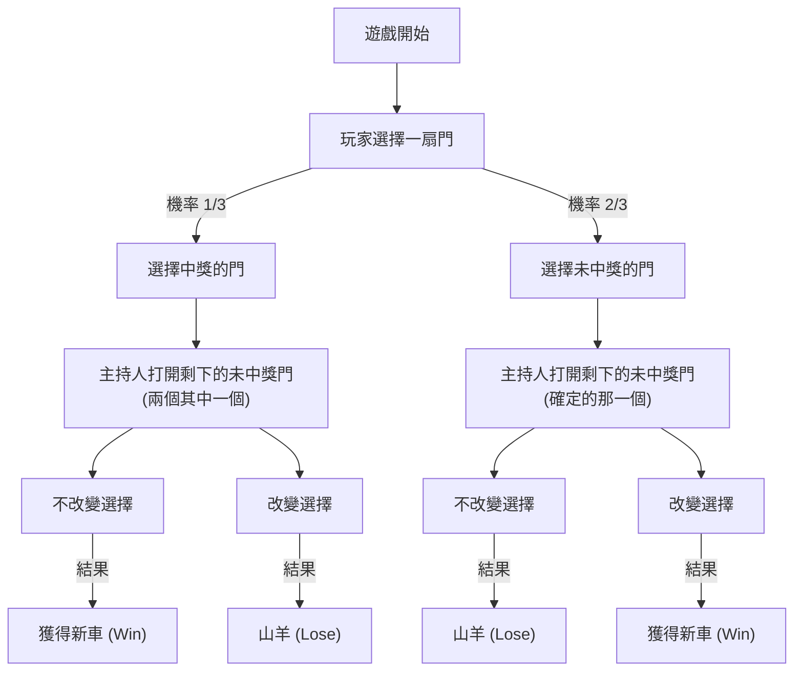
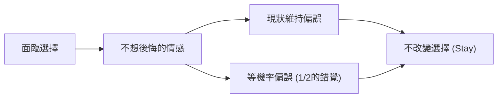

# 序言：人類直覺陷入的陷阱與機率的世界

在我們的日常生活中，「直覺」是非常強大的決策工具。基於經驗法則或捷思法（Heuristics），瞬間判斷情況並選擇行動的能力，是人類為了在嚴酷的自然環境中生存而獲得的進化恩賜。然而，這個優秀的直覺系統，在特定條件下卻有引發致命錯誤的弱點。其中最顯著的例子，就是當我們面臨關於「機率」的問題時。

機率論是用來定量評估不確定事件的數學框架，但其結論經常與我們的直覺產生激烈的衝突。這個現象作為「認知偏誤」或「直覺與邏輯的落差」，長期以來在心理學、行為經濟學以及數學教育領域中被廣泛研究。

本文將探討象徵這種直覺與機率落差的最著名悖論——「蒙提霍爾問題（Monty Hall problem）」。這個問題雖然看似簡單，卻引發了包含世界知名數學家與科學家在內的大論戰。透過「為什麼我們會如此輕易地掉入機率的陷阱中？」這個問題，我們將深入且徹底地探討人類認知結構的極限，以及邏輯思考的重要性。

## 第1章：什麼是蒙提霍爾問題？

蒙提霍爾問題是一個機率悖論，以美國長壽電視節目《Let's Make a Deal》的主持人蒙提·霍爾（Monty Hall）命名。這個問題之所以廣為人知，是因為1990年新聞雜誌《Parade》的專欄「Ask Marilyn」探討了它。

### 問題設定

想像一下你是電視遊戲節目的參賽者。在你面前有三扇關著的門（門A、門B、門C）。

1. 其中一扇門後面有「新車（中獎）」。
2. 剩下的兩扇門後面有「山羊（未中獎）」。
3. 如果你猜中新車，就可以得到它。

遊戲的規則與進行方式如下：

1. 首先，你從三扇門中選擇一扇（假設你選擇了**門A**）。
2. 節目主持人蒙提知道哪扇門後面有新車。
3. 蒙提從你沒有選擇的剩下兩扇門（門B和門C）中，**必定會打開一扇後面有山羊的門給你看**。（例如，如果門B有山羊，他就打開門B）。
4. 接著，蒙提問你：
   **「你可以換成門C。你要改變選擇嗎？」**

現在，問題來了。
**你應該改變選擇嗎？還是應該維持最初的選擇（門A）？哪一種獲得新車的機率比較高？**

### 直覺的回答

許多人被問到這個問題時，會這樣推論：

「有三扇門，其中一扇（山羊的門）被打開了。剩下的只有自己選的門（門A）和另一扇關著的門（門C）。新車一定在其中一扇門後面，所以機率應該各是50%（1/2）。因此，換不換選擇勝率都一樣，沒有必要特地去換。」

這個直覺的答案非常有說服力，壓倒性多數的人（根據某些調查高達85%以上）會回答「改變選擇機率也不會變（1/2）」。

然而，**數學上正確的答案是「應該改變選擇」**。如果改變選擇，獲得新車的機率會躍升為**2/3（約66.7%）**，是維持最初選擇的機率**1/3（約33.3%）**的兩倍。

當這個解答由瑪麗蓮·沃斯·莎凡特（當時被金氏世界紀錄認定為擁有世界最高IQ的女性）提出時，收到了來自全美約一萬封的反駁信件。其中包含了約1,000封來自擁有博士學位的數學家或科學家的信件，他們猛烈批評「妳根本不懂數學」、「這是女性不合邏輯的妄想」等。

為什麼會有這麼多知識分子答錯呢？下一章將為您解開其數學證明。

## 第2章：機率的真相與數學證明

直覺上覺得是「1/2」的機率，為什麼會變成「改變選擇就是2/3」呢？為了理解這一點，我們需要從幾個不同的角度重新審視這個問題。

### 證明方法1：列舉所有模式（樹狀圖思考）

最確實且容易理解的方法是列舉所有可能發生的模式，並計算其機率。
新車在哪扇門後面是隨機決定的，因此以下三種情況發生的機率各為 1/3。

- 情況1：新車在「門A」
- 情況2：新車在「門B」
- 情況3：新車在「門C」

假設你一開始選擇了**門A**，讓我們看看在每種情況下，「維持選擇」與「改變選擇」的結果。

| 情況 | 新車位置 | 你的選擇 | 主持人打開的門 | 維持選擇的情況 | 改變選擇的情況 |
|---|---|---|---|---|---|
| 1 (1/3) | 門A | 門A | B或C（山羊） | **獲得新車** (Win) | 山羊 (Lose) |
| 2 (1/3) | 門B | 門A | 門C（山羊） | 山羊 (Lose) | **獲得新車** (Win) |
| 3 (1/3) | 門C | 門A | 門B（山羊） | 山羊 (Lose) | **獲得新車** (Win) |

從這個表中可以明顯看出，只有在情況1（機率1/3）時，「維持選擇」才能獲得新車。另一方面，在情況2和情況3的兩種模式下，「改變選擇」可以獲得新車，其總機率為 2/3。
也就是說，這無非是**「一開始就選中正確答案的機率（1/3）」**與**「一開始選中錯誤答案的機率（2/3）」**的比較。因為主持人幫你消除了其中一個錯誤答案，所以透過改變選擇，「一開始選錯」的不幸，結構上就會反轉為「必定中獎」的幸運。

### 證明方法2：資訊理論與極端模型

如果在三扇門的情況下直覺會干擾判斷，那麼極端地增加門的數量就會比較容易理解。

想像一下「有100萬扇門」。
1. 你選擇了一扇門（門號1）。此時中獎的機率是 1/1,000,000。
2. 主持人蒙提知道答案。他將剩下的 999,999 扇門中，有山羊的 999,998 扇門全部打開。
3. 關著的只有你選的「門1」，以及蒙提故意留下沒開的「門777,777」這兩扇。

這時，你會怎麼想？
「自己一開始選的門1剛好是正確答案的機率（1/1,000,000）」與「自己選錯了，而蒙提刻意避開正確答案的門777,777，打開了其他所有門的機率（999,999/1,000,000）」，哪一個比較高是很明顯的。
理所當然地，你應該會換成門777,777。即使只有3扇門，本質上的數學結構是完全一樣的。

### 證明方法3：使用 Mermaid 的狀態轉移圖

為了加深視覺上的理解，我們用流程圖來表示遊戲的進行。

從這個圖可以看出，**如果從「一開始選擇未中獎的門（機率2/3）」的狀態採取「改變選擇」的行動，將有100%的機率到達「獲得新車」**。相反地，如果從一開始選擇中獎的門（機率1/3）的狀態改變選擇，則必定會抽中山羊。
因此，改變選擇策略的期望勝率為 2/3 × 100% = 2/3。

## 第3章：貝氏定理的嚴謹解法

透過計算條件機率的「貝氏定理（Bayes' theorem）」，我們可以更在數學上嚴謹地解出蒙提霍爾問題。貝氏估計是一個強大的工具，用來表示當獲得新資訊（證據）時，該如何更新事前的機率（事前機率）為（事後機率）。

將事件定義如下：
- $C_i$ : 新車在門 $i$ 的事件（$i \in \{A, B, C\}$）
- $M_j$ : 蒙提打開門 $j$ 的事件（$j \in \{A, B, C\}$）

假設玩家一開始選擇了「門A」。
因為完全沒有新車在哪扇門後面的資訊，事前機率如下所示為等機率。
$P(C_A) = 1/3$
$P(C_B) = 1/3$
$P(C_C) = 1/3$

在此，假設蒙提打開了「門B」。在獲得這個資訊後，我們來計算新車在門A的機率（事後機率 $P(C_A|M_B)$），以及新車在門C的機率（事後機率 $P(C_C|M_B)$）。

蒙提的行動規則（條件機率 $P(M_B|C_i)$）如下：
1. 當新車在門A時（$C_A$），因為蒙提可以隨機打開B或C，所以 $P(M_B|C_A) = 1/2$
2. 當新車在門B時（$C_B$），因為蒙提絕對不能打開B，所以 $P(M_B|C_B) = 0$
3. 當新車在門C時（$C_C$），因為蒙提不能打開C，而玩家已經選了A所以也不能打開。因此，他被迫只能打開B，所以 $P(M_B|C_C) = 1$

貝氏定理的公式如下：
$P(C_i|M_B) = \frac{P(M_B|C_i) P(C_i)}{P(M_B)}$

計算作為分母的 $P(M_B)$ （蒙提打開門B的總機率）（全機率定理）。
$P(M_B) = P(M_B|C_A)P(C_A) + P(M_B|C_B)P(C_B) + P(M_B|C_C)P(C_C)$
$P(M_B) = (1/2 \times 1/3) + (0 \times 1/3) + (1 \times 1/3) = 1/6 + 0 + 1/3 = 1/2$

那麼，我們來計算事後機率吧。

**新車在門A（維持選擇）的機率：**
$P(C_A|M_B) = \frac{P(M_B|C_A) P(C_A)}{P(M_B)} = \frac{(1/2) \times (1/3)}{1/2} = 1/3$

**新車在門C（改變選擇）的機率：**
$P(C_C|M_B) = \frac{P(M_B|C_C) P(C_C)}{P(M_B)} = \frac{1 \times (1/3)}{1/2} = 2/3$

就這樣，如果使用貝氏定理，在數學上就可以完美地證明，因為新資訊（蒙提打開了門B）使得機率被更新，門C的機率躍升到了 2/3。

## 第4章：為什麼人類的直覺會出錯？（心理學・認知因素）

無論看了多少次數學證明，許多人還是會覺得「即便如此我還是無法接受」、「感覺像被狐狸騙了一樣」。為什麼人類的大腦對這個問題如此脆弱呢？從心理學和行為經濟學的研究中，已經發現有幾個嚴重的認知偏誤牽涉其中。

### 1. 等機率偏誤（Equiprobability Bias）

人類在面對隨機事件或不確定狀況時，有一種強烈的傾向會無意識地認為「如果還有可用的選項，它們的機率應該都是相等的」。
在蒙提霍爾問題中，最終留下了「門A」與「門C」兩個選項。當大腦接收到「兩個選項」這樣的視覺及情境資訊瞬間，就會觸發「既然是兩個，那機率就是各1/2」這種強烈的捷思。
我們的大腦會將過去的歷史脈絡（一開始有三個選項、蒙提刻意打開了錯誤的門）這種「不對稱的資訊」與「現在的狀況」切割開來並忽視它。

### 2. 因果關係與「意圖」的誤認

我們試圖以線性的方式理解事物的因果關係。
這類似於在輪盤連續出現5次紅色後，就會認為「接下來差不多該出黑色了」的「賭徒謬誤（Gambler's fallacy）」，但在蒙提霍爾問題中，我們反而低估了「資訊的更新」。

重要的是，**「主持人蒙提並不是隨機打開門的」**這一點。
如果主持人什麼都不知道而隨機開了一扇門，結果「碰巧是山羊」的話，剩下的兩扇門的機率真的會是 1/2（這被稱為「無知主持人問題」）。
然而，蒙提擁有「必定打開山羊」的強烈限制（意圖）。人類的直覺無法正確處理這種「因刻意選擇而造成的資訊不對稱」，只能關注於「門只是少了一扇」的物理事實。

### 3. 現狀維持偏誤（Status Quo Bias）與後悔的規避

從行為經濟學的觀點來看，「現狀維持偏誤」產生了很大的影響。
人類是一種會感覺到採取行動而失敗時的後悔（作為誤差），比不採取行動而失敗時的後悔（不作為誤差），其精神傷害更大的生物。

請想像一下「如果改變選擇，結果最初的門才是正確答案」的情況。你一定會被「早知道就不特地換了！」這種強烈的後悔所折磨。另一方面，「如果不改變選擇而沒中」的情況，就比較容易看開，覺得「算了沒辦法，運氣不好」。
像這樣，「想要將後悔降到最低」的情感防禦機制發揮作用，產生了「換不換都一樣（想要這麼認為）」的認知扭曲，最終讓人選擇了「維持現狀（Stay）」。

## 第5章：日常生活中的悖論教訓

蒙提霍爾問題不僅僅是個測驗或數學謎題。這個悖論所教導我們的教訓，具有能夠應用於我們日常生活、商業、醫療、AI開發等各個領域的普遍價值。

### 數據與直覺的對立（醫療中的偽陽性問題）

醫療現場對於「檢查準確性」的解讀，也是直覺與貝氏機率產生落差的典型例子。
例如，有一種「每10,000人中會有1人罹患的罕見疾病」，其檢驗藥物的準確度為「99%（能將99%的陽性患者正確判定為陽性，並將99%的陰性患者正確判定為陰性）」。
如果你接受這項檢查並被判定為「陽性」，你真正罹患該罕見疾病的機率是多少呢？

直覺上，你可能會絕望地認為「既然準確度是99%，那我生病的機率應該也是99%吧」。
然而，如果用貝氏定理來計算，實際罹患的機率**只有不到1%（約0.98%）**。因為在壓倒性多數的「健康的人（9,999人）」中，會有1%（約100人）出現「偽陽性」，所以在呈現陽性反應的群體中，真正的患者（差不多1人）會變成極少數。

像這樣，直覺的機率評估（99%）與數學上的真相（1%）之間存在著巨大的落差，有給人們帶來不必要的恐慌或錯誤的醫療決斷的危險性。理解蒙提霍爾問題，正是培養正確評估這些「資訊的不對稱性與事前機率」素養的第一步。

### 商業策略中的資訊價值

在商業上，競爭對手的動向或市場的反應，正好相當於「蒙提打開的門」。
假設您的公司選擇了某項策略（門A）。之後，市場環境的變化或競爭對手的失敗（未中獎的門被打開）帶來了新資訊。
此時，是「固執地堅持當初的策略（現狀維持偏誤）」，還是「以貝氏方法評估新資訊，並調整策略（改變選擇）」呢？能夠靈活改變策略的企業，從長遠來看才能掌握較高的成功機率（2/3），這可以被解讀為一個教訓。不被沉沒成本所困，時常以「事後機率」來進行決策是很重要的。

## 結語：智慧就是「懷疑直覺」的勇氣

蒙提霍爾問題之所以如此迷人，同時又如此令人恐懼，是因為它完美地凸顯了「人類智慧的極限」。就連擁有博士學位的專家，也被最初的直覺所欺騙，對正確的證明產生了情感上的反彈。

我們依賴著在進化過程中獲得的強大武器——「直覺」來生活。然而，在日益複雜且數據氾濫的現代社會中，我們必須自覺到，這份直覺有時會讓我們陷入陷阱。

蒙提霍爾問題向我們傳達了一個重要的訊息。
那就是，**「不要盲目相信自己的直覺，而要使用邏輯與數學這項工具，停下來重新思考的重要性」**。要接受乍看之下違反直覺的真相（真理），需要有知性上的謙遜，以及更新自己成見的勇氣。

下次當你面臨人生重大選擇，並獲得新資訊（被打開的門）時，請務必想起這個蒙提霍爾問題。機率是否因為那個資訊而改變了？是否被現狀維持偏誤所困住了？
透過邏輯推導出「改變選擇」的決斷，或許就能為您帶來面前的那輛新車。
