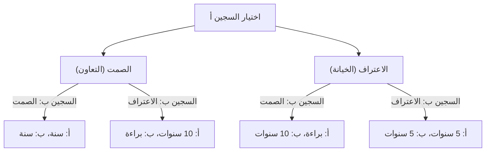
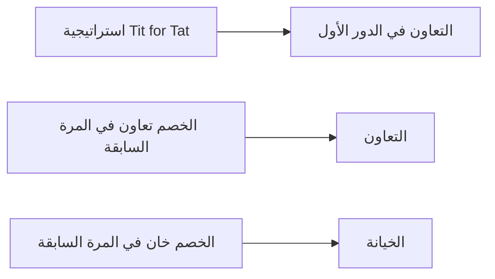

# معضلة السجين (Prisoner's Dilemma): المفارقة القصوى التي تطرحها نظرية الألعاب

"لماذا ينتهي بنا المطاف بخيانة بعضنا البعض، حتى عندما نعلم أن الأمور ستسير على ما يرام إذا تعاونا؟"

توفر **"معضلة السجين" (Prisoner's Dilemma)** في نظرية الألعاب الإجابة الأكثر وضوحًا وقسوة على هذا السؤال الأساسي من منظور الرياضيات والمنطق. ابتكرها ميريل فلود وملفين دريشر في الخمسينيات من القرن الماضي، وتمت صياغتها كـ "قصة السجناء" الحالية بواسطة ألبرت دبليو تاكر، وكان لهذا المفهوم تأثير عميق على كل مجال، من الاقتصاد والعلوم السياسية وعلم النفس، إلى علم الأحياء التطوري.

في هذا المقال، سنتعمق في "معضلة السجين" هذه، من الآليات الأساسية إلى المفاهيم المتخصصة مثل توازن ناش وأمثلية باريتو، بالإضافة إلى أمثلة واقعية وتطور التعاون في "الألعاب المتكررة".

---

## 1. السيناريو الأساسي لمعضلة السجين

أولاً، دعونا نراجع السيناريو الشهير الذي ابتكره تاكر.

تم القبض على شريكين (السجين أ والسجين ب) للاشتباه في ارتكابهما جريمة خطيرة. ومع ذلك، لا تملك الشرطة أدلة قاطعة، وبدون اعترافهما، يمكنها فقط توجيه اتهام إليهما بجريمة بسيطة (على سبيل المثال، السجن لمدة سنة واحدة).
لذلك، تعزل الشرطة الاثنين في غرف استجواب منفصلة وتقدم لكل منهما صفقة الإقرار بالذنب التالية:

1. **إذا التزم كلاهما الصمت (التعاون)**: بسبب عدم كفاية الأدلة، يُحكم على كليهما بـ **السجن لمدة سنة واحدة**.
2. **إذا اعترف أحدهما (خيانة) والتزم الآخر الصمت**: يتم إطلاق سراح من اعترف **(بريء)** كمكافأة للتعاون في التحقيق، بينما يتحمل من التزم الصمت التهمة الخطيرة ويُحكم عليه بـ **السجن لمدة 10 سنوات**.
3. **إذا اعترف كلاهما (خيانة متبادلة)**: تتم إدانتهما معًا، ولكن بسبب الظروف المخففة، يُحكم عليهما بـ **السجن لمدة 5 سنوات**.

لا يمكن للسجين أ والسجين ب التشاور مع بعضهما البعض. دون معرفة الخيار الذي سيتخذه الآخر، يجب على كل منهما اختيار ما إذا كان "سيلتزم الصمت (يتعاون مع الآخر)" أو "يعترف (يخون الآخر)".

### توضيح آلية القرار بيانيًا

يوضح المخطط الانسيابي أدناه تفرع النتائج من منظور السجين أ.

---

## 2. المأساة التي تسببها القرارات العقلانية: توازن ناش

دعونا نتبع عملية التفكير العقلاني من وجهة نظر السجين أ لتعظيم منفعته الخاصة (تقليل مدة السجن). سنقسم الحالات بناءً على اختيار الآخر (السجين ب).

- **الحالة 1: إذا اختار السجين ب "الصمت"**
  - إذا اخترت "الصمت" أيضًا، سجن لمدة سنة واحدة.
  - إذا اخترت "الاعتراف"، فسأكون بريئًا.
  - **الاستنتاج**: البراءة أفضل من سنة واحدة، لذا فإن "الاعتراف" أكثر ربحًا.

- **الحالة 2: إذا اختار السجين ب "الاعتراف"**
  - إذا اخترت "الصمت"، سجن لمدة 10 سنوات.
  - إذا اخترت "الاعتراف"، سجن لمدة 5 سنوات.
  - **الاستنتاج**: 5 سنوات أفضل من 10 سنوات، لذا فإن "الاعتراف" أكثر ربحًا.

المثير للدهشة أنه بغض النظر عما يفعله السجين ب، فمن الأفضل دائمًا للسجين أ أن يختار "الاعتراف (الخيانة)". تُسمى الاستراتيجية التي تكون دائمًا مثالية لنفسه، بغض النظر عن استراتيجية الخصم، **"الاستراتيجية المهيمنة" (Dominant Strategy)**.
السجين ب في نفس الموقف تمامًا، وإذا كان يفكر بعقلانية مماثلة، فإن "الاعتراف" يصبح أيضًا استراتيجيته المهيمنة.

ونتيجة لذلك، يختار كلاهما "الاعتراف" وينتهي بهما الأمر بـ **السجن لمدة 5 سنوات لكليهما**. في نظرية الألعاب، تُعرف هذه الحالة باسم **"توازن ناش" (Nash Equilibrium)** (حالة لا يمكن فيها لأي لاعب تحقيق مكاسب عن طريق تغيير استراتيجيته بمفرده).

### الاختلاف عن أمثلية باريتو

هنا تبرز المعضلة. هل النتيجة التي وصلا إليها ("السجن لمدة 5 سنوات لكليهما") هي أفضل نتيجة ممكنة بشكل عام؟
لا. لو أنهما وثقا ببعضهما البعض والتزما "الصمت"، لكان حُكم عليهما بـ "السجن لمدة سنة واحدة لكليهما".

يُطلق على الحالة التي يتم فيها تعظيم الفائدة الإجمالية (في هذه الحالة، أقل مجموع لفترات السجن)، أي "حالة لا يمكن فيها زيادة فائدة شخص ما دون الإضرار بشخص آخر"، **"أمثلية باريتو" (Pareto Optimality)**. يكمن جوهر معضلة السجين في أن **"الخيار العقلاني الفردي (توازن ناش) لا يتطابق مع الحل الأمثل العام (أمثلية باريتو)"**.

---

## 3. معضلة السجين في العالم الحقيقي

هذه المعضلة ليست مجرد تمرين ذهني. إنها تحدث يوميًا في هياكلنا الاجتماعية وأنشطتنا الاقتصادية، وحتى في العلاقات بين الدول.

### المنافسة السعرية في الاقتصاد
لنفترض أن الشركة أ والشركة ب تبيعان منتجات مماثلة. إذا حافظت كلتاهما على أسعار مرتفعة (تعاون)، فستحقق كلتاهما أرباحًا عالية. ومع ذلك، إذا تفوقت إحداهما وباعت بسعر أرخص (خيانة)، فإنها ستحتكر السوق وتحقق أرباحًا ضخمة. ونتيجة لذلك، تلجأ كلتاهما إلى المنافسة في التخفيضات وتقعان في "حرب أسعار" تقلص أرباحهما.

### المشاكل البيئية (مأساة المشاع)
يُعد الحد من غازات الاحتباس الحراري أيضًا معضلة سجين بين الدول. إذا بذلت جميع الدول جهودًا للحد منها (تعاون)، فيمكن منع الاحتباس الحراري. ومع ذلك، إذا خففت دولة ما من لوائحها البيئية (خيانة) بينما تبذل الدول الأخرى جهودًا، فإن تلك الدولة فقط ستستمتع بالنمو الاقتصادي. ونتيجة لذلك، تسعى كل دولة إلى التفوق، وتتدهور البيئة العالمية بأكملها.

### سباق التسلح
يُعد سباق تطوير الأسلحة النووية بين الولايات المتحدة والاتحاد السوفيتي خلال الحرب الباردة مثالاً نموذجيًا. إذا قام كلا الجانبين بنزع السلاح (تعاون)، فسيحصلان على السلام والراحة الاقتصادية، ولكن إذا تم نزع سلاح أحدهما بينما كان الآخر مسلحًا، فإنه يواجه أزمة وجودية وطنية (تعادل السجن لمدة 10 سنوات)، لذلك اضطر كلا الجانبين إلى مواصلة التسلح (الخيانة).

---

## 4. الألعاب المتكررة واستراتيجية "واحدة بواحدة" (Tit for Tat)

في معضلة السجين لمرة واحدة، كانت "الخيانة" هي الخيار العقلاني. ومع ذلك، في المجتمع الحقيقي، من الشائع التفاعل بشكل متكرر مع نفس الشخص. في نظرية الألعاب، يُطلق على هذا اسم **"اللعبة المتكررة" (Iterated Prisoner's Dilemma)**.

في الثمانينيات، نظم العالم السياسي روبرت أكسلرود بطولة كمبيوتر، حيث طلب برامج من خبراء في جميع أنحاء العالم لمعرفة الاستراتيجية الأقوى في معضلة السجين المتكررة.

كانت النتيجة أن الاستراتيجية الأبسط، والتي سجلت أعلى الدرجات، كانت استراتيجية **"واحدة بواحدة" (Tit for Tat)** التي قدمها أناتول رابوبورت.

### خوارزمية استراتيجية "واحدة بواحدة"

قواعد هذه الاستراتيجية بسيطة بشكل مذهل.
1. في الدور الأول، دائماً "تعاون".
2. من الدور الثاني فصاعدًا، **قلّد بالضبط الفعل الذي اتخذه الخصم في الدور السابق** (إذا تعاون الخصم، فتعاون؛ وإذا خان، فخُن).

لماذا كانت هذه الاستراتيجية قوية جدًا؟ قام أكسلرود بتحليل أربع خصائص مشتركة للاستراتيجيات القوية.
1. **اللطف (Nice)**: لا تكن أبدًا أول من يخون.
2. **الانتقام (Retaliating)**: إذا خان الخصم، عاقبه (رد الخيانة) على الفور.
3. **التسامح (Forgiving)**: إذا غير الخصم رأيه وعاد إلى التعاون، انسَ الخيانة السابقة وعد إلى التعاون على الفور.
4. **الوضوح (Clear)**: من السهل فهم نواياك، مما يتيح للخصم اختيار التعاون براحة بال.

يشير هذا الاكتشاف إلى أن "الأخلاق" و"الثقة" في المجتمع البشري قد لا تكون مجرد حجج عاطفية، بل تدعمها العقلانية الرياضية والتطورية.

---

## 5. ظهور التعاون في علم الأحياء التطوري

كان لمعضلة السجين ونجاح استراتيجية "واحدة بواحدة" تأثير كبير أيضًا على علم الأحياء التطوري (نظرية الألعاب التطورية). كما يمثله "الجين الأناني" لريتشارد دوكينز، فإن العالم الطبيعي هو بقاء للأصلح، ويجب على الكائنات الحية الفردية إعطاء الأولوية (الخيانة) لبقائها وتكاثرها. على الرغم من ذلك، فإن الطبيعة مليئة بـ "السلوكيات الإيثارية (التعاون)"، مثل مشاركة الدم بين الخفافيش مصاصة الدماء والطبيعة الاجتماعية للنحل.

في المحاكاة التطورية، ثبت أنه عندما يتم إدخال مجموعة صغيرة من "Tit for Tat" إلى مجتمع "يخون" فيه الجميع، فإن مجموعة Tit for Tat تتعاون مع بعضها البعض لتحقيق مكاسب عالية وتتخلص تدريجياً من مجموعة الخونة. بعبارة أخرى، في صراع البقاء على المدى الطويل، فإن المجموعات القادرة على التعاون هي الفائز النهائي.

## 6. الخلاصة: كيف نتغلب على المعضلة

تعلمنا معضلة السجين الحقيقة القاسية المتمثلة في أنه إذا سعينا وراء مصلحتنا الذاتية بشكل مفرط، فإن النتيجة هي خسارة الجميع. ولكن في الوقت نفسه، كما تظهر الأبحاث حول الألعاب المتكررة، يمكننا بناء علاقات تعاونية إذا كانت هناك علاقات مستدامة وآليات ردود فعل مناسبة.

لحل معضلة السجين في العالم الحقيقي، هناك حاجة إلى أساليب مثل ما يلي:
- **تغيير القواعد (سيادة القانون)**: إضفاء الطابع المؤسسي على العقوبات ضد الخيانة والقضاء على فوائدها. (مثل قوانين مكافحة الاحتكار والضرائب البيئية)
- **ضمان التواصل**: خلق فرص لتأكيد نوايا بعضنا البعض وبناء علاقات ثقة.
- **التركيز على العلاقات طويلة الأمد**: الوعي بظل المستقبل: "إذا خنت هذه المرة، فلن يكون هناك تعاملات في المستقبل".

قد تبدو نظرية الألعاب وكأنها عالم من الحسابات الباردة، ولكن عندما ننظر في أعماقها، نصل إلى حقيقة إنسانية ودافئة للغاية حول "لماذا يجب على الناس أن يتعاونوا".
