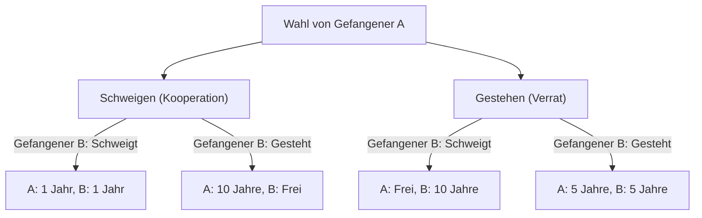
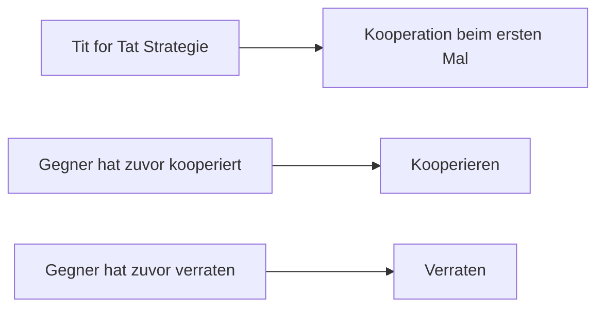

# Das Gefangenendilemma (Prisoner's Dilemma): Das ultimative Paradoxon der Spieltheorie

"Warum verraten wir einander, obwohl wir wissen, dass alles gut gehen würde, wenn wir zusammenarbeiten?"

Auf diese grundlegende Frage gibt das **"[Gefangenendilemma](/de/p/prisoners-dilemma/) (Prisoner's Dilemma)"** in der Spieltheorie die klarste und zugleich grausamste Antwort aus Sicht von Mathematik und Logik. In den 1950er Jahren von Merrill Flood und Melvin Dresher erdacht und von Albert W. Tucker in die heutige "Gefangenengeschichte" formuliert, hat dieses Konzept einen enormen Einfluss auf alles von Wirtschaft und Politikwissenschaft bis hin zu Psychologie und Evolutionsbiologie gehabt.

In diesem Artikel werden wir das "[Gefangenendilemma](/de/p/prisoners-dilemma/)" sehr detailliert untersuchen, von den grundlegenden Mechanismen über Fachkonzepte wie das Nash-Gleichgewicht und die Pareto-Optimalität bis hin zu konkreten Beispielen in der realen Welt und der Evolution von Kooperation in "wiederholten Spielen".

---

## 1. Das Grundszenario des Gefangenendilemmas

Schauen wir uns zunächst das berühmte Szenario an, das Tucker entworfen hat.

Zwei Komplizen (Gefangener A und Gefangener B) werden wegen eines schweren Verbrechens festgenommen. Die Polizei hat jedoch keine stichhaltigen Beweise und kann sie ohne Geständnis nur für ein geringes Vergehen (z. B. 1 Jahr Gefängnis) anklagen.
Daher isoliert die Polizei die beiden in getrennten Verhörräumen und bietet jedem von ihnen folgenden Deal an:

1. **Wenn beide schweigen (Kooperation)**: Aus Mangel an Beweisen erhalten beide **1 Jahr Gefängnis**.
2. **Wenn einer gesteht (Verrat) und der andere schweigt**: Derjenige, der gesteht, wird als Gegenleistung für die Kooperation **freigesprochen (freigelassen)**, während derjenige, der schweigt, wegen eines schweren Verbrechens zu **10 Jahren Gefängnis** verurteilt wird.
3. **Wenn beide gestehen (Verrat)**: Beide werden schuldig gesprochen, aber aufgrund mildernder Umstände zu **5 Jahren Gefängnis** verurteilt.

Gefangener A und Gefangener B können sich nicht absprechen. Ohne zu wissen, welche Entscheidung der andere treffen wird, muss jeder wählen zwischen "schweigen (mit dem anderen kooperieren)" und "gestehen (den anderen verraten)".

### Visualisierung des Entscheidungsmechanismus

Das folgende Flussdiagramm zeigt die Konsequenzen aus der Perspektive von Gefangener A.

---

## 2. Die Tragödie rationaler Entscheidungen: Das Nash-Gleichgewicht

Verfolgen wir den rationalen Denkprozess zur Maximierung der eigenen Interessen (Reduzierung der Haftstrafe) aus der Sicht von Gefangener A. Wir unterscheiden Fälle danach, was Gefangener B wählt.

- **Fall 1: Wenn Gefangener B "schweigt"**
  - Wenn A "schweigt", 1 Jahr Gefängnis.
  - Wenn A "gesteht", frei.
  - **Fazit**: Frei ist besser als 1 Jahr, also ist "Gestehen" vorteilhafter.

- **Fall 2: Wenn Gefangener B "gesteht"**
  - Wenn A "schweigt", 10 Jahre Gefängnis.
  - Wenn A "gesteht", 5 Jahre Gefängnis.
  - **Fazit**: 5 Jahre ist besser als 10 Jahre, also ist "Gestehen" vorteilhafter.

Erstaunlicherweise ist es für Gefangenen A immer vorteilhafter, "Gestehen (Verrat)" zu wählen, egal was Gefangener B tut. Eine solche Strategie, die unabhängig von der Strategie des Gegners immer optimal ist, wird als **"dominante Strategie"** bezeichnet.
Gefangener B befindet sich in genau der gleichen Situation, und wenn er auf die gleiche Weise rational denkt, ist "gestehen" auch für ihn die dominante Strategie.

Infolgedessen wählen beide "gestehen" und **beide werden zu 5 Jahren Gefängnis verurteilt**. In der Spieltheorie wird dieser Zustand als **"Nash-Gleichgewicht"** bezeichnet (ein Zustand, in dem kein Spieler durch einseitige Änderung seiner Strategie einen Vorteil erzielen kann).

### Abweichung von der Pareto-Optimalität

Hier entsteht das Dilemma. Ist das Ergebnis "beide 5 Jahre Gefängnis" das insgesamt beste Ergebnis?
Nein. Wenn sie einander vertraut hätten und beide geschwiegen hätten, wären sie mit "beide 1 Jahr Gefängnis" davongekommen.

Der Zustand, in dem der Gesamtnutzen (in diesem Fall die geringste Gesamthaftzeit) maximiert wird, also "ein Zustand, in dem der Nutzen von niemandem erhöht werden kann, ohne dass jemand anderes Nachteile erleidet", wird als **"Pareto-Optimalität"** bezeichnet. Der Kern des Gefangenendilemmas liegt darin, dass **"die rationale individuelle Entscheidung (Nash-Gleichgewicht) nicht mit der optimalen Gesamtlösung (Pareto-Optimalität) übereinstimmt"**.

---

## 3. Das Gefangenendilemma in der realen Welt

Dieses Dilemma ist nicht nur eine Denksportaufgabe. Es tritt täglich in unseren sozialen Strukturen, wirtschaftlichen Aktivitäten und sogar in den Beziehungen zwischen Nationen auf.

### Preiskampf in der Wirtschaft
Angenommen, Unternehmen A und Unternehmen B verkaufen ähnliche Produkte. Wenn beide hohe Preise beibehalten (Kooperation), erzielen beide hohe Gewinne. Wenn jedoch einer den anderen unterbietet (Verrat), monopolisiert er den Markt und macht riesige Gewinne. Infolgedessen beginnen beide mit einem Preiskampf, der die Gewinne schmälert.

### Umweltprobleme (Tragödie der Allmende)
Auch die Reduzierung von Treibhausgasen ist ein Gefangenendilemma zwischen Staaten. Wenn alle Länder sich bemühen (Kooperation), kann die globale Erwärmung verhindert werden. Wenn jedoch ein Land seine Umweltvorschriften lockert, während andere sich bemühen (Verrat), kann dieses Land allein Wirtschaftswachstum genießen. Infolgedessen versuchen alle Länder auszuscheren, und die Umwelt als Ganzes verschlechtert sich.

### Wettrüsten
Das Wettrüsten mit Atomwaffen zwischen den Vereinigten Staaten und der Sowjetunion während des Kalten Krieges ist ein klassisches Beispiel. Wenn beide abrüsten (Kooperation), werden Frieden und wirtschaftlicher Spielraum erreicht. Aber wenn der eine abrüstet, während der andere bewaffnet ist, ist die Nation in Gefahr (entspricht 10 Jahren Gefängnis). Daher waren beide gezwungen, weiter aufzurüsten (Verrat).

---

## 4. Wiederholte Spiele und die "Tit for Tat"-Strategie

In einem einmaligen [Gefangenendilemma](/de/p/prisoners-dilemma/) war "Verrat" die rationale Wahl. In der realen Gesellschaft ist es jedoch üblich, mehrfach mit derselben Partei zu interagieren. In der Spieltheorie wird dies als **"wiederholtes [Gefangenendilemma](/de/p/prisoners-dilemma/) (Iterated Prisoner's Dilemma)"** bezeichnet.

In den 1980er Jahren lud der Politikwissenschaftler Robert Axelrod Computerprogramme von Experten weltweit zu einem Turnier ein, um herauszufinden, welche Strategie im wiederholten [Gefangenendilemma](/de/p/prisoners-dilemma/) die stärkste ist.

Das Ergebnis war, dass die einfachste Strategie, die die höchste Punktzahl erreichte, die von Anatol Rapoport eingereichte **"Tit for Tat-Strategie (Wie du mir, so ich dir)"** war.

### Algorithmus der Tit for Tat-Strategie

Die Regel dieser Strategie ist erstaunlich einfach.
1. In der ersten Runde wird immer "kooperiert".
2. Ab der zweiten Runde **ahmt man exakt die Aktion des Gegners aus der vorherigen Runde nach** (wenn der Gegner kooperiert hat, kooperieren; wenn er verraten hat, verraten).

Warum war diese Strategie so stark? Axelrod analysierte vier gemeinsame Merkmale starker Strategien.
1. **Nett (Nice)**: Niemals als Erster verraten.
2. **Vergeltend (Retaliating)**: Wenn der Gegner verrät, immer sofort bestrafen (zurückverraten).
3. **Nachsichtig (Forgiving)**: Wenn der Gegner umdenkt und zur Kooperation zurückkehrt, den vergangenen Verrat vergessen und sofort wieder kooperieren.
4. **Klar (Clear)**: Die Absicht ist für den Gegner leicht verständlich, sodass er sicher Kooperation wählen kann.

Diese Entdeckung legt die Möglichkeit nahe, dass "Moral" und "Vertrauen" in der menschlichen Gesellschaft nicht bloße Emotionen sind, sondern durch mathematische und evolutionäre Rationalität gestützt werden.

---

## 5. Die Entstehung von Kooperation in der Evolutionsbiologie

Der Erfolg des Gefangenendilemmas und der "Tit for Tat"-Strategie hatte auch enorme Auswirkungen auf die Evolutionsbiologie (evolutionäre Spieltheorie). Wie in Richard Dawkins' "Das egoistische Gen" dargestellt, geht es in der Natur um das Überleben des Stärkeren, sodass Organismen ihr Überleben und ihre Fortpflanzung priorisieren (verraten) sollten. Dennoch ist die Natur voll von "altruistischem Verhalten (Kooperation)", wie das Blutteilen von Vampirfledermäusen und das Sozialverhalten von Honigbienen.

In Evolutionssimulationen wurde bewiesen, dass wenn eine kleine Gruppe von "Tit for Tat"-Strategen in eine Population eingebracht wird, in der alle "verraten", die "Tit for Tat"-Gruppe miteinander kooperiert, hohe Gewinne erzielt und die "Verräter"-Gruppe allmählich verdrängt. Das heißt, im langfristigen Überlebenskampf wird die Gruppe, die kooperieren kann, der endgültige Gewinner sein.

## 6. Fazit: Wie man das Dilemma überwindet

Das [Gefangenendilemma](/de/p/prisoners-dilemma/) lehrt uns die harte Realität, dass am Ende alle verlieren, wenn wir unsere Eigeninteressen zu sehr verfolgen. Gleichzeitig zeigen Untersuchungen zu wiederholten Spielen jedoch, dass wir kooperative Beziehungen aufbauen können, wenn wir kontinuierliche Beziehungen und ein angemessenes Feedback-System haben.

Um das [Gefangenendilemma](/de/p/prisoners-dilemma/) in der realen Gesellschaft zu überwinden, sind folgende Ansätze erforderlich:
- **Änderung von Regeln (Rechtsstaatlichkeit)**: Institutionalisierung von Strafen für Verrat, um die Vorteile zu beseitigen. (Beispiel: Kartellrecht und Umweltsteuern)
- **Sicherstellung von Kommunikation**: Gelegenheiten bieten, um die Absichten des anderen zu bestätigen und Vertrauen aufzubauen.
- **Betonung langfristiger Beziehungen**: Bewusstsein für die Zukunft schaffen: "Wenn du dieses Mal verrätst, gibt es keine zukünftigen Transaktionen mehr."

Die Spieltheorie mag wie eine kalte Welt des Kalküls erscheinen, aber wenn man in ihren Abgrund blickt, gelangt man zu einer sehr menschlichen und warmen Wahrheit darüber, "warum Menschen kooperieren sollten".
