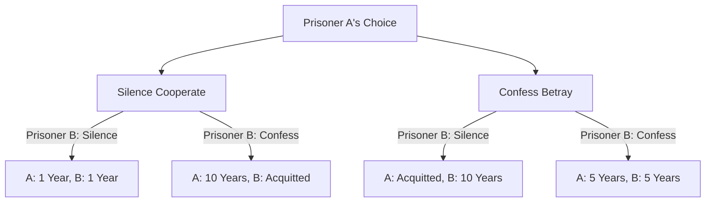
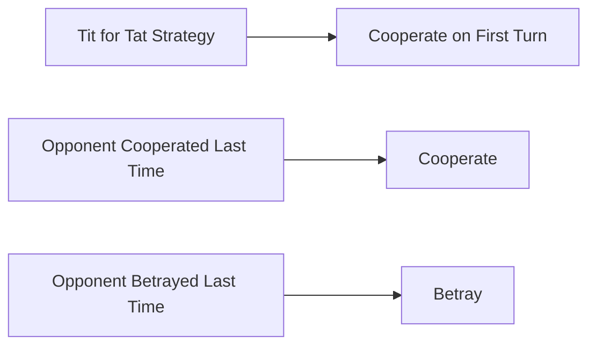

# The Prisoner's Dilemma: The Ultimate Paradox Posed by Game Theory

"Why do we betray each other even when we know that cooperating will work out better?"

To this fundamental question, the **"Prisoner's Dilemma"** in game theory presents the clearest and cruelest answer from the perspective of mathematics and logic. Devised by Merrill Flood and Melvin Dresher in the 1950s and formalized as the current "prisoner's story" by Albert W. Tucker, this concept has had a profound impact on every field from economics, political science, and psychology, to evolutionary biology.

In this article, we will delve deeply into the "Prisoner's Dilemma," from its basic mechanisms to specialized concepts such as Nash equilibrium and Pareto optimality, as well as specific examples in real society and the evolution of cooperation in "repeated games."

---

## 1. The Basic Scenario of the Prisoner's Dilemma

First, let's review the famous scenario devised by Tucker.

Two accomplices (Prisoner A and Prisoner B) are arrested on suspicion of a serious crime. However, the police do not have conclusive evidence, and without the confession of the two, they can only be prosecuted for a minor offense (e.g., 1 year in prison for a misdemeanor).
So the police isolate the two in separate interrogation rooms and offer each the following plea bargain.

1. **If both remain silent Cooperate**: Insufficient evidence, and both receive **1 year in prison**.
2. **If one confesses Betray and the other remains silent**: The one who confesses gets **acquitted released** in exchange for cooperating with the investigation, while the one who remains silent takes the heavy penalty and gets **10 years in prison**.
3. **If both confess Betray**: Both are found guilty, but due to extenuating circumstances, they receive **5 years in prison**.

Prisoner A and Prisoner B cannot consult each other. In a situation where they do not know what choice the other will make, each must choose whether to "remain silent cooperate with the other" or "confess betray the other".

### Visualizing the Decision Mechanism

The flowchart below shows the branching of outcomes from Prisoner A's perspective.

---

## 2. The Tragedy Brought by Rational Judgment: Nash Equilibrium

Let's follow the rational thought process to maximize one's own interest (shortening the prison sentence) from Prisoner A's position. We consider cases depending on what the other party (Prisoner B) chooses.

- **Case 1: If Prisoner B chooses Silence**
  - If I also choose Silence, 1 year in prison.
  - If I choose Confess, acquitted.
  - **Conclusion**: Acquittal is better than 1 year, so it is more advantageous to Confess.

- **Case 2: If Prisoner B chooses Confess**
  - If I choose Silence, 10 years in prison.
  - If I choose Confess, 5 years in prison.
  - **Conclusion**: 5 years is better than 10 years, so it is more advantageous to Confess.

Surprisingly, no matter what Prisoner B does, it is always more advantageous for Prisoner A to choose "Confess Betray." A strategy that is always optimal for oneself regardless of the opponent's strategy is called a **"dominant strategy"**.
Prisoner B is placed in exactly the same situation, and if he thinks equally rationally, "Confess" is also the dominant strategy for him.

As a result, both choose to "Confess," settling on the outcome of **5 years in prison for both**. In game theory, this state is called the **"Nash Equilibrium"** (a state where no player can gain a benefit even if only they change their strategy).

### Deviation from Pareto Optimality

Herein lies the dilemma. Is the outcome they reached, "5 years in prison for both," the best possible outcome for the whole?
No. If the two had trusted each other and both stuck to "Silence," they would have only faced "1 year in prison for both."

The state where the overall benefit (in this case, the small total of prison terms) is the highest, that is, the "state where no one's benefit can be increased any further without someone's disadvantage," is called **"Pareto Optimality"**. The core of the Prisoner's Dilemma lies in the fact that **"individual rational choice Nash equilibrium does not match the overall optimal solution Pareto optimality"**.

---

## 3. The Prisoner's Dilemma in the Real World

This dilemma is not just a mental exercise. It occurs daily in our social structures, economic activities, and even relationships between nations.

### Price Competition in the Economy
Suppose Company A and Company B sell similar products. If both maintain high prices Cooperate, both can make high profits. However, if one outsmarts the other and sells cheaply Betray, it can monopolize the market and make huge profits. As a result, both rush into price cutting competitions, falling into a "price war" that shaves away profits.

### Environmental Issues Tragedy of the Commons
The reduction of greenhouse gases is also a prisoner's dilemma between nations. If all nations make reduction efforts Cooperate, global warming can be prevented. However, if only one's own country loosens environmental regulations while other countries are making reduction efforts Betray, only one's own country can enjoy economic growth. As a result, each country tries to sneak ahead, and the overall environment deteriorates.

### Arms Race
The nuclear arms race between the US and the Soviet Union during the Cold War is also a typical example. If both sides disarm Cooperate, they gain peace and economic leeway, but if one side disarms while the other is armed, it falls into a crisis of national survival equivalent to 10 years in prison, so both sides are forced to continue military expansion Betray.

---

## 4. Repeated Games and the "Tit for Tat" Strategy

In a one-off Prisoner's Dilemma, "Betrayal" was the rational choice. However, in the real world, it is common to have a relationship with the same partner over and over again. In game theory, this is called an **"Iterated Prisoner's Dilemma"**.

In the 1980s, political scientist Robert Axelrod hosted a tournament soliciting computer programs from experts around the world to investigate what strategy is strongest in an iterated prisoner's dilemma.

As a result, the simplest strategy that scored the highest was the **"Tit for Tat"** strategy submitted by Anatol Rapoport.

### Tit for Tat Strategy Algorithm

The rules of this strategy are surprisingly simple.
1. Always "Cooperate" on the first turn.
2. From the second turn onwards, **exactly imitate the action taken by the opponent in the previous turn** (cooperate if the opponent cooperated, betray if they betrayed).

Why was this strategy strong? Axelrod analyzed four characteristics common to strong strategies.
1. **Nice**: Never betray first.
2. **Retaliating**: If the opponent betrays, immediately punish them retaliate.
3. **Forgiving**: If the opponent repents and returns to cooperation, forget past betrayals and immediately return to cooperation.
4. **Clear**: Intentions are easily communicated to the opponent, so the opponent can choose cooperation with peace of mind.

This discovery suggests that "morality" and "trust" in human society are not just emotional arguments, but may be backed by mathematical and evolutionary rationality.

---

## 5. The Emergence of Cooperation in Evolutionary Biology

The success of the Prisoner's Dilemma and the "Tit for Tat strategy" also had a great impact on evolutionary biology (evolutionary game theory). As typified by Richard Dawkins' "The Selfish Gene," the natural world is a law of the jungle, and individual organisms should prioritize their own survival and reproduction betray. Nevertheless, the natural world is full of "altruistic behavior cooperate," such as vampire bats sharing blood and the sociality of honeybees.

In evolutionary simulations, it has been proven that when a small "Tit for Tat" group is introduced into a society of all "Betrayers", the Tit for Tat group cooperates with each other, gains high profits, and gradually weeds out the betrayer group. In other words, in a long-term struggle for survival, a group that can cooperate with each other will be the ultimate winner.

## 6. Conclusion: How to Overcome the Dilemma

The Prisoner's Dilemma teaches us the harsh reality that if we pursue our self-interest too much, everyone loses as a result. At the same time, however, as research on repeated games shows, we can build cooperative relationships if we have sustainable relationships and appropriate feedback mechanisms.

In order to solve the Prisoner's Dilemma in the real world, the following approaches are necessary:
- **Rule Changes Rule of Law**: Institutionalize penalties for betrayal and eliminate the benefits of betrayal. e.g., antitrust laws and environmental taxes.
- **Ensuring Communication**: Provide opportunities to confirm each other's intentions and build trusting relationships.
- **Emphasis on Long-Term Relationships**: Make people aware of the shadow of the future that "if we betray this time, there will be no future transactions."

Game theory seems like a world of ruthless calculation, but when you look into its abyss, you arrive at a very human and warm truth of "why people should cooperate with each other."
