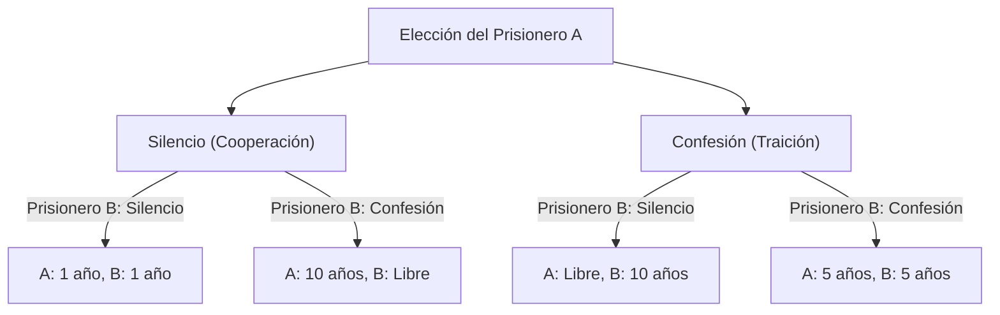
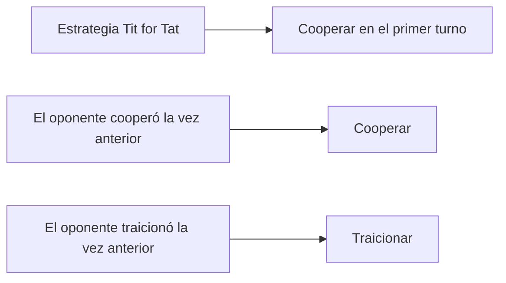

# El Dilema del Prisionero (Prisoner's Dilemma): La paradoja definitiva planteada por la teoría de juegos

"¿Por qué terminamos traicionándonos unos a otros, incluso cuando sabemos que las cosas irían bien si cooperáramos?"

El **"Dilema del Prisionero" (Prisoner's Dilemma)** en la teoría de juegos ofrece la respuesta más clara y cruel a esta pregunta fundamental desde la perspectiva de las matemáticas y la lógica. Inventado por Merrill Flood y Melvin Dresher en la década de 1950, y formalizado como la actual "historia de los prisioneros" por Albert W. Tucker, este concepto ha tenido un profundo impacto en campos que van desde la economía, la ciencia política y la psicología, hasta la biología evolutiva.

En este artículo, profundizaremos en este "Dilema del Prisionero", desde los mecanismos básicos hasta conceptos especializados como el Equilibrio de Nash y el Óptimo de Pareto, así como ejemplos concretos en el mundo real y la evolución de la cooperación en "juegos repetidos".

---

## 1. El escenario básico del Dilema del Prisionero

Primero, repasemos el famoso escenario ideado por Tucker.

Dos cómplices (Prisionero A y Prisionero B) son arrestados bajo sospecha de un delito grave. Sin embargo, la policía no tiene pruebas concluyentes y, sin la confesión de ambos, solo pueden acusarlos de un delito menor (por ejemplo, 1 año de prisión).
Entonces, la policía los aísla en salas de interrogatorio separadas y ofrece a cada uno el siguiente acuerdo de culpabilidad:

1. **Si ambos guardan silencio (cooperan)**: Debido a la falta de pruebas, ambos reciben **1 año de prisión**.
2. **Si uno confiesa (traiciona) y el otro guarda silencio**: El que confiesa queda **libre (absuelto)** a cambio de cooperar en la investigación, y el que guarda silencio asume la culpa grave y recibe **10 años de prisión**.
3. **Si ambos confiesan (se traicionan)**: Ambos son declarados culpables, pero debido a circunstancias atenuantes, reciben **5 años de prisión**.

El Prisionero A y el Prisionero B no pueden consultarse entre sí. Sin saber qué elección hará el otro, cada uno debe elegir si "guardar silencio (cooperar con el otro)" o "confesar (traicionar al otro)".

### Ilustración del mecanismo de decisión

El siguiente diagrama de flujo muestra la bifurcación de los resultados desde la perspectiva del Prisionero A.

---

## 2. La tragedia provocada por decisiones racionales: Equilibrio de Nash

Veamos el proceso de pensamiento racional desde la perspectiva del Prisionero A para maximizar su propio beneficio (reducir el tiempo de prisión). Dividiremos los casos según la elección del otro (Prisionero B).

- **Caso 1: Si el Prisionero B elige "Silencio"**
  - Si yo también elijo "Silencio", 1 año de prisión.
  - Si elijo "Confesar", quedo libre.
  - **Conclusión**: Quedar libre es mejor que 1 año, así que es más beneficioso "Confesar".

- **Caso 2: Si el Prisionero B elige "Confesar"**
  - Si elijo "Silencio", 10 años de prisión.
  - Si elijo "Confesar", 5 años de prisión.
  - **Conclusión**: 5 años es mejor que 10 años, así que es más beneficioso "Confesar".

Sorprendentemente, no importa lo que haga el Prisionero B, para el Prisionero A siempre es más ventajoso elegir "Confesar (traición)". A una estrategia que siempre es óptima para uno mismo, independientemente de la estrategia del oponente, se le llama **"Estrategia Dominante"**.
El Prisionero B se encuentra en exactamente la misma situación, y si piensa de la misma manera racional, para él también la "Confesión" se convierte en la estrategia dominante.

Como resultado, ambos eligen "Confesar" y terminan con un resultado de **5 años de prisión para ambos**. En la teoría de juegos, este estado se conoce como **"Equilibrio de Nash"** (un estado en el que ningún jugador puede obtener un beneficio cambiando su estrategia por sí solo).

### Divergencia del Óptimo de Pareto

Aquí es donde surge el dilema. ¿Es el resultado al que llegaron ("5 años de prisión para ambos") el mejor resultado posible a nivel general?
No. Si los dos confiaran el uno en el otro y ambos mantuvieran el "Silencio", habrían salido con "1 año de prisión para ambos".

El estado donde el beneficio total (en este caso, la menor suma de tiempos de prisión) se maximiza, es decir, "un estado donde el beneficio de alguien no puede aumentar más sin el perjuicio de otra persona", se llama **"Óptimo de Pareto"**. El núcleo del Dilema del Prisionero radica en que **"la elección racional individual (Equilibrio de Nash) no coincide con la solución óptima general (Óptimo de Pareto)"**.

---

## 3. El Dilema del Prisionero en el mundo real

Este dilema no es solo un ejercicio mental. Ocurre a diario en nuestras estructuras sociales, actividades económicas e incluso en las relaciones entre naciones.

### Competencia de precios en la economía
Supongamos que la Compañía A y la Compañía B venden productos similares. Si ambas mantienen precios altos (cooperan), ambas obtendrán altas ganancias. Sin embargo, si una burla a la otra y vende barato (traiciona), monopolizará el mercado y obtendrá enormes ganancias. Como resultado, ambas recurren a la competencia de rebajas y caen en una "guerra de precios" que recorta sus ganancias.

### Problemas medioambientales (La tragedia de los comunes)
La reducción de gases de efecto invernadero también es un dilema del prisionero entre las naciones. Si todos los países hacen esfuerzos de reducción (cooperación), se puede prevenir el calentamiento global. Sin embargo, si un país flexibiliza sus regulaciones ambientales (traición) mientras los demás hacen el esfuerzo, solo ese país disfrutará del crecimiento económico. Como resultado, cada país busca sacar ventaja y el medio ambiente global se deteriora.

### Carrera armamentista
La carrera de desarrollo de armas nucleares entre Estados Unidos y la Unión Soviética durante la Guerra Fría es un ejemplo típico. Si ambas partes se desarman (cooperan), lograrán paz y holgura económica, pero si uno se desarma mientras el otro está armado, enfrenta una crisis de supervivencia nacional (equivalente a 10 años de prisión), por lo que ambas partes se vieron obligadas a continuar armándose (traicionando).

---

## 4. Juegos repetidos y la estrategia "Toma y Daca" (Tit for Tat)

En un Dilema del Prisionero de una sola vez, la "traición" era la elección racional. Sin embargo, en la sociedad real, es común interactuar repetidamente con la misma persona. En la teoría de juegos, esto se llama un **"Juego Repetido" (Iterated Prisoner's Dilemma)**.

En la década de 1980, el politólogo Robert Axelrod organizó un torneo computacional, solicitando programas de expertos de todo el mundo, para averiguar qué estrategia era la más fuerte en el dilema del prisionero repetido.

El resultado fue que la estrategia más simple, y la que obtuvo la puntuación más alta, fue la estrategia **"Tit for Tat" (Toma y daca o Tal para cual)** presentada por Anatol Rapoport.

### Algoritmo de la estrategia Tit for Tat

Las reglas de esta estrategia son asombrosamente simples.
1. En el primer turno, siempre "cooperar".
2. A partir del segundo turno, **imitar exactamente la acción que tomó el oponente en el turno anterior** (si el oponente cooperó, cooperar; si traicionó, traicionar).

¿Por qué fue tan fuerte esta estrategia? Axelrod analizó cuatro características comunes a las estrategias fuertes.
1. **Amabilidad (Nice)**: Nunca ser el primero en traicionar.
2. **Represalia (Retaliating)**: Si el oponente traiciona, castigarlo (devolver la traición) inmediatamente.
3. **Indulgencia (Forgiving)**: Si el oponente cambia de actitud y vuelve a cooperar, olvidar la traición pasada y volver a cooperar inmediatamente.
4. **Claridad (Clear)**: Las intenciones son fáciles de entender, lo que permite al oponente elegir la cooperación con tranquilidad.

Este descubrimiento sugiere que la "moralidad" y la "confianza" en la sociedad humana pueden no ser meros argumentos emocionales, sino estar respaldados por una racionalidad matemática y evolutiva.

---

## 5. El surgimiento de la cooperación en la biología evolutiva

El Dilema del Prisionero y el éxito de la estrategia "Tit for Tat" también tuvieron un gran impacto en la biología evolutiva (teoría de juegos evolutivos). Como lo representa "El Gen Egoísta" de Richard Dawkins, el mundo natural es de supervivencia del más apto, y los organismos individuales deberían priorizar (traicionar) su propia supervivencia y reproducción. Sin embargo, la naturaleza está llena de "comportamientos altruistas (cooperación)", como compartir sangre entre murciélagos vampiros o la naturaleza social de las abejas.

En simulaciones evolutivas, se ha demostrado que cuando se introduce una pequeña población "Tit for Tat" en una sociedad donde todos "traicionan", la población Tit for Tat coopera entre sí, obteniendo altos beneficios, y gradualmente elimina a la población de traidores. Es decir, en la lucha por la supervivencia a largo plazo, los grupos capaces de cooperar son los vencedores definitivos.

## 6. Conclusión: Cómo superar el dilema

El Dilema del Prisionero nos enseña la dura realidad de que, si perseguimos demasiado nuestro propio interés, el resultado es que todos pierden. Pero al mismo tiempo, como muestran las investigaciones sobre los juegos repetidos, podemos construir relaciones cooperativas si existen relaciones sostenidas y un sistema de retroalimentación adecuado.

Para resolver el Dilema del Prisionero en el mundo real, se necesitan enfoques como los siguientes:
- **Cambio de reglas (Imperio de la ley)**: Institucionalizar sanciones contra la traición y eliminar sus beneficios. (Ej. Leyes antimonopolio, impuestos ambientales).
- **Asegurar la comunicación**: Crear oportunidades para confirmar las intenciones mutuas y construir relaciones de confianza.
- **Énfasis en las relaciones a largo plazo**: Hacer consciente la sombra del futuro: "Si traiciono esta vez, no habrá futuros tratos".

La teoría de juegos parece un mundo de cálculos fríos, pero cuando miramos hacia su abismo, llegamos a una verdad muy humana y cálida sobre "por qué la gente debería cooperar".
