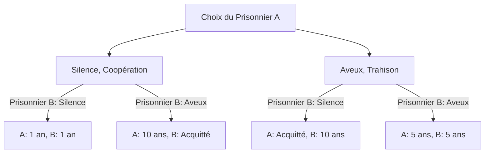
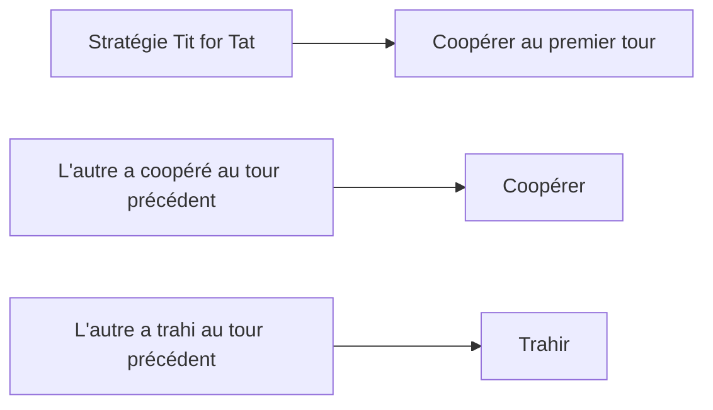

+++
title: "[Le dilemme du prisonnier] La théorie des jeux révèle les limites de la rationalité humaine et de la coopération"
description: "Le paradoxe représentatif de la théorie des jeux, le \"dilemme du prisonnier\". Une explication approfondie de la façon dont le choix rationnel d'un individu conduit au pire résultat pour l'ensemble, avec des applications dans les affaires, la politique internationale et la biologie. Nous explorons les conditions de notre coopération en abordant la stratégie du tac au tac et la théorie des jeux évolutionniste."
slug: "paradox-prisoners-dilemma"
categories: ["philosophy"]
tags: ["game-theory", "prisoners-dilemma", "strategy"]
image: "eyecatch.jpg"
date: "2026-09-24T15:00:00+09:00"
+++

# Le dilemme du prisonnier (Prisoner's Dilemma) : Le paradoxe ultime posé par la théorie des jeux

"Pourquoi nous trahissons-nous les uns les autres alors que nous savons que nous réussirions mieux en coopérant ?"

À cette question fondamentale, la réponse la plus claire et la plus cruelle, du point de vue des mathématiques et de la logique, est le **« dilemme du prisonnier » (Prisoner's Dilemma)** dans la théorie des jeux. Conçu dans les années 1950 par Merrill Flood et Melvin Dresher, et formalisé par Albert W. Tucker sous sa forme actuelle de « l'histoire du prisonnier », ce concept a eu une influence majeure dans des domaines allant de l'économie et des sciences politiques à la psychologie et la biologie de l'évolution.

Dans cet article, nous allons explorer en détail ce « dilemme du prisonnier », de ses mécanismes fondamentaux à des concepts spécialisés tels que l'équilibre de Nash et l'optimum de Pareto, en passant par des exemples concrets du monde réel et l'évolution de la coopération dans les « jeux répétés ».

---

## 1. Le scénario de base du dilemme du prisonnier

Commençons par examiner le célèbre scénario conçu par Tucker.

Deux complices (le Prisonnier A et le Prisonnier B) ont été arrêtés pour un crime grave. Cependant, la police n'a pas de preuves décisives et ne peut les poursuivre que pour un délit mineur (par exemple, 1 an de prison) sans leurs aveux.
La police isole alors les deux hommes dans des salles d'interrogatoire séparées et propose à chacun le marché suivant :

1. **Si les deux gardent le silence (coopération)** : Par manque de preuves, les deux purgent **1 an de prison**.
2. **Si l'un avoue (trahison) et que l'autre garde le silence** : Celui qui avoue est **acquitté (libéré)** en récompense de sa coopération à l'enquête, tandis que celui qui garde le silence est condamné pour crime grave à **10 ans de prison**.
3. **Si les deux avouent (trahison)** : Les deux sont reconnus coupables, mais bénéficient de circonstances atténuantes, écopant de **5 ans de prison**.

Le Prisonnier A et le Prisonnier B ne peuvent pas se concerter. Sans savoir ce que l'autre va choisir, chacun doit décider de « garder le silence (coopérer avec l'autre) » ou d'« avouer (trahir l'autre) ».

### Comprendre le mécanisme de décision avec un diagramme

L'organigramme suivant montre les différentes issues possibles du point de vue du Prisonnier A.

---

## 2. La tragédie du choix rationnel : L'équilibre de Nash

Mettez-vous à la place du Prisonnier A et suivez le processus de réflexion rationnelle visant à maximiser son propre intérêt (minimiser la peine de prison). Nous séparons les cas selon le choix de l'autre (Prisonnier B).

- **Cas 1 : Si le Prisonnier B choisit le « Silence »**
  - Si je choisis aussi le « Silence », c'est 1 an de prison.
  - Si j'« avoue », je suis acquitté.
  - **Conclusion** : L'acquittement vaut mieux qu'un an, il est donc plus avantageux d'« avouer ».

- **Cas 2 : Si le Prisonnier B choisit les « Aveux »**
  - Si je choisis le « Silence », c'est 10 ans de prison.
  - Si j'« avoue », c'est 5 ans de prison.
  - **Conclusion** : 5 ans valent mieux que 10 ans, il est donc plus avantageux d'« avouer ».

Étonnamment, quoi que fasse le Prisonnier B, il est toujours plus avantageux pour le Prisonnier A de choisir d'« avouer (trahir) ». Une stratégie qui est toujours la meilleure pour soi, quelle que soit la stratégie de l'autre, est appelée **« stratégie dominante »**.
Le Prisonnier B se trouve exactement dans la même situation. S'il réfléchit de manière tout aussi rationnelle, « avouer » devient également sa stratégie dominante.

En conséquence, les deux choisissent de s'« avouer », ce qui aboutit à **5 ans de prison pour les deux**. Dans la théorie des jeux, cet état est appelé **« équilibre de Nash »** (une situation où aucun joueur ne peut tirer profit d'un changement de stratégie tant que les autres joueurs gardent la leur inchangée).

### Divergence avec l'optimum de Pareto

C'est ici que le dilemme survient. Le résultat auquel ils sont parvenus, « 5 ans de prison pour chacun », est-il le meilleur résultat globalement ?
Non. S'ils s'étaient fait confiance et avaient tous deux choisi le « Silence », ils n'auraient écopé que d'« 1 an de prison chacun ».

L'état dans lequel le bénéfice total (dans ce cas, la somme minimale des peines de prison) est maximisé, c'est-à-dire « un état où il est impossible d'améliorer la situation d'une personne sans détériorer celle d'une autre », est appelé **« optimum de Pareto »**. Le cœur du dilemme du prisonnier réside dans le fait que **« le choix individuel rationnel (l'équilibre de Nash) ne coïncide pas avec la solution optimale globale (l'optimum de Pareto) »**.

---

## 3. Le dilemme du prisonnier dans le monde réel

Ce dilemme n'est pas qu'un simple exercice mental. Il se produit quotidiennement dans nos structures sociales, nos activités économiques, et même dans les relations internationales.

### La concurrence par les prix en économie
Supposons que les entreprises A et B vendent des produits similaires. Si les deux maintiennent des prix élevés (coopération), les deux réaliseront des profits élevés. Cependant, si l'une des deux double l'autre en baissant ses prix (trahison), elle monopolisera le marché et fera d'énormes profits. En conséquence, les deux s'engagent dans une guerre des prix, aboutissant à une « concurrence par les prix (guerre des prix) » où chacune réduit ses marges.

### Les problèmes environnementaux (La tragédie des biens communs)
La réduction des gaz à effet de serre est également un dilemme du prisonnier entre les nations. Si tous les pays font des efforts de réduction (coopération), nous pouvons prévenir le réchauffement climatique. Cependant, si un seul pays assouplit ses réglementations environnementales pendant que les autres font des efforts (trahison), ce pays seul bénéficiera de la croissance économique. Par conséquent, chaque pays tente de prendre l'avantage, ce qui dégrade l'environnement global.

### La course aux armements
La course au développement d'armes nucléaires entre les États-Unis et l'Union soviétique pendant la guerre froide en est un exemple typique. Si les deux camps désarment (coopération), ils gagnent en paix et en ressources économiques. Mais si l'un désarme pendant que l'autre reste armé, il fait face à une crise de survie nationale (équivalent aux 10 ans de prison). Les deux camps ont donc été forcés de poursuivre la course aux armements (trahison).

---

## 4. Jeux répétés et la stratégie du « Tac au Tac » (Tit for Tat)

Dans un dilemme du prisonnier unique, la « trahison » était le choix rationnel. Cependant, dans le monde réel, il est courant d'interagir à plusieurs reprises avec la même personne. La théorie des jeux appelle cela un **« jeu répété » (Iterated Prisoner's Dilemma)**.

Dans les années 1980, le politologue Robert Axelrod a organisé un tournoi en sollicitant des programmes informatiques auprès d'experts du monde entier, pour déterminer quelle stratégie était la plus forte dans un dilemme du prisonnier répété.

Le résultat fut que la stratégie la plus simple, qui a obtenu le meilleur score, a été la stratégie du **« Tac au Tac » (Tit for Tat)** proposée par Anatol Rapoport.

### L'algorithme de la stratégie du Tac au Tac

Les règles de cette stratégie sont étonnamment simples :
1. Le premier tour, choisissez toujours de « coopérer ».
2. À partir du deuxième tour, **imitez exactement l'action de l'autre joueur au tour précédent** (s'il a coopéré, coopérez ; s'il a trahi, trahissez).

Pourquoi cette stratégie était-elle si forte ? Axelrod a analysé quatre caractéristiques communes aux stratégies fortes :
1. **Gentillesse (Nice)** : Ne jamais être le premier à trahir.
2. **Représailles (Retaliating)** : Si l'autre trahit, punissez-le immédiatement (rendez la pareille).
3. **Pardon (Forgiving)** : Si l'autre change d'attitude et recommence à coopérer, oubliez les trahisons passées et coopérez à nouveau.
4. **Clarté (Clear)** : Vos intentions sont faciles à comprendre, permettant à l'autre de choisir la coopération en toute confiance.

Cette découverte suggère que la « moralité » et la « confiance » dans la société humaine pourraient ne pas être de simples émotions, mais reposer sur une rationalité mathématique et évolutive.

---

## 5. L'émergence de la coopération dans la biologie de l'évolution

Le dilemme du prisonnier et le succès de la stratégie du « tac au tac » ont également eu un impact profond sur la biologie de l'évolution (théorie des jeux évolutionniste). Comme l'illustre « Le Gène égoïste » de Richard Dawkins, le monde naturel obéit à la loi du plus fort, et chaque organisme devrait donner la priorité à sa propre survie et reproduction (trahison). Malgré cela, le monde naturel regorge de comportements altruistes (coopération), tels que le partage de sang chez les chauves-souris vampires ou la socialité des abeilles.

Dans les simulations évolutives, il a été prouvé que si un petit groupe de « tac au tac » est introduit dans une société où tout le monde « trahit », le groupe tac au tac coopère entre eux pour obtenir des avantages élevés, et élimine progressivement le groupe des traîtres. Autrement dit, dans la lutte pour la survie à long terme, les groupes capables de coopérer sont les vainqueurs ultimes.

## 6. Conclusion : Comment surmonter le dilemme

Le dilemme du prisonnier nous enseigne la dure réalité que si nous poursuivons excessivement notre propre intérêt, tout le monde finit par y perdre. Mais en même temps, comme le montrent les études sur les jeux répétés, nous pouvons établir des relations de coopération s'il existe des interactions continues et des mécanismes de retour d'information appropriés.

Pour résoudre le dilemme du prisonnier dans le monde réel, des approches telles que les suivantes sont nécessaires :
- **Changement de règles (État de droit)** : Institutionnaliser les sanctions pour les trahisons, éliminant ainsi les avantages de la trahison. (ex. : lois antitrust, taxes environnementales)
- **Garantir la communication** : Créer des opportunités pour confirmer les intentions de chacun et bâtir la confiance.
- **Mettre l'accent sur les relations à long terme** : Faire prendre conscience de l'ombre de l'avenir : « Si je trahis cette fois, il n'y aura plus de transactions à l'avenir. »

La théorie des jeux peut ressembler à un monde de calculs froids, mais lorsqu'on regarde dans ses abysses, on aboutit à une vérité très humaine et chaleureuse sur « pourquoi les gens devraient coopérer ».
