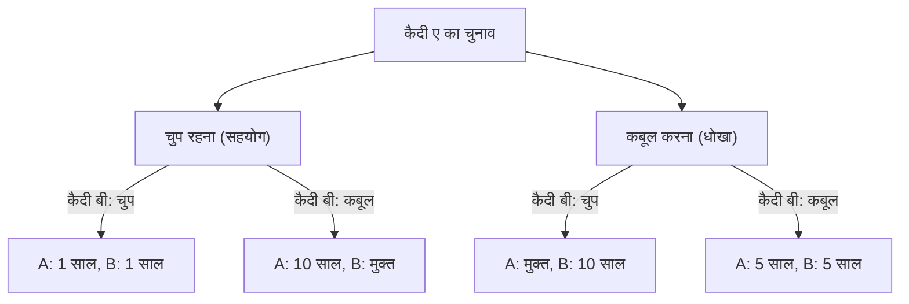
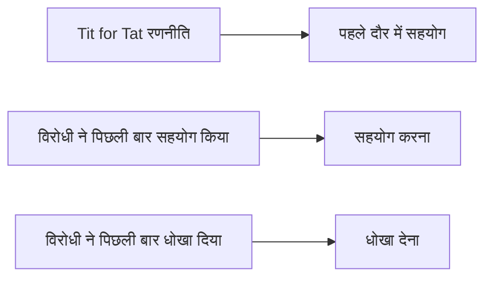

# कैदी की दुविधा (Prisoner's Dilemma): गेम थ्योरी द्वारा प्रस्तुत अंतिम विरोधाभास

"हम एक-दूसरे को धोखा क्यों देते हैं, तब भी जब हम जानते हैं कि अगर हम सहयोग करेंगे तो सब ठीक हो जाएगा?"

इस मौलिक प्रश्न का गणित और तर्कशास्त्र के दृष्टिकोण से सबसे स्पष्ट और क्रूर उत्तर गेम थ्योरी में **"कैदी की दुविधा" (Prisoner's Dilemma)** द्वारा दिया जाता है। 1950 के दशक में मेरिल फ्लड और मेल्विन ड्रेशर द्वारा आविष्कार किया गया, और अल्बर्ट डब्ल्यू. टकर द्वारा वर्तमान "कैदियों की कहानी" के रूप में औपचारिक रूप दिया गया, इस अवधारणा का अर्थशास्त्र, राजनीति विज्ञान, मनोविज्ञान से लेकर विकासवादी जीव विज्ञान तक हर क्षेत्र पर गहरा प्रभाव पड़ा है।

इस लेख में, हम इस "कैदी की दुविधा" में गहराई से गोता लगाएँगे, बुनियादी तंत्र से लेकर नैश इक्विलिब्रियम (Nash Equilibrium) और पारेटो ऑप्टिमेलिटी (Pareto Optimality) जैसी विशिष्ट अवधारणाओं के साथ-साथ वास्तविक दुनिया के उदाहरणों और "दोहराए गए खेलों" में सहयोग के विकास पर चर्चा करेंगे।

---

## 1. कैदी की दुविधा का मूल परिदृश्य

सबसे पहले, आइए टकर द्वारा तैयार किए गए प्रसिद्ध परिदृश्य की समीक्षा करें।

दो साथियों (कैदी ए और कैदी बी) को एक गंभीर अपराध के संदेह में गिरफ्तार किया गया है। हालाँकि, पुलिस के पास निर्णायक सबूत नहीं हैं, और दोनों के कबूलनामे के बिना, वे केवल एक छोटे अपराध (उदाहरण के लिए, 1 साल की जेल) के लिए उन पर आरोप लगा सकते हैं।
इसलिए, पुलिस दोनों को अलग-अलग पूछताछ कक्षों में अलग कर देती है और प्रत्येक को निम्नलिखित दलील का सौदा (Plea Bargain) पेश करती है:

1. **यदि दोनों चुप रहते हैं (सहयोग)**: अपर्याप्त सबूतों के कारण, दोनों को **1 साल की जेल** मिलती है।
2. **यदि एक कबूल करता है (धोखा) और दूसरा चुप रहता है**: जो कबूल करता है वह जांच में सहयोग के इनाम के रूप में **मुक्त (बरी)** हो जाता है, और जो चुप रहता है वह भारी अपराध को स्वीकारता है और उसे **10 साल की जेल** मिलती है।
3. **यदि दोनों कबूल करते हैं (धोखा)**: दोनों को दोषी पाया जाता है, लेकिन कम करने वाली परिस्थितियों के कारण, उन्हें **5 साल की जेल** मिलती है।

कैदी ए और कैदी बी एक-दूसरे से सलाह-मशविरा नहीं कर सकते। यह न जानते हुए कि दूसरा क्या विकल्प चुनेगा, हर एक को चुनना होगा कि "चुप रहें (दूसरे के साथ सहयोग करें)" या "कबूल करें (दूसरे को धोखा दें)"।

### निर्णय तंत्र को आरेख में देखना

नीचे दिया गया फ़्लोचार्ट कैदी ए के दृष्टिकोण से परिणामों का विभाजन दिखाता है।

---

## 2. तार्किक निर्णयों के कारण होने वाली त्रासदी: नैश इक्विलिब्रियम

आइए कैदी ए के दृष्टिकोण से अपने स्वयं के लाभ (जेल के समय को कम करना) को अधिकतम करने के लिए तार्किक विचार प्रक्रिया का पालन करें। हम दूसरे (कैदी बी) के चुनाव के आधार पर मामलों को विभाजित करेंगे।

- **मामला 1: यदि कैदी बी "चुप रहने" का विकल्प चुनता है**
  - यदि मैं भी "चुप रहने" का विकल्प चुनता हूँ, 1 साल की जेल।
  - यदि मैं "कबूल करने" का विकल्प चुनता हूँ, तो मैं मुक्त हो जाता हूँ।
  - **निष्कर्ष**: मुक्त होना 1 साल से बेहतर है, इसलिए "कबूल करना" अधिक लाभदायक है।

- **मामला 2: यदि कैदी बी "कबूल करने" का विकल्प चुनता है**
  - यदि मैं "चुप रहने" का विकल्प चुनता हूँ, 10 साल की जेल।
  - यदि मैं "कबूल करने" का विकल्प चुनता हूँ, 5 साल की जेल।
  - **निष्कर्ष**: 5 साल 10 साल से बेहतर है, इसलिए "कबूल करना" अधिक लाभदायक है।

हैरानी की बात है कि, कोई फर्क नहीं पड़ता कि कैदी बी क्या करता है, कैदी ए के लिए हमेशा "कबूल (धोखा)" चुनना अधिक फायदेमंद होता है। एक ऐसी रणनीति जो हमेशा किसी के लिए इष्टतम होती है, चाहे प्रतिद्वंद्वी की रणनीति कुछ भी हो, उसे **"प्रभावी रणनीति" (Dominant Strategy)** कहा जाता है।
कैदी बी भी बिल्कुल वैसी ही स्थिति में है, और यदि वह भी इसी तरह तार्किक रूप से सोचता है, तो "कबूल करना" भी उसके लिए प्रभावी रणनीति बन जाती है।

परिणामस्वरूप, दोनों "कबूल करना" चुनते हैं और **दोनों के लिए 5 साल की जेल** के परिणाम पर समाप्त होते हैं। गेम थ्योरी में इस स्थिति को **"नैश इक्विलिब्रियम" (Nash Equilibrium)** कहा जाता है (एक ऐसी स्थिति जहां कोई भी खिलाड़ी अकेले अपनी रणनीति बदलकर लाभ प्राप्त नहीं कर सकता है)।

### पारेटो ऑप्टिमेलिटी से विचलन

यहाँ दुविधा उत्पन्न होती है। क्या "दोनों के लिए 5 साल की जेल" का परिणाम, जिस पर वे पहुंचे, समग्र रूप सर्वोत्तम परिणाम है?
नहीं। यदि वे दोनों एक-दूसरे पर भरोसा करते और "चुप" रहते, तो वे "दोनों के लिए 1 साल की जेल" से बच जाते।

वह स्थिति जहां कुल लाभ (इस मामले में, संयुक्त जेल समय की कम से कम मात्रा) अधिकतम हो जाता है, यानी, "एक ऐसी स्थिति जहां किसी और के नुकसान के बिना किसी का लाभ नहीं बढ़ाया जा सकता है," उसे **"पारेटो ऑप्टिमेलिटी" (Pareto Optimality)** कहा जाता है। कैदी की दुविधा का मूल यह है कि **"व्यक्तिगत तार्किक विकल्प (नैश इक्विलिब्रियम) समग्र इष्टतम समाधान (पारेटो ऑप्टिमेलिटी) के साथ मेल नहीं खाता है।"**

---

## 3. वास्तविक दुनिया में कैदी की दुविधा

यह दुविधा केवल एक दिमागी कसरत नहीं है। यह हमारे सामाजिक ढांचे, आर्थिक गतिविधियों और यहाँ तक कि देशों के बीच संबंधों में रोज़ाना होता है।

### अर्थशास्त्र में मूल्य प्रतियोगिता
मान लीजिए कि कंपनी ए और कंपनी बी समान उत्पाद बेच रहे हैं। यदि दोनों उच्च मूल्य बनाए रखते हैं (सहयोग), तो दोनों उच्च लाभ प्राप्त करेंगे। हालांकि, यदि एक दूसरे को मात देकर सस्ता बेचता है (धोखा), तो वह बाजार पर एकाधिकार कर लेगा और भारी मुनाफा कमाएगा। नतीजतन, दोनों सस्ते में बेचने की प्रतियोगिता का सहारा लेते हैं और "मूल्य युद्ध" (Price War) में पड़ जाते हैं जो उनके मुनाफे को कम कर देता है।

### पर्यावरणीय मुद्दे (सामान्य की त्रासदी)
ग्रीनहाउस गैसों को कम करना भी देशों के बीच एक कैदी की दुविधा है। यदि सभी देश कम करने के प्रयास (सहयोग) करते हैं, तो ग्लोबल वार्मिंग को रोका जा सकता है। हालाँकि, यदि कोई देश अपने पर्यावरण नियमों को ढीला कर देता है (धोखा) जबकि अन्य प्रयास कर रहे हैं, तो केवल वह देश ही आर्थिक विकास का आनंद लेगा। नतीजतन, प्रत्येक देश आगे निकलने की कोशिश करता है, और समग्र पर्यावरण बिगड़ जाता है।

### हथियारों की होड़
शीत युद्ध के दौरान संयुक्त राज्य अमेरिका और सोवियत संघ के बीच परमाणु हथियारों के विकास की होड़ एक विशिष्ट उदाहरण है। यदि दोनों पक्ष निशस्त्रीकरण (सहयोग) करते हैं, तो वे शांति और आर्थिक राहत प्राप्त करेंगे, लेकिन अगर कोई एक निशस्त्रीकरण करता है जबकि दूसरा हथियारबंद है, तो उसे राष्ट्रीय अस्तित्व के संकट (10 साल की जेल के बराबर) का सामना करना पड़ता है, इसलिए दोनों पक्षों को हथियार बनाने (धोखा देने) को मजबूर होना पड़ा।

---

## 4. दोहराए गए खेल और "टिट-फॉर-टैट" (Tit for Tat) रणनीति

एक बार के कैदी की दुविधा में, "धोखा" देना तार्किक विकल्प था। हालांकि, वास्तविक समाज में, एक ही व्यक्ति के साथ बार-बार संबंध रखना आम बात है। गेम थ्योरी में इसे **"दोहराया गया खेल" (Iterated Prisoner's Dilemma)** कहा जाता है।

1980 के दशक में, राजनीतिक वैज्ञानिक रॉबर्ट एक्सेलरोड ने दुनिया भर के विशेषज्ञों से कंप्यूटर प्रोग्राम एकत्र करके एक टूर्नामेंट आयोजित किया, ताकि यह पता लगाया जा सके कि दोहराए गए कैदी की दुविधा में कौन सी रणनीति सबसे मजबूत थी।

परिणाम यह रहा कि एनाटोल रापोपोर्ट द्वारा प्रस्तुत **"टिट-फॉर-टैट" (Tit for Tat - जैसे को तैसा)** रणनीति सबसे सरल थी और सबसे अधिक स्कोर प्राप्त किया।

### टिट-फॉर-टैट रणनीति का एल्गोरिदम

इस रणनीति के नियम आश्चर्यजनक रूप से सरल हैं।
1. पहले टर्न में हमेशा "सहयोग" करें।
2. दूसरे टर्न के बाद से, **वही कार्य करें जो विरोधी ने ठीक पिछले टर्न में किया था** (यदि विरोधी ने सहयोग किया, तो सहयोग करें; यदि धोखा दिया, तो धोखा दें)।

यह रणनीति इतनी मजबूत क्यों थी? एक्सेलरोड ने मजबूत रणनीतियों में चार सामान्य विशेषताओं का विश्लेषण किया।
1. **अच्छा (Nice)**: धोखा देने वाला पहला व्यक्ति कभी न बनें।
2. **प्रतिशोधी (Retaliating)**: यदि विरोधी धोखा देता है, तो उसे तुरंत दंडित करें (बदले में धोखा दें)।
3. **क्षमाशील (Forgiving)**: यदि विरोधी अपना मन बदल लेता है और फिर से सहयोग करता है, तो पिछले विश्वासघात को भूल जाएं और तुरंत सहयोग पर लौट आएं।
4. **स्पष्ट (Clear)**: आपके इरादे समझने में आसान होते हैं, जिससे विरोधी मन की शांति के साथ सहयोग चुन सकता है।

यह खोज बताती है कि मानव समाज में "नैतिकता" और "विश्वास" केवल भावनात्मक तर्क नहीं हो सकते हैं, बल्कि गणितीय और विकासवादी तार्किकता द्वारा समर्थित हैं।

---

## 5. विकासवादी जीव विज्ञान में सहयोग का उदय

कैदी की दुविधा और "टिट-फॉर-टैट" रणनीति की सफलता का विकासवादी जीव विज्ञान (Evolutionary Game Theory) पर भी बड़ा प्रभाव पड़ा। रिचर्ड डॉकिन्स के "द सेल्फिश जीन" (स्वार्थी जीन) द्वारा प्रस्तुत रूप में, प्राकृतिक दुनिया योग्यतम की उत्तरजीविता है, और व्यक्तिगत जीवों को अपने स्वयं के अस्तित्व और प्रजनन को प्राथमिकता (धोखा) देनी चाहिए। इसके बावजूद, प्रकृति "परोपकारी व्यवहार (सहयोग)" से भरी हुई है, जैसे कि पिशाच चमगादड़ों द्वारा रक्त साझा करना और मधुमक्खियों की सामाजिक प्रकृति।

विकासवादी सिमुलेशन में, यह साबित हो गया है कि जब सभी "धोखा" देने वाले समाज में एक छोटा "टिट-फॉर-टैट" समूह लाया जाता है, तो टिट-फॉर-टैट समूह एक-दूसरे के साथ सहयोग करके उच्च लाभ कमाता है और धीरे-धीरे धोखा देने वाले समूह को समाप्त कर देता है। दूसरे शब्दों में, दीर्घकालिक अस्तित्व के संघर्ष में, जो समूह सहयोग करने में सक्षम हैं, वे ही अंतिम विजेता होते हैं।

## 6. निष्कर्ष: दुविधा को कैसे दूर करें

कैदी की दुविधा हमें वह कठोर वास्तविकता सिखाती है कि यदि हम अपने स्वयं के लाभ का बहुत अधिक पीछा करते हैं, तो अंततः सभी को नुकसान होता है। लेकिन साथ ही, जैसा कि दोहराए गए खेलों पर शोध से पता चलता है, यदि निरंतर रिश्ते और उचित प्रतिक्रिया तंत्र (Feedback Mechanism) हों, तो हम सहकारी संबंध बना सकते हैं।

वास्तविक दुनिया में कैदी की दुविधा को हल करने के लिए, निम्नलिखित दृष्टिकोणों की आवश्यकता है:
- **नियम परिवर्तन (कानून का शासन)**: धोखे के खिलाफ दंड को संस्थागत बनाना और इसके लाभों को समाप्त करना। (उदा: अविश्वास कानून और पर्यावरण कर)
- **संचार सुनिश्चित करना**: एक-दूसरे के इरादों की पुष्टि करने और विश्वास संबंध बनाने के अवसर पैदा करना।
- **दीर्घकालिक संबंधों पर जोर**: भविष्य की छाया के प्रति जागरूक करना: "यदि मैं इस बार धोखा देता हूं, तो भविष्य में कोई व्यापार नहीं होगा।"

गेम थ्योरी ठंडी गणना की दुनिया की तरह लग सकती है, लेकिन जब हम इसकी गहराई में देखते हैं, तो हम एक बहुत ही मानवीय और गर्म सच्चाई पर पहुंचते हैं कि "लोगों को सहयोग क्यों करना चाहिए।"
