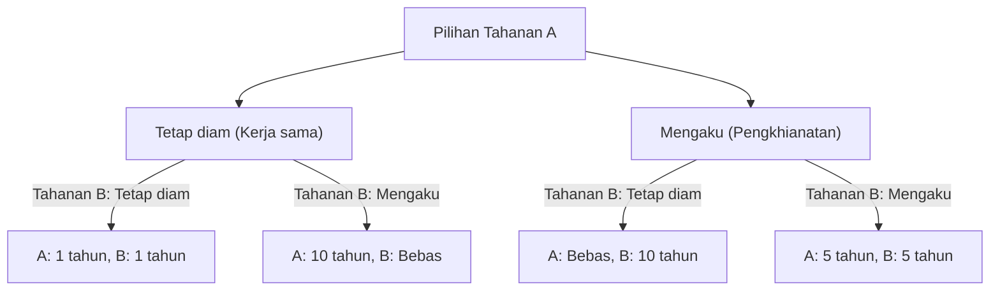
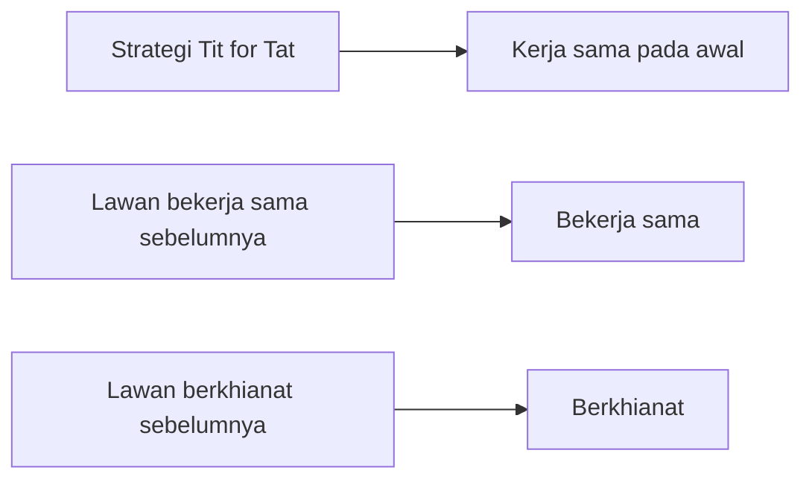

# Dilema Tahanan (Prisoner's Dilemma): Paradoks Utama dari Teori Permainan

"Mengapa kita saling mengkhianati ketika kita tahu segalanya akan berjalan lancar jika kita bekerja sama?"

Menanggapi pertanyaan mendasar ini, **"Dilema Tahanan (Prisoner's Dilemma)"** dalam teori permainan memberikan jawaban paling jelas dan paling kejam dari perspektif matematika dan logika. Diciptakan oleh Merrill Flood dan Melvin Dresher pada 1950-an, dan diformulasikan sebagai "cerita tahanan" saat ini oleh Albert W. Tucker, konsep ini telah berdampak besar pada segala hal mulai dari ekonomi dan ilmu politik hingga psikologi dan biologi evolusioner.

Dalam artikel ini, kita akan membahas "Dilema Tahanan" dengan sangat rinci, dari mekanisme dasar hingga konsep khusus seperti ekuilibrium Nash dan optimalitas Pareto, serta contoh spesifik di dunia nyata dan evolusi kerja sama dalam "permainan berulang".

---

## 1. Skenario Dasar Dilema Tahanan

Pertama, mari kita tinjau skenario terkenal yang dirancang oleh Tucker.

Dua kaki tangan (Tahanan A dan Tahanan B) ditangkap atas dugaan kejahatan berat. Namun, polisi tidak memiliki bukti kuat dan hanya dapat mendakwa mereka dengan pelanggaran ringan (misalnya, 1 tahun penjara) tanpa pengakuan dari keduanya.
Oleh karena itu, polisi mengisolasi keduanya di ruang interogasi terpisah dan menawarkan kesepakatan pembelaan kepada masing-masing dari mereka:

1. **Jika keduanya tetap diam (bekerja sama)**: Karena kurangnya bukti, keduanya mendapat hukuman **1 tahun penjara**.
2. **Jika satu mengaku (berkhianat) dan yang lain tetap diam**: Pihak yang mengaku akan **dibebaskan (bebas)** sebagai imbalan kerja sama, sedangkan pihak yang tetap diam akan didakwa dengan kejahatan berat dan menerima hukuman **10 tahun penjara**.
3. **Jika keduanya mengaku (berkhianat)**: Keduanya dinyatakan bersalah, tetapi dengan keadaan yang meringankan mendapat hukuman **5 tahun penjara**.

Tahanan A dan Tahanan B tidak dapat berkonsultasi satu sama lain. Tanpa mengetahui pilihan apa yang akan diambil pihak lain, masing-masing harus memilih antara "tetap diam (bekerja sama dengan pihak lain)" atau "mengaku (mengkhianati pihak lain)".

### Memvisualisasikan Mekanisme Keputusan

Bagan alur di bawah ini menunjukkan konsekuensi dari perspektif Tahanan A.

---

## 2. Tragedi yang Disebabkan oleh Keputusan Rasional: Ekuilibrium Nash

Mari kita telusuri proses pemikiran rasional untuk memaksimalkan kepentingan Tahanan A sendiri (mengurangi hukuman). Kita bagi kasus berdasarkan apa yang dipilih Tahanan B.

- **Kasus 1: Jika Tahanan B memilih "Tetap diam"**
  - Jika A "Tetap diam", 1 tahun penjara.
  - Jika A "Mengaku", bebas.
  - **Kesimpulan**: Bebas lebih baik daripada 1 tahun, jadi "Mengaku" lebih menguntungkan.

- **Kasus 2: Jika Tahanan B memilih "Mengaku"**
  - Jika A "Tetap diam", 10 tahun penjara.
  - Jika A "Mengaku", 5 tahun penjara.
  - **Kesimpulan**: 5 tahun lebih baik daripada 10 tahun, jadi "Mengaku" lebih menguntungkan.

Yang mengejutkan, tidak peduli apa yang dilakukan Tahanan B, selalu lebih menguntungkan bagi Tahanan A untuk memilih "Mengaku (berkhianat)". Strategi ini yang selalu optimal terlepas dari strategi lawan disebut **"Strategi Dominan"**.
Tahanan B juga berada dalam situasi yang sama persis, dan jika ia berpikir rasional dengan cara yang sama, "mengaku" juga merupakan strategi dominannya.

Akibatnya, keduanya saling memilih "mengaku" dan **keduanya dijatuhi hukuman 5 tahun penjara**. Dalam teori permainan, keadaan ini disebut **"Ekuilibrium Nash"** (keadaan di mana tidak ada pemain yang dapat memperoleh keuntungan jika hanya dia yang mengubah strateginya).

### Divergensi dari Optimalitas Pareto

Di sinilah muncul dilema. Apakah hasil "keduanya 5 tahun penjara" merupakan hasil terbaik secara keseluruhan?
Tidak. Jika mereka saling percaya dan keduanya tetap diam, mereka hanya akan mendapat "keduanya 1 tahun penjara".

Keadaan di mana keuntungan keseluruhan (dalam hal ini total masa hukuman) dimaksimalkan, yaitu "keadaan di mana tidak mungkin meningkatkan keuntungan seseorang tanpa mengurangi keuntungan orang lain", disebut **"Optimalitas Pareto"**. Inti dari Dilema Tahanan terletak pada kenyataan bahwa **"pilihan rasional individu (ekuilibrium Nash) tidak selaras dengan solusi optimal keseluruhan (optimalitas Pareto)"**.

---

## 3. Dilema Tahanan di Dunia Nyata

Dilema ini bukan sekadar latihan otak. Ini terjadi setiap hari dalam struktur sosial kita, kegiatan ekonomi, dan bahkan dalam hubungan antarnegara.

### Persaingan Harga dalam Ekonomi
Misalkan Perusahaan A dan Perusahaan B menjual produk yang serupa. Jika keduanya mempertahankan harga tinggi (kerja sama), keduanya akan mendapat untung besar. Namun, jika salah satu pihak memotong harga untuk mengalahkan yang lain (pengkhianatan), ia akan memonopoli pasar dan meraup untung besar. Akibatnya, kedua belah pihak bersaing memotong harga, jatuh ke dalam "perang harga" yang menggerus keuntungan.

### Masalah Lingkungan (Tragedi Kepemilikan Bersama)
Pengurangan gas rumah kaca juga merupakan dilema tahanan antarnegara. Jika semua negara berupaya mengurangi (kerja sama), pemanasan global dapat dicegah. Namun, jika suatu negara melonggarkan peraturan lingkungan saat negara lain berupaya (pengkhianatan), negara itu dapat menikmati pertumbuhan ekonomi sendiri. Akibatnya, semua negara berusaha mendahului, sehingga lingkungan keseluruhan memburuk.

### Perlombaan Senjata
Perlombaan pengembangan senjata nuklir antara Amerika Serikat dan Uni Soviet selama Perang Dingin adalah contoh klasik. Jika keduanya melucuti senjata (kerja sama), perdamaian dan kelonggaran ekonomi akan tercapai, tetapi jika satu melucuti saat pihak lain bersenjata, negara akan terancam (setara 10 tahun penjara). Oleh karena itu, keduanya terpaksa terus meningkatkan persenjataan (pengkhianatan).

---

## 4. Permainan Berulang dan Strategi "Tit for Tat"

Dalam dilema tahanan satu kali, "berkhianat" adalah pilihan rasional. Namun, dalam masyarakat nyata, umum untuk berinteraksi dengan pihak yang sama berkali-kali. Dalam teori permainan, ini disebut **"Dilema Tahanan Berulang (Iterated Prisoner's Dilemma)"**.

Pada 1980-an, ilmuwan politik Robert Axelrod mengundang program komputer dari para ahli di seluruh dunia untuk mengadakan turnamen demi mencari tahu strategi apa yang terkuat dalam dilema tahanan berulang.

Hasilnya, program yang paling sederhana dan meraih skor tertinggi adalah **"Strategi Tit for Tat"** yang diajukan oleh Anatol Rapoport.

### Algoritma Strategi Tit for Tat

Aturan strategi ini sangat sederhana.
1. Pada giliran pertama, selalu "bekerja sama".
2. Dari giliran kedua dan seterusnya, **tiru persis tindakan yang diambil lawan pada giliran sebelumnya** (jika lawan bekerja sama, maka kerja sama; jika berkhianat, berkhianat).

Mengapa strategi ini kuat? Axelrod menganalisis empat karakteristik umum pada strategi yang kuat.
1. **Baik hati (Nice)**: Tidak akan pernah berkhianat terlebih dahulu.
2. **Membalas (Retaliating)**: Jika lawan berkhianat, selalu hukum dengan segera (balas mengkhianati).
3. **Pemaaf (Forgiving)**: Jika lawan berubah pikiran dan kembali bekerja sama, lupakan pengkhianatan lalu dan segera kembali bekerja sama.
4. **Jelas (Clear)**: Niatnya mudah dipahami lawan, sehingga lawan merasa aman memilih kerja sama.

Penemuan ini menunjukkan kemungkinan bahwa "moralitas" dan "kepercayaan" dalam masyarakat manusia tidak sekadar sentimen emosional, melainkan didukung oleh rasionalitas matematis dan evolusioner.

---

## 5. Munculnya Kerja Sama dalam Biologi Evolusioner

Keberhasilan Dilema Tahanan dan "strategi tit for tat" berdampak besar pada biologi evolusioner (teori permainan evolusioner). Seperti dalam "Gen Egois" karya Richard Dawkins, alam adalah tentang kelangsungan hidup yang terkuat, sehingga organisme seharusnya mengutamakan kelangsungan hidup dan reproduksinya (berkhianat). Meski demikian, alam dipenuhi dengan "perilaku altruistik (kerja sama)", seperti kelelawar vampir yang berbagi darah dan sifat sosial lebah madu.

Dalam simulasi evolusi, ketika sejumlah kecil kelompok "tit for tat" dimasukkan ke dalam populasi di mana semua orang "berkhianat", telah terbukti bahwa kelompok "tit for tat" akan bekerja sama satu sama lain untuk meraih keuntungan tinggi dan secara bertahap menyingkirkan kelompok "pengkhianat". Artinya, dalam kompetisi bertahan hidup jangka panjang, kelompok yang dapat bekerja sama lah yang akan menjadi pemenang akhir.

## 6. Kesimpulan: Bagaimana Mengatasi Dilema

Dilema Tahanan mengajarkan kenyataan pahit bahwa jika kita mengejar kepentingan diri terlalu jauh, pada akhirnya semua orang akan rugi. Namun pada saat yang sama, seperti ditunjukkan oleh penelitian tentang permainan berulang, kita dapat membangun hubungan kerja sama jika kita memiliki hubungan berkelanjutan dan sistem umpan balik yang tepat.

Untuk mengatasi Dilema Tahanan di dunia nyata, diperlukan pendekatan berikut.
- **Perubahan Aturan (Aturan Hukum)**: Melembagakan hukuman terhadap pengkhianatan untuk menghilangkan keuntungannya. (Contoh: Undang-undang antimonopoli dan pajak lingkungan)
- **Memastikan Komunikasi**: Memberikan peluang untuk mengonfirmasi niat satu sama lain dan membangun hubungan saling percaya.
- **Menekankan Hubungan Jangka Panjang**: Membuat orang sadar akan dampak di masa depan, yaitu "jika Anda berkhianat kali ini, tidak akan ada transaksi lagi ke depannya."

Teori permainan mungkin tampak seperti dunia kalkulasi yang dingin, tetapi saat melihat ke dalam jurangnya, kita tiba pada kebenaran yang sangat manusiawi dan hangat tentang "mengapa manusia harus bekerja sama."
