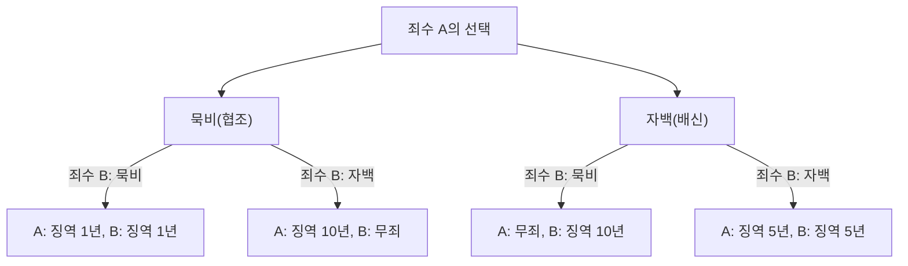
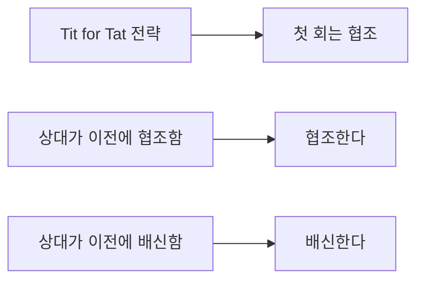

# 죄수의 딜레마(Prisoner's Dilemma): 게임 이론이 제시하는 궁극의 역설

"왜 우리는 서로 협력하면 잘 풀린다는 것을 알면서도 서로 배신하게 될까?"

이 근본적인 질문에 대해 수학과 논리학의 관점에서 가장 명확하고 잔혹한 해답을 제시하는 것이 게임 이론의 **"죄수의 딜레마(Prisoner's Dilemma)"**입니다. 1950년대 메릴 플러드(Merrill Flood)와 멜빈 드레셔(Melvin Dresher)가 고안하고, 앨버트 W. 터커(Albert W. Tucker)가 현재의 '죄수의 이야기'로 정식화한 이 개념은 경제학, 정치학, 심리학, 진화 생물학에 이르기까지 모든 분야에 막대한 영향을 미쳤습니다.

본 기사에서는 이 '죄수의 딜레마'에 대해 기초적인 메커니즘부터 내쉬 균형, 파레토 최적과 같은 전문적인 개념, 나아가 현실 세계의 구체적 사례와 '반복 게임'에서의 협력의 진화까지 매우 상세하게 파헤쳐 봅니다.

---

## 1. 죄수의 딜레마의 기본 시나리오

먼저 터커가 고안한 유명한 시나리오를 확인해 보겠습니다.

중대 범죄 혐의로 두 명의 공범(죄수 A와 죄수 B)이 체포되었습니다. 그러나 경찰은 결정적인 증거를 가지고 있지 않으며, 두 사람의 자백이 없으면 가벼운 범죄(예: 징역 1년)로만 기소할 수 있습니다.
그래서 경찰은 두 사람을 서로 다른 취조실에 격리하고, 각각에게 다음과 같은 사법 거래를 제안합니다.

1. **두 사람 모두 묵비권(협조)을 행사할 경우**: 증거 불충분으로 두 사람 모두 **징역 1년**.
2. **한 사람은 자백(배신)하고 다른 한 사람은 묵비권을 행사할 경우**: 자백한 자는 수사 협조에 대한 대가로 **무죄(석방)**가 되고, 묵비권을 행사한 자는 중범죄로 **징역 10년**에 처한다.
3. **두 사람 모두 자백(배신)할 경우**: 양측 모두 유죄가 되지만, 정상 참작으로 **징역 5년**.

죄수 A와 죄수 B는 서로 상의할 수 없습니다. 상대방이 어떤 선택을 할지 모르는 상황에서 각각 '묵비권(상대방과의 협조)' 또는 '자백(상대방에 대한 배신)'을 선택해야 합니다.

### 결정 메커니즘 도식화

아래의 순서도는 죄수 A의 시점에서 본 결과의 분기입니다.

---

## 2. 합리적인 판단이 부르는 비극: 내쉬 균형

죄수 A의 입장에서 자신의 이익(형량을 줄이는 것)을 극대화하기 위한 합리적인 사고 과정을 따라가 보겠습니다. 상대(죄수 B)가 어떤 선택을 하느냐에 따라 경우를 나눕니다.

- **케이스 1: 만약 죄수 B가 '묵비'를 선택한 경우**
  - 자신도 '묵비'하면 징역 1년.
  - 자신이 '자백'하면 무죄.
  - **결론**: 1년보다 무죄가 낫기 때문에 '자백'하는 것이 이득.

- **케이스 2: 만약 죄수 B가 '자백'을 선택한 경우**
  - 자신이 '묵비'하면 징역 10년.
  - 자신이 '자백'하면 징역 5년.
  - **결론**: 10년보다 5년이 낫기 때문에 '자백'하는 것이 이득.

놀랍게도 죄수 B가 어떤 행동을 하든 죄수 A에게는 항상 '자백(배신)'을 선택하는 것이 유리합니다. 이처럼 상대방의 전략에 관계없이 항상 자신에게 최적인 전략을 **"우월 전략(Dominant Strategy)"**이라고 부릅니다.
죄수 B 역시 완전히 똑같은 상황에 놓여 있으며, 똑같이 합리적으로 생각한다면 그에게도 '자백'이 우월 전략이 됩니다.

결과적으로 두 사람은 서로 '자백'을 선택하게 되고, **양측 모두 징역 5년**이라는 결과에 도달합니다. 이 상태를 게임 이론에서는 **"내쉬 균형(Nash Equilibrium)"**(어느 플레이어도 자신만 전략을 변경해서는 이익을 얻을 수 없는 상태)이라고 부릅니다.

### 파레토 최적과의 괴리

여기서 딜레마가 발생합니다. 그들이 도달한 '양측 징역 5년'이라는 결과는 전체적으로 볼 때 최선의 결과일까요?
아닙니다. 만약 두 사람이 서로를 믿고 함께 '묵비'를 지켰다면 '양측 징역 1년'으로 끝났을 것입니다.

전체의 이익(이 경우 형량 합계의 최소화)이 가장 높은 상태, 즉 '누군가의 불이익 없이는 더 이상 다른 누군가의 이익을 증가시킬 수 없는 상태'를 **"파레토 최적(Pareto Optimum)"**이라고 부릅니다. 죄수의 딜레마의 핵심은 **"개인의 합리적인 선택(내쉬 균형)이 전체의 최적 해(파레토 최적)와 일치하지 않는다"**는 점에 있습니다.

---

## 3. 현실 세계에서의 죄수의 딜레마

이 딜레마는 단순한 두뇌 체조가 아닙니다. 우리의 사회 구조나 경제 활동, 나아가 국가 간의 관계에서 일상적으로 발생하고 있습니다.

### 경제에서의 가격 경쟁
A사와 B사가 비슷한 상품을 판매하고 있다고 가정합시다. 양사가 높은 가격(협조)을 유지하면 양사 모두 높은 이익을 얻을 수 있습니다. 그러나 상대를 속이고 저가 판매(배신)를 하면 시장을 독점하여 막대한 이익을 얻을 수 있습니다. 결과적으로 양측이 저가 경쟁에 뛰어들어 이익을 깎아 먹는 '가격 경쟁(출혈 경쟁)'에 빠지게 됩니다.

### 환경 문제(공유지의 비극)
온실가스 감축 역시 국가 간의 죄수의 딜레마입니다. 모든 국가가 감축 노력(협조)을 하면 지구 온난화를 막을 수 있습니다. 그러나 다른 국가가 감축 노력을 하는 동안 자국만 환경 규제를 완화(배신)하면 자국만이 경제 성장을 누릴 수 있습니다. 결과적으로 각국이 얌체 짓을 노려 전체 환경이 악화됩니다.

### 군비 경쟁
냉전 시대 미국과 소련의 핵무기 개발 경쟁도 전형적인 예입니다. 양측이 군축(협조)을 하면 평화와 경제적 여유를 얻지만, 상대가 무장하고 있는데 자신이 군축을 하면 국가 존망의 위기(징역 10년에 해당)에 빠지기 때문에 양측 모두 군비 확장(배신)을 계속할 수밖에 없었습니다.

---

## 4. 반복 게임과 '팃포탯(Tit for Tat)' 전략

일회성 죄수의 딜레마에서는 '배신'이 합리적인 선택이었습니다. 그러나 현실 사회에서는 같은 상대와 여러 번 관계를 맺는 것이 일반적입니다. 이를 게임 이론에서는 **"반복 게임(Iterated Prisoner's Dilemma)"**이라고 부릅니다.

1980년대 정치학자 로버트 엑셀로드(Robert Axelrod)는 반복되는 죄수의 딜레마에서 어떤 전략이 가장 강한지 알아보기 위해 전 세계 전문가들로부터 컴퓨터 프로그램을 모집하여 토너먼트를 개최했습니다.

그 결과, 가장 단순하면서도 가장 높은 점수를 기록한 것은 아나톨 라포포트(Anatol Rapoport)가 제출한 **"팃포탯 전략(Tit for Tat)"**이었습니다.

### 팃포탯 전략의 알고리즘

이 전략의 규칙은 놀랍도록 단순합니다.
1. 첫 턴은 반드시 '협조'한다.
2. 두 번째 턴부터는 **직전 턴에서 상대가 취한 행동을 그대로 따라 한다**(상대가 협조하면 협조, 배신하면 배신).

왜 이 전략이 강했을까요? 엑셀로드는 강한 전략에 공통된 4가지 특징을 분석했습니다.
1. **신사적일 것(Nice)**: 먼저 절대 배신하지 않는다.
2. **보복적일 것(Retaliating)**: 상대가 배신하면 반드시 즉시 벌을 준다(배신으로 갚는다).
3. **관대할 것(Forgiving)**: 상대가 마음을 고쳐먹고 협조로 돌아오면, 과거의 배신은 잊고 즉시 협조로 돌아간다.
4. **명확할 것(Clear)**: 의도가 상대에게 전달되기 쉬워 상대가 안심하고 협조를 선택할 수 있다.

이 발견은 인간 사회의 '도덕'이나 '신뢰'가 단순한 감정론이 아니라 수학적·진화적 합리성에 뒷받침되고 있을 가능성을 시사합니다.

---

## 5. 진화 생물학에서의 협력의 발생

죄수의 딜레마와 '팃포탯 전략'의 성공은 진화 생물학(진화 게임 이론)에도 큰 충격을 주었습니다. 리처드 도킨스의 '이기적 유전자'로 대표되듯, 자연계는 약육강식이며 개별 생물은 자신의 생존과 번식을 우선(배신)해야 합니다. 그럼에도 불구하고 흡혈 박쥐의 피 나누기나 꿀벌의 사회성 등 자연계에는 '이타적 행동(협조)'이 넘쳐납니다.

진화 시뮬레이션에서 모두가 '배신'하는 사회에 소수의 '팃포탯' 집단이 투입되면, 팃포탯 집단은 서로 협력하여 높은 이익을 얻고 점차 배신 집단을 도태시키는 것이 증명되었습니다. 즉, 장기적인 생존 경쟁에서는 협력할 수 있는 집단이야말로 최종적인 승자가 되는 것입니다.

## 6. 요약: 딜레마를 어떻게 극복할 것인가

죄수의 딜레마는 우리가 자기 이익을 너무 추구하면 결과적으로 모두가 손해를 본다는 엄격한 현실을 가르쳐 줍니다. 그러나 동시에 반복 게임의 연구가 보여주듯이 지속적인 관계와 적절한 피드백 시스템이 있다면 우리는 협력 관계를 구축할 수 있습니다.

현실 사회에서 죄수의 딜레마를 해결하기 위해서는 다음과 같은 접근이 필요합니다.
- **규칙 변경(법의 지배)**: 배신에 대한 페널티를 제도화하여 배신의 이점을 없앤다. (예: 독점 금지법이나 환경세)
- **커뮤니케이션 확보**: 서로의 의도를 확인하고 신뢰 관계를 구축할 기회를 마련한다.
- **장기적인 관계 중시**: "이번에 배신하면 다음부터는 거래가 없다"는 미래의 결과를 의식하게 한다.

게임 이론은 냉혹한 계산의 세계처럼 보이지만, 그 심연을 들여다보면 "왜 사람은 서로 협력해야 하는가"라는 매우 인간적이고 따뜻한 진리에 도달하게 됩니다.
