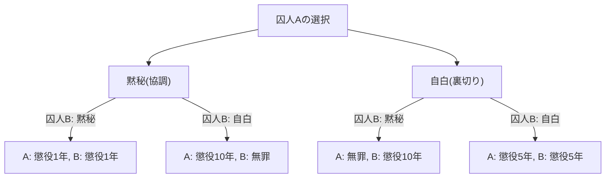
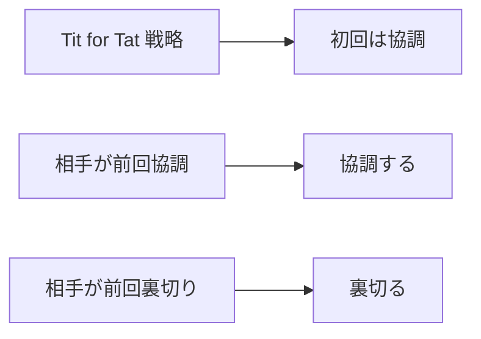

# 囚人のジレンマ（Prisoner's Dilemma）：ゲーム理論が突きつける究極のパラドックス

「なぜ私たちは、互いに協力すればうまくいくと分かっているのに、裏切り合ってしまうのか？」

この根源的な問いに対して、数学と論理学の観点から最も明確で、かつ残酷な答えを提示するのが、ゲーム理論における**「[囚人のジレンマ](/p/prisoners-dilemma/)（Prisoner's Dilemma）」**です。1950年代にメリル・フラッドとメルビン・ドレシャーによって考案され、アルバート・W・タッカーによって現在の「囚人の物語」として定式化されたこの概念は、経済学、政治学、心理学、進化生物学に至るまで、あらゆる分野に多大な影響を与えてきました。

本記事では、この「[囚人のジレンマ](/p/prisoners-dilemma/)」について、基礎的なメカニズムから、ナッシュ均衡、パレート最適といった専門的な概念、さらには現実社会での具体例や「繰り返しゲーム」における協力の進化まで、非常に詳細に深掘りしていきます。

---

## 1. 囚人のジレンマの基本的シナリオ

まずは、タッカーが考案した有名なシナリオを確認しましょう。

ある重犯罪の容疑で、2人の共犯者（囚人Aと囚人B）が逮捕されました。しかし、警察は決定的な証拠を持っておらず、2人の自白がなければ軽い罪（例えば微罪の懲役1年）でしか起訴できません。
そこで警察は、2人を別々の取調室に隔離し、それぞれに次のような司法取引を持ちかけます。

1. **2人とも黙秘（協調）した場合**：証拠不十分で、2人とも**懲役1年**。
2. **片方が自白（裏切り）し、もう一方が黙秘した場合**：自白した者は捜査協力の対価として**無罪（釈放）**となり、黙秘した者は重罪を被り**懲役10年**となる。
3. **2人とも自白（裏切り）した場合**：両者ともに有罪となるが、情状酌量により**懲役5年**。

囚人Aと囚人Bは、互いに相談することはできません。相手がどのような選択をするか分からない状況で、それぞれ「黙秘（相手との協調）」か「自白（相手への裏切り）」かを選ばなければなりません。

### 決定のメカニズムを図解で見る

以下のフローチャートは、囚人Aの視点から見た結果の分岐です。

---

## 2. 合理的な判断が招く悲劇：ナッシュ均衡

囚人Aの立場で、自らの利益（刑期を短くすること）を最大化するための合理的な思考プロセスをたどってみましょう。相手（囚人B）がどちらの選択をするかによって、場合分けをします。

- **ケース1：もし囚人Bが「黙秘」を選んだ場合**
  - 自分も「黙秘」すれば、懲役1年。
  - 自分が「自白」すれば、無罪。
  - **結論**：1年より無罪の方が良いので、「自白」した方が得。

- **ケース2：もし囚人Bが「自白」を選んだ場合**
  - 自分が「黙秘」すれば、懲役10年。
  - 自分が「自白」すれば、懲役5年。
  - **結論**：10年より5年の方が良いので、「自白」した方が得。

驚くべきことに、囚人Bが何をしようとも、囚人Aにとっては常に「自白（裏切り）」を選択する方が有利になるのです。このような、相手の戦略にかかわらず常に自分にとって最適な戦略を<strong>「支配戦略」</strong>と呼びます。
囚人Bも全く同じ状況に置かれており、同じく合理的に思考するならば、彼にとっても「自白」が支配戦略となります。

その結果、2人は互いに「自白」を選択し、**両者ともに懲役5年**という結果に落ち着きます。この状態をゲーム理論では<strong>「ナッシュ均衡」</strong>（どのプレイヤーも、自分だけが戦略を変更しても利益を得られない状態）と呼びます。

### パレート最適との乖離

ここでジレンマが生じます。彼らが到達した「両者懲役5年」という結果は、全体として見た最善の結果でしょうか？
否です。もし2人が互いを信頼し、ともに「黙秘」を貫いていれば、「両者懲役1年」で済んだはずです。

全体の利益（この場合は刑期の合計の少なさ）が最も高くなる状態、つまり「誰かの不利益なしには、これ以上誰かの利益を増やせない状態」を**「パレート最適」**と呼びます。[囚人のジレンマ](/p/prisoners-dilemma/)の核心は、**「個人の合理的な選択（ナッシュ均衡）が、全体の最適解（パレート最適）と一致しない」**という点にあります。

---

## 3. 現実世界における囚人のジレンマ

このジレンマは、単なる頭の体操ではありません。私たちの社会構造や経済活動、さらには国家間の関係において、日常的に発生しています。

### 経済における価格競争
A社とB社が似たような商品を販売しているとします。両社が高値（協調）を維持すれば、両社とも高い利益を得られます。しかし、相手を出し抜いて安売り（裏切り）をすれば、市場を独占して莫大な利益を得られます。結果として、双方が安売り競争に走り、利益を削り合う「価格競争（値下げ合戦）」に陥ります。

### 環境問題（コモンズの悲劇）
温室効果ガスの削減も、国家間の囚人のジレンマです。全国家が削減努力（協調）を行えば、地球温暖化を防ぐことができます。しかし、他国が削減努力をしている間に自国だけが環境規制を緩めれば（裏切り）、自国だけが経済成長を享受できます。結果として各国が抜け駆けを狙い、全体の環境が悪化します。

### 軍拡競争
冷戦時代のアメリカとソ連の核兵器開発競争も典型的な例です。双方が軍縮（協調）すれば平和と経済的余裕が得られますが、相手が武装しているのに自分が軍縮すると国家存亡の危機（懲役10年に相当）に陥るため、双方が軍拡（裏切り）を続けざるを得ませんでした。

---

## 4. 繰り返しゲームと「しっぺ返し（Tit for Tat）」戦略

1回限りの[囚人のジレンマ](/p/prisoners-dilemma/)では、「裏切り」が合理的な選択でした。しかし、現実の社会では、同じ相手と何度も関係を持つことが一般的です。これをゲーム理論では**「繰り返しゲーム（Iterated Prisoner's Dilemma）」**と呼びます。

1980年代、政治学者のロバート・アクセルロッドは、繰り返しの[囚人のジレンマ](/p/prisoners-dilemma/)でどのような戦略が最も強いかを調べるため、世界中の専門家からコンピュータープログラムを募集し、トーナメントを行いました。

その結果、最も単純で、かつ最も高いスコアを叩き出したのが、アナトール・ラパポートが提出した<strong>「しっぺ返し戦略（Tit for Tat）」</strong>でした。

### しっぺ返し戦略のアルゴリズム

この戦略のルールは驚くほどシンプルです。
1. 最初のターンは必ず「協調」する。
2. 2回目以降は、**直前のターンで相手がとった行動をそのまま真似する**（相手が協調なら協調、裏切りなら裏切り）。

なぜこの戦略が強かったのでしょうか。アクセルロッドは、強い戦略に共通する4つの特徴を分析しました。
1. **紳士的であること（Nice）**：自分から先には絶対に裏切らない。
2. **報復的であること（Retaliating）**：相手が裏切ったら、必ずすぐに罰を与える（裏切り返す）。
3. **寛容であること（Forgiving）**：相手が改心して協調に戻れば、過去の裏切りは忘れてすぐに協調に戻る。
4. **明快であること（Clear）**：意図が相手に伝わりやすく、相手が安心して協調を選べる。

この発見は、人間社会における「道徳」や「信頼」が、単なる感情論ではなく、数学的・進化的な合理性に裏打ちされている可能性を示唆しています。

---

## 5. 進化生物学における協調の発生

[囚人のジレンマ](/p/prisoners-dilemma/)と「しっぺ返し戦略」の成功は、進化生物学（進化ゲーム理論）にも大きな衝撃を与えました。リチャード・ドーキンスの「利己的な遺伝子」に代表されるように、自然界は弱肉強食であり、個々の生物は自らの生存と繁殖を優先（裏切り）するはずです。それにもかかわらず、吸血コウモリの血の分け合いや、ミツバチの社会性など、自然界には「利他行動（協調）」が溢れています。

進化のシミュレーションにおいて、全員が「裏切り」の社会に少数の「しっぺ返し」集団が投入されると、しっぺ返し集団は互いに協調して高い利益を上げ、徐々に裏切り集団を淘汰していくことが証明されています。つまり、長期的な生存競争においては、協力し合うことができる集団こそが最終的な勝者となるのです。

## 6. まとめ：ジレンマをどう乗り越えるか

[囚人のジレンマ](/p/prisoners-dilemma/)は、私たちが自己利益を追求しすぎると、結果として全員が損をするという厳しい現実を教えてくれます。しかし同時に、繰り返しゲームの研究が示すように、持続的な関係性と適切なフィードバックの仕組みがあれば、私たちは協力関係を築くことができます。

現実社会で[囚人のジレンマ](/p/prisoners-dilemma/)を解決するためには、以下のようなアプローチが必要です。
- **ルールの変更（法の支配）**：裏切りに対するペナルティを制度化し、裏切りのメリットをなくす。（例：独占禁止法や環境税）
- **コミュニケーションの確保**：互いの意図を確認し、信頼関係を構築する機会を設ける。
- **長期的な関係の重視**：「今回裏切れば、次回以降の取引がなくなる」という未来の影を意識させる。

ゲーム理論は冷酷な計算の世界のように見えますが、その深淵を覗き込むと、「なぜ人は協力し合うべきなのか」という、非常に人間的で温かい真理に行き着くのです。
