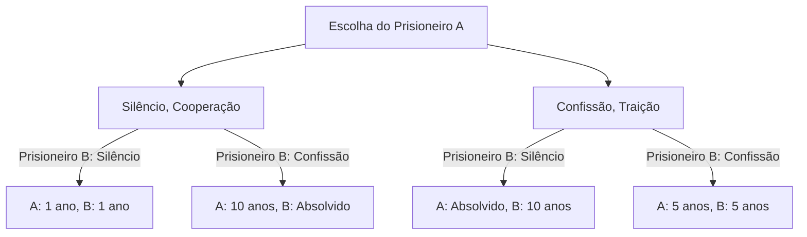
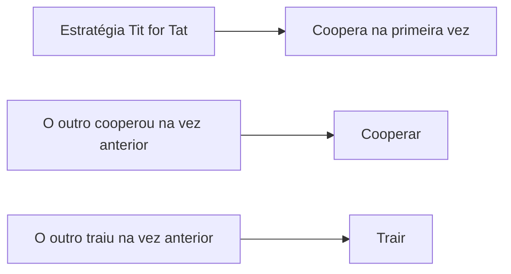

# O Dilema do Prisioneiro (Prisoner's Dilemma): O paradoxo supremo da teoria dos jogos

"Por que nos traímos, mesmo sabendo que nos sairíamos melhor se cooperássemos?"

Para esta questão fundamental, a resposta mais clara e cruel, sob a perspectiva da matemática e da lógica, é o **"Dilema do Prisioneiro" (Prisoner's Dilemma)** na teoria dos jogos. Concebido na década de 1950 por Merrill Flood e Melvin Dresher, e formalizado por Albert W. Tucker na atual "história dos prisioneiros", esse conceito teve uma influência profunda em áreas que vão da economia e ciência política à psicologia e biologia evolutiva.

Neste artigo, aprofundaremos esse "dilema do prisioneiro", desde seus mecanismos básicos até conceitos especializados como o Equilíbrio de Nash e o Ótimo de Pareto, bem como exemplos do mundo real e a evolução da cooperação em "jogos repetidos".

---

## 1. O cenário básico do dilema do prisioneiro

Primeiro, vejamos o famoso cenário concebido por Tucker.

Dois cúmplices (Prisioneiro A e Prisioneiro B) são presos por suspeita de um crime grave. No entanto, a polícia não tem provas conclusivas e, sem as suas confissões, só pode acusá-los de um crime menor (por exemplo, 1 ano de prisão).
Então a polícia isola os dois em salas de interrogatório separadas e oferece a cada um o seguinte acordo:

1. **Se ambos permanecerem em silêncio (cooperação)**: Por falta de provas, ambos cumprem **1 ano de prisão**.
2. **Se um confessar (traição) e o outro permanecer em silêncio**: Quem confessa é **absolvido (libertado)** como recompensa pela colaboração com a investigação, enquanto aquele que permanece em silêncio sofre toda a pena e recebe **10 anos de prisão**.
3. **Se ambos confessarem (traição)**: Ambos são considerados culpados, mas com circunstâncias atenuantes, cumprindo **5 anos de prisão**.

O Prisioneiro A e o Prisioneiro B não podem consultar um ao outro. Sem saber qual escolha o outro fará, cada um deve decidir se "permanece em silêncio (coopera com o outro)" ou "confessa (trai o outro)".

### Compreendendo o mecanismo de decisão com um diagrama

O fluxograma abaixo mostra as possíveis ramificações de resultados sob a perspectiva do Prisioneiro A.

---

## 2. A tragédia da escolha racional: O Equilíbrio de Nash

Vamos traçar o processo de pensamento racional para maximizar os próprios interesses (minimizar a pena de prisão) a partir da perspectiva do Prisioneiro A. Dividiremos em casos dependendo da escolha do outro (Prisioneiro B).

- **Caso 1: Se o Prisioneiro B escolher "Silêncio"**
  - Se eu também escolher "Silêncio", é 1 ano de prisão.
  - Se eu "Confessar", sou absolvido.
  - **Conclusão**: A absolvição é melhor que 1 ano, então é mais vantajoso "Confessar".

- **Caso 2: Se o Prisioneiro B escolher "Confissão"**
  - Se eu escolher "Silêncio", são 10 anos de prisão.
  - Se eu "Confessar", são 5 anos de prisão.
  - **Conclusão**: 5 anos é melhor que 10, então é mais vantajoso "Confessar".

Surpreendentemente, não importa o que o Prisioneiro B faça, é sempre mais vantajoso para o Prisioneiro A escolher "Confessar (trair)". Essa estratégia, que é sempre a melhor para você, independentemente da estratégia do outro, é chamada de **"estratégia dominante"**.
O Prisioneiro B está exatamente na mesma situação. Se ele pensar de forma igualmente racional, "Confessar" também será sua estratégia dominante.

Como resultado, os dois escolhem "Confessar" e o resultado se estabelece em **5 anos de prisão para ambos**. Na teoria dos jogos, esse estado é chamado de **"Equilíbrio de Nash"** (um estado em que nenhum jogador pode lucrar alterando unilateralmente sua estratégia).

### Divergência com o Ótimo de Pareto

Aqui surge o dilema. O resultado de "5 anos de prisão para ambos" é o melhor resultado geral?
Não. Se os dois confiassem um no outro e mantivessem o "Silêncio", teriam se safado com "1 ano de prisão para ambos".

O estado em que o benefício total (neste caso, a soma mínima das penas de prisão) é mais alto, ou seja, "um estado em que os benefícios de ninguém podem ser aumentados sem penalizar outra pessoa", é chamado de **"Ótimo de Pareto"**. O cerne do dilema do prisioneiro reside no fato de que **"a escolha racional individual (Equilíbrio de Nash) não coincide com a solução ideal geral (Ótimo de Pareto)"**.

---

## 3. O dilema do prisioneiro no mundo real

Esse dilema não é apenas um mero exercício mental. Ocorre diariamente em nossas estruturas sociais, atividades econômicas e até mesmo nas relações internacionais.

### Concorrência de preços na economia
Suponha que as empresas A e B vendam produtos semelhantes. Se ambas mantiverem preços altos (cooperação), ambas terão lucros elevados. No entanto, se uma for mais esperta que a outra e vender barato (traição), ela monopolizará o mercado e obterá enormes lucros. Como resultado, ambas entram em uma corrida para baratear, caindo em uma "concorrência de preços (guerra de preços)" onde reduzem os lucros uma da outra.

### Problemas ambientais (A tragédia dos comuns)
A redução dos gases de efeito estufa também é um dilema do prisioneiro entre as nações. Se todos os países fizerem esforços de redução (cooperação), podemos evitar o aquecimento global. No entanto, se um país relaxar suas regulamentações ambientais (traição) enquanto os outros fazem esforços de redução, somente ele desfrutará do crescimento econômico. Como resultado, todos os países tentam tirar vantagem e o meio ambiente global se deteriora.

### Corrida armamentista
A corrida pelo desenvolvimento de armas nucleares entre os EUA e a União Soviética durante a Guerra Fria é um exemplo clássico. Se ambos os lados se desarmarem (cooperação), alcançarão a paz e o espaço econômico. Mas se você se desarmar enquanto o oponente está armado, entrará em uma crise de sobrevivência nacional (equivalente a 10 anos de prisão), de modo que ambos foram forçados a continuar a corrida armamentista (traição).

---

## 4. Jogos repetidos e a estratégia de Retaliação (Tit for Tat)

No dilema do prisioneiro de uma única vez, a "traição" foi a escolha racional. No entanto, no mundo real, é comum ter relacionamentos repetidos com a mesma pessoa. Na teoria dos jogos, isso é chamado de **"jogo repetido" (Iterated Prisoner's Dilemma)**.

Na década de 1980, o cientista político Robert Axelrod organizou um torneio solicitando programas de computador de especialistas de todo o mundo para ver qual estratégia era a mais forte no dilema do prisioneiro repetido.

Como resultado, a estratégia mais simples, que obteve a pontuação mais alta, foi a estratégia de **"Retaliação" (Tit for Tat)** enviada por Anatol Rapoport.

### Algoritmo da estratégia Tit for Tat

As regras dessa estratégia são surpreendentemente simples:
1. No primeiro turno, sempre "coopere".
2. A partir do segundo turno, **imite exatamente a ação tomada pelo oponente no turno anterior** (se o outro cooperou, coopere; se traiu, traia).

Por que essa estratégia foi tão forte? Axelrod analisou quatro características comuns a estratégias fortes:
1. **Gentileza (Nice)**: Nunca trair primeiro.
2. **Retaliação (Retaliating)**: Se o oponente trair, puna-o imediatamente (traia de volta).
3. **Perdão (Forgiving)**: Se o oponente mudar de atitude e voltar a cooperar, esqueça as traições passadas e volte a cooperar imediatamente.
4. **Clareza (Clear)**: As intenções são fáceis de serem compreendidas pelo oponente, permitindo que ele escolha a cooperação com confiança.

Essa descoberta sugere que a "moralidade" e a "confiança" na sociedade humana podem não ser meras teorias emocionais, mas sim apoiadas em uma racionalidade matemática e evolutiva.

---

## 5. O surgimento da cooperação na biologia evolutiva

[O dilema do prisioneiro](/pt/p/prisoners-dilemma/) e o sucesso da estratégia de "retaliação" também tiveram um impacto profundo na biologia evolutiva (teoria dos jogos evolutiva). Conforme representado em "O Gene Egoísta", de Richard Dawkins, o mundo natural é baseado na lei do mais forte, e cada organismo deve priorizar sua própria sobrevivência e reprodução (traição). Mesmo assim, o mundo natural está repleto de "comportamento altruísta (cooperação)", como o compartilhamento de sangue entre os morcegos-vampiros e a sociabilidade das abelhas.

Em simulações evolutivas, foi provado que quando um pequeno grupo de "retaliadores" é introduzido em uma sociedade onde todos "traem", o grupo retaliador coopera entre si para obter grandes benefícios e gradualmente elimina o grupo traidor. Em outras palavras, na luta de longo prazo pela sobrevivência, o grupo que pode cooperar é o vencedor final.

## 6. Conclusão: Como superar o dilema

[O dilema do prisioneiro](/pt/p/prisoners-dilemma/) nos ensina a dura realidade de que se buscarmos excessivamente nossos próprios interesses, todos acabarão perdendo. Mas, ao mesmo tempo, como as pesquisas em jogos repetidos demonstram, se houver um relacionamento sustentável e mecanismos apropriados de feedback, podemos construir relacionamentos cooperativos.

Para resolver [o dilema do prisioneiro](/pt/p/prisoners-dilemma/) no mundo real, são necessárias abordagens como:
- **Mudança de regras (Estado de direito)**: Institucionalizar as penalidades pela traição e eliminar os benefícios da traição. (Ex: leis antitruste ou impostos ambientais)
- **Garantir a comunicação**: Oferecer oportunidades para confirmar as intenções uns dos outros e construir relacionamentos de confiança.
- **Foco nas relações de longo prazo**: Torná-los cientes da sombra do futuro: "Se você trair desta vez, não haverá transações futuras".

A teoria dos jogos pode parecer um mundo de cálculos frios, mas quando você olha para o seu abismo, chega a uma verdade muito humana e calorosa sobre "por que as pessoas devem cooperar".
