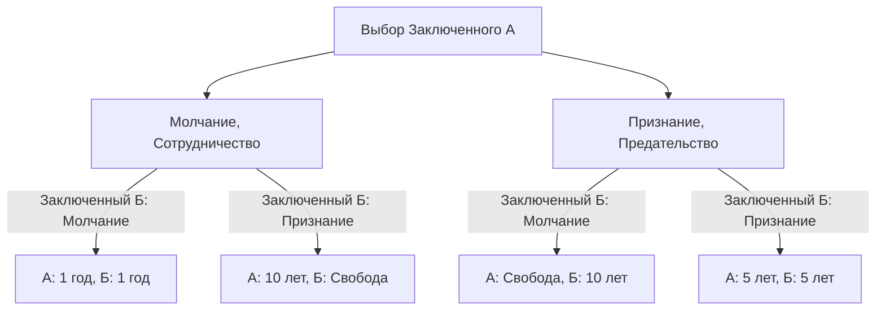
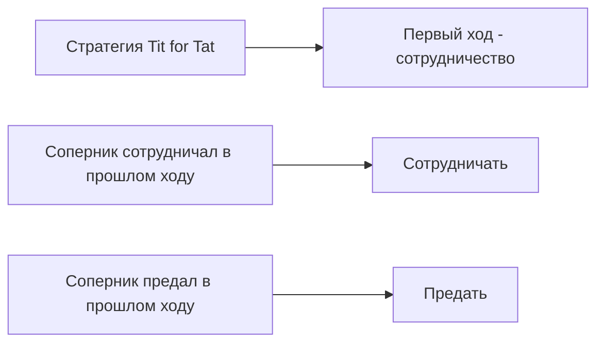

# Дилемма заключенного (Prisoner's Dilemma): Главный парадокс теории игр

«Почему мы предаем друг друга, даже зная, что все было бы лучше, если бы мы сотрудничали?»

На этот фундаментальный вопрос самый ясный и в то же время самый жестокий ответ с точки зрения математики и логики дает **«Дилемма заключенного» (Prisoner's Dilemma)** в теории игр. Эта концепция, разработанная в 1950-х годах Мерриллом Фладом и Мелвином Дрешером и формализованная Альбертом В. Такером как «история заключенных», оказала огромное влияние на многие области: от экономики и политологии до психологии и эволюционной биологии.

В этой статье мы подробно рассмотрим эту «дилемму заключенного»: от базовых механизмов до таких специализированных концепций, как равновесие Нэша и оптимум Парето, а также реальных примеров и эволюции сотрудничества в «повторяющихся играх».

---

## 1. Базовый сценарий дилеммы заключенного

Сначала давайте рассмотрим знаменитый сценарий, придуманный Такером.

Двое соучастников (Заключенный А и Заключенный Б) арестованы по подозрению в тяжком преступлении. Однако у полиции нет решающих доказательств, и без их признаний обоим грозит лишь небольшой срок (например, 1 год тюрьмы за мелкое правонарушение).
Тогда полиция изолирует их в разных комнатах для допросов и предлагает каждому следующую сделку:

1. **Если оба молчат (сотрудничество)**: Из-за недостатка улик оба получают **по 1 году тюрьмы**.
2. **Если один признается (предательство), а другой молчит**: Тот, кто признался, получает **свободу (оправдание)** за помощь следствию, а тот, кто молчал, несет всю тяжесть вины и получает **10 лет тюрьмы**.
3. **Если оба признаются (предательство)**: Оба признаются виновными, но со смягчающими обстоятельствами, и получают **по 5 лет тюрьмы**.

Заключенный А и Заключенный Б не могут совещаться. Не зная, какой выбор сделает другой, каждый должен решить: «молчать (сотрудничать с партнером)» или «признаться (предать партнера)».

### Схема механизма принятия решений

На следующей блок-схеме показаны возможные исходы с точки зрения Заключенного А.

---

## 2. Трагедия рационального выбора: Равновесие Нэша

Давайте проследим процесс рационального мышления Заключенного А, направленный на максимизацию собственной выгоды (минимизацию срока). Мы разберем варианты в зависимости от выбора другого (Заключенного Б).

- **Вариант 1: Если Заключенный Б выбирает «Молчание»**
  - Если я тоже выберу «Молчание» — 1 год тюрьмы.
  - Если я «Признаюсь» — свобода.
  - **Вывод**: Свобода лучше, чем 1 год, поэтому выгоднее «Признаться».

- **Вариант 2: Если Заключенный Б выбирает «Признание»**
  - Если я выберу «Молчание» — 10 лет тюрьмы.
  - Если я «Признаюсь» — 5 лет тюрьмы.
  - **Вывод**: 5 лет лучше, чем 10, поэтому выгоднее «Признаться».

Поразительно, но что бы ни сделал Заключенный Б, для Заключенного А всегда выгоднее выбрать «Признание (предательство)». Такая стратегия, которая всегда является лучшей для вас независимо от действий другого, называется **«доминирующей стратегией»**.
Заключенный Б находится в точно такой же ситуации. Если он рассуждает так же рационально, для него «Признание» тоже будет доминирующей стратегией.

В результате оба выбирают «Признание», что приводит к итогу: **оба получают по 5 лет тюрьмы**. В теории игр это состояние называется **«Равновесием Нэша»** (ситуация, когда ни один игрок не может увеличить свою выгоду, изменив стратегию в одностороннем порядке).

### Отклонение от оптимума Парето

Здесь и возникает дилемма. Является ли результат «по 5 лет каждому» лучшим в целом?
Нет. Если бы они доверяли друг другу и оба упорно хранили «Молчание», они отделались бы «1 годом каждому».

Состояние, при котором общая выгода (в данном случае наименьшая сумма сроков заключения) максимальна, то есть «состояние, в котором невозможно улучшить чье-либо положение, не ухудшив положение кого-то другого», называется **«оптимумом Парето»**. Суть дилеммы заключенного заключается в том, что **«индивидуальный рациональный выбор (равновесие Нэша) не совпадает с глобальным оптимальным решением (оптимумом Парето)»**.

---

## 3. Дилемма заключенного в реальном мире

Эта дилемма — не просто разминка для ума. Она ежедневно встречается в наших социальных структурах, экономической деятельности и даже в международных отношениях.

### Ценовая конкуренция в экономике
Предположим, компании А и Б продают похожие товары. Если обе поддерживают высокие цены (сотрудничество), обе получают высокую прибыль. Однако, если одна из них обманет другую и снизит цены (предательство), она монополизирует рынок и получит огромную прибыль. В результате обе стороны вступают в ценовую войну, сокращая прибыль друг друга.

### Экологические проблемы (Трагедия общин)
Сокращение выбросов парниковых газов также является дилеммой заключенного между странами. Если все страны будут прилагать усилия по сокращению (сотрудничество), мы сможем предотвратить глобальное потепление. Однако если одна страна ослабит свои экологические нормы, пока другие прилагают усилия (предательство), она сможет наслаждаться экономическим ростом. В результате каждая страна пытается схитрить, что ухудшает общую экологическую ситуацию.

### Гонка вооружений
Гонка ядерных вооружений между США и СССР во время холодной войны является типичным примером. Если обе стороны разоружатся (сотрудничество), они обретут мир и экономические ресурсы. Но если вы разоружаетесь, пока противник вооружен, возникает угроза выживанию нации (эквивалент 10 годам тюрьмы). Поэтому обе стороны были вынуждены продолжать гонку вооружений (предательство).

---

## 4. Повторяющиеся игры и стратегия «Око за око» (Tit for Tat)

В одноразовой дилемме заключенного «предательство» было рациональным выбором. Однако в реальном обществе обычным делом являются многократные отношения с одним и тем же партнером. В теории игр это называется **«повторяющейся игрой» (Iterated Prisoner's Dilemma)**.

В 1980-х годах политолог Роберт Аксельрод провел турнир, попросив компьютерные программы у экспертов со всего мира, чтобы выяснить, какая стратегия является самой сильной в повторяющейся дилемме заключенного.

В результате самой простой и набравшей наибольшее количество баллов оказалась стратегия **«Око за око» (Tit for Tat)**, предложенная Анатолем Рапопортом.

### Алгоритм стратегии «Око за око»

Правила этой стратегии удивительно просты:
1. На первом ходу всегда «Сотрудничать».
2. Начиная со второго хода, **в точности копировать действие соперника на предыдущем ходу** (если он сотрудничал — сотрудничать, если предал — предать).

Почему эта стратегия оказалась такой сильной? Аксельрод проанализировал четыре характеристики, общие для сильных стратегий:
1. **Доброжелательность (Nice)**: Никогда не предавать первым.
2. **Мстительность (Retaliating)**: Если соперник предал, обязательно наказать его (предать в ответ).
3. **Прощение (Forgiving)**: Если соперник исправился и снова начал сотрудничать, забыть о прошлых предательствах и вернуться к сотрудничеству.
4. **Ясность (Clear)**: Намерения легко понятны сопернику, что позволяет ему уверенно выбирать сотрудничество.

Это открытие позволяет предположить, что «мораль» и «доверие» в человеческом обществе могут быть не просто эмоциями, а подкрепляться математической и эволюционной рациональностью.

---

## 5. Возникновение сотрудничества в эволюционной биологии

Дилемма заключенного и успех стратегии «око за око» оказали огромное влияние и на эволюционную биологию (эволюционную теорию игр). Как описано в «Эгоистичном гене» Ричарда Докинза, в природе правит закон джунглей, и каждое живое существо должно ставить в приоритет собственное выживание и размножение (предательство). Тем не менее, в природе полно проявлений альтруизма (сотрудничества), таких как дележ крови у летучих мышей-вампиров или социальность пчел.

В эволюционных симуляциях было доказано, что если в общество, где все «предают», внедрить небольшую группу «око за око», они будут сотрудничать между собой, получая высокую выгоду, и постепенно вытеснят группу предателей. Иными словами, в долгосрочной борьбе за выживание именно группы, способные к сотрудничеству, становятся окончательными победителями.

## 6. Заключение: Как преодолеть дилемму

Дилемма заключенного учит нас суровой реальности: если мы слишком гонимся за собственной выгодой, в итоге проигрывают все. Но в то же время, как показывают исследования повторяющихся игр, мы можем строить отношения сотрудничества при наличии устойчивых связей и правильных механизмов обратной связи.

Для разрешения дилеммы заключенного в реальном мире необходимы следующие подходы:
- **Изменение правил (верховенство права)**: Институционализация наказаний за предательство для устранения выгод от предательства (например, антимонопольные законы или экологические налоги).
- **Обеспечение коммуникации**: Создание возможностей для подтверждения намерений друг друга и построения доверия.
- **Акцент на долгосрочные отношения**: Осознание тени будущего: «Если я предам в этот раз, будущих сделок не будет».

Теория игр может казаться миром холодных расчетов, но заглянув в ее бездны, мы приходим к очень человечной и теплой истине о том, «почему люди должны сотрудничать».
