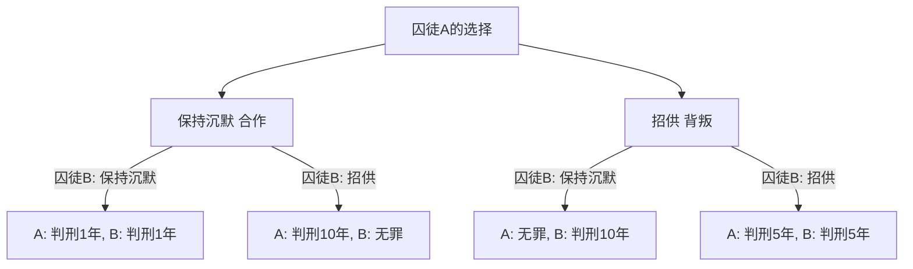
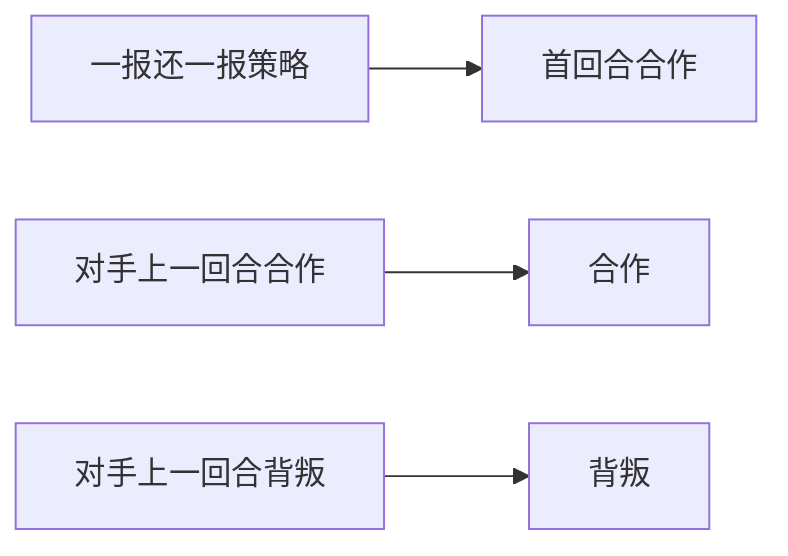

# 囚徒困境（Prisoner's Dilemma）：博弈论提出的终极悖论

“为什么我们明知道相互合作会得到更好的结果，却还是要互相背叛呢？”

对于这个根本性的问题，博弈论中的**“囚徒困境（Prisoner's Dilemma）”**从数学和逻辑学的角度给出了最清晰且最残酷的答案。这一概念由梅里尔·弗拉德和梅尔文·德雷希尔在20世纪50年代提出，并由阿尔伯特·W·塔克将其系统化为如今的“囚徒故事”，对经济学、政治学、心理学乃至演化生物学等各个领域都产生了深远的影响。

本文将深入探讨“囚徒困境”，从其基础机制到纳什均衡、帕累托最优等专业概念，再到现实社会中的具体案例以及“重复博弈”中合作的演化，进行极其详尽的解析。

---

## 1. 囚徒困境的基本情境

首先，让我们回顾一下塔克构思的著名情境。

两名共犯（囚徒A和囚徒B）因涉嫌一项重罪被捕。然而，警方没有决定性的证据，如果没有两人的招供，只能以轻罪（例如轻微罪名判刑1年）起诉他们。
于是警方将两人分别隔离在不同的审讯室，并向他们各自提出了以下辩诉交易。

1. **两人都保持沉默 合作**：因证据不足，两人各**判刑1年**。
2. **一方招供 背叛，另一方保持沉默**：招供者作为配合调查的交换将**无罪释放**，而保持沉默者将承担重罪，**判刑10年**。
3. **两人都招供 背叛**：两人均被判有罪，但因酌情减轻处罚，各**判刑5年**。

囚徒A和囚徒B无法相互商量。在不知道对方会做出何种选择的情况下，他们必须各自决定是“保持沉默 与对方合作”还是“招供 背叛对方”。

### 图解决策机制

以下流程图展示了从囚徒A视角的决策分支。

---

## 2. 理性判断招致的悲剧：纳什均衡

让我们站在囚徒A的立场上，遵循将其自身利益最大化（缩短刑期）的理性思考过程。根据对方（囚徒B）的选择，我们进行分类讨论。

- **情况1：如果囚徒B选择“保持沉默”**
  - 如果自己也“保持沉默”，判刑1年。
  - 如果自己“招供”，无罪释放。
  - **结论**：无罪比1年好，所以“招供”更划算。

- **情况2：如果囚徒B选择“招供”**
  - 如果自己“保持沉默”，判刑10年。
  - 如果自己“招供”，判刑5年。
  - **结论**：5年比10年好，所以“招供”更划算。

令人惊讶的是，无论囚徒B怎么做，对囚徒A来说，选择“招供 背叛”总是有利的。这种无论对手采取何种策略，对自己而言始终是最优的策略，被称为**“占优策略”**。
囚徒B也处于完全相同的境地，如果他同样理性思考，对他来说“招供”也是占优策略。

结果，两人都选择了“招供”，最终陷入了**两人各判刑5年**的结局。在博弈论中，这种状态被称为**“纳什均衡”**（即任何玩家单方面改变策略都无法获得更好利益的状态）。

### 与帕累托最优的背离

困境就产生于此。他们达成的“两人各判刑5年”的结果，从整体来看是最佳结果吗？
并非如此。如果两人相互信任，都坚持“保持沉默”，本来只需“两人各判刑1年”即可了事。

整体利益（在本例中为刑期总和最短）达到最高的状态，即“在不减少任何人利益的前提下，无法再增加任何人利益的状态”，被称为**“帕累托最优”**。囚徒困境的核心在于，**“个人的理性选择（纳什均衡）与整体的最优解（帕累托最优）并不一致”**。

---

## 3. 现实世界中的囚徒困境

这种困境绝非仅仅是思维体操。在我们的社会结构、经济活动，乃至国家间关系中，它都在日常发生着。

### 经济中的价格竞争
假设A公司和B公司销售相似的商品。如果两家都维持高价 合作，双方都能获得高额利润。然而，如果一方为了占便宜而降价 背叛，就能垄断市场获取巨额利润。结果，双方都争相降价，陷入了削减利润的“价格战”。

### 环境问题 公地悲剧
减少温室气体排放也是国家间的囚徒困境。如果所有国家都努力减排 合作，就可以防止全球变暖。然而，如果在其他国家努力减排时，唯独本国放宽环境法规 背叛，本国就能独享经济增长。结果各国都想走捷径，导致整体环境恶化。

### 军备竞赛
冷战时期美苏之间的核武器研发竞赛也是典型案例。如果双方都裁军 合作，就能获得和平与经济上的宽裕，但如果对方武装而自己裁军，国家就会面临存亡危机相当于判刑10年，因此双方只能不断扩军 背叛。

---

## 4. 重复博弈与“一报还一报（Tit for Tat）”策略

在一次性的囚徒困境中，“背叛”是理性的选择。然而，在现实社会中，我们通常会与同一对象进行多次交往。这在博弈论中被称为**“重复博弈（Iterated Prisoner's Dilemma）”**。

20世纪80年代，政治学家罗伯特·阿克塞尔罗德为了调查在重复的囚徒困境中哪种策略最强，向全世界的专家征集计算机程序并进行了锦标赛。

结果，最简单且获得最高分的是由阿纳托尔·拉波波特提交的**“一报还一报策略（Tit for Tat）”**。

### 一报还一报策略的算法

这个策略的规则出奇地简单。
1. 第一回合必定“合作”。
2. 从第二回合开始，**完全模仿对方在上一回合采取的行动**（对方合作就合作，对方背叛就背叛）。

为什么这个策略会这么强呢？阿克塞尔罗德分析了强策略共通的四个特征。
1. **友善（Nice）**：绝对不先背叛。
2. **报复性（Retaliating）**：如果对方背叛，必定立刻给予惩罚报复。
3. **宽容（Forgiving）**：如果对方改过自新恢复合作，就忘记过去的背叛，立刻恢复合作。
4. **明确（Clear）**：意图容易传达给对方，让对方能安心选择合作。

这一发现表明，人类社会中的“道德”和“信任”可能并非仅仅是感情论，而是有数学和演化理性作为支撑的。

---

## 5. 演化生物学中合作的产生

囚徒困境和“一报还一报策略”的成功，也对演化生物学（演化博弈论）产生了巨大冲击。正如理查德·道金斯的《自私的基因》所代表的那样，自然界是弱肉强食的，个体生物理应优先考虑自身的生存和繁殖 背叛。尽管如此，吸血蝙蝠分享血液、蜜蜂的社会性等“利他行为 合作”在自然界中却随处可见。

在演化的模拟中，当少数“一报还一报”群体被投入到一个全都是“背叛”社会中时，已经被证明一报还一报群体会相互合作获取高额利益，并逐渐淘汰背叛群体。也就是说，在长期的生存竞争中，能够相互合作的群体才是最终的赢家。

## 6. 总结：如何克服困境

囚徒困境告诉我们一个严酷的现实：如果我们过度追求自身利益，结果就是所有人都会受损。但同时，正如重复博弈的研究所示，只要有持续的关系和适当的反馈机制，我们就能建立起合作关系。

为了在现实社会中解决囚徒困境，需要以下方法：
- **改变规则 法治**：将对背叛的惩罚制度化，消除背叛的利益。（例如：反垄断法和环境税）
- **确保沟通**：提供确认彼此意图的机会，建立信任关系。
- **重视长期关系**：让人意识到未来之影，即“如果这次背叛，以后就没有交易了”。

博弈论看似是一个冷酷计算的世界，但当你凝视其深渊时，就会得出一个非常人性且温暖的真理：“为什么人们应该相互合作”。
