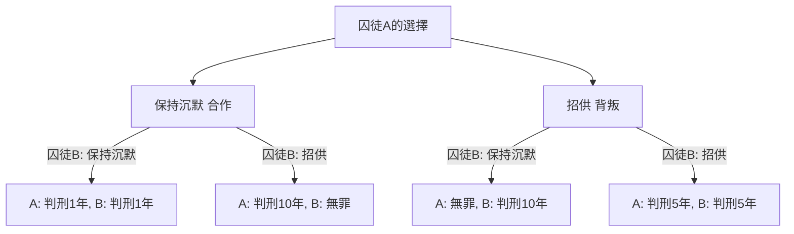
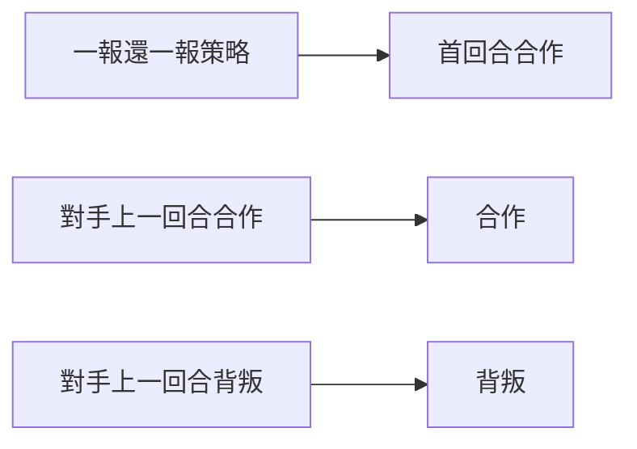

# 囚徒困境（Prisoner's Dilemma）：賽局理論提出的終極悖論

「為什麼我們明知道相互合作會得到更好的結果，卻還是要互相背叛呢？」

對於這個根本性的問題，賽局理論中的**「[囚徒困境](/zh-tw/p/prisoners-dilemma/)（Prisoner's Dilemma）」**從數學和邏輯學的角度給出了最清晰且最殘酷的答案。這一概念由梅里爾·弗拉德和梅爾文·德雷希爾在20世紀50年代提出，並由阿爾伯特·W·塔克將其系統化為如今的「囚徒故事」，對經濟學、政治學、心理學乃至演化生物學等各個領域都產生了深遠的影響。

本文將深入探討「[囚徒困境](/zh-tw/p/prisoners-dilemma/)」，從其基礎機制到納許均衡、柏瑞圖最適等專業概念，再到現實社會中的具體案例以及「重複賽局」中合作的演化，進行極其詳盡的解析。

---

## 1. 囚徒困境的基本情境

首先，讓我們回顧一下塔克構思的著名情境。

兩名共犯（囚徒A和囚徒B）因涉嫌一項重罪被捕。然而，警方沒有決定性的證據，如果沒有兩人的招供，只能以輕罪（例如輕微罪名判刑1年）起訴他們。
於是警方將兩人分別隔離在不同的審訊室，並向他們各自提出了以下認罪協商。

1. **兩人都保持沉默 合作**：因證據不足，兩人各**判刑1年**。
2. **一方招供 背叛，另一方保持沉默**：招供者作為配合調查的交換將**無罪釋放**，而保持沉默者將承擔重罪，**判刑10年**。
3. **兩人都招供 背叛**：兩人均被判有罪，但因酌情減輕處罰，各**判刑5年**。

囚徒A和囚徒B無法相互商量。在不知道對方會做出何種選擇的情況下，他們必須各自決定是「保持沉默 與對方合作」還是「招供 背叛對方」。

### 圖解決策機制

以下流程圖展示了從囚徒A視角的決策分支。

---

## 2. 理性判斷招致的悲劇：納許均衡

讓我們站在囚徒A的立場上，遵循將其自身利益最大化（縮短刑期）的理性思考過程。根據對方（囚徒B）的選擇，我們進行分類討論。

- **情況1：如果囚徒B選擇「保持沉默」**
  - 如果自己也「保持沉默」，判刑1年。
  - 如果自己「招供」，無罪釋放。
  - **結論**：無罪比1年好，所以「招供」更划算。

- **情況2：如果囚徒B選擇「招供」**
  - 如果自己「保持沉默」，判刑10年。
  - 如果自己「招供」，判刑5年。
  - **結論**：5年比10年好，所以「招供」更划算。

令人驚訝的是，無論囚徒B怎麼做，對囚徒A來說，選擇「招供 背叛」總是有利的。這種無論對手採取何種策略，對自己而言始終是最優的策略，被稱為<strong>「優勢策略」</strong>。
囚徒B也處於完全相同的境地，如果他同樣理性思考，對他來說「招供」也是優勢策略。

結果，兩人都選擇了「招供」，最終陷入了**兩人各判刑5年**的結局。在賽局理論中，這種狀態被稱為<strong>「納許均衡」</strong>（即任何玩家單方面改變策略都無法獲得更好利益的狀態）。

### 與柏瑞圖最適的背離

困境就產生於此。他們達成的「兩人各判刑5年」的結果，從整體來看是最佳結果嗎？
並非如此。如果兩人相互信任，都堅持「保持沉默」，本來只需「兩人各判刑1年」即可了事。

整體利益（在本例中為刑期總和最短）達到最高的狀態，即「在不減少任何人利益的前提下，無法再增加任何人利益的狀態」，被稱為**「柏瑞圖最適」**。[囚徒困境](/zh-tw/p/prisoners-dilemma/)的核心在於，**「個人的理性選擇（納許均衡）與整體的最優解（柏瑞圖最適）並不一致」**。

---

## 3. 現實世界中的囚徒困境

這種困境絕非僅僅是思維體操。在我們的社會結構、經濟活動，乃至國家間關係中，它都在日常發生著。

### 經濟中的價格競爭
假設A公司和B公司銷售相似的商品。如果兩家都維持高價 合作，雙方都能獲得高額利潤。然而，如果一方為了佔便宜而降價 背叛，就能壟斷市場獲取巨額利潤。結果，雙方都爭相降價，陷入了削減利潤的「價格戰」。

### 環境問題 公地悲劇
減少溫室氣體排放也是國家間的囚徒困境。如果所有國家都努力減排 合作，就可以防止全球暖化。然而，如果在其他國家努力減排時，唯獨本國放寬環境法規 背叛，本國就能獨享經濟成長。結果各國都想走捷徑，導致整體環境惡化。

### 軍備競賽
冷戰時期美蘇之間的核武器研發競賽也是典型案例。如果雙方都裁軍 合作，就能獲得和平與經濟上的寬裕，但如果對方武裝而自己裁軍，國家就會面臨存亡危機相當於判刑10年，因此雙方只能不斷擴軍 背叛。

---

## 4. 重複賽局與「一報還一報（Tit for Tat）」策略

在一次性的[囚徒困境](/zh-tw/p/prisoners-dilemma/)中，「背叛」是理性的選擇。然而，在現實社會中，我們通常會與同一對象進行多次交往。這在賽局理論中被稱為**「重複賽局（Iterated Prisoner's Dilemma）」**。

20世紀80年代，政治學家羅伯特·阿克塞爾羅德為了調查在重複的[囚徒困境](/zh-tw/p/prisoners-dilemma/)中哪種策略最強，向全世界的專家徵集電腦程式並進行了錦標賽。

結果，最簡單且獲得最高分的是由阿納托爾·拉波波特提交的<strong>「一報還一報策略（Tit for Tat）」</strong>。

### 一報還一報策略的演算法

這個策略的規則出奇地簡單。
1. 第一回合必定「合作」。
2. 從第二回合開始，**完全模仿對方在上一回合採取的行動**（對方合作就合作，對方背叛就背叛）。

為什麼這個策略會這麼強呢？阿克塞爾羅德分析了強策略共通的四個特徵。
1. **友善（Nice）**：絕對不先背叛。
2. **報復性（Retaliating）**：如果對方背叛，必定立刻給予懲罰報復。
3. **寬容（Forgiving）**：如果對方改過自新恢復合作，就忘記過去的背叛，立刻恢復合作。
4. **明確（Clear）**：意圖容易傳達給對方，讓對方能安心選擇合作。

這一發現表明，人類社會中的「道德」和「信任」可能並非僅僅是感情論，而是有數學和演化理性作為支撐的。

---

## 5. 演化生物學中合作的產生

[囚徒困境](/zh-tw/p/prisoners-dilemma/)和「一報還一報策略」的成功，也對演化生物學（演化賽局理論）產生了巨大衝擊。正如理查德·道金斯的《自私的基因》所代表的那樣，自然界是弱肉強食的，個體生物理應優先考慮自身的生存和繁殖 背叛。儘管如此，吸血蝙蝠分享血液、蜜蜂的社會性等「利他行為 合作」在自然界中卻隨處可見。

在演化的模擬中，當少數「一報還一報」群體被投入到一個全都是「背叛」的社會中時，已經被證明一報還一報群體會相互合作獲取高額利益，並逐漸淘汰背叛群體。也就是說，在長期的生存競爭中，能夠相互合作的群體才是最終的贏家。

## 6. 總結：如何克服困境

[囚徒困境](/zh-tw/p/prisoners-dilemma/)告訴我們一個嚴酷的現實：如果我們過度追求自身利益，結果就是所有人都會受損。但同時，正如重複賽局的研究所示，只要有持續的關係和適當的反饋機制，我們就能建立起合作關係。

為了在現實社會中解決[囚徒困境](/zh-tw/p/prisoners-dilemma/)，需要以下方法：
- **改變規則 法治**：將對背叛的懲罰制度化，消除背叛的利益。（例如：反壟斷法和環境稅）
- **確保溝通**：提供確認彼此意圖的機會，建立信任關係。
- **重視長期關係**：讓人意識到未來之影，即「如果這次背叛，以後就沒有交易了」。

賽局理論看似是一個冷酷計算的世界，但當你凝視其深淵時，就會得出一個非常人性且溫暖的真理：「為什麼人們應該相互合作」。
