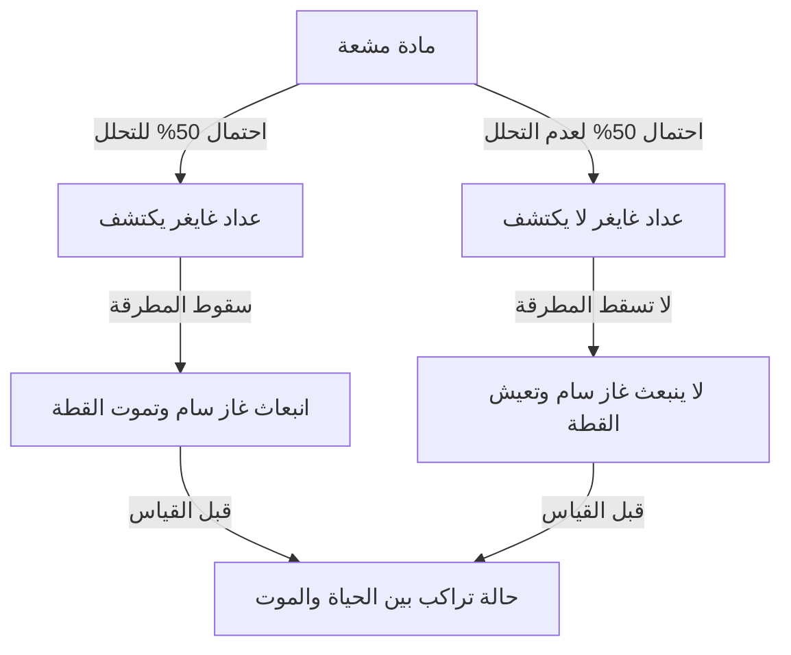
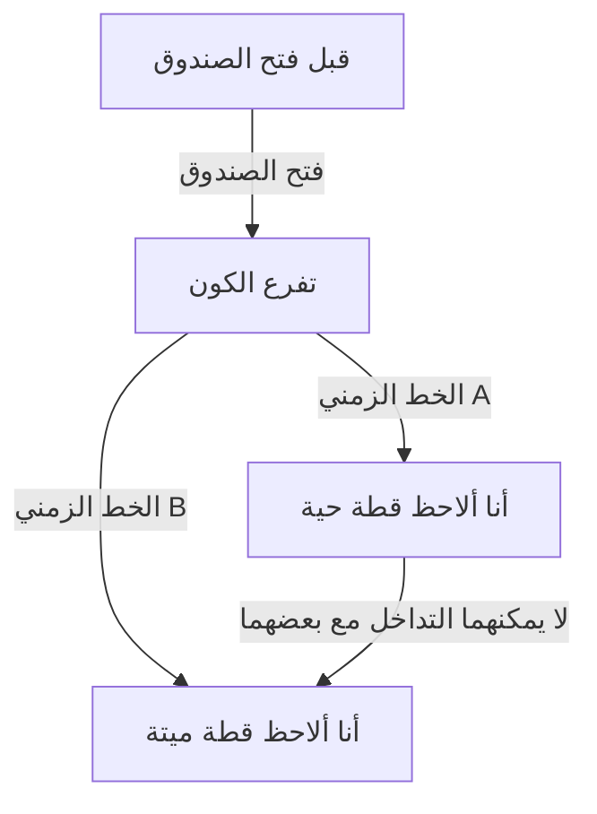

# أقصى حدود ميكانيكا الكم: مفارقة الواقع التي تطرحها قطة شرودنغر

عالم الكم هو عالم مجهري لا ينطبق عليه حدسنا أو منطقنا المعتاد على الإطلاق. والتجربة الفكرية التي جلبت غرابة ميكانيكا الكم إلى النطاق اليومي، واستمرت في إرباك ليس فقط علماء الفيزياء بل الفلاسفة أيضًا، هي "قطة شرودنغر". في هذا المقال، سنتعمق بشكل مفصل وشامل في هذه المفارقة الشهيرة للغاية، بدءًا من نشأتها ومعانيها الفيزيائية والفلسفية، وصولًا إلى التفسيرات الحديثة.

## الفصل الأول: ما هي قطة شرودنغر؟

"قطة شرودنغر (Schrödinger's cat)" هي تجربة فكرية اقترحها الفيزيائي النمساوي إروين شرودنغر في عام 1935. كان الهدف من هذه التجربة هو تسليط الضوء على التناقضات المنطقية والطبيعة التي تتعارض مع الحدس في التفسير السائد لميكانيكا الكم في ذلك الوقت (تفسير كوبنهاغن).

### إعداد التجربة الفكرية

افترض شرودنغر الموقف التالي:

1. **صندوق فولاذي**: يتم تحضير صندوق مغلق تمامًا لا يمكن ملاحظة ما بداخله من الخارج على الإطلاق.
2. **قطة حية**: يتم وضع قطة حية واحدة داخل الصندوق.
3. **مادة مشعة وعداد غايغر**: يوجد داخل الصندوق كمية ضئيلة من مادة مشعة لديها احتمال 50% للتحلل خلال ساعة واحدة، وعداد غايغر للكشف عن ذلك.
4. **زجاجة غاز سام (غاز السيانيد) ومطرقة**: عندما يكتشف عداد غايغر انبعاث الإشعاع (التحلل الإشعاعي)، يتم تنشيط دائرة التتابع، وتسقط المطرقة لكسر الزجاجة التي تحتوي على الغاز السام.

بعد ساعة، ماذا سيحدث داخل هذا الصندوق؟
من منظور المنطق السليم، يجب أن تكون القطة في إحدى الحالتين: "حية" أو "ميتة". ومع ذلك، عند التطبيق الصارم لقوانين ميكانيكا الكم (تفسير كوبنهاغن) على هذا النظام بأكمله، يتم التوصل إلى استنتاج مفاجئ.

تحلل المادة المشعة هو ظاهرة كمومية، وحتى يتم فتح الصندوق والقياس، توجد "الحالة المتحللة" و"الحالة غير المتحللة" كـ**"تراكب (superposition)"**. وبناءً على ذلك، يُقال إن القطة المرتبطة بتلك الحالة تكون أيضًا في **حالة تراكب بين "حالة الحياة" و"حالة الموت"** حتى يفتح الإنسان الصندوق ويقوم بالقياس.

## الفصل الثاني: لماذا ظهرت مثل هذه التجربة الفكرية الغريبة؟

الخلفية التي أدت إلى ظهور هذه التجربة الفكرية هي التطور السريع لميكانيكا الكم بين العشرينيات والثلاثينيات من القرن الماضي، والجدل العنيف بين الفيزيائيين الذي رافق ذلك.

### ولادة تفسير كوبنهاغن

أصبح "تفسير كوبنهاغن"، الذي بناه بشكل أساسي نيلز بور وفيرنر هايزنبيرغ وآخرون، التفسير القياسي للإطار الرياضي لميكانيكا الكم. الادعاءات المركزية له هي كما يلي:

1. **الدالة الموجية والتراكب**: يوصف النظام الكمومي بأداة رياضية تسمى "الدالة الموجية"، وتوجد الحالات المتعددة الممكنة متراكبة احتمالياً حتى يتم ملاحظتها.
2. **انهيار الحزمة الموجية (مشكلة القياس)**: في اللحظة التي يتم فيها القياس أو الملاحظة، "تنهار (collapse)" حالة التراكب إلى حالة واحدة مؤكدة فقط.
3. **التكاملية**: لا يمكن ملاحظة الخصائص كجسيم والخصائص كموجة بالكامل في نفس الوقت، بل هما في علاقة تكمل بعضها البعض.

### استياء أينشتاين وشرودنغر

انتقد ألبرت أينشتاين بشدة "النظرة الاحتمالية للطبيعة" و"الانهيارによる القياس" لتفسير كوبنهاغن. مقولته الشهيرة "الإله لا يلعب النرد" تعبر عن إيمانه بأن القوانين الفيزيائية يجب أن تكون حتمية.

شرودنغر نفسه، الذي اكتشف "معادلة شرودنغر" وهي المعادلة الأساسية لميكانيكا الكم، شعر بمقاومة شديدة لاستخدام معادلته التي ابتكرها في التفسيرات الاحتمالية. من خلال مراسلاته مع أينشتاين، كانت "قطة شرودنغر" هي محاولته للإشارة إلى سخافة تفسير كوبنهاغن من خلال إدخال عدم اليقين في العالم المجهري (المادة المشعة) إلى العالم العياني (القطة).

## الفصل الثالث: عندما تمتد قوانين العالم المجهري إلى العالم العياني (التشابك الكمي)

في صميم مفارقة قطة شرودنغر، يوجد مفهوم وثيق الصلة يسمى "التشابك الكمي (entanglement)".

داخل الصندوق، ترتبط حالة المادة المشعة (متحللة / غير متحللة) وحالة القطة (ميتة / حية) ارتباطًا وثيقًا. يُطلق على هذا الارتباط، حيث يحدد أحدهما الآخر بالضرورة، اسم "التشابك" في ميكانيكا الكم.

يتضخم التراكب الكمومي المجهري للذرة المشعة من خلال الأجهزة العيانية مثل عداد غايغر، ودائرة التتابع، والمطرقة، ويمتد أخيرًا إلى تراكب الحياة والموت لكائن حي وهو القطة. وصف شرودنغر هذا بأنه "سخيف (ridiculous)" وحذر من خطورة تطبيق قوانين العالم المجهري بشكل أعمى على الأشياء العيانية.

## الفصل الرابع: كيف تفسر الفيزياء الحديثة "القطة"؟

حتى بعد مرور ما يقرب من قرن على عصر شرودنغر، لا توجد إجابة (تفسير) موحدة ومثالية لهذه المفارقة. ومع ذلك، في الفيزياء الحديثة، هناك عدة مناهج بارزة تحاول حل هذه المشكلة.

### 1. المنظور الحديث لتفسير كوبنهاغن

من موقف الحفاظ على تفسير كوبنهاغن التقليدي، يكون التركيز على "أين تم القياس؟".
في الواقع، ليس وعي الإنسان فقط هو "القياس". من الطبيعي أن نعتبر أن "القياس" قد تم في اللحظة التي يكتشف فيها عداد غايغر الإشعاع، أو في اللحظة التي يتفاعل فيها مع البيئة العيانية، وأن الدالة الموجية قد انهارت في تلك النقطة. أي أن الفكرة هي أن حياة أو موت القطة قد تم تحديدهما بالفعل داخل الصندوق دون انتظار مراقبة الإنسان.

### 2. تفسير العوالم المتعددة (تفسير إيفريت)

يقدم "تفسير العوالم المتعددة" الذي اقترحه هيو إيفريت الثالث في عام 1957 حلاً جريئًا للغاية.
وفقًا لتفسير العوالم المتعددة، لا يحدث انهيار للدالة الموجية أبدًا. يُقال إنه في اللحظة التي تفتح فيها الصندوق، يتفرع الكون نفسه (أو بالأحرى يتواجدان بشكل متوازٍ) إلى "كون يرى فيه المراقب قطة حية" و"كون يرى فيه المراقب قطة ميتة".

يكمن جمال هذا التفسير في أنه يمكن تطبيقه دون تعديل معادلات ميكانيكا الكم (معادلة شرودنغر) على الإطلاق. ومع ذلك، فإنه يأتي مع تكلفة فلسفية تتمثل في وجوب قبول الاستنتاج غير البديهي القائل بـ "وجود أكوان موازية لا حصر لها".

### 3. فك الترابط (فقدان التداخل الكمي)

العملية الفيزيائية الأكثر أهمية في نظرية المعلومات الكمومية الحديثة هي "فك الترابط الكمي (Quantum decoherence)".
للحفاظ على حالة التراكب، يجب أن يكون النظام معزولًا تمامًا عن البيئة الخارجية. ومع ذلك، فإن نظامًا ضخمًا مثل قطة حقيقية يتصادم دائمًا ويتفاعل مع جزيئات الهواء والفوتونات المحيطة به.

ظاهرة فك الترابط هي تسرب المعلومات حول "الطور (التماسك كموجة)" للتراكب إلى البيئة بسبب هذه التفاعلات التي لا حصر لها. نظرًا لأن فك الترابط يحدث في وقت قصير للغاية (في الأنظمة العيانية مثل القطط يكون مساويًا للصفر تقريبًا)، فإن التراكب الكمي ينهار على الفور وينتقل إلى الاحتمالية الكلاسيكية (إما حية أو ميتة). تشرح نظرية فك الترابط بشكل جميل "لماذا لا نرى التراكب في العالم العياني".

### 4. نظرية الانهيار الموضوعي (Objective Collapse Theory)

مثل نظرية GRW وتفسير بنروز، هذا هو النهج الذي تنهار فيه الدالة الموجية بشكل طبيعي من خلال آلية فيزيائية بغض النظر عما إذا كان هناك قياس أم لا. كلما زادت كتلة أو تعقيد النظام، كلما قصر الوقت المستغرق للانهيار. يمكن للجسيمات المجهرية مثل الإلكترونات الحفاظ على التراكب لفترة طويلة، لكن جسماً كبيراً مثل القطة ينهار في لحظة، لذلك يوضح أن تراكب الحياة والموت لا يحدث في الواقع.

## الفصل الخامس: التطبيقات الواقعية لـ "قطة شرودنغر"

إن "تراكب الحالات العيانية" الذي قدمه شرودنغر كمفارقة أصبح حقيقة واقعة في التكنولوجيا الحديثة.

### التطبيقات في أجهزة الكمبيوتر الكمومية

الوحدة الأساسية لجهاز الكمبيوتر الكمومي، "البت الكمومي (كيوبت)"، تقوم بإجراء حسابات متوازية باستخدام حالة "التراكب بين 0 و 1". في السنوات الأخيرة، تقدمت الأبحاث في الدوائر التي تتكون من ذرات عديدة أو الحلقات فائقة التوصيل، حيث يتم إنشاء "حالة قطة شرودنغر (cat state)" عن قصد على نطاق عياني (أو ميزوسكوبي) واستخدامها في الحسابات أو تصحيح الأخطاء.

مع قيامنا بصقل التكنولوجيا لدينا وتحسين القدرة على منع فك الترابط (العزل التام عن البيئة الخارجية)، تتحول قطة شرودنغر تدريجياً من "تجربة فكرية غريبة" إلى "مورد عملي لمعالجة المعلومات".

## الفصل السادس: التداعيات على الفلسفة ونظرية المعرفة

تتجاوز قطة شرودنغر كونها مجرد مشكلة فيزيائية لتطرح علينا أسئلة فلسفية عميقة مثل "ما هو الواقع؟" و"ما هو القياس؟".

إذا كان "القياس" هو الذي يحدد الواقع، فهل هناك دور فيزيائي خاص لـ "وعي" البشر كمراقبين؟ (مفارقة صديق ويغنر)
أو هل هذا العالم الصلب الذي ندركه هو مجرد جانب واحد من بين عوالم كمومية متعددة شاسعة؟

لقد هزت ميكانيكا الكم الاعتقاد الراسخ بـ "الواقع الموضوعي والمستقل" الذي بنته الفيزياء الكلاسيكية. تقف قطة شرودنغر في طليعة هذا التذبذب وتستمر في جذبنا إلى أسئلة عميقة حتى يومنا هذا.

## الخلاصة: ماذا تعلمنا القطة؟

كانت قطة شرودنغر تجربة فكرية تم إنشاؤها لكشف النقص في ميكانيكا الكم. لكن من المفارقات أنها أصبحت أقوى استعارة تنقل للجمهور العام الطبيعة الأكثر جوهرية وغموضاً لميكانيكا الكم بشكل بديهي.

تخبرنا القطة داخل الصندوق أن "الواقع" الذي نعتبره أمراً مفروغاً منه مبني في الواقع على توازن دقيق للغاية حيث تتقاطع التقلبات الكمومية المجهرية والعالم الكلاسيكي العياني. في كل مرة تتطور فيها الفيزياء وتولد تفسيرات أو نظريات جديدة، تظهر أمامنا قطة شرودنغر بشكل جديد.

وستظل في المستقبل أكثر المعالم غموضاً وجاذبية في رحلة استكشاف العقل البشري للبحث عن "الطبيعة الحقيقية للواقع".
