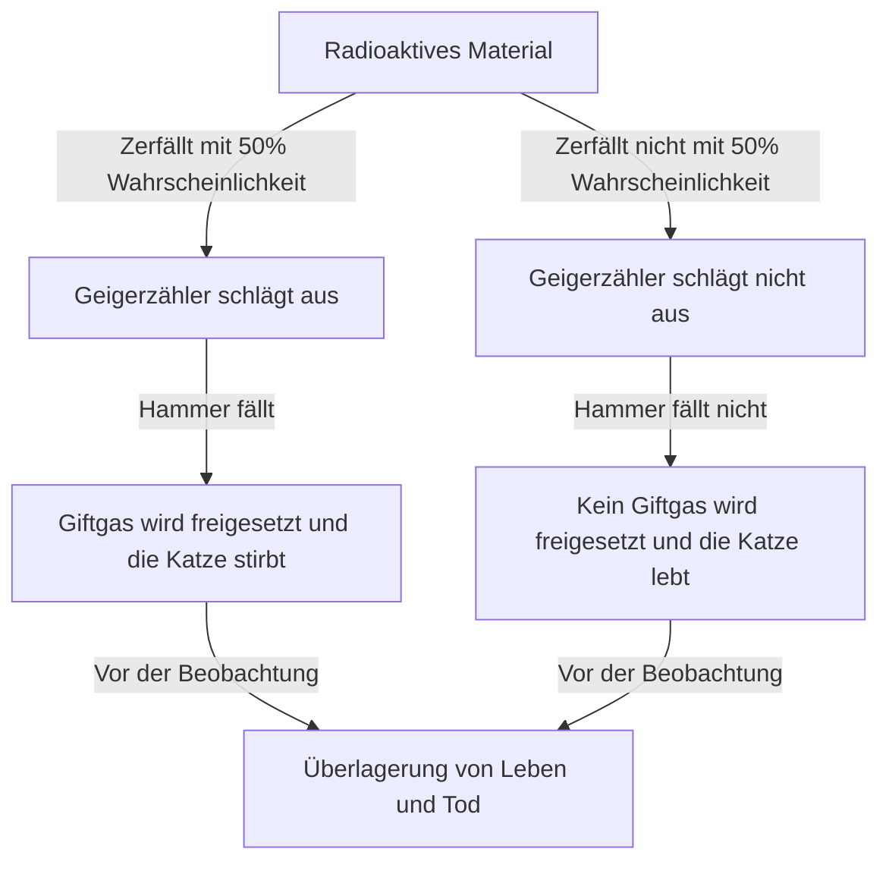
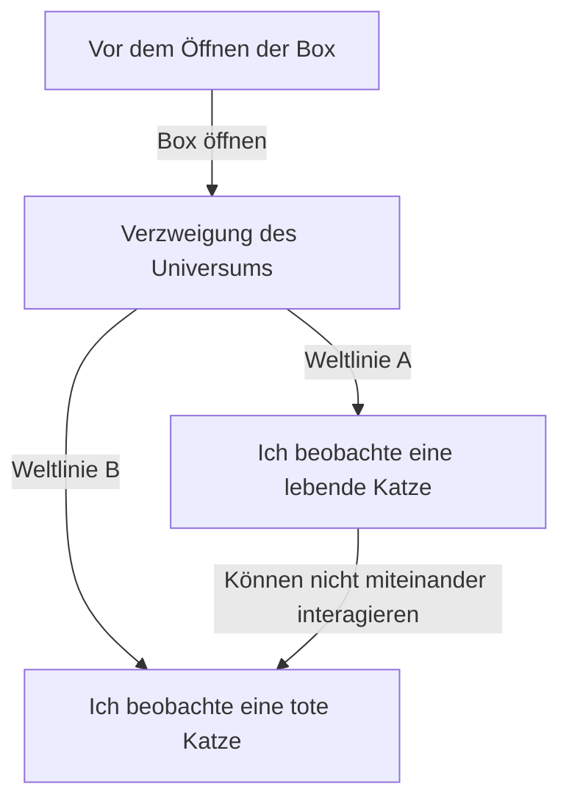

# Der äußerste Norden der Quantenmechanik: Das Paradoxon der Realität, das uns Schrödingers Katze vor Augen führt

Die Mikrowelt, in der unsere Intuition und unser gesunder Menschenverstand absolut nicht mehr gelten, das ist die Welt der Quantenmechanik. Und das Gedankenexperiment, das die Fremdartigkeit der Quantenmechanik auf unsere alltägliche Ebene bringt und nicht nur Physiker, sondern auch Philosophen immer wieder vor Rätsel stellt, ist „Schrödingers Katze“. In diesem Artikel werden wir dieses überaus berühmte Paradoxon von seiner Entstehung über seine physikalische und philosophische Bedeutung bis hin zu seiner modernen Interpretation sehr detailliert und gründlich untersuchen.

## Kapitel 1: Was ist Schrödingers Katze?

„Schrödingers Katze“ (Schrödinger's cat) ist ein Gedankenexperiment, das 1935 vom österreichischen Physiker Erwin Schrödinger vorgeschlagen wurde. Der Zweck dieses Experiments war es, die logischen Widersprüche und die der Intuition widersprechenden Eigenschaften der damaligen Mainstream-Interpretation der Quantenmechanik (der Kopenhagener Interpretation) aufzuzeigen.

### Aufbau des Gedankenexperiments

Schrödinger stellte sich folgende Situation vor:

1. **Eine Stahlbox**: Man bereitet eine vollständig verschlossene Box vor, in deren Inneres man von außen nicht hineinsehen kann.
2. **Eine lebende Katze**: In diese Box wird eine lebende Katze gesetzt.
3. **Radioaktives Material und Geigerzähler**: In der Box befinden sich eine winzige Menge radioaktiven Materials, das mit einer Wahrscheinlichkeit von 50 % innerhalb einer Stunde zerfällt, und ein Geigerzähler, der dies erkennt.
4. **Flasche mit Giftgas (Blausäure) und Hammer**: Wenn der Geigerzähler die Emission von Strahlung (radioaktiver Zerfall) erkennt, wird eine Relaisschaltung aktiviert, durch die ein Hammer fällt und eine Flasche mit Giftgas zerschlägt.

Wie sieht es nach einer Stunde in der Box aus?
Aus gesundem Menschenverstand heraus betrachtet, müsste sich die Katze in einem von zwei Zuständen befinden: „lebend“ oder „tot“. Wenn man die Gesetze der Quantenmechanik (die Kopenhagener Interpretation) jedoch streng auf dieses gesamte System anwendet, kommt man zu einer erstaunlichen Schlussfolgerung.

Der Zerfall von radioaktivem Material ist ein quantenmechanisches Phänomen. Bis die Box geöffnet und eine Beobachtung gemacht wird, existieren der „zerfallene Zustand“ und der „nicht zerfallene Zustand“ als **„Überlagerung“ (superposition)**. Und die Katze, die an diesen Zustand gekoppelt ist, befindet sich demnach ebenfalls in einer **Überlagerung aus „lebendem Zustand“ und „totem Zustand“**, bis ein Mensch die Box öffnet und eine Beobachtung durchführt.

## Kapitel 2: Warum entstand dieses seltsame Gedankenexperiment?

Der Hintergrund für die Entstehung dieses Gedankenexperiments war die rasante Entwicklung der Quantenmechanik in den 1920er und 1930er Jahren und die damit einhergehenden heftigen Debatten unter Physikern.

### Die Entstehung der Kopenhagener Interpretation

Die „Kopenhagener Interpretation“, die im Wesentlichen von Niels Bohr, Werner Heisenberg und anderen entwickelt wurde, wurde zur Standardinterpretation für den mathematischen Rahmen der Quantenmechanik. Ihre Hauptbehauptungen sind wie folgt:

1. **Wellenfunktion und Überlagerung**: Quantensysteme werden durch ein mathematisches Werkzeug namens „Wellenfunktion“ beschrieben und bis zur Beobachtung überlagern sich mehrere mögliche Zustände probabilistisch.
2. **Kollaps der Wellenfunktion (Messproblem)**: In dem Moment, in dem eine Messung oder Beobachtung stattfindet, „kollabiert“ (collapse) der Überlagerungszustand auf einen einzigen, definitiven Zustand.
3. **Komplementarität**: Teilchen- und Welleneigenschaften können nicht gleichzeitig vollständig beobachtet werden und ergänzen sich gegenseitig.

### Die Unzufriedenheit von Einstein und Schrödinger

Albert Einstein kritisierte die „probabilistische Naturauffassung“ und den „Kollaps durch Beobachtung“ der Kopenhagener Interpretation scharf. Sein berühmtes Zitat „Gott würfelt nicht“ drückt seine Überzeugung aus, dass die physikalischen Gesetze deterministisch sein sollten.

Auch Schrödinger selbst, der die „Schrödinger-Gleichung“ (die Grundgleichung der Quantenmechanik) entdeckte, empfand starken Widerstand dagegen, dass die von ihm geschaffene Gleichung für eine probabilistische Interpretation verwendet wurde. In einem Briefwechsel mit Einstein versuchte er mit „Schrödingers Katze“, die Absurdität der Kopenhagener Interpretation aufzuzeigen, indem er die Unbestimmtheit der Mikrowelt (radioaktives Material) in die Makrowelt (Katze) übertrug.

## Kapitel 3: Wenn mikroskopische Gesetze auf Makroskopisches übergreifen (Quantenverschränkung)

Im Kern des Paradoxons von Schrödingers Katze ist das Konzept der „Quantenverschränkung“ (Entanglement) tief verwurzelt.

In der Box sind der Zustand des radioaktiven Materials (zerfallen/nicht zerfallen) und der Zustand der Katze (tot/lebend) stark miteinander verbunden. Diese Korrelation, bei der der eine Zustand unweigerlich den anderen bestimmt, wird in der Quantenmechanik als „Verschränkung“ bezeichnet.

Die mikroskopische Quantenüberlagerung des radioaktiven Atoms wird durch makroskopische Geräte wie den Geigerzähler, die Relaisschaltung und den Hammer verstärkt und erstreckt sich (greift über) schließlich auf die Überlagerung von Leben und Tod des Lebewesens Katze. Schrödinger nannte dies „lächerlich“ (ridiculous) und warnte vor der Gefahr, mikroskopische Gesetze unkritisch auf makroskopische Objekte anzuwenden.

## Kapitel 4: Wie interpretiert die moderne Physik die „Katze“?

Selbst heute, etwa ein Jahrhundert nach Schrödingers Zeit, gibt es keine einheitliche, perfekte Antwort (Interpretation) auf dieses Paradoxon. Die moderne Physik versucht jedoch, dieses Problem durch mehrere vielversprechende Ansätze zu lösen.

### 1. Moderne Sichtweise der Kopenhagener Interpretation

Aus der Perspektive der Beibehaltung der traditionellen Kopenhagener Interpretation steht im Mittelpunkt, „wo die Beobachtung stattfand“.
Tatsächlich ist nicht nur das menschliche Bewusstsein eine „Beobachtung“. Es ist natürlich anzunehmen, dass in dem Moment, in dem der Geigerzähler die Strahlung erkennt oder mit der makroskopischen Umgebung interagiert, eine „Beobachtung“ stattfindet und die Wellenfunktion zu diesem Zeitpunkt kollabiert. Das heißt, der Tod oder das Überleben der Katze in der Box ist bereits entschieden, ohne dass eine menschliche Beobachtung abgewartet werden muss.

### 2. Viele-Welten-Interpretation (Everett-Interpretation)

Die 1957 von Hugh Everett III. vorgeschlagene „Viele-Welten-Interpretation“ bietet eine sehr mutige Lösung.
Laut dieser Interpretation kollabiert die Wellenfunktion niemals. In dem Moment, in dem die Box geöffnet wird, verzweigt sich das Universum selbst (bzw. existiert parallel) in „das Universum des Beobachters, der eine lebende Katze sieht“ und „das Universum des Beobachters, der eine tote Katze sieht“.

Die Schönheit dieser Interpretation liegt darin, dass die Gleichungen der Quantenmechanik (Schrödinger-Gleichung) angewendet werden können, ohne sie zu verändern. Sie bringt jedoch philosophische Kosten mit sich, da man die der Intuition widersprechende Schlussfolgerung akzeptieren muss, dass „unzählige Paralleluniversen existieren“.

### 3. Dekohärenz (Verlust der Quanteninterferenz)

Der in der modernen Quanteninformationstheorie am meisten beachtete physikalische Prozess ist die „Quantendekohärenz“.
Um einen Überlagerungszustand aufrechtzuerhalten, muss ein System vollständig von der äußeren Umgebung isoliert sein. Ein riesiges System wie eine echte Katze kollidiert und interagiert jedoch ständig mit den umgebenden Luftmolekülen und Photonen.

Das Phänomen, bei dem durch diese unzähligen Interaktionen Informationen über die „Phase (Kohärenz als Welle)“ der Überlagerung in die Umgebung entweichen, ist die Dekohärenz. Da die Dekohärenz in extrem kurzer Zeit stattfindet (bei einem makroskopischen System wie einer Katze effektiv gleich null), bricht die Quantenüberlagerung augenblicklich zusammen und geht in eine klassische Wahrscheinlichkeit (entweder lebend oder tot) über. Die Dekohärenztheorie erklärt auf elegante Weise, „warum wir in der Makrowelt keine Überlagerungen sehen“.

### 4. Objektive Kollaps-Theorie (Objective Collapse Theory)

Dies ist ein Ansatz wie die GRW-Theorie oder die Penrose-Interpretation, bei dem die Wellenfunktion unabhängig vom Vorhandensein oder Fehlen einer Beobachtung auf natürliche Weise durch einen physikalischen Mechanismus kollabiert. Je größer die Masse und Komplexität des Systems, desto kürzer ist die Zeit, die für den Kollaps benötigt wird. Mikroskopische Teilchen wie Elektronen können Überlagerungen über lange Zeiträume aufrechterhalten, aber massereiche Objekte wie eine Katze kollabieren augenblicklich. Daher erklärt dieser Ansatz, dass eine Überlagerung von Leben und Tod in der Realität nicht auftritt.

## Kapitel 5: Reale Anwendungen von „Schrödingers Katze“

Die „Überlagerung makroskopischer Zustände“, die Schrödinger als Paradoxon präsentierte, wird in modernen Technologien zunehmend Realität.

### Anwendung in Quantencomputern

Das grundlegende Element eines Quantencomputers, das „Qubit“ (Quantum Bit), führt parallele Berechnungen durch, indem es genau diesen „Überlagerungszustand von 0 und 1“ nutzt. In den letzten Jahren wurden Fortschritte in der Forschung gemacht, bei denen absichtlich „Schrödingers Katzenzustände“ (cat states) auf eigentlich makroskopischer (oder mesoskopischer) Ebene geschaffen werden, beispielsweise in Schaltkreisen aus vielen Atomen oder supraleitenden Schleifen, und für Berechnungen oder Fehlerkorrekturen genutzt werden.

Während wir unsere Technologien verfeinern und die Fähigkeit verbessern, Dekohärenz zu verhindern (vollständige Isolation von der Außenumgebung), wandelt sich Schrödingers Katze von einem „seltsamen Gedankenexperiment“ zu einer „praktischen Ressource für die Informationsverarbeitung“.

## Kapitel 6: Auswirkungen auf Philosophie und Erkenntnistheorie

Schrödingers Katze geht über reine physikalische Probleme hinaus und konfrontiert uns mit tiefen philosophischen Fragen: „Was ist Realität?“ und „Was ist Beobachtung?“.

Wenn die „Beobachtung“ die Realität bestimmt, hat dann das „Bewusstsein“ von uns menschlichen Beobachtern eine besondere physikalische Rolle? (Wigners Freund-Paradoxon)
Oder ist diese solide Welt, die wir wahrnehmen, nur eine einzige Facette innerhalb einer unermesslichen Quanten-Viele-Welten-Realität?

Die Quantenmechanik erschütterte den festen Glauben an eine „objektive, unabhängige Realität“, den die klassische Physik aufgebaut hatte. Schrödingers Katze steht an vorderster Front dieser Erschütterung und führt uns noch heute zu tiefgründigen Fragen.

## Fazit: Was lehrt uns die Katze?

Schrödingers Katze war ein Gedankenexperiment, das entwickelt wurde, um die Unvollständigkeit der Quantenmechanik aufzudecken. Ironischerweise wurde sie jedoch zur stärksten Metapher, um der breiten Öffentlichkeit auf intuitive Weise die grundlegendste und mysteriöseste Natur der Quantenmechanik zu vermitteln.

Die Katze in der Box lehrt uns, dass die „Realität“, die wir für selbstverständlich halten, in Wahrheit auf einem extrem feinen Gleichgewicht beruht, in dem sich mikroskopische Quantenfluktuationen und die makroskopische klassische Welt überschneiden. Jedes Mal, wenn sich die Physik weiterentwickelt und neue Interpretationen und Theorien entstehen, erscheint Schrödingers Katze in einer neuen Form vor uns.

Sie wird wohl auch in Zukunft der mysteriöseste und faszinierendste Wegweiser auf der Suche des menschlichen Intellekts nach der „wahren Gestalt der Realität“ bleiben.
