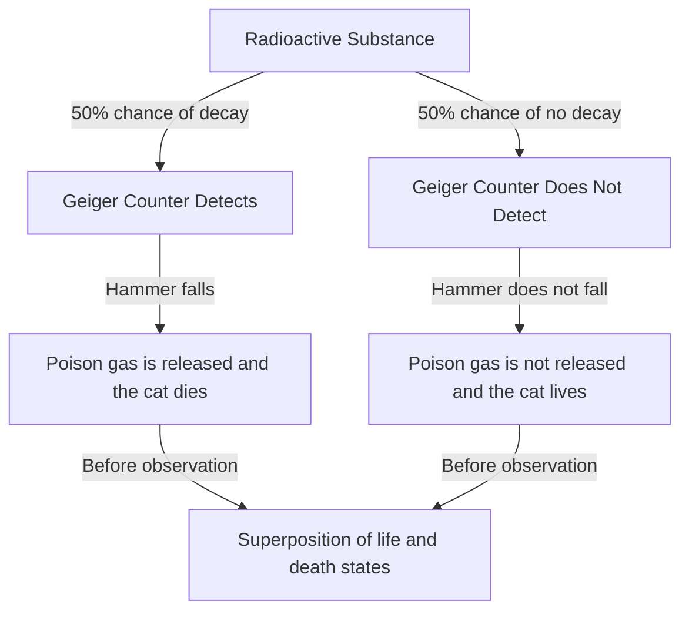
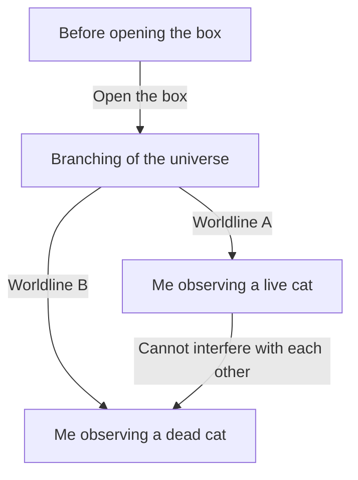

# The Extreme North of Quantum Mechanics: The Paradox of Reality Posed by Schrödinger's Cat

The microscopic world, where our intuition and common sense completely fail, is the world of quantum mechanics. And the thought experiment that brings the strangeness of quantum mechanics to an everyday scale, continuing to puzzle not only physicists but also philosophers, is "Schrödinger's Cat." In this article, we will delve extremely deeply and thoroughly into this overly famous paradox, from its origins to its physical and philosophical meaning, and even its modern interpretations.

## Chapter 1: What is Schrödinger's Cat?

"Schrödinger's Cat" is a thought experiment proposed in 1935 by the Austrian physicist Erwin Schrödinger. The purpose of this experiment was to highlight the logical contradictions and counterintuitive nature of the then-mainstream interpretation of quantum mechanics (the Copenhagen interpretation).

### Setup of the Thought Experiment

Schrödinger envisioned the following situation:

1. **Steel Box**: Prepare a completely sealed box whose inside cannot be observed from the outside at all.
2. **Live Cat**: Place a single live cat inside the box.
3. **Radioactive Substance and Geiger Counter**: Inside the box, a tiny amount of radioactive substance with a 50% chance of decaying within one hour and a Geiger counter to detect it are installed.
4. **Flask of Poison Gas (Hydrocyanic Acid) and Hammer**: If the Geiger counter detects the emission of radiation (radioactive decay), a relay circuit is activated, and a mechanism is designed so that a hammer falls and breaks the flask containing poison gas.

What happens inside this box after one hour?
Common sense dictates that the cat must be in either a state of being "alive" or "dead." However, applying the laws of quantum mechanics (the Copenhagen interpretation) strictly to this entire system leads to an astonishing conclusion.

The decay of a radioactive substance is a quantum mechanical phenomenon, and until the box is opened and observed, a "decayed state" and an "undecayed state" exist as a **"superposition."** And the cat, which is linked to that state, is also in a **state where "alive state" and "dead state" are superimposed** until a human opens the box and observes it.

## Chapter 2: Why was such a strange thought experiment created?

The background behind the creation of this thought experiment was the rapid development of quantum mechanics in the 1920s and 30s, and the fierce debates among physicists that accompanied it.

### Birth of the Copenhagen Interpretation

The "Copenhagen interpretation," built around Niels Bohr and Werner Heisenberg, became the standard interpretation of the mathematical framework of quantum mechanics. Its central claims are as follows:

1. **Wave Function and Superposition**: A quantum system is described by a mathematical tool called a "wave function," and until it is observed, multiple possible states exist probabilistically in a superposition.
2. **Collapse of the Wave Packet (Measurement Problem)**: The moment a measurement or observation is made, the state of superposition "collapses" into just one definite state.
3. **Complementarity**: The properties of a particle and the properties of a wave cannot be completely observed at the same time, and are in a mutually complementary relationship.

### Einstein and Schrödinger's Dissatisfaction

Albert Einstein strongly criticized the "probabilistic view of nature" and the "collapse by observation" of this Copenhagen interpretation. His famous quote, "God does not play dice," expresses his belief that physical laws should be deterministic.

Schrödinger himself, who discovered the "Schrödinger equation," the fundamental equation of quantum mechanics, also felt strong resistance to his own equation being used for a probabilistic interpretation. Through corresponding with Einstein, this "Schrödinger's Cat" was his attempt to point out the absurdity of the Copenhagen interpretation by bringing the uncertainty of the microscopic world (radioactive substance) into the macroscopic world (cat).

## Chapter 3: When Microscopic Laws Ripple to the Macroscopic (Quantum Entanglement)

Deeply involved in the core of the Schrödinger's Cat paradox is the concept of "quantum entanglement."

Inside the box, the state of the radioactive substance (decayed/not decayed) and the state of the cat (dead/alive) are strongly linked. In quantum mechanics, this correlation, where if one is determined the other is also inevitably determined, is called "entanglement."

The microscopic quantum superposition of radioactive atoms is amplified through macroscopic devices such as the Geiger counter, relay circuit, and hammer, and eventually expands (ripples) to the superposition of life and death of a lifeform, the cat. Schrödinger called this "ridiculous" and warned of the danger of uncritically applying microscopic laws to macroscopic objects.

## Chapter 4: How does modern physics interpret the "cat"?

Even now, about a century after Schrödinger's time, there is no unified and perfect answer (interpretation) to this paradox. However, modern physics attempts to resolve this problem through several prominent approaches.

### 1. Modern Perspective of the Copenhagen Interpretation

From the standpoint of maintaining the traditional Copenhagen interpretation, the focus is on "where the observation was made."
In fact, human consciousness is not the only "observation." It is natural to think that the moment the Geiger counter detects radiation, or the moment it interacts with a macroscopic environment, an "observation" has been made, and the wave function collapses at that point. In other words, the idea is that inside the box, the life or death of the cat has already been determined without waiting for human observation.

### 2. Many-Worlds Interpretation (Everett Interpretation)

The "many-worlds interpretation" proposed by Hugh Everett III in 1957 presents a very bold solution.
According to the many-worlds interpretation, the collapse of the wave function never happens. The moment the box is opened, the universe itself branches (or rather, exists in parallel) into two: "a universe of an observer seeing a live cat" and "a universe of an observer seeing a dead cat."

The beauty of this interpretation lies in the fact that it can be applied without tinkering with the equations of quantum mechanics (the Schrödinger equation) at all. However, it comes with the philosophical cost of having to accept the counterintuitive conclusion that "countless parallel universes exist."

### 3. Decoherence (Loss of Quantum Interference)

The most emphasized physical process in modern quantum information theory is "quantum decoherence."
In order to maintain a state of superposition, the system needs to be completely isolated from the external environment. However, a huge system like a real cat is constantly colliding and interacting with surrounding air molecules and photons.

Decoherence is the phenomenon where information regarding the "phase (coherence as a wave)" of the superposition leaks into the environment due to these countless interactions. Since decoherence occurs in an extremely short time (practically equal to zero for a macroscopic system like a cat), the quantum superposition breaks down instantly, transitioning to classical probabilities (either alive or dead). Decoherence theory beautifully explains "why superpositions are not seen in the macroscopic world."

### 4. Objective Collapse Theory

Approaches such as the GRW theory and Penrose's interpretation propose that the wave function collapses naturally by a physical mechanism, regardless of whether there is an observation or not. The larger the mass or complexity of the system, the shorter the time it takes to collapse. They explain that while microscopic particles like electrons can maintain superposition for a long period, massive objects like cats collapse in an instant, so a superposition of life and death does not actually occur in reality.

## Chapter 5: Real-World Applications of "Schrödinger's Cat"

The "superposition of macroscopic states" that Schrödinger presented as a paradox is becoming a reality in modern technology.

### Application to Quantum Computers

The "qubit," the basic unit of a quantum computer, performs parallel calculations utilizing exactly the "superposition state of 0 and 1." In recent years, research has been advancing to intentionally create "Schrödinger's cat states" at a macroscopic (or mesoscopic) scale, such as circuits consisting of many atoms or superconducting loops, and to use them for calculations and error correction.

As we refine our technology and improve techniques for preventing decoherence (completely isolating from the external environment), Schrödinger's cat is transforming from a "strange thought experiment" to a "practical resource for information processing."

## Chapter 6: Ripple Effects on Philosophy and Epistemology

Schrödinger's cat goes beyond a mere physics problem and thrusts deep philosophical questions at us, such as "What is reality?" and "What is observation?"

If "observation" determines reality, does the "consciousness" of us humans as observers have a special physical role? (Wigner's friend paradox)
Or is this firm world we perceive merely one aspect within a vast quantum many-worlds?

Quantum mechanics shook the firm belief in "objective, independent reality" built by classical physics. Schrödinger's cat stands at the forefront of that shaking and continues to invite us to profound questions even now.

## Conclusion: What does the cat teach us?

Schrödinger's cat was a thought experiment created to expose the incompleteness of quantum mechanics. Ironically, however, it came to function as the most powerful metaphor for intuitively conveying the most essential and mysterious properties of quantum mechanics to the general public.

The cat in the box teaches us that the "reality" we take for granted actually rests upon an extremely delicate balance where microscopic quantum fluctuations and the macroscopic classical world intersect. Every time physics develops and new interpretations or theories are born, Schrödinger's cat appears before us in a new form.

It will continue to be the most mysterious and fascinating guidepost in humanity's intellectual journey in search of the "true form of reality."
