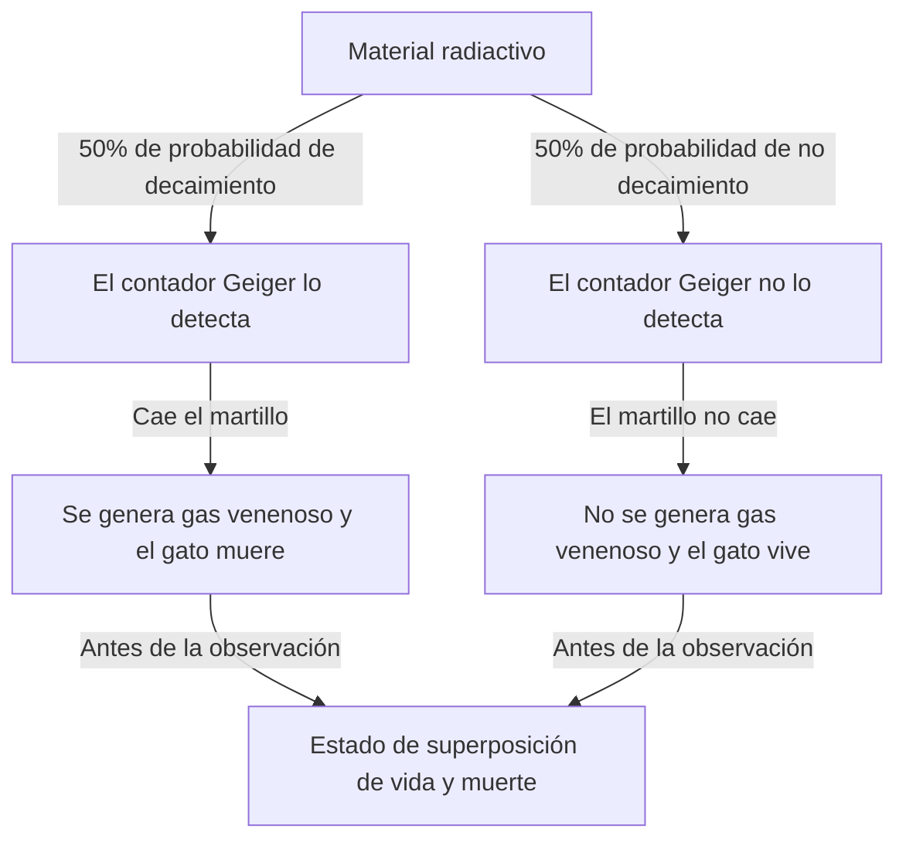
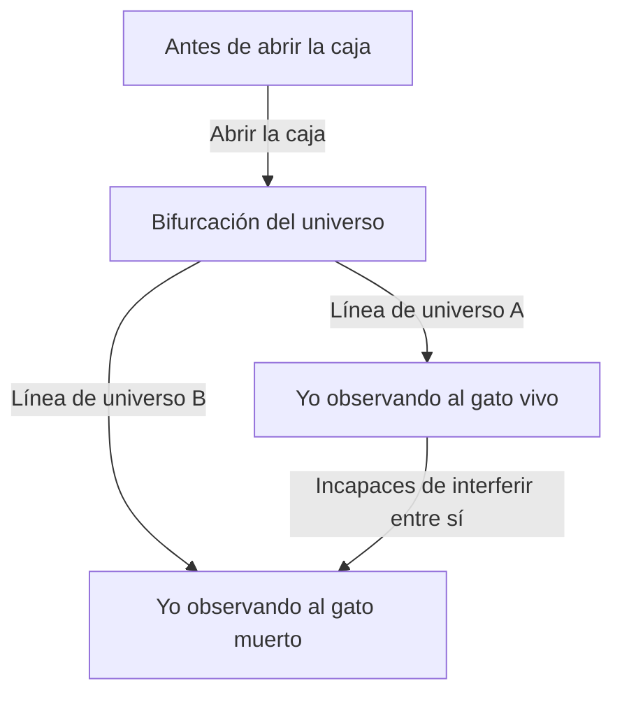

# El extremo norte de la mecánica cuántica: la paradoja de la realidad que plantea el gato de Schrödinger

El mundo microscópico donde nuestra intuición y sentido común no se aplican en absoluto, ese es el mundo de la mecánica cuántica. Y el experimento mental que lleva la rareza de esta mecánica cuántica a una escala cotidiana, y que ha seguido desconcertando no solo a los físicos sino también a los filósofos, es el "gato de Schrödinger". En este artículo, profundizaremos de manera extremadamente detallada y exhaustiva en esta famosa paradoja, desde sus orígenes hasta su significado físico y filosófico, llegando a sus interpretaciones modernas.

## Capítulo 1: ¿Qué es el gato de Schrödinger?

El "gato de Schrödinger" (Schrödinger's cat) es un experimento mental propuesto en 1935 por el físico austriaco Erwin Schrödinger. El propósito de este experimento era poner de relieve las contradicciones lógicas y la naturaleza contraintuitiva de la interpretación principal de la mecánica cuántica de la época (la interpretación de Copenhague).

### Configuración del experimento mental

Schrödinger imaginó la siguiente situación:

1. **Caja de acero**: Se prepara una caja completamente sellada cuyo interior no puede ser observado en absoluto desde el exterior.
2. **Gato vivo**: Se coloca un gato vivo dentro de la caja.
3. **Material radiactivo y contador Geiger**: Dentro de la caja, se instala una pequeña cantidad de material radiactivo que tiene un 50% de probabilidad de desintegrarse en una hora, junto con un contador Geiger para detectarlo.
4. **Frasco de gas venenoso (gas cianhídrico) y martillo**: Si el contador Geiger detecta la emisión de radiación (desintegración radiactiva), se activa un circuito de relé que deja caer un martillo para romper el frasco que contiene gas venenoso.

Después de una hora, ¿cuál será el estado dentro de esta caja?
Pensando con sentido común, el gato debería estar en uno de dos estados: "vivo" o "muerto". Sin embargo, si aplicamos estrictamente las leyes de la mecánica cuántica (la interpretación de Copenhague) a todo este sistema, se llega a una conclusión sorprendente.

La desintegración del material radiactivo es un fenómeno cuántico, y hasta que abrimos la caja para observar, el "estado desintegrado" y el "estado no desintegrado" existen como una **"superposición" (superposition)**. Por lo tanto, el gato, cuyo estado está vinculado a esto, también se encuentra en un **estado superpuesto de estar "vivo" y "muerto"** hasta que un humano abre la caja y lo observa.

## Capítulo 2: ¿Por qué surgió un experimento mental tan extraño?

El contexto en el que nació este experimento mental incluye el rápido desarrollo de la mecánica cuántica entre las décadas de 1920 y 1930, y las intensas disputas entre los físicos que lo acompañaron.

### El nacimiento de la interpretación de Copenhague

La "interpretación de Copenhague", construida principalmente por Niels Bohr y Werner Heisenberg, se convirtió en la interpretación estándar del marco matemático de la mecánica cuántica. Sus afirmaciones centrales son las siguientes:

1. **Función de onda y superposición**: Los sistemas cuánticos se describen mediante una herramienta matemática llamada "función de onda", y hasta que son observados, existen múltiples estados posibles superpuestos probabilísticamente.
2. **Colapso del paquete de ondas (problema de la medición)**: En el instante en que se realiza una medición u observación, el estado de superposición "colapsa" (collapse) en un único estado definitivo.
3. **Complementariedad**: Las propiedades como partícula y como onda no pueden ser observadas completamente al mismo tiempo, y se complementan entre sí.

### La insatisfacción de Einstein y Schrödinger

Albert Einstein criticó fuertemente esta "visión probabilística de la naturaleza" y el "colapso por observación" de la interpretación de Copenhague. Su famosa frase "Dios no juega a los dados" expresa su creencia de que las leyes de la física deberían ser deterministas.

El propio Schrödinger, quien descubrió la "ecuación de Schrödinger", la ecuación fundamental de la mecánica cuántica, sintió una fuerte resistencia a que la ecuación que él mismo creó se usara para una interpretación probabilística. A través de su correspondencia con Einstein, al introducir la incertidumbre del mundo microscópico (material radiactivo) en el mundo macroscópico (el gato), Schrödinger intentó señalar lo absurdo de la interpretación de Copenhague con el "gato de Schrödinger".

## Capítulo 3: Cuando las leyes de lo microscópico se propagan a lo macroscópico (entrelazamiento cuántico)

En el núcleo de la paradoja del gato de Schrödinger, el concepto de "entrelazamiento cuántico" (quantum entanglement) está profundamente involucrado.

Dentro de la caja, el estado del material radiactivo (desintegrado/no desintegrado) y el estado del gato (muerto/vivo) están fuertemente vinculados. En la mecánica cuántica, esta correlación en la que determinar uno inevitablemente determina el otro se llama "entrelazamiento".

La superposición cuántica microscópica del átomo radiactivo se amplifica a través de dispositivos macroscópicos como el contador Geiger, el circuito de relé y el martillo, y finalmente se expande (se propaga) a la superposición de vida y muerte del organismo biológico que es el gato. Schrödinger llamó a esto "ridículo" (ridiculous) y advirtió sobre el peligro de aplicar acríticamente las leyes microscópicas a objetos macroscópicos.

## Capítulo 4: ¿Cómo interpreta la física moderna al "gato"?

Incluso hoy, aproximadamente un siglo después de la época de Schrödinger, no existe una respuesta (interpretación) unificada y perfecta para esta paradoja. Sin embargo, en la física moderna, se está intentando resolver este problema a través de varios enfoques prometedores.

### 1. Perspectiva moderna de la interpretación de Copenhague

Desde la posición que mantiene la interpretación tradicional de Copenhague, el enfoque es "dónde se realizó la observación".
En realidad, la conciencia humana no es la única "observación". Es natural pensar que la "observación" ocurre en el momento en que el contador Geiger detecta la radiación, o en el momento en que interactúa con el entorno macroscópico, y que la función de onda colapsa en ese punto. En otras palabras, la idea es que dentro de la caja, la vida o la muerte del gato ya está determinada sin tener que esperar la observación humana.

### 2. Interpretación de los muchos mundos (Interpretación de Everett)

La "interpretación de los muchos mundos", propuesta por Hugh Everett III en 1957, ofrece una solución muy audaz.
Según esta interpretación, el colapso de la función de onda nunca ocurre. Afirma que en el instante en que se abre la caja, el universo mismo se divide (más bien existe en paralelo) en dos: "el universo del observador que ve al gato vivo" y "el universo del observador que ve al gato muerto".

La belleza de esta interpretación radica en que las ecuaciones de la mecánica cuántica (la ecuación de Schrödinger) se pueden aplicar sin ninguna alteración. Sin embargo, conlleva el costo filosófico de tener que aceptar la conclusión contraintuitiva de que "existen innumerables universos paralelos".

### 3. Decoherencia (Pérdida de la interferencia cuántica)

El proceso físico que se considera más importante en la teoría moderna de la información cuántica es la "decoherencia cuántica".
Para mantener un estado de superposición, el sistema debe estar completamente aislado del entorno externo. Sin embargo, un sistema gigante como un gato real está constantemente chocando e interactuando con las moléculas de aire y fotones circundantes.

La decoherencia es el fenómeno por el cual, debido a estas innumerables interacciones, la información sobre la "fase (coherencia como onda)" de la superposición se filtra hacia el entorno. Dado que la decoherencia ocurre en un tiempo extremadamente corto (prácticamente igual a cero para un sistema macroscópico como un gato), la superposición cuántica se destruye instantáneamente y transita a una probabilidad clásica (ya sea vivo o muerto). La teoría de la decoherencia explica bellamente "por qué no se observan superposiciones en el mundo macroscópico".

### 4. Teoría del colapso objetivo (Objective Collapse Theory)

Enfoques como la teoría GRW y la interpretación de Penrose sostienen que la función de onda colapsa naturalmente debido a un mecanismo físico, independientemente de si hay observación o no. Cuanto mayor sea la masa o la complejidad del sistema, más corto será el tiempo que tarda en colapsar. Las partículas microscópicas como los electrones pueden mantener la superposición durante un largo período, pero un objeto con una gran masa como un gato colapsa en un instante, por lo que explican que la superposición de vida y muerte no ocurre en la realidad.

## Capítulo 5: Aplicaciones del "gato de Schrödinger" en el mundo real

La "superposición de estados macroscópicos" que Schrödinger presentó como una paradoja se está convirtiendo en una realidad en la tecnología moderna.

### Aplicación a las computadoras cuánticas

El "cúbit" (qubit), la unidad básica de una computadora cuántica, realiza cálculos paralelos utilizando precisamente el "estado de superposición de 0 y 1". En los últimos años, se ha avanzado en la investigación que crea intencionalmente un "estado de gato de Schrödinger" (cat state) a una escala que normalmente sería macroscópica (o mesoscópica), como circuitos compuestos por muchos átomos o bucles superconductores, y lo utiliza para el cálculo y la corrección de errores.

A medida que refinamos nuestra tecnología y mejoramos nuestra capacidad para prevenir la decoherencia (aislándola completamente del entorno externo), el gato de Schrödinger se está transformando de un "extraño experimento mental" a un "recurso práctico de procesamiento de información".

## Capítulo 6: Repercusiones en la filosofía y la epistemología

El gato de Schrödinger va más allá de ser un simple problema de física y nos plantea profundas preguntas filosóficas: "¿Qué es la realidad?" y "¿Qué es la observación?".

Si la "observación" determina la realidad, ¿tiene la "conciencia" de nosotros los humanos, como observadores, un papel físico especial? (La paradoja del amigo de Wigner)
¿O es este mundo sólido que percibimos simplemente un aspecto de un vasto multiverso cuántico?

La mecánica cuántica sacudió la firme creencia en una "realidad objetiva e independiente" que la física clásica había construido. El gato de Schrödinger se encuentra en la vanguardia de esa sacudida y, aún hoy, nos sigue invitando a hacernos preguntas profundas.

## Conclusión: ¿Qué nos enseña el gato?

El gato de Schrödinger fue un experimento mental creado para exponer las imperfecciones de la mecánica cuántica. Sin embargo, irónicamente, se convirtió en la metáfora más poderosa para transmitir de manera intuitiva, incluso al público en general, la naturaleza más esencial y misteriosa de la mecánica cuántica.

El gato dentro de la caja nos enseña que la "realidad" que damos por sentada se basa en realidad en un equilibrio extremadamente delicado donde las fluctuaciones cuánticas microscópicas y el mundo clásico macroscópico se cruzan. Cada vez que la física se desarrolla y nacen nuevas interpretaciones y teorías, el gato de Schrödinger aparece ante nosotros con una nueva apariencia.

Sin duda, seguirá siendo la guía más misteriosa y fascinante en el viaje de la inteligencia humana en busca de la "verdadera naturaleza de la realidad".
