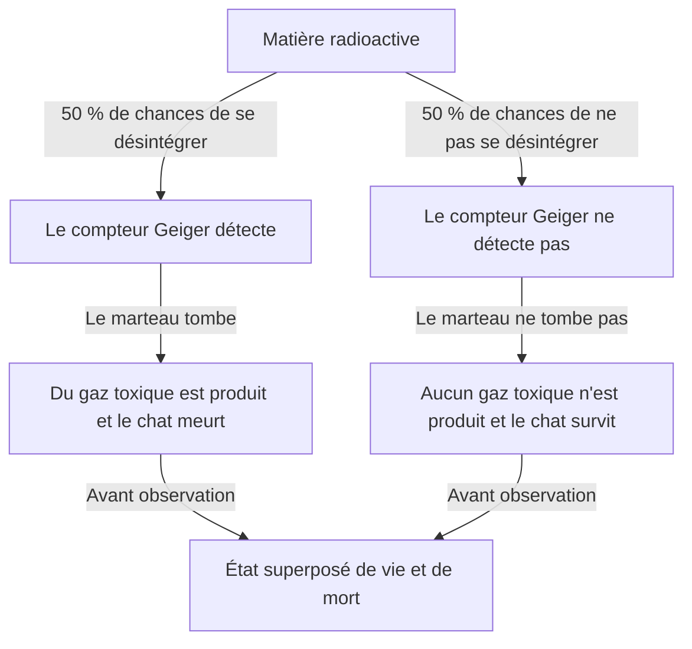
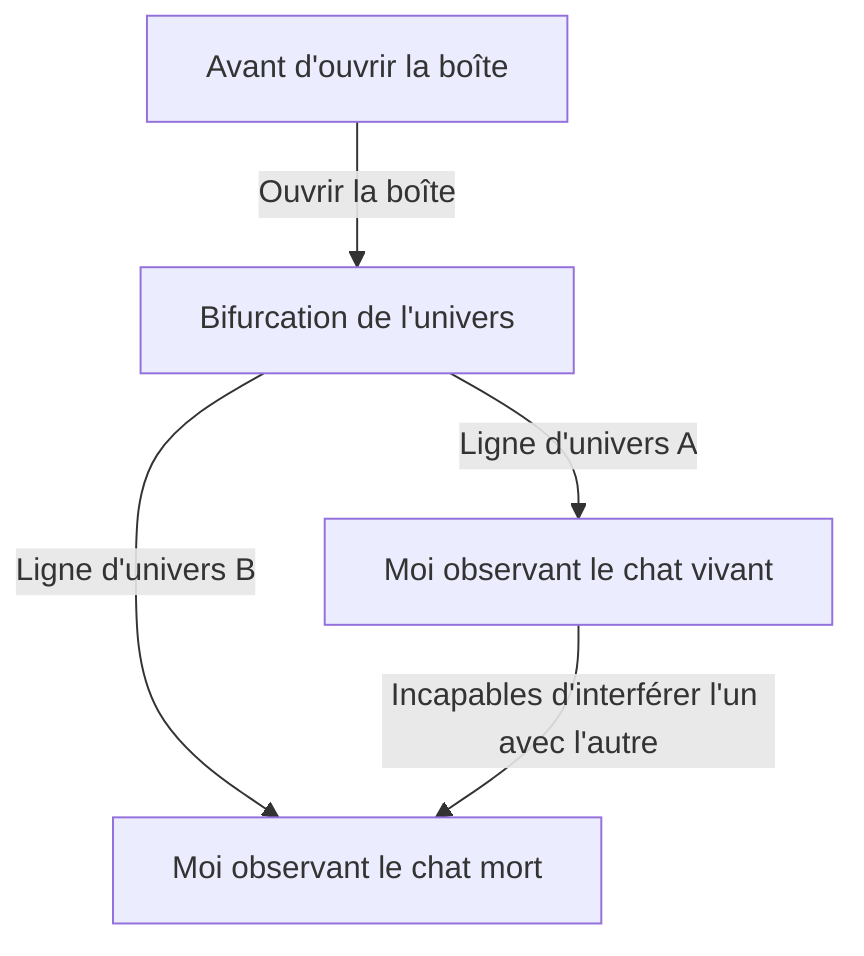

# L'Extrême Nord de la Mécanique Quantique : Le Paradoxe de la Réalité Posé par le Chat de Schrödinger

Le monde microscopique, où notre intuition et notre bon sens ne s'appliquent pas du tout, est celui de la mécanique quantique. Et l'expérience de pensée qui amène l'étrangeté de cette mécanique quantique à l'échelle quotidienne, et qui continue de troubler non seulement les physiciens mais aussi les philosophes, est le « Chat de Schrödinger ». Dans cet article, nous allons explorer en profondeur et de manière extrêmement détaillée ce paradoxe si célèbre, depuis ses origines jusqu'à sa signification physique et philosophique, et ses interprétations modernes.

## Chapitre 1 : Qu'est-ce que le Chat de Schrödinger ?

Le « Chat de Schrödinger » (Schrödinger's cat) est une expérience de pensée proposée en 1935 par le physicien autrichien Erwin Schrödinger. Le but de cette expérience était de mettre en évidence les contradictions logiques et la nature contre-intuitive de l'interprétation dominante de la mécanique quantique de l'époque (l'interprétation de Copenhague).

### Mise en place de l'expérience de pensée

Schrödinger a imaginé la situation suivante :

1. **Une boîte en acier** : Préparez une boîte complètement scellée, dont l'intérieur ne peut pas du tout être observé de l'extérieur.
2. **Un chat vivant** : Placez un chat vivant à l'intérieur de cette boîte.
3. **Matière radioactive et compteur Geiger** : Dans la boîte, il y a une petite quantité de matière radioactive ayant 50 % de chances de se désintégrer en moins d'une heure, ainsi qu'un compteur Geiger pour la détecter.
4. **Fiole de gaz toxique (cyanure) et marteau** : Si le compteur Geiger détecte l'émission de radiations (désintégration radioactive), un circuit de relais s'active, faisant tomber un marteau qui brise la fiole contenant le gaz toxique.

Après une heure, que se passe-t-il à l'intérieur de cette boîte ?
Selon le bon sens, le chat devrait être soit « vivant » soit « mort ». Cependant, si l'on applique strictement les lois de la mécanique quantique (interprétation de Copenhague) à l'ensemble de ce système, une conclusion surprenante est tirée.

La désintégration de la matière radioactive est un phénomène quantique, et jusqu'à ce que l'on ouvre la boîte pour l'observer, l'état « désintégré » et l'état « non désintégré » existent en tant que **« superposition » (superposition)**. Par conséquent, le chat qui est lié à cet état est également, jusqu'à ce qu'un humain ouvre la boîte pour l'observer, dans **un état superposé de « vivant » et de « mort »**.

## Chapitre 2 : Pourquoi une expérience de pensée aussi étrange a-t-elle vu le jour ?

Le contexte de la création de cette expérience de pensée était le développement rapide de la mécanique quantique dans les années 1920 et 1930, et les débats intenses entre physiciens qui l'ont accompagné.

### Naissance de l'interprétation de Copenhague

L'« interprétation de Copenhague », construite principalement par Niels Bohr et Werner Heisenberg, est devenue l'interprétation standard du cadre mathématique de la mécanique quantique. Ses affirmations centrales sont les suivantes :

1. **Fonction d'onde et superposition** : Un système quantique est décrit par un outil mathématique appelé « fonction d'onde », et jusqu'à ce qu'il soit observé, de multiples états possibles existent de manière superposée et probabiliste.
2. **Réduction du paquet d'ondes (problème de la mesure)** : Au moment où une mesure ou une observation est effectuée, l'état superposé se « réduit » (collapse) à un seul état certain.
3. **Complémentarité** : La nature particulaire et la nature ondulatoire ne peuvent pas être parfaitement observées simultanément, et ont une relation de complémentarité.

### L'insatisfaction d'Einstein et Schrödinger

Albert Einstein a fortement critiqué la « vision probabiliste de la nature » et la « réduction par l'observation » de cette interprétation de Copenhague. Sa célèbre phrase, « Dieu ne joue pas aux dés », exprime sa conviction que les lois de la physique devraient être déterministes.

Schrödinger lui-même, qui a découvert l'« équation de Schrödinger », l'équation fondamentale de la mécanique quantique, a ressenti une forte résistance à l'idée que l'équation qu'il avait créée soit utilisée pour une interprétation probabiliste. En échangeant des lettres avec Einstein, c'est ce « Chat de Schrödinger » qu'il a imaginé pour souligner l'absurdité de l'interprétation de Copenhague en introduisant l'incertitude du monde microscopique (matière radioactive) dans le monde macroscopique (chat).

## Chapitre 3 : Quand les lois du microcosme se propagent au macrocosme (Intrication quantique)

Au cœur du paradoxe du chat de Schrödinger se trouve le concept d'« intrication quantique » (entanglement).

Dans la boîte, l'état de la matière radioactive (désintégrée / non désintégrée) et l'état du chat (mort / vivant) sont fortement liés. Si l'un est déterminé, l'autre l'est aussi nécessairement. Cette corrélation est appelée « intrication » en mécanique quantique.

La superposition quantique microscopique des atomes radioactifs est amplifiée par des dispositifs macroscopiques tels que le compteur Geiger, le circuit de relais et le marteau, et finit par s'étendre (se propager) à la superposition de la vie et de la mort d'un organisme, le chat. Schrödinger a qualifié cela de « ridicule » et a mis en garde contre le danger d'appliquer sans esprit critique les lois microscopiques aux objets macroscopiques.

## Chapitre 4 : Comment la physique moderne interprète-t-elle le « chat » ?

Même près d'un siècle après l'époque de Schrödinger, il n'existe toujours pas de réponse (interprétation) parfaite et unifiée à ce paradoxe. Cependant, la physique moderne tente de résoudre ce problème par plusieurs approches influentes.

### 1. Point de vue moderne sur l'interprétation de Copenhague

Du point de vue du maintien de l'interprétation traditionnelle de Copenhague, l'accent est mis sur « où l'observation a-t-elle lieu ».
En réalité, la conscience humaine n'est pas la seule « observation ». Il est naturel de penser que l'« observation » a lieu au moment où le compteur Geiger détecte un rayonnement, ou lorsqu'il interagit avec l'environnement macroscopique, et que la fonction d'onde se réduit à ce moment-là. Autrement dit, dans la boîte, sans attendre l'observation humaine, la vie ou la mort du chat est déjà déterminée.

### 2. L'interprétation des mondes multiples (Interprétation d'Everett)

L'« interprétation des mondes multiples » proposée par Hugh Everett III en 1957 offre une solution très audacieuse.
Selon l'interprétation des mondes multiples, la réduction de la fonction d'onde ne se produit jamais. Au moment où vous ouvrez la boîte, l'univers lui-même se divise (ou plutôt, existe en parallèle) en deux : « l'univers de l'observateur qui voit un chat vivant » et « l'univers de l'observateur qui voit un chat mort ».

La beauté de cette interprétation est qu'elle permet d'appliquer les équations de la mécanique quantique (l'équation de Schrödinger) sans y toucher. Cependant, cela s'accompagne du coût philosophique de devoir accepter la conclusion contre-intuitive qu'« un nombre infini d'univers parallèles existe ».

### 3. Décohérence (Perte de l'interférence quantique)

Le processus physique considéré comme le plus important dans la théorie moderne de l'information quantique est la « décohérence quantique ».
Pour maintenir un état superposé, le système doit être complètement isolé de l'environnement extérieur. Cependant, un système massif comme un vrai chat entre constamment en collision et interagit avec les molécules d'air et les photons environnants.

Le phénomène par lequel les informations concernant la « phase (cohérence en tant qu'onde) » de la superposition fuient dans l'environnement à cause de ces innombrables interactions est la décohérence. Étant donné que la décohérence se produit en un temps extrêmement court (virtuellement nul pour un système macroscopique comme un chat), la superposition quantique est instantanément détruite, passant à une probabilité classique (soit vivant, soit mort). La théorie de la décohérence explique magnifiquement « pourquoi nous ne voyons pas de superpositions dans le monde macroscopique ».

### 4. Théorie de la réduction objective (Objective Collapse Theory)

Cette approche, qui inclut la théorie GRW et l'interprétation de Penrose, postule que la fonction d'onde se réduit naturellement via un mécanisme physique, qu'il y ait eu observation ou non. Plus la masse ou la complexité d'un système est grande, plus le temps de réduction est court. Les particules microscopiques comme les électrons peuvent maintenir une superposition pendant de longues périodes, mais un objet de grande masse comme un chat se réduisant en un instant, on explique que la superposition de la vie et de la mort ne se produit pas en réalité.

## Chapitre 5 : Applications du « Chat de Schrödinger » dans le monde réel

La « superposition d'états macroscopiques » que Schrödinger a présentée comme un paradoxe est en train de devenir une réalité dans la technologie moderne.

### Applications à l'informatique quantique

Le « qubit », l'unité de base d'un ordinateur quantique, effectue des calculs parallèles en utilisant précisément l'« état superposé de 0 et 1 ». Ces dernières années, des recherches ont progressé sur la création intentionnelle d'un « état du chat de Schrödinger (cat state) » à une échelle normalement macroscopique (ou mésoscopique), comme des circuits constitués de nombreux atomes ou des boucles supraconductrices, et sur son utilisation pour le calcul et la correction d'erreurs.

À mesure que nous affinons notre technologie et améliorons notre capacité à prévenir la décohérence (à isoler complètement de l'environnement extérieur), le Chat de Schrödinger se transforme d'une « étrange expérience de pensée » en une « ressource pratique pour le traitement de l'information ».

## Chapitre 6 : Répercussions sur la philosophie et l'épistémologie

Le Chat de Schrödinger dépasse le cadre d'un simple problème de physique pour nous confronter à de profondes questions philosophiques : « Qu'est-ce que la réalité ? » et « Qu'est-ce que l'observation ? ».

Si l'« observation » détermine la réalité, la « conscience » de nous, les humains en tant qu'observateurs, a-t-elle un rôle physique particulier ? (Le paradoxe de l'ami de Wigner)
Ou bien, ce monde solide que nous percevons n'est-il qu'une facette parmi d'autres dans un vaste multivers quantique ?

La mécanique quantique a ébranlé la ferme conviction de la physique classique en une « réalité objective et indépendante ». Le Chat de Schrödinger se tient à l'avant-garde de ce bouleversement et continue de nous inviter, encore aujourd'hui, vers des questionnements abyssaux.

## Conclusion : Que nous enseigne le chat ?

Le Chat de Schrödinger était une expérience de pensée conçue pour exposer l'incomplétude de la mécanique quantique. Mais ironiquement, il a fini par fonctionner comme la métaphore la plus puissante pour communiquer intuitivement les propriétés les plus essentielles et mystérieuses de la mécanique quantique au grand public.

Le chat dans la boîte nous enseigne que la « réalité » que nous tenons pour acquise repose en fait sur un équilibre extrêmement délicat où se croisent les fluctuations quantiques microscopiques et le monde classique macroscopique. À chaque développement de la physique et à chaque nouvelle interprétation ou théorie, le Chat de Schrödinger nous apparaît sous un nouveau jour.

Il continuera sans aucun doute d'être le repère le plus mystérieux et fascinant dans le voyage de l'intellect humain à la recherche de la « véritable nature de la réalité ».
