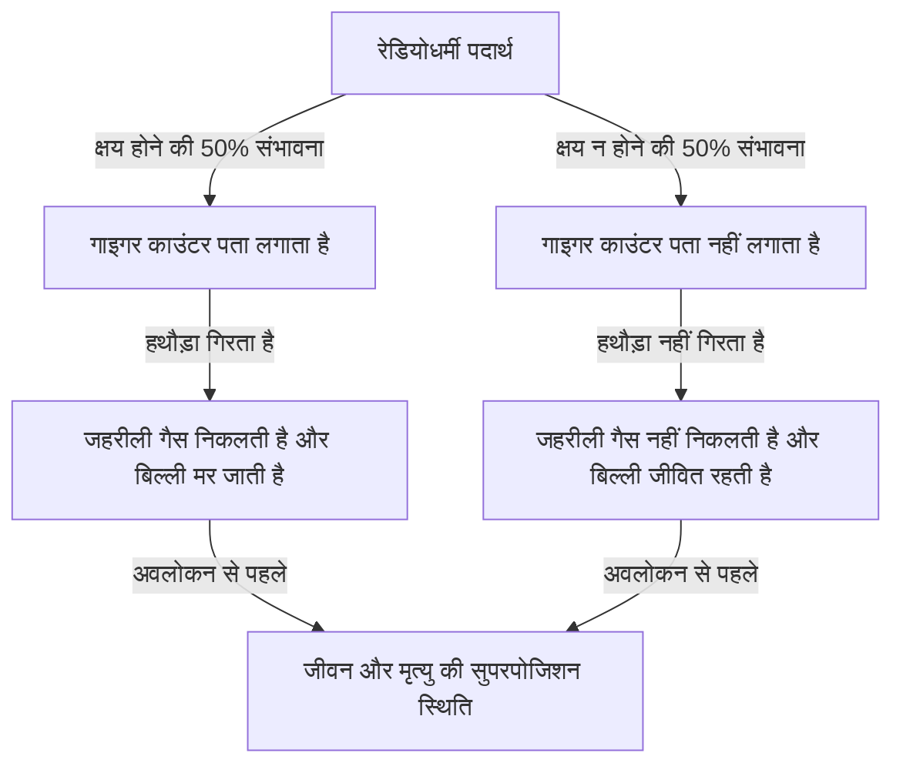
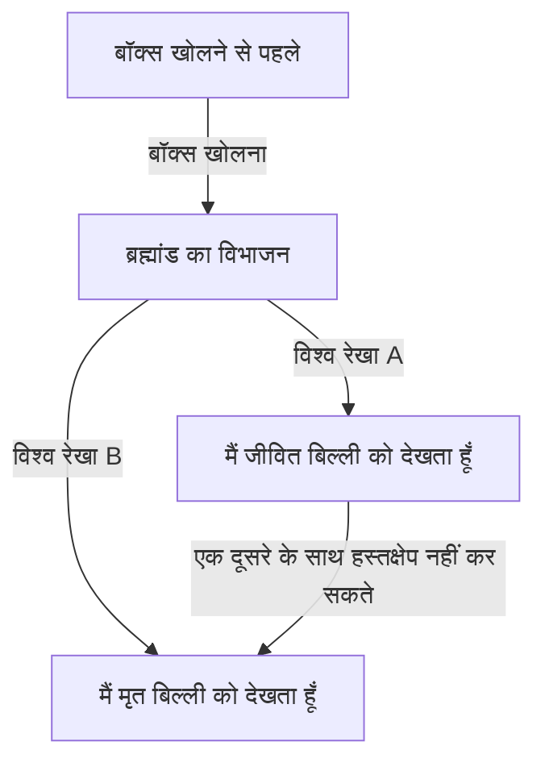

# क्वांटम मैकेनिक्स का सुदूर उत्तर: श्रोडिंगर की बिल्ली द्वारा प्रस्तुत वास्तविकता का विरोधाभास

सूक्ष्म दुनिया जहां हमारी अंतर्ज्ञान और सामान्य ज्ञान बिल्कुल भी काम नहीं करते हैं, वह क्वांटम यांत्रिकी की दुनिया है। और वह विचार प्रयोग जो क्वांटम यांत्रिकी की इस विचित्रता को रोजमर्रा के पैमाने पर लाता है और न केवल भौतिकविदों बल्कि दार्शनिकों को भी परेशान करता आ रहा है, वह "श्रोडिंगर की बिल्ली" है। इस लेख में, हम इस बहुत प्रसिद्ध विरोधाभास के बारे में इसकी उत्पत्ति से लेकर इसके भौतिक और दार्शनिक अर्थ और आधुनिक व्याख्याओं तक बहुत गहराई और विस्तार से जानेंगे।

## अध्याय 1: श्रोडिंगर की बिल्ली क्या है?

"श्रोडिंगर की बिल्ली" 1935 में ऑस्ट्रियाई भौतिक विज्ञानी एर्विन श्रोडिंगर द्वारा प्रस्तावित एक विचार प्रयोग है। इस प्रयोग का उद्देश्य उस समय की क्वांटम यांत्रिकी की मुख्यधारा की व्याख्या (कोपेनहेगन व्याख्या) के तार्किक अंतर्विरोधों और इसके अंतर्ज्ञान-विरोधी स्वभाव को उजागर करना था।

### विचार प्रयोग का सेटअप

श्रोडिंगर ने निम्नलिखित स्थिति की कल्पना की:

1. **स्टील का बॉक्स**: एक पूरी तरह से सील किया गया बॉक्स तैयार किया जाता है जिसके अंदर की चीजों को बाहर से बिल्कुल नहीं देखा जा सकता।
2. **जीवित बिल्ली**: उस बॉक्स में एक जीवित बिल्ली को रखा जाता है।
3. **रेडियोधर्मी पदार्थ और गाइगर काउंटर**: बॉक्स के अंदर, थोड़ी मात्रा में रेडियोधर्मी पदार्थ रखा जाता है जिसके एक घंटे के भीतर क्षय होने की 50% संभावना होती है, और इसका पता लगाने के लिए एक गाइगर काउंटर स्थापित किया जाता है।
4. **जहरीली गैस (हाइड्रोजन साइनाइड) की शीशी और हथौड़ा**: जब गाइगर काउंटर विकिरण के उत्सर्जन (रेडियोधर्मी क्षय) का पता लगाता है, तो एक रिले सर्किट सक्रिय होता है और एक हथौड़ा गिरकर जहरीली गैस की शीशी को तोड़ देता है।

1 घंटे बाद, इस बॉक्स के अंदर क्या हो रहा होगा?
सामान्य ज्ञान से सोचें तो बिल्ली को "जीवित" या "मृत" में से किसी एक स्थिति में होना चाहिए। हालांकि, यदि आप क्वांटम यांत्रिकी के नियमों (कोपेनहेगन व्याख्या) को इस पूरी प्रणाली पर सख्ती से लागू करते हैं, तो एक आश्चर्यजनक निष्कर्ष निकलता है।

रेडियोधर्मी पदार्थ का क्षय एक क्वांटम यांत्रिक घटना है, और जब तक आप बॉक्स को खोलकर अवलोकन नहीं करते, तब तक "क्षय हुई स्थिति" और "क्षय न हुई स्थिति" एक **"सुपरपोजिशन"** के रूप में एक साथ मौजूद होती हैं। और यह कहा जाता है कि बिल्ली भी, जो उस स्थिति से जुड़ी हुई है, जब तक कि इंसान बॉक्स को खोलकर उसे नहीं देखता, तब तक **"जीवित स्थिति" और "मृत स्थिति" के ओवरलैप (सुपरपोजिशन)** में होती है।

## अध्याय 2: ऐसा अजीब विचार प्रयोग क्यों पैदा हुआ?

इस विचार प्रयोग की पृष्ठभूमि 1920 और 30 के दशक में क्वांटम यांत्रिकी का तेजी से विकास था, और इसके साथ ही भौतिकविदों के बीच भयंकर बहसें हुईं।

### कोपेनहेगन व्याख्या का जन्म

नील्स बोहर और वर्नर हाइजेनबर्ग द्वारा निर्मित "कोपेनहेगन व्याख्या", क्वांटम यांत्रिकी के गणितीय ढांचे की मानक व्याख्या बन गई। इसके मुख्य दावे इस प्रकार हैं:

1. **तरंग फलन और सुपरपोजिशन**: क्वांटम प्रणालियों को "तरंग फलन" नामक एक गणितीय उपकरण द्वारा वर्णित किया जाता है, और जब तक उनका अवलोकन नहीं किया जाता है, तब तक कई संभावित स्थितियां संभाव्य रूप से एक साथ मौजूद रहती हैं।
2. **तरंग फलन का पतन (अवलोकन समस्या)**: जिस क्षण मापन या अवलोकन किया जाता है, सुपरपोजिशन की स्थिति केवल एक निश्चित स्थिति में "सिकुड़ (collapse)" जाती है।
3. **पूरकता**: कण जैसी प्रकृति और तरंग जैसी प्रकृति को एक ही समय में पूरी तरह से नहीं देखा जा सकता है, और वे एक दूसरे के पूरक हैं।

### आइंस्टीन और श्रोडिंगर का असंतोष

अल्बर्ट आइंस्टीन ने कोपेनहेगन व्याख्या के इस "प्रकृति के संभाव्य दृष्टिकोण" और "अवलोकन द्वारा पतन" की कड़ी आलोचना की। उनका प्रसिद्ध कथन, "भगवान पासा नहीं खेलते हैं", इस विश्वास को व्यक्त करता है कि भौतिकी के नियम नियतात्मक होने चाहिए।

श्रोडिंगर ने खुद, जिन्होंने क्वांटम यांत्रिकी के मौलिक समीकरण, "श्रोडिंगर समीकरण" की खोज की थी, अपने द्वारा बनाए गए समीकरण की संभाव्य व्याख्या के लिए इस्तेमाल किए जाने का कड़ा विरोध किया। आइंस्टीन के साथ पत्राचार में, श्रोडिंगर ने सूक्ष्म दुनिया (रेडियोधर्मी पदार्थ) की अनिश्चितता को स्थूल दुनिया (बिल्ली) में लाकर कोपेनहेगन व्याख्या की बेरुखी की ओर इशारा करने की कोशिश की, और यही "श्रोडिंगर की बिल्ली" थी।

## अध्याय 3: जब सूक्ष्म नियम स्थूल पर प्रभाव डालते हैं (क्वांटम उलझाव)

श्रोडिंगर की बिल्ली के विरोधाभास के मूल में "क्वांटम उलझाव" की अवधारणा गहराई से शामिल है।

बॉक्स के अंदर, रेडियोधर्मी पदार्थ की स्थिति (क्षय हुआ / नहीं हुआ) और बिल्ली की स्थिति (मृत / जीवित) दृढ़ता से जुड़ी हुई है। यदि एक निर्धारित हो जाता है, तो दूसरा भी आवश्यक रूप से निर्धारित हो जाएगा। क्वांटम यांत्रिकी में इस सहसंबंध को "उलझाव" कहा जाता है।

रेडियोधर्मी परमाणुओं का सूक्ष्म क्वांटम सुपरपोजिशन स्थूल उपकरणों जैसे गाइगर काउंटर, रिले सर्किट और हथौड़े के माध्यम से प्रवर्धित हो जाता है, और अंततः एक जीवित प्राणी, बिल्ली के जीवन और मृत्यु के सुपरपोजिशन तक फैल जाता है। श्रोडिंगर ने इसे "हास्यास्पद" कहा और सूक्ष्म नियमों को बिना सोचे-समझे स्थूल वस्तुओं पर लागू करने के खतरे की चेतावनी दी।

## अध्याय 4: आधुनिक भौतिकी "बिल्ली" की व्याख्या कैसे करती है?

श्रोडिंगर के समय से लगभग एक सदी बीत जाने के बाद भी, इस विरोधाभास का कोई एक एकीकृत और सही उत्तर (व्याख्या) नहीं है। हालांकि, आधुनिक भौतिकी कई प्रमुख दृष्टिकोणों के माध्यम से इस समस्या को हल करने का प्रयास कर रही है।

### 1. कोपेनहेगन व्याख्या का आधुनिक दृष्टिकोण

पारंपरिक कोपेनहेगन व्याख्या को बनाए रखने के दृष्टिकोण से, ध्यान इस बात पर होता है कि "अवलोकन कहां किया गया था।"
वास्तव में, केवल मानवीय चेतना ही "अवलोकन" नहीं है। यह सोचना स्वाभाविक है कि जिस क्षण गाइगर काउंटर ने विकिरण का पता लगाया, या जिस क्षण यह स्थूल वातावरण के साथ बातचीत करता है, "अवलोकन" किया गया है, और तरंग फलन उस बिंदु पर ढह जाता है। दूसरे शब्दों में, यह विचार है कि मानव के अवलोकन की प्रतीक्षा किए बिना, बॉक्स के अंदर बिल्ली का जीवन या मृत्यु पहले से ही तय है।

### 2. कई दुनिया की व्याख्या (Everett interpretation)

1957 में ह्यूग एवरेट III द्वारा प्रस्तावित "कई दुनिया की व्याख्या", एक बहुत ही साहसिक समाधान प्रस्तुत करती है।
कई दुनिया की व्याख्या के अनुसार, तरंग फलन का पतन कभी नहीं होता है। जिस क्षण बॉक्स खोला जाता है, ब्रह्मांड स्वयं दो में विभाजित हो जाता है (या यों कहें, समानांतर रूप से मौजूद होता है): "वह ब्रह्मांड जिसमें पर्यवेक्षक एक जीवित बिल्ली देखता है" और "वह ब्रह्मांड जिसमें पर्यवेक्षक एक मृत बिल्ली देखता है।"

इस व्याख्या की सुंदरता इस तथ्य में निहित है कि क्वांटम यांत्रिकी के समीकरणों (श्रोडिंगर समीकरण) को बिना किसी बदलाव के लागू किया जा सकता है। हालांकि, यह उस दार्शनिक लागत के साथ आता है जिसमें "अनगिनत समानांतर ब्रह्मांड मौजूद हैं" के अंतर्ज्ञान-विरोधी निष्कर्ष को स्वीकार करना पड़ता है।

### 3. डिकोहेरेंस (क्वांटम हस्तक्षेप का नुकसान)

आधुनिक क्वांटम सूचना सिद्धांत में सबसे महत्वपूर्ण भौतिक प्रक्रिया "क्वांटम डिकोहेरेंस" है।
सुपरपोजिशन की स्थिति को बनाए रखने के लिए, सिस्टम को बाहरी वातावरण से पूरी तरह से अलग किया जाना चाहिए। हालांकि, बिल्ली जैसी वास्तविक, बड़ी प्रणालियां लगातार आसपास के वायु अणुओं और फोटॉनों से टकराती और बातचीत करती रहती हैं।

यह अनगिनत अंतःक्रियाएं एक ऐसी घटना का कारण बनती हैं जिसे डिकोहेरेंस कहा जाता है, जहां सुपरपोजिशन के "चरण (एक तरंग के रूप में हस्तक्षेप)" के बारे में जानकारी पर्यावरण में लीक हो जाती है। चूंकि डिकोहेरेंस बेहद कम समय (बिल्ली जैसी स्थूल प्रणाली में लगभग शून्य के बराबर समय) में होता है, क्वांटम सुपरपोजिशन तुरंत टूट जाता है और एक शास्त्रीय संभावना (या तो जीवित या मृत) में स्थानांतरित हो जाता है। डिकोहेरेंस सिद्धांत खूबसूरती से बताता है कि "हम स्थूल दुनिया में सुपरपोजिशन क्यों नहीं देखते हैं।"

### 4. वस्तुनिष्ठ पतन सिद्धांत (Objective Collapse Theory)

यह एक ऐसा दृष्टिकोण है, जैसे जीआरडब्ल्यू सिद्धांत या पेनरोज़ की व्याख्या, कि तरंग फलन स्वाभाविक रूप से भौतिक तंत्र द्वारा सिकुड़ जाता है, चाहे कोई अवलोकन किया गया हो या नहीं। प्रणाली का द्रव्यमान और जटिलता जितनी अधिक होगी, ढहने में उतना ही कम समय लगेगा। इलेक्ट्रॉन जैसे सूक्ष्म कण लंबे समय तक सुपरपोजिशन बनाए रख सकते हैं, लेकिन बिल्ली जैसी बड़ी द्रव्यमान वाली वस्तुएं एक पल में ढह जाती हैं, इसलिए यह बताता है कि जीवन और मृत्यु का सुपरपोजिशन वास्तव में नहीं होता है।

## अध्याय 5: "श्रोडिंगर की बिल्ली" के वास्तविक दुनिया के अनुप्रयोग

श्रोडिंगर द्वारा एक विरोधाभास के रूप में प्रस्तुत "स्थूल अवस्थाओं का सुपरपोजिशन", आधुनिक तकनीक में एक वास्तविकता बनता जा रहा है।

### क्वांटम कंप्यूटरों में अनुप्रयोग

"क्वांटम बिट्स", जो क्वांटम कंप्यूटरों की मूल इकाई हैं, समानांतर गणना करने के लिए "0 और 1 की सुपरपोजिशन स्थिति" का उपयोग करते हैं। हाल के वर्षों में, जानबूझकर "श्रोडिंगर की बिल्ली की स्थिति" को एक स्थूल (या मेसोस्कोपिक) पैमाने पर बनाने के लिए शोध चल रहा है, जैसे कि कई परमाणुओं से बने सर्किट या सुपरकंडक्टिंग लूप, और उन्हें गणना और त्रुटि सुधार के लिए उपयोग किया जा रहा है।

जैसे-जैसे हम अपनी तकनीक को परिष्कृत करते हैं और डिकोहेरेंस को रोकने (बाहरी वातावरण से पूरी तरह से अलग करने) की अपनी क्षमता में सुधार करते हैं, श्रोडिंगर की बिल्ली एक "अजीब विचार प्रयोग" से "एक व्यावहारिक सूचना प्रसंस्करण संसाधन" में बदल रही है।

## अध्याय 6: दर्शन और ज्ञानमीमांसा पर प्रभाव

भौतिकी की एक मात्र समस्या से परे जाकर, श्रोडिंगर की बिल्ली हमारे सामने गहन दार्शनिक प्रश्न प्रस्तुत करती है: "वास्तविकता क्या है?" और "अवलोकन क्या है?"

यदि "अवलोकन" वास्तविकता को निर्धारित करता है, तो क्या पर्यवेक्षकों के रूप में हम मनुष्यों की "चेतना" की कोई विशेष भौतिक भूमिका है? (विग्नर के मित्र का विरोधाभास)
या क्या यह ठोस दुनिया जिसे हम देखते हैं, एक विशाल क्वांटम मल्टीवर्स (कई दुनिया) का सिर्फ एक पहलू है?

क्वांटम यांत्रिकी ने शास्त्रीय भौतिकी द्वारा स्थापित "उद्देश्य और स्वतंत्र वास्तविकता" के दृढ़ विश्वास को हिलाकर रख दिया है। श्रोडिंगर की बिल्ली इस उथल-पुथल में सबसे आगे खड़ी है, और हमें अब भी गहन सवालों की ओर आमंत्रित करती है।

## निष्कर्ष: बिल्ली हमें क्या सिखाती है?

श्रोडिंगर की बिल्ली क्वांटम यांत्रिकी की अपूर्णता को उजागर करने के लिए बनाया गया एक विचार प्रयोग था। विडंबना यह है कि यह आम लोगों को क्वांटम यांत्रिकी के सबसे आवश्यक और रहस्यमय गुणों को सहज रूप से संप्रेषित करने के लिए सबसे मजबूत रूपक के रूप में कार्य करने लगा।

बॉक्स में बिल्ली हमें सिखाती है कि हम जिस "वास्तविकता" को हल्के में लेते हैं, वह वास्तव में सूक्ष्म क्वांटम उतार-चढ़ाव और स्थूल शास्त्रीय दुनिया के प्रतिच्छेदन में बहुत ही नाजुक संतुलन पर बनी है। हर बार जब भौतिकी विकसित होती है और नई व्याख्याएं या सिद्धांत पैदा होते हैं, तो श्रोडिंगर की बिल्ली हमारे सामने एक नए रूप में प्रकट होती है।

यह मानव बुद्धि की "वास्तविकता की वास्तविक प्रकृति" को खोजने की यात्रा में सबसे रहस्यमय और आकर्षक मार्गदर्शक बनी रहेगी।
