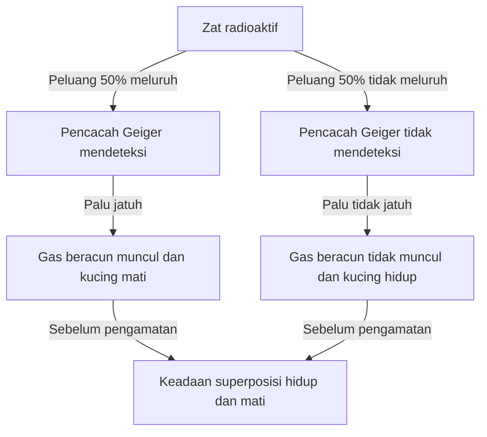
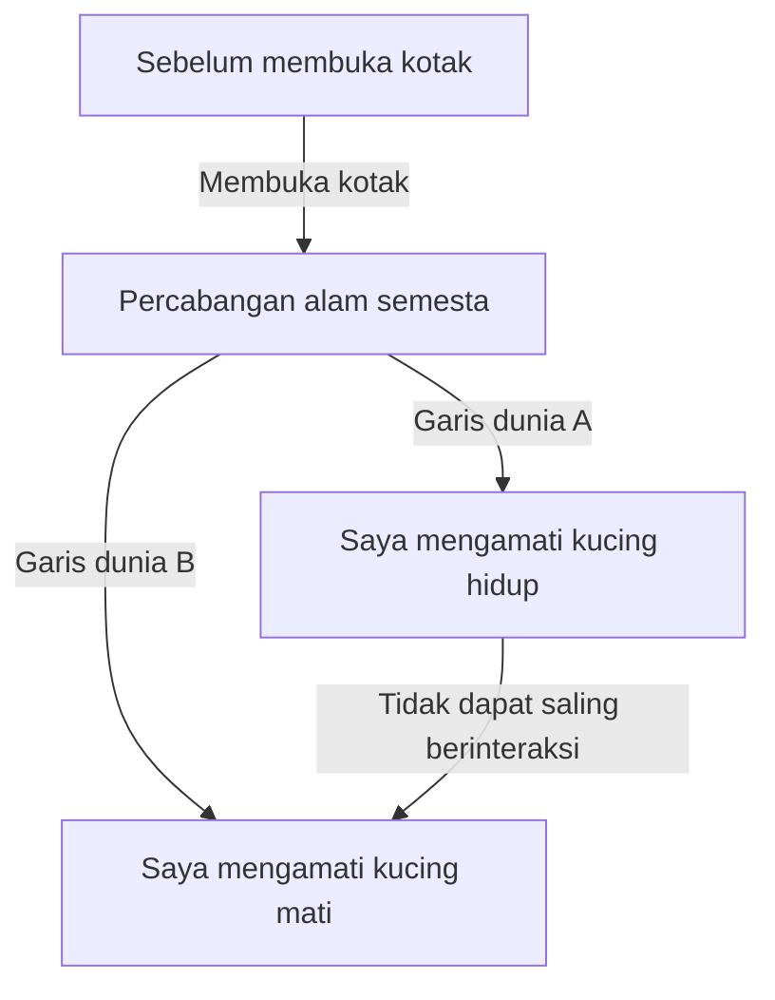

# Kutub Utara Mekanika Kuantum: Paradoks Realitas yang Dihadapkan oleh Kucing Schrödinger

Dunia mikro di mana intuisi dan akal sehat kita sama sekali tidak berlaku, itulah dunia mekanika kuantum. Dan eksperimen pemikiran yang membawa keanehan mekanika kuantum tersebut ke dalam skala sehari-hari, yang terus membingungkan tidak hanya para fisikawan tetapi juga para filsuf, adalah "Kucing Schrödinger". Dalam artikel ini, kita akan menggali lebih dalam secara detail dan menyeluruh mengenai paradoks yang sangat terkenal ini, mulai dari asal-usulnya, makna fisik dan filosofisnya, hingga interpretasi modern.

## Bab 1: Apa itu Kucing Schrödinger?

"Kucing Schrödinger (Schrödinger's cat)" adalah sebuah eksperimen pemikiran yang diajukan oleh fisikawan Austria, Erwin Schrödinger, pada tahun 1935. Tujuan dari eksperimen ini adalah untuk menyoroti kontradiksi logis dan sifat-sifat yang berlawanan dengan intuisi yang terdapat dalam interpretasi arus utama mekanika kuantum pada saat itu (Interpretasi Kopenhagen).

### Pengaturan Eksperimen Pemikiran

Schrödinger membayangkan situasi berikut:

1. **Kotak baja**: Siapkan sebuah kotak tertutup rapat di mana bagian dalamnya sama sekali tidak dapat diamati dari luar.
2. **Kucing hidup**: Masukkan seekor kucing yang masih hidup ke dalam kotak tersebut.
3. **Zat radioaktif dan Pencacah Geiger**: Di dalam kotak, terdapat sejumlah kecil zat radioaktif yang memiliki peluang 50% untuk meluruh dalam waktu 1 jam, dan sebuah Pencacah Geiger untuk mendeteksinya.
4. **Botol gas beracun (gas asam sianida) dan palu**: Jika Pencacah Geiger mendeteksi emisi radiasi (peluruhan radioaktif), sebuah sirkuit relai akan terpicu, dan sebuah mekanisme dibuat di mana palu akan jatuh untuk memecahkan botol berisi gas beracun.

Setelah 1 jam, apa yang terjadi di dalam kotak ini?
Menurut akal sehat, kucing tersebut seharusnya berada dalam salah satu keadaan, entah itu "hidup" atau "mati". Namun, jika hukum mekanika kuantum (Interpretasi Kopenhagen) diterapkan secara ketat pada keseluruhan sistem ini, sebuah kesimpulan yang mengejutkan akan ditarik.

Peluruhan zat radioaktif adalah fenomena kuantum, dan hingga kotak dibuka dan diamati, keadaan "meluruh" dan "tidak meluruh" ada sebagai **"superposisi (superposition)"**. Dan kucing yang terhubung dengan keadaan tersebut juga berada dalam **keadaan superposisi antara "hidup" dan "mati"** hingga kotak dibuka dan manusia mengamatinya.

## Bab 2: Mengapa Eksperimen Pemikiran yang Aneh Ini Lahir?

Latar belakang lahirnya eksperimen pemikiran ini adalah perkembangan pesat mekanika kuantum pada tahun 1920-an hingga 30-an, dan perdebatan sengit di antara para fisikawan yang menyertainya.

### Lahirnya Interpretasi Kopenhagen

"Interpretasi Kopenhagen" yang dibangun terutama oleh Niels Bohr dan Werner Heisenberg menjadi interpretasi standar untuk kerangka matematis mekanika kuantum. Klaim utamanya adalah sebagai berikut:

1. **Fungsi gelombang dan superposisi**: Sistem kuantum dideskripsikan oleh alat matematika yang disebut "fungsi gelombang", dan hingga diamati, beberapa keadaan yang mungkin ada saling tumpang tindih secara probabilistik.
2. **Penyusutan paket gelombang (masalah pengamatan)**: Pada saat pengukuran atau pengamatan dilakukan, keadaan superposisi "menyusut (collapse)" menjadi hanya satu keadaan yang pasti.
3. **Komplementaritas**: Sifat sebagai partikel dan sifat sebagai gelombang tidak dapat diamati secara sempurna pada saat yang bersamaan, dan memiliki hubungan yang saling melengkapi.

### Ketidakpuasan Einstein dan Schrödinger

Albert Einstein mengkritik keras "pandangan alam probabilistik" dan "penyusutan akibat pengamatan" dari Interpretasi Kopenhagen ini. Kata-katanya yang terkenal, "Tuhan tidak bermain dadu", mengungkapkan keyakinannya bahwa hukum fisika seharusnya bersifat deterministik.

Schrödinger sendiri, yang menemukan "Persamaan Schrödinger" yang merupakan persamaan dasar mekanika kuantum, merasakan penolakan yang kuat terhadap fakta bahwa persamaan yang diciptakannya digunakan untuk interpretasi probabilistik. Melalui korespondensi dengan Einstein, dengan membawa ketidakpastian dunia mikro (zat radioaktif) ke dunia makro (kucing), "Kucing Schrödinger" ini adalah upayanya untuk menunjukkan betapa absurdnya Interpretasi Kopenhagen.

## Bab 3: Ketika Hukum Mikro Merambat ke Makro (Keterikatan Kuantum)

Inti dari paradoks Kucing Schrödinger terkait erat dengan konsep "keterikatan kuantum (entanglement)".

Di dalam kotak, keadaan zat radioaktif (meluruh / tidak meluruh) dan keadaan kucing (mati / hidup) terikat kuat. Hubungan korelasi ini, di mana jika satu hal ditentukan maka yang lain juga pasti akan ditentukan, disebut "keterikatan" dalam mekanika kuantum.

Superposisi kuantum mikro dari atom radioaktif diperkuat melalui perangkat makro seperti Pencacah Geiger, sirkuit relai, dan palu, dan pada akhirnya meluas (merambat) ke superposisi hidup dan mati dari makhluk hidup yaitu kucing. Schrödinger menyebut ini sebagai "sesuatu yang konyol (ridiculous)", dan memperingatkan bahayanya menerapkan hukum mikro pada objek makro secara tidak kritis.

## Bab 4: Bagaimana Fisika Modern Menginterpretasikan "Kucing"?

Bahkan sekarang, sekitar satu abad sejak zaman Schrödinger, tidak ada jawaban (interpretasi) tunggal dan sempurna untuk paradoks ini. Namun, dalam fisika modern, pemecahan masalah ini sedang dicoba melalui beberapa pendekatan yang kuat.

### 1. Perspektif Modern Interpretasi Kopenhagen

Dari sudut pandang mempertahankan Interpretasi Kopenhagen tradisional, fokusnya adalah pada "di mana pengamatan dilakukan".
Sebenarnya, "pengamatan" bukan hanya kesadaran manusia. Adalah wajar untuk berpikir bahwa "pengamatan" dilakukan pada saat Pencacah Geiger mendeteksi radiasi, atau pada saat berinteraksi dengan lingkungan makro, dan fungsi gelombang menyusut pada saat itu. Artinya, di dalam kotak, bahkan sebelum menunggu pengamatan manusia, hidup atau matinya kucing sudah ditentukan.

### 2. Interpretasi Banyak-Dunia (Interpretasi Everett)

"Interpretasi Banyak-Dunia" yang diajukan oleh Hugh Everett III pada tahun 1957 menyajikan solusi yang sangat berani.
Menurut interpretasi banyak-dunia, penyusutan fungsi gelombang tidak pernah terjadi. Dikatakan bahwa pada saat kotak dibuka, alam semesta itu sendiri bercabang (lebih tepatnya, ada secara paralel) menjadi dua: "alam semesta pengamat yang melihat kucing hidup" dan "alam semesta pengamat yang melihat kucing mati".

Keindahan dari interpretasi ini terletak pada fakta bahwa persamaan mekanika kuantum (persamaan Schrödinger) dapat diterapkan tanpa mengubahnya sama sekali. Namun, hal ini disertai dengan biaya filosofis yaitu harus menerima kesimpulan yang berlawanan dengan intuisi bahwa "ada alam semesta paralel yang tak terhitung jumlahnya".

### 3. Dekohorensi (Hilangnya Interferensi Kuantum)

Yang dianggap paling penting dalam teori informasi kuantum modern adalah proses fisik yang disebut "dekohorensi kuantum".
Untuk mempertahankan keadaan superposisi, sistem harus benar-benar terisolasi dari lingkungan eksternal. Namun, sistem raksasa seperti kucing yang nyata selalu bertabrakan dan berinteraksi dengan molekul udara dan foton di sekitarnya.

Fenomena di mana informasi mengenai "fase (koherensi sebagai gelombang)" dari superposisi bocor ke lingkungan akibat interaksi yang tak terhitung jumlahnya ini adalah dekohorensi. Karena dekohorensi terjadi dalam waktu yang sangat singkat (waktu yang secara praktis sama dengan nol untuk sistem makro seperti kucing), superposisi kuantum hancur dalam sekejap, dan beralih ke probabilitas klasik (apakah hidup atau mati, salah satu saja). Teori dekohorensi menjelaskan dengan indah "mengapa superposisi tidak terlihat di dunia makro".

### 4. Teori Penyusutan Spontan (Objective Collapse Theory)

Ini adalah pendekatan seperti Teori GRW dan interpretasi Penrose, bahwa fungsi gelombang menyusut secara alami melalui mekanisme fisik tanpa memandang ada tidaknya pengamatan. Semakin besar massa atau kompleksitas sistem, semakin pendek waktu yang dibutuhkan untuk menyusut. Dikatakan bahwa partikel mikro seperti elektron dapat mempertahankan superposisi untuk waktu yang lama, tetapi objek bermassa besar seperti kucing akan menyusut dalam sekejap, sehingga superposisi hidup dan mati pada kenyataannya tidak terjadi.

## Bab 5: Penerapan "Kucing Schrödinger" di Dunia Nyata

"Superposisi keadaan makro" yang disajikan Schrödinger sebagai paradoks kini menjadi kenyataan dalam teknologi modern.

### Penerapan pada Komputer Kuantum

"Qubit (quantum bit)", yang merupakan unit dasar komputer kuantum, justru memanfaatkan "keadaan superposisi 0 dan 1" untuk melakukan komputasi paralel. Dalam beberapa tahun terakhir, penelitian sedang berkembang untuk secara sengaja menciptakan "keadaan kucing Schrödinger (cat state)" dalam skala makro (atau mesoskopik) yang seharusnya, seperti sirkuit yang terdiri dari banyak atom atau loop superkonduktor, dan memanfaatkannya untuk komputasi dan koreksi kesalahan.

Seiring dengan peningkatan teknologi kita untuk menyempurnakan dan mencegah dekohorensi (mengisolasi sepenuhnya dari lingkungan eksternal), Kucing Schrödinger sedang berubah dari "eksperimen pemikiran yang aneh" menjadi "sumber daya pemrosesan informasi yang praktis".

## Bab 6: Dampak pada Filsafat dan Epistemologi

Kucing Schrödinger melampaui masalah fisika belaka, dan menghadapkan kita pada pertanyaan filosofis yang mendalam: "Apa itu realitas?" dan "Apa itu pengamatan?".

Jika "pengamatan" memang menentukan realitas, apakah "kesadaran" manusia sebagai pengamat memiliki peran fisik yang khusus? (Paradoks Teman Wigner)
Atau, apakah dunia yang nyata yang kita rasakan ini hanyalah salah satu aspek dari banyak-dunia kuantum yang luas?

Mekanika kuantum telah menggoyahkan keyakinan kuat akan "realitas objektif dan independen" yang dibangun oleh fisika klasik. Kucing Schrödinger berdiri di garis depan guncangan tersebut, dan hingga saat ini terus mengundang kita ke dalam pertanyaan yang mendalam.

## Kesimpulan: Apa yang Kucing Ajarkan kepada Kita?

Kucing Schrödinger adalah eksperimen pemikiran yang diciptakan untuk mengungkap ketidaksempurnaan mekanika kuantum. Namun ironisnya, ini telah berfungsi sebagai metafora terkuat untuk menyampaikan sifat mekanika kuantum yang paling esensial dan misterius secara intuitif bahkan kepada masyarakat umum.

Kucing di dalam kotak mengajarkan kita bahwa "realitas" yang kita anggap biasa, sebenarnya dibangun di atas keseimbangan yang sangat halus di mana fluktuasi kuantum mikro dan dunia klasik makro saling bersilangan. Setiap kali fisika berkembang dan interpretasi atau teori baru lahir, Kucing Schrödinger muncul di hadapan kita dalam bentuk yang baru.

Ke depannya, ia akan terus menjadi penunjuk jalan yang paling misterius dan mempesona dalam perjalanan pencarian kecerdasan umat manusia untuk menemukan "wujud asli dari realitas".
