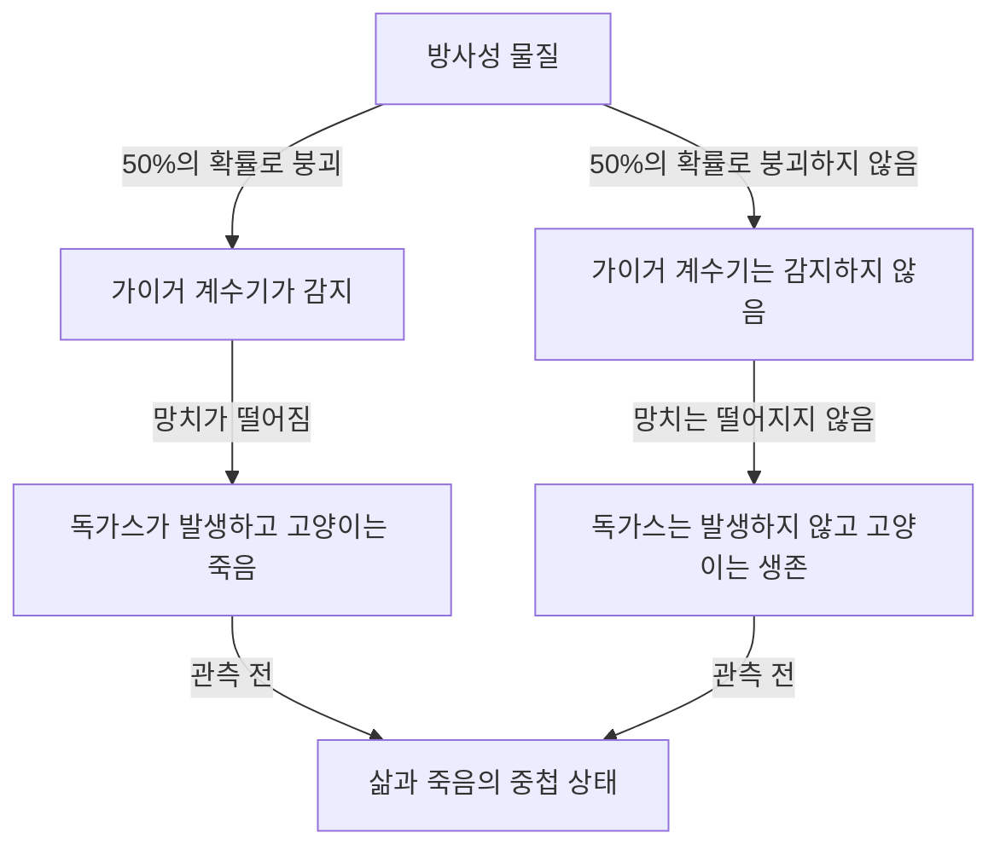
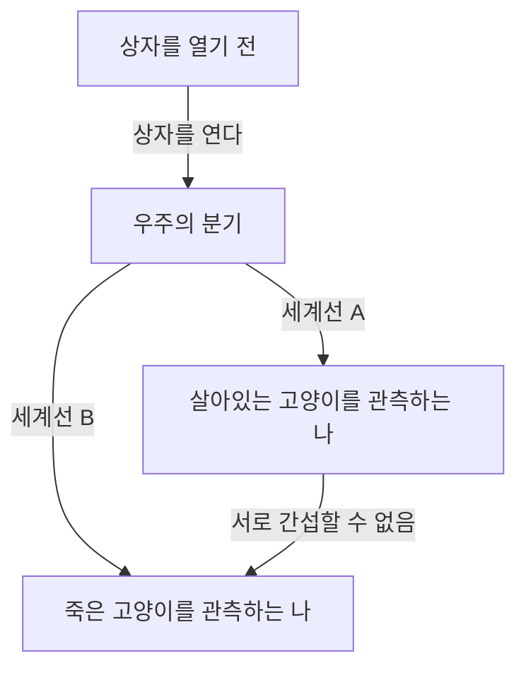

# 양자역학의 극북: 슈뢰딩거의 고양이가 들이미는 현실의 역설

우리의 직관이나 상식이 전혀 통하지 않는 미시 세계, 그것이 양자역학의 세계입니다. 그리고 그 양자역학의 기묘함을 일상적인 규모로 가져와, 물리학자뿐만 아니라 철학자들까지도 계속해서 괴롭혀 온 사고실험이 '슈뢰딩거의 고양이'입니다. 본 기사에서는 이 너무나도 유명한 역설에 대해, 그 성립 배경부터 물리학적·철학적 의미, 그리고 현대의 해석에 이르기까지 매우 상세하고 철저하게 파헤쳐 봅니다.

## 제1장: 슈뢰딩거의 고양이란 무엇인가?

'슈뢰딩거의 고양이(Schrödinger's cat)'는 1935년 오스트리아의 물리학자 에르빈 슈뢰딩거에 의해 제창된 사고실험입니다. 이 실험의 목적은 당시 주류였던 양자역학의 해석(코펜하겐 해석)이 안고 있는 논리적 모순이나 직관에 반하는 성질을 부각시키는 것이었습니다.

### 사고실험의 설정

슈뢰딩거는 다음과 같은 상황을 가정했습니다.

1. **강철 상자**: 외부에서 내부를 전혀 관측할 수 없는 완전히 밀폐된 상자를 준비합니다.
2. **살아있는 고양이**: 그 상자 안에 살아있는 고양이 한 마리를 넣습니다.
3. **방사성 물질과 가이거 계수기**: 상자 안에는 50%의 확률로 1시간 이내에 붕괴하는 미량의 방사성 물질과 이를 감지하는 가이거 계수기가 설치되어 있습니다.
4. **독가스(청산가스) 병과 망치**: 가이거 계수기가 방사선 방출(방사성 붕괴)을 감지하면 릴레이 회로가 작동하여 망치가 내리쳐져 독가스가 든 병을 깨뜨리는 장치가 만들어져 있습니다.

1시간 후, 이 상자 안은 어떻게 되어 있을까요?
상식적으로 생각하면 고양이는 '살아있다' 또는 '죽어있다' 중 어느 한 상태에 있어야 합니다. 그러나 양자역학의 법칙(코펜하겐 해석)을 이 시스템 전체에 엄밀하게 적용하면 놀라운 결론이 도출됩니다.

방사성 물질의 붕괴는 양자역학적인 현상이며, 상자를 열어 관측하기 전까지는 '붕괴된 상태'와 '붕괴되지 않은 상태'가 **'중첩(superposition)'**으로 존재합니다. 그리고 그 상태에 연동되어 있는 고양이 또한, 상자를 열고 인간이 관측하기 전까지는 **'살아있는 상태'와 '죽어있는 상태'가 중첩된 상태**에 있다는 것입니다.

## 제2장: 왜 이러한 기묘한 사고실험이 탄생했는가?

이 사고실험이 탄생한 배경에는 1920년대부터 30년대에 걸친 양자역학의 급속한 발전과 그에 따른 물리학자들의 격렬한 논쟁이 있었습니다.

### 코펜하겐 해석의 탄생

닐스 보어와 베르너 하이젠베르크 등이 중심이 되어 구축한 '코펜하겐 해석'은 양자역학의 수학적 틀에 대한 표준적인 해석이 되었습니다. 그 중심적인 주장은 다음과 같습니다.

1. **파동함수와 중첩**: 양자계는 '파동함수'라고 불리는 수학적 도구로 기술되며, 관측되기 전까지는 여러 가능한 상태가 확률적으로 중첩되어 존재한다.
2. **파동의 수축(관측 문제)**: 측정 또는 관측이 이루어진 순간, 중첩 상태는 단 하나의 확실한 상태로 '수축(collapse)'한다.
3. **상보성**: 입자로서의 성질과 파동로서의 성질은 동시에 완전히 관측할 수 없으며, 서로 보완하는 관계에 있다.

### 아인슈타인과 슈뢰딩거의 불만

알베르트 아인슈타인은 이 코펜하겐 해석의 '확률적인 자연관'과 '관측에 의한 수축'을 강하게 비판했습니다. '신은 주사위를 던지지 않는다'는 그의 유명한 말은 물리 법칙이 결정론적이어야 한다는 신념을 나타냅니다.

양자역학의 기초 방정식인 '슈뢰딩거 방정식'을 발견한 슈뢰딩거 자신도, 자신이 만들어낸 방정식이 확률적인 해석에 사용되는 것에 강한 거부감을 느꼈습니다. 아인슈타인과 서신을 주고받는 과정에서 거시적인 세계(고양이)에 미시적인 세계(방사성 물질)의 불확정성을 끌어들임으로써 코펜하겐 해석의 터무니없음을 지적하려 했던 것이 바로 이 '슈뢰딩거의 고양이'였습니다.

## 제3장: 미시의 법칙이 거시로 파급될 때 (양자 얽힘)

슈뢰딩거의 고양이 역설의 핵심에는 '양자 얽힘(엔탱글먼트)'이라는 개념이 깊이 관여하고 있습니다.

상자 안에서는 방사성 물질의 상태(붕괴됨/붕괴되지 않음)와 고양이의 상태(죽어있음/살아있음)가 강하게 결부되어 있습니다. 한쪽이 결정되면 다른 쪽도 반드시 결정되는 이 상관관계를 양자역학에서는 '얽힘'이라고 부릅니다.

방사성 원자의 미시적인 양자적 중첩이 가이거 계수기, 릴레이 회로, 망치와 같은 거시적인 장치를 통해 증폭되어, 최종적으로 고양이라는 생명체의 삶과 죽음의 중첩으로까지 확대(파급)되어 버립니다. 슈뢰딩거는 이를 '터무니없는 일(ridiculous)'이라고 부르며, 미시의 법칙을 비판 없이 거시적인 물체에 적용하는 것의 위험성을 경고했습니다.

## 제4장: 현대 물리학은 '고양이'를 어떻게 해석하는가?

슈뢰딩거 시대부터 약 1세기가 지난 현재에도 이 역설에 대한 통일되고 완벽한 답(해석)은 존재하지 않습니다. 그러나 현대 물리학에서는 몇 가지 유력한 접근법을 통해 이 문제의 해결을 시도하고 있습니다.

### 1. 코펜하겐 해석의 현대적 관점

전통적인 코펜하겐 해석을 유지하는 입장에서는 '어디서 관측이 이루어졌는가'가 초점이 됩니다.
사실 인간의 의식만이 '관측'은 아닙니다. 가이거 계수기가 방사선을 감지한 순간, 혹은 거시적인 환경과 상호작용한 순간에 이미 '관측'은 이루어졌으며, 파동함수는 그 시점에서 수축했다고 보는 것이 자연스럽습니다. 즉, 상자 안에서는 인간의 관측을 기다릴 필요 없이 고양이의 생사는 이미 결정되어 있다는 생각입니다.

### 2. 다세계 해석 (에버렛 해석)

1957년 휴 에버렛 3세에 의해 제창된 '다세계 해석'은 매우 대담한 해결책을 제시합니다.
다세계 해석에 따르면 파동함수의 수축은 결코 일어나지 않습니다. 상자를 여는 순간, 우주 자체가 '살아있는 고양이를 보는 관측자의 우주'와 '죽어있는 고양이를 보는 관측자의 우주'의 두 가지로 분기(분기라기보다는 평행하게 실재)한다는 것입니다.

이 해석의 아름다움은 양자역학의 방정식(슈뢰딩거 방정식)을 전혀 수정하지 않고 적용할 수 있다는 점에 있습니다. 그러나 '무수한 평행우주가 존재한다'는 직관에 반하는 결론을 받아들여야 한다는 철학적 비용이 따릅니다.

### 3. 결어긋남 (양자 간섭의 상실)

현대 양자정보이론에서 가장 중요하게 여겨지는 것이 '양자 결어긋남(데코히어런스)'이라는 물리적 과정입니다.
중첩 상태를 유지하기 위해서는 시스템이 외부 환경으로부터 완전히 격리되어 있어야 합니다. 그러나 실제 고양이와 같은 거대한 계는 항상 주변의 공기 분자나 광자와 충돌하며 상호작용하고 있습니다.

이러한 무수한 상호작용에 의해 중첩의 '위상(파동으로서의 간섭성)'에 관한 정보가 환경으로 새어나가는 현상이 결어긋남입니다. 결어긋남은 극히 짧은 시간(고양이와 같은 거시적인 계에서는 사실상 0에 가까운 시간)에 일어나기 때문에 양자적인 중첩은 순식간에 깨지고 고전적인 확률(살아있거나 죽어있거나 둘 중 하나)로 이행합니다. 결어긋남 이론은 '왜 거시적인 세계에서는 중첩을 볼 수 없는가'를 아름답게 설명합니다.

### 4. 자발적 수축 이론 (Objective Collapse Theory)

GRW 이론이나 펜로즈의 해석 등, 파동함수는 관측 유무와 관계없이 물리적인 메커니즘에 의해 자연스럽게 수축한다는 접근법입니다. 계의 질량이나 복잡성이 커질수록 수축에 걸리는 시간은 짧아집니다. 전자와 같은 미시적인 입자는 장기간 중첩을 유지할 수 있지만, 고양이와 같은 질량이 큰 물체는 순식간에 수축하기 때문에 삶과 죽음의 중첩은 현실에서는 발생하지 않는다고 설명합니다.

## 제5장: '슈뢰딩거의 고양이'의 실세계 응용

슈뢰딩거가 역설로 제시했던 '거시적인 상태의 중첩'은 현대 기술에 있어 현실이 되어가고 있습니다.

### 양자 컴퓨터로의 응용

양자 컴퓨터의 기본 단위인 '양자비트(큐비트)'는 바로 '0과 1의 중첩 상태'를 이용하여 병렬 계산을 수행합니다. 최근에는 다수의 원자로 이루어진 회로나 초전도 루프 등 원래라면 거시적인(혹은 메조스코픽한) 규모에서 의도적으로 '슈뢰딩거의 고양이 상태(cat state)'를 만들어내고, 이를 계산이나 오류 정정에 이용하려는 연구가 진행되고 있습니다.

우리가 기술을 세련되게 다듬고 결어긋남을 방지하는(외부 환경으로부터 완전히 격리하는) 기술을 향상함에 따라, 슈뢰딩거의 고양이는 '기묘한 사고실험'에서 '실용적인 정보 처리 자원'으로 변모해가고 있는 것입니다.

## 제6장: 철학과 인식론으로의 파급

슈뢰딩거의 고양이는 단순한 물리학의 문제를 넘어, '실재란 무엇인가?', '관측이란 무엇인가?'라는 깊은 철학적인 질문을 우리에게 던집니다.

만약 '관측'이 실재를 결정짓는 것이라면, 관측자인 우리 인간의 '의식'에는 특별한 물리적 역할이 있는 것일까요? (위그너의 친구 역설)
혹은 우리가 인식하고 있는 이 확고한 세계는 광대한 양자적 다세계 속의 한 측면에 불과한 것일까요?

양자역학은 고전 물리학이 구축했던 '객관적이고 독립적인 실재'라는 확고한 신념을 뒤흔들었습니다. 슈뢰딩거의 고양이는 그 흔들림의 최전선에 서서 지금도 여전히 우리를 심오한 질문으로 이끌고 있습니다.

## 결론: 고양이는 우리에게 무엇을 가르쳐 주는가

슈뢰딩거의 고양이는 양자역학의 불완전성을 폭로하기 위해 만들어진 사고실험이었습니다. 그러나 아이러니하게도 그것은 양자역학의 가장 본질적이고 불가사의한 성질을 일반 대중에게도 직관적으로 전달하는 가장 강력한 은유로서 기능하게 되었습니다.

상자 안의 고양이는 우리가 당연하다고 생각하는 '현실'이 사실은 미시적인 양자적 요동과 거시적인 고전적 세계가 교차하는 극히 미묘한 균형 위에 성립되어 있음을 가르쳐 줍니다. 물리학이 발전하고 새로운 해석이나 이론이 탄생할 때마다 슈뢰딩거의 고양이는 새로운 모습으로 우리 앞에 나타납니다.

그것은 앞으로도 인류의 지성이 '실재의 진정한 모습'을 추구하는 탐구의 여정에서 가장 미스터리하고 매력적인 이정표로 계속 남아있을 것입니다.
