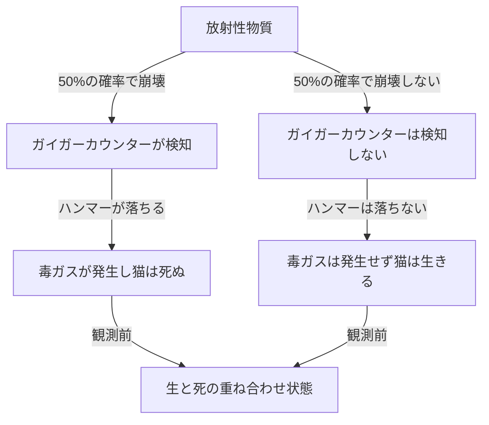
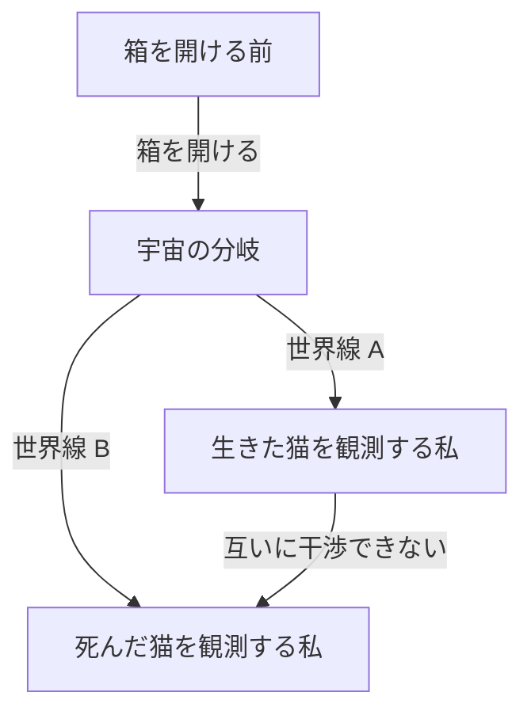

# 量子力学の極北：シュレーディンガーの猫が突きつける現実のパラドックス

私たちの直感や常識が全く通用しないミクロの世界、それが量子力学の世界です。そして、その量子力学の奇妙さを日常的なスケールに持ち込み、物理学者のみならず哲学者たちをも悩ませ続けてきた思考実験が「シュレーディンガーの猫」です。本記事では、このあまりにも有名なパラドックスについて、その成り立ちから物理学的・哲学的な意味、そして現代の解釈に至るまで、極めて詳細かつ徹底的に掘り下げていきます。

## 第1章：シュレーディンガーの猫とは何か？

「シュレーディンガーの猫（Schrödinger's cat）」は、1935年にオーストリアの物理学者エルヴィン・シュレーディンガーによって提唱された思考実験です。この実験の目的は、当時の主流であった量子力学の解釈（コペンハーゲン解釈）が抱える論理的な矛盾や直感に反する性質を浮き彫りにすることでした。

### 思考実験のセットアップ

シュレーディンガーは次のような状況を想定しました。

1. **鋼鉄の箱**: 外部から内部を一切観測できない完全に密閉された箱を用意します。
2. **生きた猫**: その箱の中に、一匹の生きた猫を入れます。
3. **放射性物質とガイガーカウンター**: 箱の中には、50%の確率で1時間以内に崩壊する微量の放射性物質と、それを検知するガイガーカウンターが設置されています。
4. **毒ガス（青酸ガス）の瓶とハンマー**: ガイガーカウンターが放射線の放出（放射性崩壊）を検知すると、リレー回路が作動し、ハンマーが振り下ろされて毒ガスの入った瓶を割る仕組みが作られています。

1時間後、この箱の中はどうなっているでしょうか？
常識的に考えれば、猫は「生きている」か「死んでいる」かのどちらか一方の状態にあるはずです。しかし、量子力学の法則（コペンハーゲン解釈）をこのシステム全体に厳密に適用すると、驚くべき結論が導かれます。

放射性物質の崩壊は量子力学的な現象であり、箱を開けて観測するまでは「崩壊した状態」と「崩壊していない状態」が**「重ね合わせ（superposition）」**として存在しています。そして、その状態に連動している猫もまた、箱を開けて人間が観測するまでは**「生きている状態」と「死んでいる状態」が重なり合った状態**にある、というのです。

## 第2章：なぜこのような奇妙な思考実験が生まれたのか？

この思考実験が生まれた背景には、1920年代から30年代にかけての量子力学の急速な発展と、それに伴う物理学者たちの激しい論争がありました。

### コペンハーゲン解釈の誕生

ニールス・ボーアやヴェルナー・ハイゼンベルクらが中心となって構築した「コペンハーゲン解釈」は、量子力学の数学的枠組みに対する標準的な解釈となりました。その中心的な主張は以下の通りです。

1. **波動関数と重ね合わせ**: 量子系は「波動関数」と呼ばれる数学的な道具で記述され、観測されるまでは複数の可能な状態が確率的に重なり合って存在する。
2. **波束の収縮（観測問題）**: 測定または観測が行われた瞬間に、重ね合わせの状態はただ一つの確実な状態に「収縮（collapse）」する。
3. **相補性**: 粒子としての性質と波としての性質は同時に完全に観測することはできず、互いに補い合う関係にある。

### アインシュタインとシュレーディンガーの不満

アルベルト・アインシュタインは、このコペンハーゲン解釈の「確率的な自然観」と「観測による収縮」を強く批判しました。「神はサイコロを振らない」という彼の有名な言葉は、物理法則は決定論的であるべきだという信念を表しています。

量子力学の基礎方程式である「シュレーディンガー方程式」を発見したシュレーディンガー自身も、自らが生み出した方程式が確率的な解釈に用いられることに強い抵抗を覚えました。アインシュタインと文通を交わす中で、マクロな世界（猫）にミクロな世界（放射性物質）の不確定性を持ち込むことで、コペンハーゲン解釈の荒唐無稽さを指摘しようとしたのが、この「シュレーディンガーの猫」だったのです。

## 第3章：ミクロの法則がマクロに波及する時（量子もつれ）

シュレーディンガーの猫のパラドックスの核心には、「量子もつれ（エンタングルメント）」という概念が深く関わっています。

箱の中では、放射性物質の状態（崩壊した/していない）と猫の状態（死んでいる/生きている）が強く結びついています。一方が決まれば他方も必ず決まるこの相関関係を、量子力学では「もつれ」と呼びます。

放射性原子のミクロな量子的重ね合わせが、ガイガーカウンター、リレー回路、ハンマーといったマクロな装置を通じて増幅され、最終的に猫という生命体の生と死の重ね合わせにまで拡大（波及）してしまいます。シュレーディンガーはこれを「ばかげたこと（ridiculous）」と呼び、ミクロの法則を無批判にマクロな物体に適用することの危険性を警告しました。

## 第4章：現代物理学は「猫」をどう解釈するか？

シュレーディンガーの時代から約1世紀が経った現在でも、このパラドックスに対する統一された完璧な答え（解釈）は存在しません。しかし、現代物理学ではいくつかの有力なアプローチによって、この問題の解決が試みられています。

### 1. コペンハーゲン解釈の現代的視点

伝統的なコペンハーゲン解釈を維持する立場からは、「どこで観測が行われたか」が焦点となります。
実は、人間の意識だけが「観測」ではありません。ガイガーカウンターが放射線を検知した瞬間、あるいはマクロな環境と相互作用した瞬間に「観測」は行われており、波動関数はその時点で収縮していると考えるのが自然です。つまり、箱の中では人間の観測を待つまでもなく、猫の生死は既に決定しているという考え方です。

### 2. 多世界解釈（エヴェレット解釈）

1957年にヒュー・エヴェレット3世によって提唱された「多世界解釈」は、非常に大胆な解決策を提示します。
多世界解釈によれば、波動関数の収縮は決して起きません。箱を開けた瞬間、宇宙自体が「生きている猫を見る観測者の宇宙」と「死んでいる猫を見る観測者の宇宙」の2つに分岐（分岐というよりは平行して実在）するというのです。

この解釈の美しさは、量子力学の方程式（シュレーディンガー方程式）を一切いじらずに適用できる点にあります。しかし、「無数の平行宇宙が存在する」という直感に反する結論を受け入れなければならないという哲学的コストが伴います。

### 3. デコヒーレンス（量子干渉の喪失）

現代の量子情報理論において最も重要視されているのが「量子デコヒーレンス」という物理過程です。
重ね合わせの状態を維持するためには、システムが外部環境から完全に隔離されている必要があります。しかし、現実の猫のような巨大な系は、常に周囲の空気分子や光子と衝突し、相互作用しています。

この無数の相互作用によって、重ね合わせの「位相（波としての干渉性）」に関する情報が環境へと漏れ出してしまう現象がデコヒーレンスです。デコヒーレンスは極めて短い時間（猫のようなマクロな系では事実上ゼロに等しい時間）で起きるため、量子的な重ね合わせは瞬時に壊れ、古典的な確率（生きているか死んでいるかどちらか一方）に移行します。デコヒーレンス理論は「なぜマクロな世界で重ね合わせが見られないのか」を美しく説明します。

### 4. 自発的収縮理論（Objective Collapse Theory）

GRW理論やペンローズの解釈など、波動関数は観測の有無にかかわらず、物理的なメカニズムによって自然に収縮するというアプローチです。系の質量や複雑さが大きくなるほど、収縮にかかる時間は短くなります。電子のようなミクロな粒子は長期間重ね合わせを維持できますが、猫のような質量の大きな物体は一瞬にして収縮するため、生と死の重ね合わせは現実には生じないと説明します。

## 第5章：「シュレーディンガーの猫」の実世界での応用

シュレーディンガーがパラドックスとして提示した「マクロな状態の重ね合わせ」は、現代のテクノロジーにおいて現実のものとなりつつあります。

### 量子コンピューターへの応用

量子コンピューターの基本単位である「量子ビット（キュービット）」は、まさに「0と1の重ね合わせ状態」を利用して並列計算を行います。近年では、多数の原子からなる回路や超伝導ループなど、本来ならマクロな（あるいはメゾスコピックな）スケールにおいて、意図的に「シュレーディンガーの猫状態（cat state）」を作り出し、それを計算やエラー訂正に利用する研究が進んでいます。

私たちが技術を洗練させ、デコヒーレンスを防ぐ（外部環境から完全に隔離する）技術を向上させるにつれて、シュレーディンガーの猫は「奇妙な思考実験」から「実用的な情報処理の資源」へと変貌を遂げつつあるのです。

## 第6章：哲学と認識論への波及

シュレーディンガーの猫は、単なる物理学の問題を超えて、「実在とは何か？」「観測とは何か？」という深い哲学的な問いを私たちに突きつけます。

もし「観測」が実在を決定づけるのだとしたら、観測者たる私たち人間の「意識」には特別な物理的役割があるのでしょうか？（ウィグナーの友人パラドックス）
あるいは、私たちが認識しているこの確固たる世界は、広大な量子的な多世界の中の一つの側面に過ぎないのでしょうか？

量子力学は、古典物理学が築き上げた「客観的で独立した実在」という確固たる信念を揺るがしました。シュレーディンガーの猫は、その揺らぎの最前線に立ち、今なお私たちを深淵な問いへと誘い続けています。

## 結論：猫は私たちに何を教えているのか

シュレーディンガーの猫は、量子力学の不完全性を暴くために作られた思考実験でした。しかし皮肉なことに、それは量子力学の最も本質的で不可思議な性質を、一般の人々にも直感的に伝える最強のメタファーとして機能することになりました。

箱の中の猫は、私たちが当たり前だと思っている「現実」が、実はミクロの量子的ゆらぎとマクロの古典的世界が交差する、極めて微妙なバランスの上に成り立っていることを教えてくれます。物理学が発展し、新たな解釈や理論が生まれるたびに、シュレーディンガーの猫は新しい姿で私たちの前に現れます。

それはこれからも、人類の知性が「実在の真の姿」を求める探求の旅において、最もミステリアスで魅力的な道標であり続けることでしょう。
