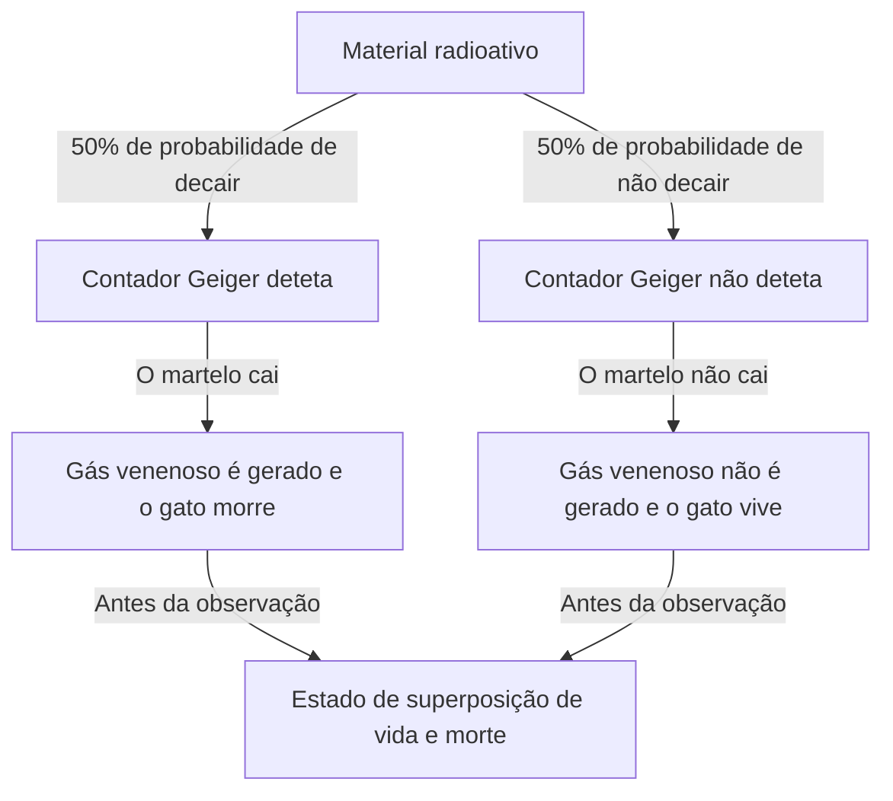
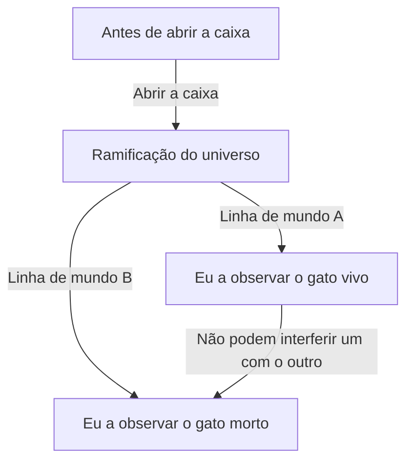

# O Extremo da Mecânica Quântica: O Paradoxo da Realidade Apresentado pelo Gato de Schrödinger

O mundo micro onde a nossa intuição e o senso comum não se aplicam de todo, esse é o mundo da mecânica quântica. E a experiência mental que traz a estranheza da mecânica quântica para a escala quotidiana, e que continua a intrigar não só os físicos, mas também os filósofos, é o "Gato de Schrödinger". Neste artigo, vamos aprofundar de forma extremamente detalhada e exaustiva este paradoxo muito famoso, desde a sua origem até aos seus significados físicos e filosóficos, e às suas interpretações modernas.

## Capítulo 1: O que é o Gato de Schrödinger?

O "Gato de Schrödinger (Schrödinger's cat)" é uma experiência mental proposta em 1935 pelo físico austríaco Erwin Schrödinger. O objetivo desta experiência era evidenciar as contradições lógicas e a natureza contra-intuitiva da interpretação dominante da mecânica quântica da época (Interpretação de Copenhaga).

### Configuração da Experiência Mental

Schrödinger imaginou a seguinte situação:

1. **Caixa de aço**: Prepara-se uma caixa completamente fechada, sem qualquer possibilidade de observação do exterior para o interior.
2. **Gato vivo**: Coloca-se um gato vivo dentro dessa caixa.
3. **Material radioativo e contador Geiger**: Dentro da caixa, instala-se uma quantidade minúscula de material radioativo com 50% de probabilidade de decair no espaço de uma hora, e um contador Geiger para o detetar.
4. **Frasco de gás venenoso (gás cianídrico) e martelo**: Foi criado um mecanismo no qual, quando o contador Geiger deteta a emissão de radiação (decaimento radioativo), um circuito de relé é ativado e um martelo é largado para quebrar o frasco contendo o gás venenoso.

Após 1 hora, o que estará a acontecer dentro desta caixa?
Pensando no senso comum, o gato deve estar num de dois estados: ou está "vivo" ou está "morto". No entanto, ao aplicar estritamente as leis da mecânica quântica (Interpretação de Copenhaga) a todo este sistema, chega-se a uma conclusão surpreendente.

O decaimento do material radioativo é um fenómeno quântico e, até abrirmos a caixa para observar, o "estado decaído" e o "estado não decaído" existem como uma **"superposição (superposition)"**. Consequentemente, o gato, que está ligado a esse estado, também se encontra num **estado de superposição entre estar "vivo" e estar "morto"** até a caixa ser aberta e observada por um ser humano.

## Capítulo 2: Por que razão nasceu uma experiência mental tão estranha?

O contexto por trás do nascimento desta experiência mental foi o rápido desenvolvimento da mecânica quântica entre as décadas de 1920 e 1930, acompanhado de intensos debates entre os físicos.

### O Nascimento da Interpretação de Copenhaga

A "Interpretação de Copenhaga", construída centralmente por Niels Bohr, Werner Heisenberg, entre outros, tornou-se a interpretação padrão para o quadro matemático da mecânica quântica. As suas principais afirmações são as seguintes:

1. **Função de onda e superposição**: O sistema quântico é descrito por uma ferramenta matemática chamada "função de onda", existindo como uma sobreposição probabilística de vários estados possíveis até ser observado.
2. **Colapso da função de onda (problema da medição)**: No momento em que uma medição ou observação é efetuada, o estado de superposição "colapsa (collapse)" para um único estado definido.
3. **Complementaridade**: As propriedades como partícula e as propriedades como onda não podem ser completamente observadas em simultâneo, complementando-se mutuamente.

### A Insatisfação de Einstein e Schrödinger

Albert Einstein criticou fortemente esta "visão probabilística da natureza" e o "colapso pela observação" da Interpretação de Copenhaga. A sua famosa citação "Deus não joga aos dados" expressa a sua crença de que as leis da física devem ser determinísticas.

Erwin Schrödinger, que descobriu a "Equação de Schrödinger", a equação fundamental da mecânica quântica, também sentiu uma forte resistência em ver a equação que ele próprio criou ser usada para interpretações probabilísticas. O "Gato de Schrödinger" surgiu das suas correspondências com Einstein, numa tentativa de apontar o absurdo da Interpretação de Copenhaga, introduzindo a incerteza do mundo micro (material radioativo) no mundo macro (gato).

## Capítulo 3: Quando as leis microscópicas afetam o macroscópico (Emaranhamento Quântico)

No cerne do paradoxo do Gato de Schrödinger, está profundamente envolvido o conceito de "emaranhamento quântico (entanglement)".

Dentro da caixa, o estado do material radioativo (decaído/não decaído) e o estado do gato (morto/vivo) estão fortemente ligados. A esta correlação em que, se um é determinado, o outro também é inevitavelmente determinado, a mecânica quântica chama de "emaranhamento".

A superposição quântica microscópica do átomo radioativo é amplificada através de dispositivos macroscópicos como o contador Geiger, o circuito de relé e o martelo, expandindo-se (propagando-se) finalmente até à superposição da vida e morte da entidade biológica que é o gato. Schrödinger chamou a isto um "absurdo (ridiculous)" e alertou para o perigo de aplicar sem critério as leis microscópicas a objetos macroscópicos.

## Capítulo 4: Como a física moderna interpreta o "Gato"?

Quase um século após a época de Schrödinger, ainda não existe uma resposta (interpretação) perfeita e unificada para este paradoxo. No entanto, na física moderna, tenta-se resolver este problema através de várias abordagens proeminentes.

### 1. A Perspetiva Moderna da Interpretação de Copenhaga

A partir da posição que mantém a Interpretação de Copenhaga tradicional, o foco incide sobre "onde foi feita a observação".
Na verdade, a "observação" não é apenas a consciência humana. No momento em que o contador Geiger deteta a radiação, ou no momento em que interage com o ambiente macroscópico, a "observação" foi feita, e é natural pensar que a função de onda colapsa nesse ponto. Por outras palavras, a ideia é que, dentro da caixa, a vida ou a morte do gato já está decidida muito antes de se esperar pela observação humana.

### 2. A Interpretação de Muitos Mundos (Interpretação de Everett)

A "Interpretação de Muitos Mundos", proposta por Hugh Everett III em 1957, apresenta uma solução extremamente ousada.
De acordo com a Interpretação de Muitos Mundos, o colapso da função de onda nunca ocorre. No momento em que se abre a caixa, o próprio universo divide-se (ou melhor, coexiste paralelamente) em dois: "o universo do observador que vê o gato vivo" e "o universo do observador que vê o gato morto".

A beleza desta interpretação reside no facto de poder ser aplicada sem adulterar as equações da mecânica quântica (Equação de Schrödinger). No entanto, acarreta o custo filosófico de ter de aceitar a conclusão contra-intuitiva de que "existem infinitos universos paralelos".

### 3. Decoerência (Perda da Interferência Quântica)

O que é mais valorizado na teoria moderna da informação quântica é o processo físico chamado "decoerência quântica".
Para manter um estado de superposição, o sistema tem de estar completamente isolado do ambiente externo. Contudo, um sistema enorme como um gato real está constantemente a colidir e a interagir com as moléculas de ar e os fotões circundantes.

A este fenómeno, no qual a informação sobre a "fase (coerência como onda)" da superposição se perde para o ambiente através dessas infinitas interações, chama-se decoerência. Como a decoerência ocorre num tempo extremamente curto (praticamente nulo para sistemas macroscópicos como um gato), a superposição quântica colapsa instantaneamente, transitando para uma probabilidade clássica (ou está vivo ou está morto). A teoria da decoerência explica de forma bela "por que razão não se vêem superposições no mundo macroscópico".

### 4. Teoria do Colapso Espontâneo (Objective Collapse Theory)

Abordagens como a teoria GRW ou a interpretação de Penrose sugerem que a função de onda colapsa naturalmente devido a um mecanismo físico, independentemente da presença de observação. Quanto maior a massa e a complexidade do sistema, menor é o tempo necessário para o colapso. Enquanto partículas microscópicas como os eletrões conseguem manter a superposição por longos períodos, objetos com grande massa como um gato colapsam instantaneamente, explicando que a superposição da vida e da morte não ocorre na realidade.

## Capítulo 5: Aplicações do "Gato de Schrödinger" no Mundo Real

A "superposição de estados macroscópicos" que Schrödinger apresentou como um paradoxo está a tornar-se uma realidade na tecnologia moderna.

### Aplicação aos Computadores Quânticos

O "qubit (bit quântico)", que é a unidade básica de um computador quântico, efetua cálculos paralelos precisamente tirando partido do "estado de superposição de 0 e 1". Nos últimos anos, tem havido avanços em pesquisas que criam intencionalmente o "estado do gato de Schrödinger (cat state)" a uma escala originalmente macroscópica (ou mesoscópica), como circuitos feitos de múltiplos átomos ou loops supercondutores, utilizando-os para cálculos ou correção de erros.

À medida que refinamos as nossas tecnologias e melhoramos os métodos para evitar a decoerência (isolamento total do ambiente externo), o Gato de Schrödinger está a transformar-se de uma "experiência mental bizarra" num "recurso prático de processamento de informação".

## Capítulo 6: Repercussões na Filosofia e Epistemologia

O Gato de Schrödinger transcende o mero problema da física e confronta-nos com questões filosóficas profundas: "O que é a realidade?" e "O que é a observação?".

Se a "observação" determina a realidade, terá a "consciência" humana de nós, observadores, algum papel físico especial? (O paradoxo do amigo de Wigner)
Ou será que este mundo firme que reconhecemos é apenas uma faceta dentro dos vastos muitos mundos quânticos?

A mecânica quântica abalou a convicção sólida de uma "realidade objetiva e independente" construída pela física clássica. O Gato de Schrödinger está na vanguarda dessa agitação e continua a guiar-nos em direção a questões profundas.

## Conclusão: O que nos ensina o gato?

O Gato de Schrödinger foi uma experiência mental criada para expor a incompletude da mecânica quântica. Contudo, ironicamente, acabou por funcionar como a metáfora mais poderosa para transmitir intuitivamente ao público em geral a natureza mais essencial e misteriosa da mecânica quântica.

O gato dentro da caixa ensina-nos que a "realidade" que tomamos por garantida repousa, na verdade, sobre um equilíbrio extremamente delicado onde as flutuações quânticas microscópicas e o mundo clássico macroscópico se cruzam. Sempre que a física evolui e nascem novas teorias ou interpretações, o Gato de Schrödinger reaparece perante nós sob uma nova forma.

Sem dúvida, ele continuará a ser, daqui em diante, o marco mais misterioso e fascinante na viagem de exploração da inteligência humana em busca da "verdadeira face da realidade".
