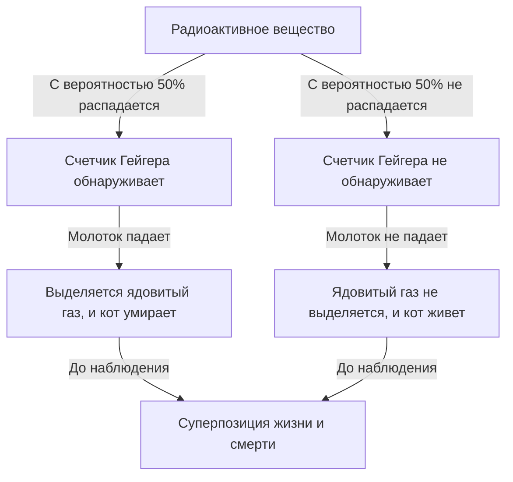
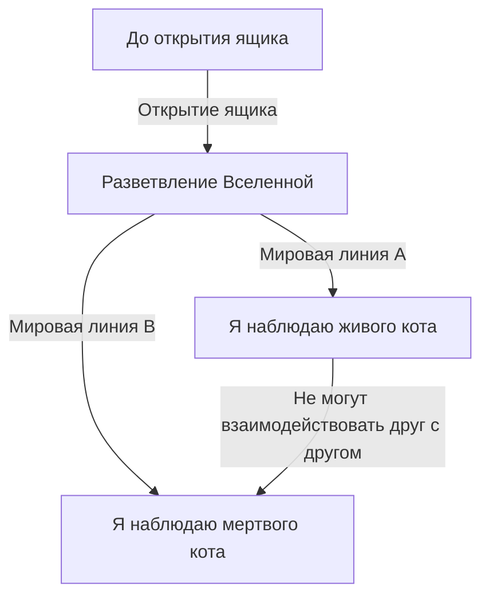

# Крайний предел квантовой механики: Парадокс реальности, который ставит перед нами кот Шредингера

Микромир, в котором наша интуиция и здравый смысл совершенно неприменимы, — это мир квантовой механики. Мысленный эксперимент, переносящий странности квантовой механики в повседневные масштабы и продолжающий беспокоить не только физиков, но и философов, — это «кот Шредингера». В этой статье мы подробно и основательно рассмотрим этот знаменитый парадокс, начиная с истории его возникновения и физико-философского значения, заканчивая его современными интерпретациями.

## Глава 1: Что такое кот Шредингера?

«Кот Шредингера» (Schrödinger's cat) — это мысленный эксперимент, предложенный австрийским физиком Эрвином Шредингером в 1935 году. Целью этого эксперимента было выявить логические противоречия и нелогичные свойства господствовавшей тогда интерпретации квантовой механики (Копенгагенской интерпретации).

### Схема мысленного эксперимента

Шредингер представил себе следующую ситуацию:

1. **Стальной ящик**: Подготавливается полностью закрытый ящик, внутрь которого невозможно заглянуть снаружи.
2. **Живой кот**: В этот ящик помещается живой кот.
3. **Радиоактивное вещество и счетчик Гейгера**: Внутри ящика находится небольшое количество радиоактивного вещества, которое имеет 50% вероятность распада в течение одного часа, и счетчик Гейгера для его обнаружения.
4. **Колба с ядовитым газом (синильной кислотой) и молоток**: Когда счетчик Гейгера обнаруживает испускание радиации (радиоактивный распад), срабатывает реле, и молоток падает, разбивая колбу с ядовитым газом.

Что будет внутри этого ящика через час?
С точки зрения здравого смысла, кот должен находиться только в одном из состояний: «жив» или «мертв». Однако если строго применить законы квантовой механики (Копенгагенскую интерпретацию) ко всей этой системе, получится поразительный вывод.

Распад радиоактивного вещества — это квантовомеханическое явление, и до того, как мы откроем ящик и произведем наблюдение, существует **«суперпозиция (superposition)»** «состояния распада» и «состояния без распада». Следовательно, кот, связанный с этим состоянием, до того, как ящик будет открыт и произведено наблюдение человеком, находится в **состоянии суперпозиции «живого состояния» и «мертвого состояния»**.

## Глава 2: Почему возник такой странный мысленный эксперимент?

На фоне быстрого развития квантовой механики в 1920-х и 1930-х годах возникли бурные споры среди физиков, что и привело к появлению этого мысленного эксперимента.

### Зарождение Копенгагенской интерпретации

«Копенгагенская интерпретация», разработанная Нильсом Бором, Вернером Гейзенбергом и другими, стала стандартной интерпретацией математического аппарата квантовой механики. Ее основные положения таковы:

1. **Волновая функция и суперпозиция**: Квантовая система описывается математическим инструментом, называемым «волновой функцией», и до момента наблюдения существует в вероятностной суперпозиции нескольких возможных состояний.
2. **Коллапс волновой функции (проблема измерения)**: В момент измерения или наблюдения состояние суперпозиции «коллапсирует» в одно-единственное определенное состояние.
3. **Дополнительность**: Корпускулярные и волновые свойства не могут быть полностью наблюдаемы одновременно и дополняют друг друга.

### Недовольство Эйнштейна и Шредингера

Альберт Эйнштейн подверг резкой критике «вероятностный взгляд на природу» и «коллапс при наблюдении» в Копенгагенской интерпретации. Его знаменитая фраза «Бог не играет в кости» выражала убеждение, что физические законы должны быть детерминированными.

Шредингер, открывший «уравнение Шредингера» — фундаментальное уравнение квантовой механики, — также испытывал сильное сопротивление тому, что созданное им уравнение используется для вероятностной интерпретации. В переписке с Эйнштейном он предложил «кота Шредингера», чтобы продемонстрировать абсурдность Копенгагенской интерпретации путем переноса неопределенности микромира (радиоактивного вещества) на макромир (кота).

## Глава 3: Когда законы микромира переходят на макромир (квантовая запутанность)

В основе парадокса кота Шредингера лежит понятие «квантовой запутанности (entanglement)».

Внутри ящика состояние радиоактивного вещества (распалось/не распалось) и состояние кота (мертв/жив) тесно связаны. В квантовой механике эта корреляция, когда определение одного состояния немедленно определяет другое, называется «запутанностью».

Микроскопическая квантовая суперпозиция радиоактивного атома усиливается через макроскопические устройства (счетчик Гейгера, реле, молоток) и в конечном итоге распространяется на суперпозицию жизни и смерти живого существа — кота. Шредингер назвал это «смешным (ridiculous)» и предупреждал об опасности некритического применения законов микромира к макроскопическим объектам.

## Глава 4: Как современная физика интерпретирует «кота»?

Спустя почти столетие после эпохи Шредингера до сих пор не существует единого и идеального ответа (интерпретации) на этот парадокс. Однако современная физика пытается решить эту проблему с помощью нескольких перспективных подходов.

### 1. Современный взгляд на Копенгагенскую интерпретацию

С позиции сохранения традиционной Копенгагенской интерпретации в центре внимания оказывается вопрос «где происходит наблюдение».
На самом деле «наблюдение» — это не только человеческое сознание. Естественно считать, что «наблюдение» происходит в тот момент, когда счетчик Гейгера обнаруживает радиацию, или когда происходит взаимодействие с макроскопической средой, и в этот момент происходит коллапс волновой функции. То есть внутри ящика жизнь и смерть кота уже определены, не дожидаясь человеческого наблюдения.

### 2. Многомировая интерпретация (Интерпретация Эверетта)

«Многомировая интерпретация», предложенная Хью Эвереттом III в 1957 году, представляет собой очень смелое решение.
Согласно этой интерпретации, коллапс волновой функции никогда не происходит. В момент открытия ящика сама Вселенная разветвляется (скорее, параллельно существует) на две: «Вселенную наблюдателя, видящего живого кота» и «Вселенную наблюдателя, видящего мертвого кота».

Красота этой интерпретации заключается в том, что она позволяет применять уравнения квантовой механики (уравнение Шредингера) без каких-либо изменений. Однако за это приходится платить философскую цену, принимая нелогичный вывод о «существовании бесчисленных параллельных вселенных».

### 3. Декогеренция (Потеря квантовой интерференции)

В современной теории квантовой информации наиболее важным физическим процессом считается «квантовая декогеренция».
Для поддержания состояния суперпозиции система должна быть полностью изолирована от внешней среды. Однако огромная система, такая как настоящий кот, постоянно сталкивается и взаимодействует с окружающими молекулами воздуха и фотонами.

Явление, при котором информация о «фазе (когерентности как волны)» суперпозиции утекает в окружающую среду в результате этих бесчисленных взаимодействий, называется декогеренцией. Поскольку декогеренция происходит за чрезвычайно короткое время (практически равное нулю для такой макроскопической системы, как кот), квантовая суперпозиция мгновенно разрушается и переходит к классической вероятности (либо жив, либо мертв). Теория декогеренции прекрасно объясняет, «почему мы не видим суперпозицию в макромире».

### 4. Теория объективного коллапса (Objective Collapse Theory)

Такие подходы, как теория GRW или интерпретация Пенроуза, предполагают, что волновая функция естественным образом коллапсирует под действием физических механизмов, независимо от наличия или отсутствия наблюдения. Чем больше масса или сложность системы, тем короче время, необходимое для коллапса. Микроскопические частицы, такие как электроны, могут сохранять суперпозицию в течение длительного времени, но массивные объекты, такие как кот, коллапсируют в одно мгновение, поэтому объясняется, что суперпозиция жизни и смерти в реальности не возникает.

## Глава 5: Применение «кота Шредингера» в реальном мире

«Суперпозиция макроскопических состояний», которую Шредингер представил как парадокс, становится реальностью в современных технологиях.

### Применение в квантовых компьютерах

«Квантовый бит (кубит)», базовая единица квантового компьютера, выполняет параллельные вычисления, используя именно «состояние суперпозиции 0 и 1». В последние годы ведутся исследования по намеренному созданию «состояний кота Шредингера (cat state)» на макроскопическом (или мезоскопическом) масштабе, например, в цепях, состоящих из множества атомов, или в сверхпроводящих петлях, и использованию их для вычислений и исправления ошибок.

По мере того как мы совершенствуем наши технологии и улучшаем способность предотвращать декогеренцию (полностью изолировать от внешней среды), кот Шредингера превращается из «странного мысленного эксперимента» в «практический ресурс для обработки информации».

## Глава 6: Влияние на философию и эпистемологию

Кот Шредингера выходит за рамки простых проблем физики и ставит перед нами глубокие философские вопросы: «Что такое реальность?» и «Что такое наблюдение?».

Если «наблюдение» определяет реальность, играет ли «сознание» нас, людей, как наблюдателей, особую физическую роль? (Парадокс друга Вигнера)
Или, может быть, этот твердый мир, который мы воспринимаем, — всего лишь один из аспектов огромного квантового многомирия?

Квантовая механика пошатнула твердую веру классической физики в «объективную и независимую реальность». Кот Шредингера стоит на переднем крае этих потрясений и до сих пор продолжает побуждать нас к глубоким вопросам.

## Заключение: Чему нас учит кот?

Кот Шредингера был мысленным экспериментом, созданным для того, чтобы разоблачить неполноту квантовой механики. Однако, по иронии судьбы, он стал мощнейшей метафорой, позволяющей интуитивно передать самые фундаментальные и непостижимые свойства квантовой механики обычным людям.

Кот в ящике учит нас тому, что «реальность», которую мы принимаем как должное, на самом деле зиждется на чрезвычайно тонком балансе, где пересекаются микроскопические квантовые флуктуации и макроскопический классический мир. Каждый раз, когда физика развивается и рождаются новые интерпретации или теории, кот Шредингера предстает перед нами в новом облике.

Он, несомненно, останется самым загадочным и интригующим ориентиром в путешествии человеческого разума в поисках «истинной природы реальности».
