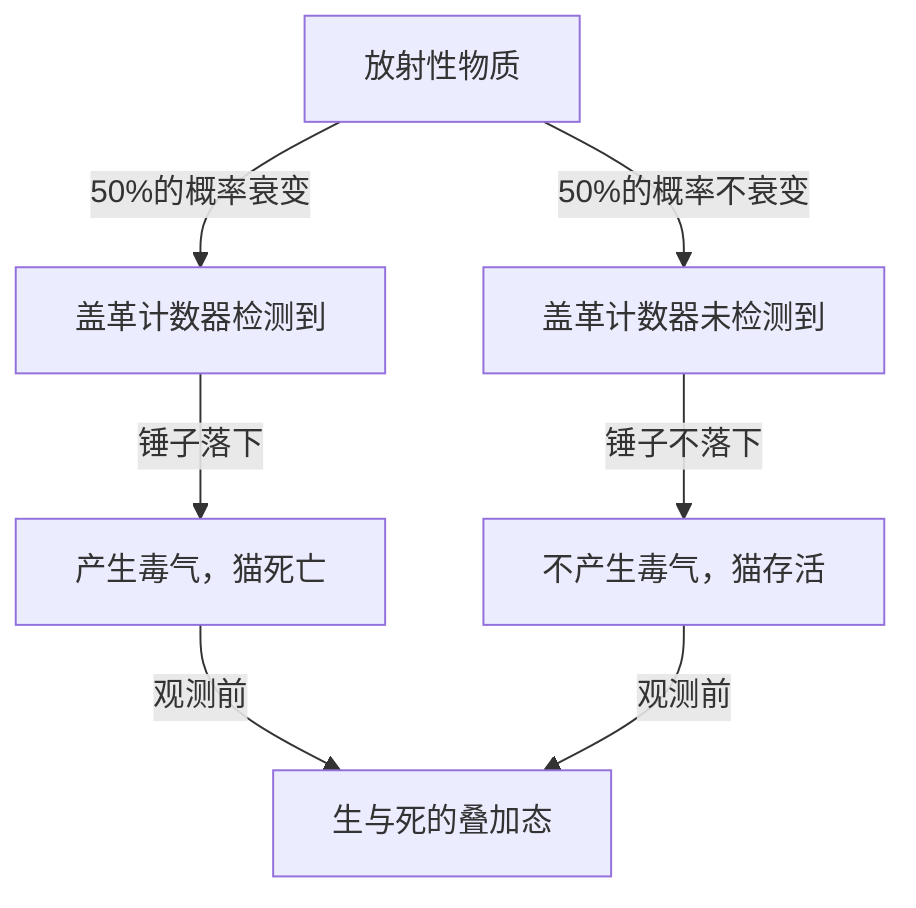
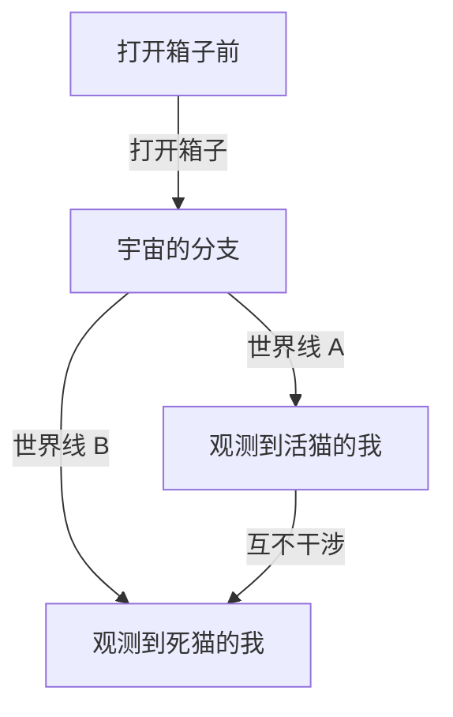

# 量子力学的极北：薛定谔的猫带来的现实悖论

我们的直觉和常识完全无法适用的微观世界，这就是量子力学的世界。而将这种量子力学的奇异性带入日常尺度，让物理学家乃至哲学家们都感到困扰的思维实验，就是“薛定谔的猫”。本文将极度详尽且彻底地深入探讨这个异常著名的悖论，从其起源、物理学与哲学层面的意义，一直到现代的诠释。

## 第1章：什么是薛定谔的猫？

“薛定谔的猫（Schrödinger's cat）”是1935年由奥地利物理学家埃尔温·薛定谔提出的思维实验。该实验的目的是为了凸显当时主流的量子力学诠释（哥本哈根诠释）所包含的逻辑矛盾以及违背直觉的性质。

### 思维实验的设定

薛定谔设想了以下情境：

1. **钢箱**：准备一个完全密封、从外部无法观测到内部的箱子。
2. **活猫**：将一只活猫放入这个箱子中。
3. **放射性物质与盖革计数器**：箱子内放置了微量的放射性物质（在1小时内有50%的概率发生衰变）以及用于检测它的盖革计数器。
4. **毒气（氢氰酸）瓶与锤子**：如果盖革计数器检测到放射线释放（放射性衰变），继电器电路就会启动，从而触发锤子落下，打破装有毒气的瓶子。

1小时后，这个箱子里面会是什么样的情况呢？
按常理来想，猫应该处于“活着”或“死了”这两种状态中的某一种。然而，如果将量子力学法则（哥本哈根诠释）严格应用于这个整体系统，就会得出令人震惊的结论。

放射性物质的衰变是一种量子力学现象，在打开箱子进行观测之前，“已衰变状态”与“未衰变状态”作为**“叠加态（superposition）”**而存在。因此，与该状态联动的猫，在人类打开箱子进行观测之前，也处于**“活状态”与“死状态”重叠的状态**。

## 第2章：为什么会产生这样奇异的思维实验？

这个思维实验产生的背景，是20世纪20年代到30年代量子力学的迅速发展，以及随之而来的物理学家们激烈的争论。

### 哥本哈根诠释的诞生

由尼尔斯·玻尔和维尔纳·海森堡等人为中心建立的“哥本哈根诠释”，成为了量子力学数学框架的标准诠释。其核心主张如下：

1. **波函数与叠加态**：量子系统用被称为“波函数”的数学工具来描述，在被观测之前，存在多种可能状态的概率性叠加。
2. **波包塌缩（观测问题）**：在进行测量或观测的瞬间，叠加态会“塌缩（collapse）”为一个单一的确定的状态。
3. **互补性**：作为粒子的性质和作为波的性质无法同时被完美观测，两者处于互补的关系。

### 爱因斯坦与薛定谔的不满

阿尔伯特·爱因斯坦强烈批判了哥本哈根诠释中“概率性的自然观”以及“因观测而塌缩”的观点。“上帝不掷骰子”这句名言表达了他认为物理法则应该是决定论的信念。

发现了量子力学基础方程“薛定谔方程”的薛定谔本人，也对自己创造的方程被用于概率性诠释感到强烈抵触。在与爱因斯坦的通信中，他试图通过将微观世界（放射性物质）的不确定性引入宏观世界（猫），来指出哥本哈根诠释的荒谬之处，这就是“薛定谔的猫”。

## 第3章：当微观法则波及宏观时（量子纠缠）

在薛定谔的猫悖论的核心，深深地涉及到了“量子纠缠（entanglement）”这个概念。

在箱子中，放射性物质的状态（已衰变/未衰变）和猫的状态（死亡/存活）紧密相连。只要一方确定，另一方也必然确定，这种相关关系在量子力学中被称为“纠缠”。

放射性原子的微观量子叠加态，通过盖革计数器、继电器电路、锤子等宏观装置被放大，最终扩大（波及）到了猫这个生命体的生与死叠加态。薛定谔称其为“荒谬的（ridiculous）”，警告了将微观法则毫无批判地应用于宏观物体的危险性。

## 第4章：现代物理学如何诠释“猫”？

距离薛定谔的时代已经过去近一个世纪，但对于这个悖论至今仍不存在统一且完美的答案（诠释）。不过，在现代物理学中，人们正尝试通过几种有力的方法来解决这个问题。

### 1. 哥本哈根诠释的现代视角

从维持传统哥本哈根诠释的立场来看，焦点在于“在何处进行了观测”。
实际上，不仅仅是人类的意识才算“观测”。在盖革计数器检测到放射线的瞬间，或者与宏观环境发生相互作用的瞬间，“观测”就已经进行了，我们自然会认为波函数在那时就已经塌缩。也就是说，在箱子中，根本不需要等待人类的观测，猫的生死就已经决定了。

### 2. 多世界诠释（埃弗雷特诠释）

1957年由休·埃弗雷特三世提出的“多世界诠释”给出了一个非常大胆的解决方案。
根据多世界诠释，波函数的塌缩绝对不会发生。在打开箱子的瞬间，宇宙本身就分支（与其说是分支，不如说是平行存在）成了“观测到活猫的观测者的宇宙”和“观测到死猫的观测者的宇宙”。

这个诠释的优美之处在于，它可以完全不改动量子力学的方程（薛定谔方程）而直接应用。然而，伴随而来的哲学代价是必须接受“存在无数个平行宇宙”这一违背直觉的结论。

### 3. 退相干（量子干涉的丧失）

在现代量子信息理论中最受重视的是被称为“量子退相干（decoherence）”的物理过程。
为了维持叠加态，系统必须与外部环境完全隔离。但是，像现实中的猫这样巨大的系统，总是不断地与周围的空气分子或光子发生碰撞和相互作用。

通过这些无数的相互作用，关于叠加的“相位（作为波的相干性）”信息泄漏到环境中的现象就是退相干。由于退相干在极短的时间内发生（对于像猫这样的宏观系统，时间实际上等于零），量子的叠加瞬间崩溃，过渡到经典的概率（要么活要么死）。退相干理论优美地解释了“为什么在宏观世界中看不到叠加态”。

### 4. 自发塌缩理论（Objective Collapse Theory）

这是一种如 GRW 理论或彭罗斯诠释等方法，认为波函数无论有无观测，都会因为物理机制而自然塌缩。系统的质量或复杂性越大，塌缩所需的时间就越短。像电子这样的微观粒子可以长期维持叠加态，但像猫这样质量巨大的物体会在瞬间塌缩，因此解释了生与死的叠加态在现实中并不会发生。

## 第5章：“薛定谔的猫”在现实世界中的应用

薛定谔作为悖论提出的“宏观状态的叠加”，在现代技术中正逐渐成为现实。

### 在量子计算机中的应用

量子计算机的基本单位“量子比特（qubit）”，正是利用“0和1的叠加态”进行并行计算。近年来，在原本属于宏观（或介观）尺度的由大量原子组成的电路或超导回路等中，刻意制造出“薛定谔的猫态（cat state）”，并将其应用于计算或纠错的研究正在取得进展。

随着我们技术的精进，以及防止退相干（从外部环境完全隔离）技术的提高，薛定谔的猫正在从一个“奇异的思维实验”转变为“实用的信息处理资源”。

## 第6章：对哲学与认识论的波及

薛定谔的猫超越了单纯的物理学问题，向我们抛出了“何为实在？”“何为观测？”这样深刻的哲学质问。

如果“观测”决定了实在，那么作为观测者的我们人类的“意识”是否具有特殊的物理作用？（维格纳的朋友悖论）
或者，我们所认识到的这个确定的世界，仅仅是广阔的量子多世界中的一个侧面而已吗？

量子力学动摇了经典物理学所建立的“客观且独立的实在”这一坚定信念。薛定谔的猫站在这种动摇的最前线，至今仍在引导我们走向深渊般的探索。

## 结论：猫告诉了我们什么

薛定谔的猫原本是为了揭露量子力学的不完备性而创造的思维实验。但讽刺的是，它成为了向普通大众直观传达量子力学最本质、最不可思议性质的最强隐喻。

箱子里的猫告诉我们，我们认为理所当然的“现实”，其实是建立在微观的量子涨落与宏观的经典世界相交错的、极其微妙的平衡之上。每当物理学发展、诞生新的诠释或理论时，薛定谔的猫都会以全新的姿态出现在我们面前。

在未来，在人类智慧探求“实在的真实面貌”的旅程中，它也将继续成为最神秘且最具魅力的路标。
