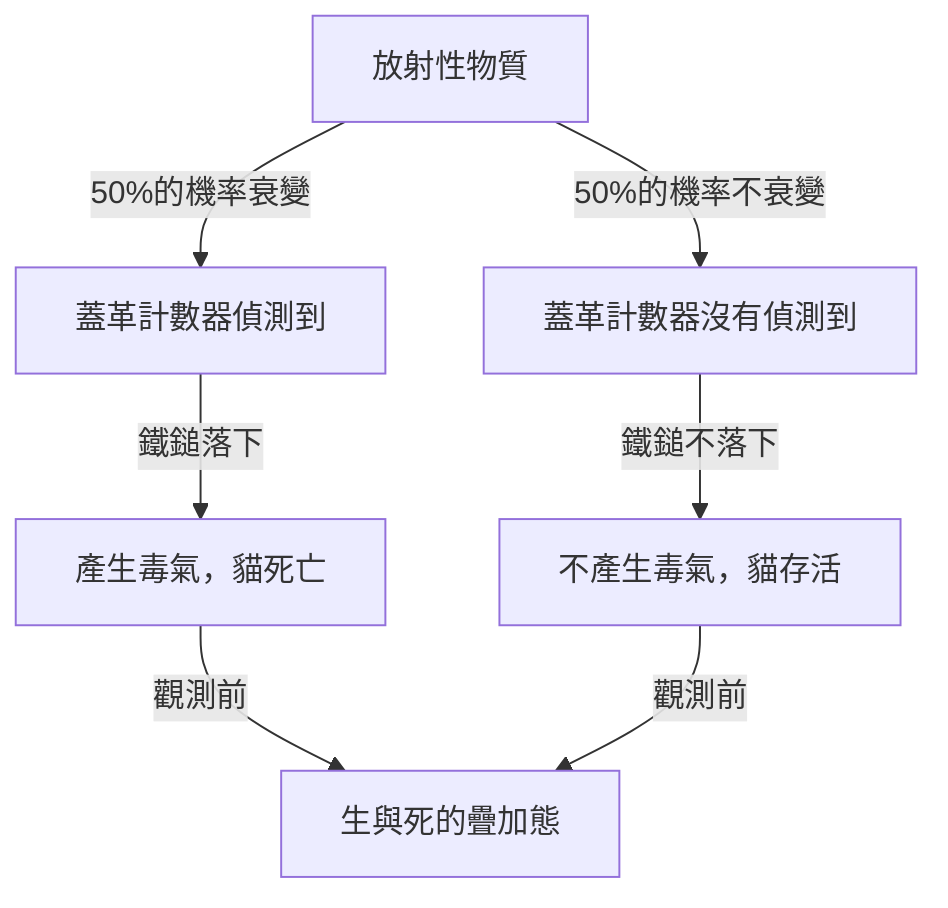
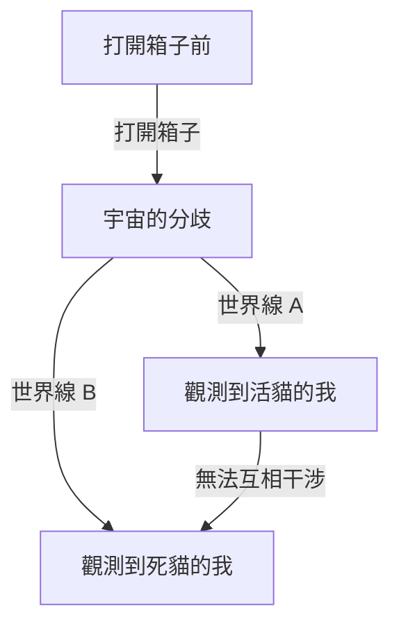

# 量子力學的極北：薛丁格的貓所提出的現實悖論

我們的直覺與常識完全無法適用的微觀世界，那就是量子力學的世界。而將這種量子力學的奇妙之處帶入日常尺度，讓物理學家甚至哲學家們持續煩惱的思考實驗，就是「薛丁格的貓」。本文將針對這個過於著名的悖論，從其由來、物理學與哲學意義，一直到現代的詮釋，進行極其詳細且徹底的深入探討。

## 第1章：什麼是薛丁格的貓？

「薛丁格的貓（Schrödinger's cat）」是由奧地利物理學家埃爾溫·薛丁格於1935年所提出的思考實驗。這個實驗的目的，在於凸顯當時作為主流的量子力學詮釋（哥本哈根詮釋）所包含的邏輯矛盾與違反直覺的性質。

### 思考實驗的設置

薛丁格設想了以下的情況：

1. **鋼鐵箱子**：準備一個完全密封、從外部完全無法觀測內部的箱子。
2. **活著的貓**：在那個箱子裡，放進一隻活著的貓。
3. **放射性物質與蓋革計數器**：箱子裡設置了有50%機率在1小時內衰變的微量放射性物質，以及用來偵測它的蓋革計數器。
4. **毒氣（氫氰酸氣體）瓶與鐵鎚**：當蓋革計數器偵測到放射線釋放（放射性衰變）時，繼電器電路就會啟動，並設計成鐵鎚會揮下打破裝有毒氣的瓶子。

1小時後，這個箱子裡面會變成什麼樣子呢？
用常識來想，貓應該處於「活著」或「死了」的其中一種狀態。然而，如果將量子力學的法則（哥本哈根詮釋）嚴格應用於這個整體系統，就會導出令人驚訝的結論。

放射性物質的衰變是量子力學現象，在打開箱子進行觀測之前，「已衰變狀態」與「未衰變狀態」會作為**「疊加態（superposition）」**而存在。然後，與該狀態連動的貓，在人類打開箱子觀測之前，也處於**「活著的狀態」與「死了的狀態」重疊在一起的狀態**。

## 第2章：為什麼會產生這種奇妙的思考實驗？

這個思考實驗產生的背景，在於1920年代到30年代之間量子力學的快速發展，以及隨之而來的物理學家們激烈的爭論。

### 哥本哈根詮釋的誕生

由尼爾斯·波耳與維爾納·海森堡等人為中心所建構的「哥本哈根詮釋」，成為了對於量子力學數學框架的標準詮釋。其核心主張如下：

1. **波函數與疊加態**：量子系統是用稱為「波函數」的數學工具來描述，在被觀測之前，多個可能的狀態會以機率性重疊存在。
2. **波包塌縮（觀測問題）**：在進行測量或觀測的瞬間，疊加態會「塌縮（collapse）」成唯一一個確定的狀態。
3. **互補性**：作為粒子的性質與作為波的性質無法同時被完全觀測，處於互相補充的關係。

### 愛因斯坦與薛丁格的不滿

阿爾伯特·愛因斯坦強烈批評了哥本哈根詮釋中這種「機率性的自然觀」與「因觀測而塌縮」。「上帝不擲骰子」這句他的名言，表達了物理法則應該是決定論的信念。

發現了量子力學基礎方程式「薛丁格方程式」的薛丁格本人，對於自己創造的方程式被用於機率性詮釋也感到強烈抗拒。在與愛因斯坦的通信中，藉由將微觀世界（放射性物質）的不確定性帶入宏觀世界（貓），試圖指出哥本哈根詮釋的荒謬性，這正是「薛丁格的貓」的由來。

## 第3章：當微觀法則波及宏觀時（量子糾纏）

在薛丁格的貓悖論的核心中，深深涉及了「量子糾纏（entanglement）」這個概念。

在箱子裡，放射性物質的狀態（已衰變/未衰變）與貓的狀態（死了/活著）強烈地結合在一起。只要其中一方決定了，另一方也必定會決定，這種相關關係在量子力學中被稱為「糾纏」。

放射性原子的微觀量子疊加，透過蓋革計數器、繼電器電路、鐵鎚等宏觀裝置被放大，最終擴大（波及）到貓這個生命體的生與死之疊加態。薛丁格稱此為「荒謬之事（ridiculous）」，並警告了將微觀法則毫無批判地應用於宏觀物體的危險性。

## 第4章：現代物理學如何詮釋「貓」？

距離薛丁格的時代已經過了大約一世紀的現在，對於這個悖論依然不存在統一且完美的答案（詮釋）。然而，現代物理學試圖透過幾個有力的途徑來解決這個問題。

### 1. 哥本哈根詮釋的現代觀點

從維持傳統哥本哈根詮釋的立場來看，焦點在於「在哪裡進行了觀測」。
實際上，並非只有人類的意識才算是「觀測」。當蓋革計數器偵測到放射線的瞬間，或者與宏觀環境發生交互作用的瞬間，「觀測」就已經進行了，自然可以認為波函數在那一刻已經塌縮。也就是說，在箱子裡根本不需要等待人類的觀測，貓的生死早已經決定了，這就是此觀點的想法。

### 2. 多世界詮釋（艾弗雷特詮釋）

1957年由休·艾弗雷特三世所提出的「多世界詮釋」，提供了一個非常大膽的解決方案。
根據多世界詮釋，波函數的塌縮絕對不會發生。在打開箱子的瞬間，宇宙本身就會分歧（與其說是分歧，不如說是平行存在）為「觀測到活貓的觀測者宇宙」與「觀測到死貓的觀測者宇宙」這兩個宇宙。

這個詮釋的美妙之處在於，它可以完全不修改量子力學方程式（薛丁格方程式）就直接應用。然而，這伴隨著必須接受「存在著無數個平行宇宙」這種違反直覺結論的哲學代價。

### 3. 量子退相干（量子干涉的喪失）

在現代量子資訊理論中最被重視的是稱為「量子退相干（decoherence）」的物理過程。
為了維持疊加態，系統必須與外部環境完全隔離。然而，像現實中的貓這樣巨大的系統，總是會與周圍的空氣分子或光子碰撞並發生交互作用。

由於這無數的交互作用，關於疊加「相位（作為波的干涉性）」的資訊洩漏到環境中的現象就是退相干。退相干會在極短的時間內發生（對於像貓這樣的宏觀系統，時間實際上等於零），因此量子疊加態會瞬間被破壞，並轉移到古典的機率（活著或死了的其中一方）。退相干理論完美地解釋了「為什麼在宏觀世界中看不到疊加態」。

### 4. 自發塌縮理論（Objective Collapse Theory）

例如GRW理論或彭羅斯的詮釋，主張無論有無觀測，波函數都會透過物理機制自然塌縮。系統的質量或[複雜度](/zh-tw/p/time-space-complexity-big-o-notation-examples/)越大，塌縮所需的時間就越短。像電子這樣的微觀粒子可以長時間維持疊加態，但像貓這樣質量巨大的物體會在一瞬間塌縮，因此解釋了生與死的疊加態在現實中並不會發生。

## 第5章：「薛丁格的貓」在現實世界中的應用

薛丁格作為悖論所提出的「宏觀狀態的疊加」，在現代科技中正逐漸成為現實。

### 應用於量子電腦

作為量子電腦基本單位的「量子位元（qubit）」，正是利用「0與1的疊加態」來進行平行計算。近年來，在原本屬於宏觀（或介觀）尺度的由多個原子組成的電路或超導迴路中，刻意製造出「薛丁格貓態（cat state）」並將其應用於計算或錯誤更正的研究正在進行中。

隨著我們精進技術並提升防止退相干（與外部環境完全隔離）的技術，薛丁格的貓正在從「奇妙的思考實驗」轉變為「實用的資訊處理資源」。

## 第6章：對哲學與認識論的影響

薛丁格的貓超越了單純的物理學問題，向我們提出了「什麼是真實存在？」「什麼是觀測？」等深刻的哲學性問題。

如果「觀測」決定了真實存在，那麼作為觀測者的我們人類的「意識」，是否具有特殊的物理作用？（維格納的朋友悖論）
或者，我們所認知到的這個確固的世界，只是廣闊量子多世界中的一個面向而已？

量子力學動搖了古典物理學所建立的「客觀且獨立的真實存在」這種堅定的信念。薛丁格的貓站在這波動搖的最前線，至今仍持續引導著我們走向深淵般的提問。

## 結論：貓教會了我們什麼？

薛丁格的貓，是為了揭露量子力學的不完整性而創造出來的思考實驗。但諷刺的是，它最終成為了將量子力學最本質且不可思議的性質，直觀地傳達給一般大眾的最強隱喻。

箱子裡的貓告訴我們，我們視為理所當然的「現實」，其實是建立在微觀的量子起伏與宏觀的古典世界交會的極其微妙平衡之上。每當物理學發展，產生新的詮釋或理論時，薛丁格的貓就會以新的姿態出現在我們面前。

在人類智力尋求「真實存在的真面目」的探求之旅中，它今後也將繼續成為最神祕且最具吸引力的路標吧。
