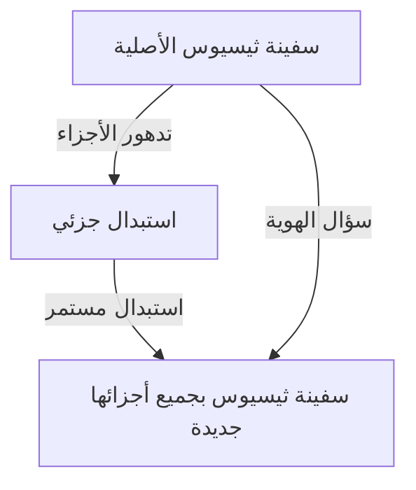
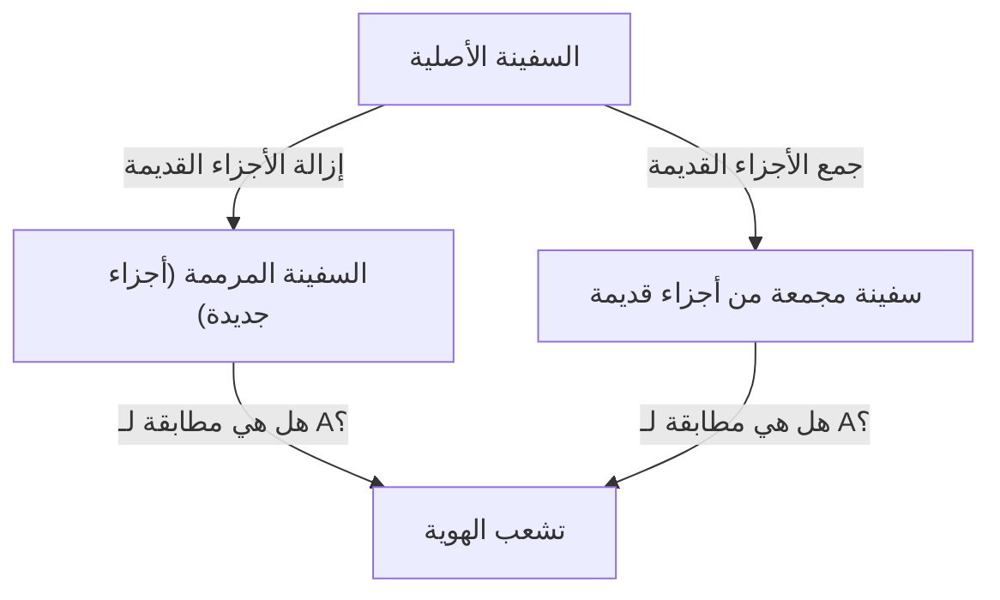

# سفينة ثيسيوس: تجربة الفكر النهائية التي تتساءل عن حدود الهوية

هل "أنت" نفس الشخص الذي كنت عليه قبل 10 سنوات؟

يُقال إن معظم الخلايا البشرية يتم استبدالها في غضون بضع سنوات. عندما تصبح المكونات المادية مختلفة تمامًا، ما هو الأساس الذي نعتمد عليه لنعتقد أننا ما زلنا "نفس الشخص"؟ هذا السؤال العميق لم يأتِ من التكنولوجيا الحديثة، بل يعود إلى مفارقة فلسفية نوقشت منذ عصر اليونان القديمة، وهي "سفينة ثيسيوس".

في هذا المقال، سنستكشف بعمق الهوية الذاتية، المادة والشكل، وحتى الهوية الرقمية في المجتمع الحديث، متخذين من تجربة "سفينة ثيسيوس" الفكرية الشهيرة نقطة انطلاق.

## 1. ما هي "سفينة ثيسيوس"؟

تعود أصول "سفينة ثيسيوس" إلى عمل الفيلسوف اليوناني القديم بلوتارخ (حوالي 46 - 119 م) في كتاب *حيوات موازية*. فيما يتعلق بالسفينة التي عاد عليها البطل الأثيني ثيسيوس من جزيرة كريت، ترك بلوتارخ الوصف التالي:

> "السفينة ذات الثلاثين مجدافًا التي أبحر عليها ثيسيوس مع شباب أثينا وعاد بأمان، احتفظ بها الأثينيون حتى عصر ديمتريوس الفاليري. كانوا يزيلون الأخشاب القديمة كلما تعفنت، ويضعون أخشابًا جديدة قوية مكانها. ونتيجة لذلك، أصبحت هذه السفينة مثالًا دائمًا بين الفلاسفة في النقاش حول 'منطق النمو (أو التغيير)'؛ حيث جادل البعض بأن 'السفينة بقيت كما هي'، بينما جادل آخرون بأنها 'لم تعد نفس السفينة'."

هذا هو جوهر المفارقة.
السفينة الخشبية تتعفن بمرور الوقت. لنفترض أنه تمت إزالة لوح خشبي قديم للإصلاح وتم تثبيت لوح جديد. في هذه المرحلة، سيجيب الجميع، "لا تزال هذه سفينة ثيسيوس." ولكن إذا مرت عقود أو قرون، وتم **استبدال جميع الأخشاب الأصلية بالكامل بأخرى جديدة**، فهل لا يزال من الممكن تسميتها "سفينة ثيسيوس"؟

يسلط هذا السؤال الضوء على غموض كلمة "نفس الشيء" التي نستخدمها يوميًا.

## 2. امتداد توماس هوبز: ظهور السفينة الثانية

أضاف الفيلسوف الإنجليزي في القرن السابع عشر، توماس هوبز، تحولًا إضافيًا لهذه المفارقة. في كتابه *De Corpore*، قدم السيناريو المتطرف التالي:

**"ماذا لو قام شخص بجمع جميع الأخشاب القديمة التي أُزيلت من سفينة ثيسيوس، وجمعها معًا لبناء سفينة ثانية بنفس الشكل تمامًا، فأيهما هي سفينة ثيسيوس الحقيقية؟"**

مع هذه التجربة الفكرية، تصبح المشكلة أكثر تعقيدًا.

في سيناريو هوبز، يوجد مرشحان:
1. **سفينة الاستمرارية (السفينة المرممة)**: السفينة التي رست في ميناء أثينا واستمرت في العمل واستمر الناس في تسميتها "سفينة ثيسيوس" (على الرغم من أن المواد كلها جديدة).
2. **سفينة المواد (السفينة المعاد بناؤها)**: السفينة المكونة من نفس المادة الفيزيائية للسفينة الأصلية تمامًا.

إذا كان "امتلاك نفس المواد" هو شرط الهوية، فإن الثانية هي الحقيقية. ولكن إذا كان "الاستمرارية المكانية والزمانية" هو الشرط، فإن الأولى هي الحقيقية. نظرًا لأنه من المستحيل منطقيًا وجود "سفينتي ثيسيوس" في نفس الوقت، يجب علينا اختيار واحدة.

## 3. نهج نظرية الأسباب الأربعة لأرسطو

لحل هذه المشكلة، دعونا نطبق فلسفة "الأسباب الأربعة" للفيلسوف اليوناني القديم أرسطو. صنف أرسطو أسباب وجود الأشياء إلى أربعة أسباب.

1. **السبب المادي**: مم تتكون (خشب، مسامير، إلخ)
2. **السبب الصوري**: شكل الشيء أو مخططه أو هيكله (تصميم السفينة، شكلها)
3. **السبب الفاعل**: الفاعل أو العملية التي صنعته (النجارون، أعمال الترميم)
4. **السبب الغائي**: الغرض الذي توجد من أجله (للإبحار، كنصب تذكاري للبطل)

في هذا الإطار، يمكن إعادة صياغة مفارقة "سفينة ثيسيوس" إلى السؤال: "هل نبحث عن هوية الشيء في سببه المادي، أم في سببه الصوري والغائي؟"

أولئك الذين يجادلون بأنه "شيء مختلف لأن جميع المواد قد تغيرت" يؤكدون على **السبب المادي**.
من ناحية أخرى، فإن أولئك الذين يجادلون بأن "لها نفس الشكل والهيكل، والغرض من إحياء ذكرى ثيسيوس هو نفسه، فهي إذن نفس السفينة" يؤكدون على **السبب الصوري** و**السبب الغائي**. غالبًا ما يدعم الحدس البشري السبب الصوري. تخيل تدفق نهر. جزيئات الماء المتدفقة في نهر كامو ليست هي نفسها أبدًا لأي ثانية. يتدفق الماء الجديد باستمرار. ومع ذلك، فإننا نطلق على هذا النهر دائمًا اسم "نهر كامو". تكمن هوية النهر ليس في "الماء (المادة)" التي يتكون منها، ولكن في "مسار تدفقه (الشكل)".

## 4. "سفينة ثيسيوس" في العصر الحديث: الخلايا والوعي

تظهر هذه المفارقة كأكثر المشاكل إلحاحًا عندما يتعلق الأمر "بأنفسنا".

كحقيقة بيولوجية، تتجدد الخلايا البشرية باستمرار. يتم استبدال خلايا بطانة المعدة في غضون أيام قليلة، وخلايا الجلد في بضعة أسابيع، وخلايا الدم الحمراء في حوالي 120 يومًا. في غضون 7 إلى 10 سنوات، يتم استبدال معظم المواد التي يتكون منها جسدنا بذرات وجزيئات مختلفة تمامًا عن ماضينا.

إذن، هل أنت "نفس" الشخص الذي كنت عليه قبل 10 سنوات؟ لماذا نحن واثقون من أننا "نحن أنفسنا" على الرغم من أن موادنا الفيزيائية مختلفة تمامًا؟

هنا يأتي مفهوم **"الاستمرارية النفسية"**. جادل الفيلسوف الإنجليزي جون لوك بأن الهوية الشخصية لا تضمنها المادة (الجسد)، بل من خلال استمرارية الذاكرة والوعي. بعبارة أخرى، طالما أننا نتذكر من كنا بالأمس، وتؤثر تجاربنا السابقة على حاضرنا دون أن تنكسر تلك السلسلة، فإننا نظل "نفس الشخص".

## 5. الهوية في المجتمع: الشركات، الفرق الموسيقية، شيكينن سينغو

يمكن ملاحظة مفارقة سفينة ثيسيوس في جوانب مختلفة من المجتمع.

### تغيير أعضاء فرقة موسيقية
إذا غادر جميع الأعضاء الأصليين للفرقة وبقي الأعضاء الجدد فقط، فهل هي نفس الفرقة؟ طالما يتم توارث "شكل" اسم الفرقة وأغانيها، فغالبًا ما يتعرف عليها المعجبون على أنها نفس الفرقة.

### شيكينن سينغو في ضريح إيسه
في اليابان، هناك استجابة ثقافية جميلة لسفينة ثيسيوس: "شيكينن سينغو" في ضريح إيسه. في ضريح إيسه، كل 20 عامًا، يتم بناء مبنى ضريح جديد بنفس التصميم تمامًا على موقع مجاور، ويتم تفكيك المبنى القديم. استمرت هذه الطقوس لأكثر من 1300 عام.
من وجهة نظر مادية، يبدو أنه يصبح شيئًا مختلفًا كل 20 عامًا، ولكن هناك فلسفة عميقة مفادها أن توارث التكنولوجيا والروح (الشكل) هو وسيلة للحفاظ على الاستمرارية الأبدية.

## 6. العصر الرقمي والهوية الذاتية

اليوم، لا تخضع البيانات للتآكل المادي، لكن النسخ والنقل يخلق مفارقة جديدة. علاوة على ذلك، في المستقبل عندما يتحقق "رفع العقل" (نقل الوعي إلى جهاز كمبيوتر)، ستصل المفارقة إلى ذروتها. عندما يتم استبدال خلايا الدماغ تدريجيًا بشرائح السيليكون، وفي النهاية تصبح كلها آلية، فهل لا يزال من الممكن تسمية الوعي الموجود هناك "بأنت"؟

## 7. الخلاصة: هل "نفس الشيء" مجرد اتفاق؟

أكبر درس تعلمناه إياه سفينة ثيسيوس هو أن **"الهوية ليست خاصية مطلقة متأصلة في الأشياء، بل هي مجرد اتفاق أو مفهوم لكيفية إدراكنا لها"**.

كما يعلمنا المفهوم البوذي عن عدم الثبات، كل شيء في هذا العالم في حالة تدفق وتغير. تنشأ المفارقة لأننا نحاول العثور على كيان ثابت يسمى "نفس السفينة" أو "نفس الأنا". ما نطلق عليه "نفس الشيء" هو مجرد تسمية مناسبة يتم تطبيقها على عملية تتغير باستمرار.

أن نعيش هو مثل سفينة ثيسيوس: رحلة نتخلص فيها باستمرار من ذواتنا القديمة، وندمج أشياء جديدة، بينما نواصل نسج قصة تسمى "أنا".
