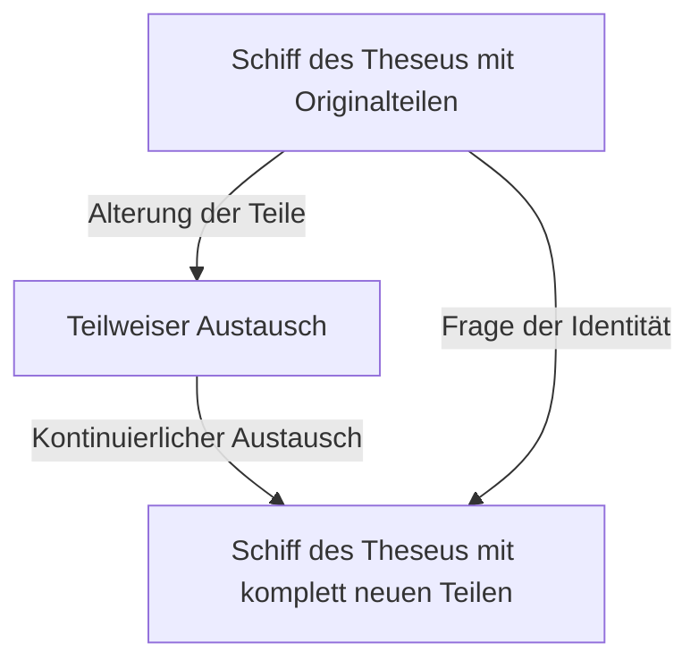
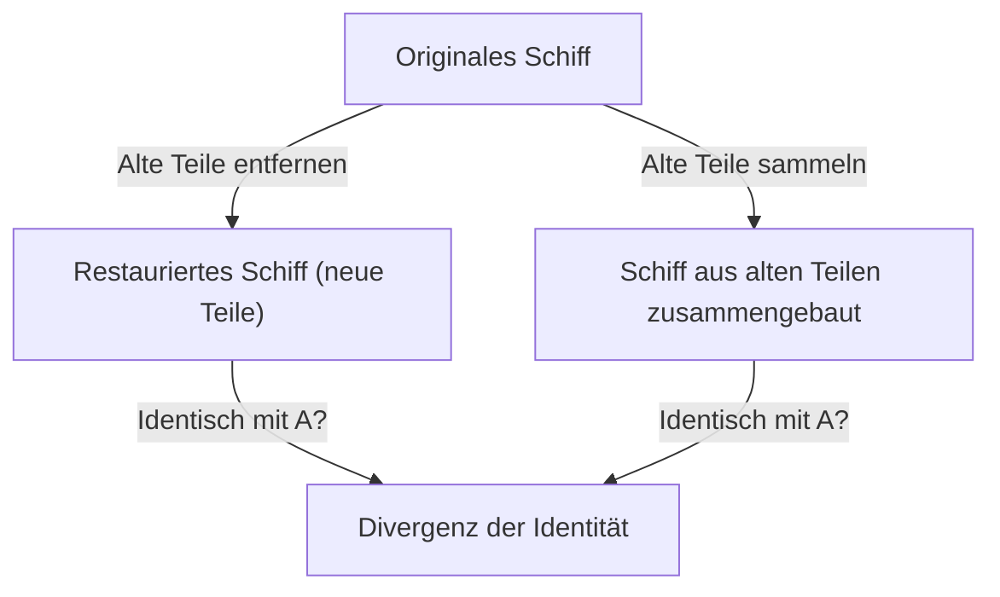

# Das Schiff des Theseus: Das ultimative Gedankenexperiment, das die Grenzen der Identität hinterfragt

Sind „Sie“ dieselbe Person wie „Sie“ vor 10 Jahren?

Es heißt, dass die meisten menschlichen Zellen innerhalb weniger Jahre ersetzt werden. Wenn die physischen Bestandteile völlig andere werden, worauf gründet sich dann unser Glaube, dass wir immer noch „das gleiche Selbst“ sind? Diese tiefgründige Frage wurde nicht durch die moderne Wissenschaft und Technologie aufgeworfen, sondern läuft auf ein philosophisches Paradoxon hinaus, das seit der griechischen Antike diskutiert wird. Das ist das „[Schiff des Theseus](/de/p/ship-of-theseus/)“.

In diesem Artikel werden wir dieses berühmte Gedankenexperiment des „Schiffs des Theseus“ als Ausgangspunkt nehmen, um persönliche Identität, Materie und Form, und sogar die digitale Identität in der modernen Gesellschaft äußerst detailliert und gründlich zu untersuchen.

## 1. Was ist das „Schiff des Theseus“?

Der Ursprung des „Schiffs des Theseus“ geht auf die „Parallelbiographien“ des antiken griechischen Philosophen Plutarch (ca. 46 – 119 n. Chr.) zurück. Plutarch hinterließ folgende Beschreibung über das Schiff, mit dem der athenische Held Theseus von Kreta zurückkehrte:

> „Das Schiff mit dreißig Rudern, auf dem Theseus mit den jungen Athenern zurückkehrte, wurde von den Athenern bis zur Zeit des Demetrios von Phaleron aufbewahrt. Sie entfernten das verrottete Holz und fügten an seiner Stelle neues, starkes Holz ein. Infolgedessen wurde dieses Schiff zu einem hervorragenden Thema für Diskussionen unter den Philosophen über die Logik des ‚Wachstums (oder der Veränderung)‘. Die einen argumentierten, ‚es sei dasselbe Schiff‘, und die anderen argumentierten, ‚es sei nicht mehr dasselbe Schiff‘.“

Das ist die Wurzel des Paradoxons.
Ein Holzschiff verrottet im Laufe der Zeit. Nehmen wir an, wir reißen ein altes Brett zur Reparatur ab und nageln ein neues Brett fest. An diesem Punkt würde jeder antworten: „Das ist immer noch das [Schiff des Theseus](/de/p/ship-of-theseus/).“ Wenn jedoch Jahrzehnte oder Jahrhunderte vergehen und **das ursprüngliche Holz komplett durch neues Holz ersetzt wird**, kann es dann noch „[Schiff des Theseus](/de/p/ship-of-theseus/)“ genannt werden?

Diese Frage trifft genau die Zweideutigkeit des Wortes „gleich“, das wir alltäglich verwenden.

## 2. Thomas Hobbes' Erweiterung: Das Erscheinen des zweiten Schiffes

Im 17. Jahrhundert fügte der englische Philosoph Thomas Hobbes diesem Paradoxon eine weitere Wendung hinzu. In seinem Buch „De Corpore“ präsentierte er folgendes extreme Szenario:

**„Was wäre, wenn jemand all das alte Holz, das vom [Schiff des Theseus](/de/p/ship-of-theseus/) entfernt wurde, einsammeln, es genau so zusammensetzen und ein anderes Schiff mit der gleichen Form bauen würde – welches wäre das echte [Schiff des Theseus](/de/p/ship-of-theseus/)?“**

Durch dieses Gedankenexperiment wird das Problem noch komplizierter.

In dem von Hobbes präsentierten Szenario gibt es zwei Kandidaten.
1. **Schiff der Kontinuität (Das restaurierte Schiff)**: Das Schiff, das im Hafen von Athen angebunden blieb, weiterhin funktionierte und von den Menschen weiterhin das „[Schiff des Theseus](/de/p/ship-of-theseus/)“ genannt wurde (alle Materialien sind neu).
2. **Schiff des Materials (Das rekonstruierte Schiff)**: Das Schiff, das aus genau denselben physischen Materialien wie das ursprüngliche Schiff besteht.

Wenn „aus dem gleichen Material zu bestehen“ die Bedingung für Identität ist, dann ist letzteres das Original. Wenn jedoch die „räumliche und zeitliche Kontinuität“ die Bedingung für Identität ist, dann ist ersteres das Original. Da es logischerweise unmöglich ist, dass zwei „Schiffe des Theseus“ gleichzeitig existieren, müssen wir uns für eines entscheiden.

## 3. Der Ansatz der vier Ursachen von Aristoteles

Um dieses Problem zu lösen, wenden wir die Philosophie von Aristoteles, dem Giganten der griechischen Antike, an: die „Vier-Ursachen-Lehre“. Aristoteles klassifizierte die Gründe, warum Dinge existieren, in vier Ursachen:

1. **Materialursache (Causa materialis)**: Woraus es besteht (Holz, Nägel, etc.)
2. **Formursache (Causa formalis)**: Die Form, der Bauplan oder die Struktur der Sache (Schiffsdesign, Form)
3. **Wirkursache (Causa efficiens)**: Das Subjekt oder der Prozess, der es gemacht hat (Schiffsbauer, Restaurierungsarbeiten)
4. **Zweckursache (Causa finalis)**: Der Zweck, für den es existiert (zum Segeln, als Denkmal für einen Helden)

Wenn man in diesem Rahmen denkt, lässt sich das Paradoxon des „Schiffs des Theseus“ in die Frage übersetzen: „Suchen wir die Identität eines Dinges in seiner Materialursache oder in seiner Form- und Zweckursache?“

Diejenigen, die argumentieren: „Es ist etwas anderes, weil alle Materie ersetzt wurde“, betonen die **Materialursache**.
Auf der anderen Seite betonen diejenigen, die argumentieren: „Es ist dasselbe Schiff, weil Form und Struktur gleich sind, und es den gleichen Zweck hat, Theseus zu ehren“, die **Formursache** und die **Zweckursache**. Die menschliche Intuition unterstützt oft die Formursache. Stellen Sie sich den Flusslauf vor. Die Wassermoleküle, die im „Kamogawa-Fluss“ fließen, sind keine Sekunde lang dieselben. Es fließt ständig neues Wasser hinein. Dennoch nennen wir diesen Fluss immer „Kamogawa-Fluss“. Dies liegt daran, dass die Identität des Flusses nicht im „Wasser (Materie)“ liegt, aus dem er besteht, sondern im „Weg seiner Strömung (Form)“.

## 4. „Das Schiff des Theseus“ in der modernen Ära: Zellen und Bewusstsein

Das Paradoxon taucht als drängendstes Problem bei niemand anderem als „uns selbst“ auf.

Als biologische Tatsache erneuern sich menschliche Zellen durch den Stoffwechsel ständig. Magenschleimhautzellen werden in wenigen Tagen ersetzt, Hautzellen in einigen Wochen und rote Blutkörperchen in etwa 120 Tagen. In etwa 7 bis 10 Jahren wurde der größte Teil der Materie, aus der unser Körper besteht, durch völlig andere Atome und Moleküle ersetzt als bei uns in der Vergangenheit.

Also, sind das Sie von vor 10 Jahren und das Sie von heute dieselbe Person? Warum sind wir uns sicher, dass „ich ich bin“, obwohl das physische Material völlig anders ist?

Hier kommt das Konzept der **„Psychologischen Kontinuität“ (Psychological Continuity)** ins Spiel. Der englische Philosoph John Locke argumentierte, dass die persönliche Identität nicht durch die Materie (den Körper), sondern durch die Kontinuität von Gedächtnis und Bewusstsein garantiert wird. Mit anderen Worten, solange wir uns daran erinnern, wer wir gestern waren, und unsere vergangenen Erfahrungen beeinflussen, wer wir heute sind, und diese Kette nicht unterbrochen wird, sind wir weiterhin „das gleiche Selbst“.

## 5. Identität in der Gesellschaft: Unternehmen, Bands und Shikinen Sengu

Das Paradoxon des Schiffs des Theseus lässt sich in verschiedenen Situationen der Gesellschaft beobachten.

### Mitgliederwechsel in einer Musikband
Ist eine Band, bei der alle ursprünglichen Mitglieder seit ihrer Gründung ausgestiegen sind und nur noch neue Mitglieder übrig sind, noch dieselbe Band? Solange die „Form“ des Gruppennamens und der Lieder vererbt wird, wird sie von den Fans oft als dieselbe Band anerkannt.

### Das Shikinen Sengu des Ise-Schreins
In Japan gibt es eine wunderschöne kulturelle Antwort auf das Schiff des Theseus. Es ist das „Shikinen Sengu“ des Ise-Schreins. Am Ise-Schrein wird alle 20 Jahre ein neues Schrein-Gebäude mit genau demselben Design auf dem angrenzenden Grundstück errichtet, und das alte Gebäude wird abgerissen. Dieses Ritual wird seit über 1.300 Jahren fortgesetzt.
Aus einer materialistischen Perspektive scheint es so, als würde es alle 20 Jahre etwas anderes werden, aber es gibt dort eine hochstehende Philosophie, die besagt, dass die Weitergabe von Technologie und Geist (Form) das eigentliche Mittel ist, um ewige Kontinuität zu bewahren.

## 6. Das digitale Zeitalter und die persönliche Identität

Heutzutage sind Daten keinem physischen Verschleiß unterworfen, aber sie schaffen ein neues Paradoxon des Kopierens und Verschiebens. Wenn in der Zukunft außerdem „Mind Uploading (Übertragung des Bewusstseins auf einen Computer)“ verwirklicht wird, erreicht das Paradoxon seinen Höhepunkt. Wenn Gehirnzellen nach und nach durch Siliziumchips ersetzt werden und schließlich alles mechanisiert ist, kann das Bewusstsein dort noch „Sie“ genannt werden?

## 7. Fazit: Ist „gleich“ nur eine Übereinkunft?

Die größte Lektion, die uns das [Schiff des Theseus](/de/p/ship-of-theseus/) lehrt, ist, dass **„Identität keine absolute Eigenschaft ist, die den Dingen innewohnt, sondern nur eine Übereinkunft oder ein Konzept darüber, wie wir sie wahrnehmen“**.

Wie die „Vergänglichkeit (Impermanenz)“ des Buddhismus zeigt, befindet sich alles auf dieser Welt im Fluss der Veränderung. Das Paradoxon entsteht, weil wir versuchen, eine feste Einheit wie „das gleiche Schiff“ oder „das gleiche Ich“ zu suchen. Was wir „gleich“ nennen, ist nur ein Etikett, das der Einfachheit halber an einen sich ständig verändernden Prozess angehängt wird.

Die Tatsache, dass wir leben, ist wie eine Seereise, genau wie das [Schiff des Theseus](/de/p/ship-of-theseus/), bei der wir ständig unser altes Ich ablegen, ein neues Ich integrieren und dennoch weiterhin die Geschichte des „Ich“ weben.
