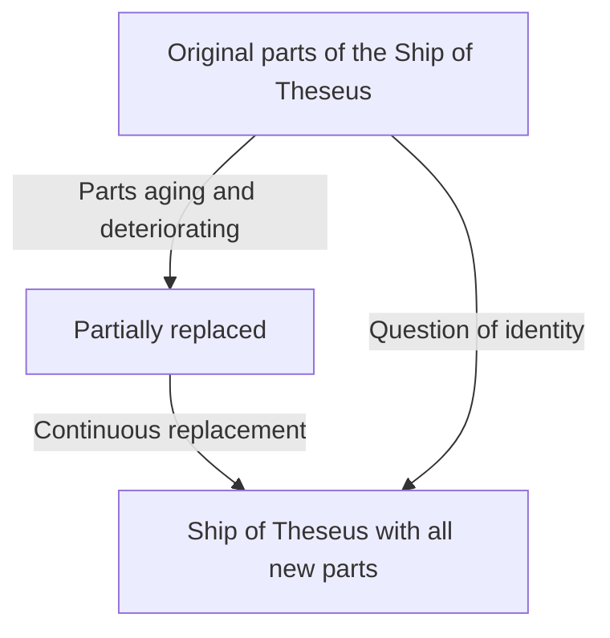
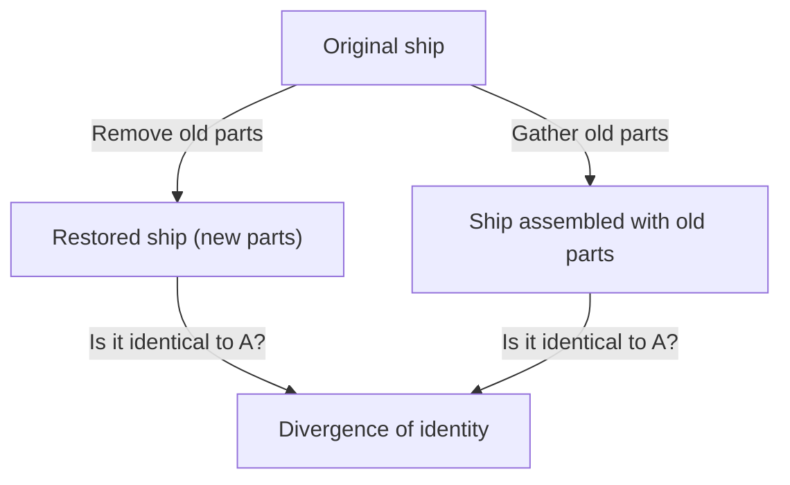

# The Ship of Theseus: The Ultimate Thought Experiment Questioning the Boundaries of Identity

Are "you" the same person as "you" were 10 years ago?

It is said that most human cells are replaced within a few years. When the physical components become completely different, what is the basis for us to believe that we are "the same self"? This profound question was not brought about by modern science and technology, but comes down to a philosophical paradox that has been endlessly debated since the times of ancient Greece. That is the "Ship of Theseus".

In this article, using this famous thought experiment of the "Ship of Theseus" as a foothold, we will thoroughly and deeply explore self-identity, matter and form, up to digital identity in modern society.

## 1. What is the "Ship of Theseus"?

The origin of the "Ship of Theseus" dates back to "Parallel Lives" written by the ancient Greek philosopher Plutarch (c. 46 - 119 AD). Plutarch left the following description about the ship that the Athenian hero Theseus rode when returning from Crete.

> "The ship wherein Theseus and the youth of Athens returned had thirty oars, and was preserved by the Athenians down even to the time of Demetrius Phalereus, for they took away the old planks as they decayed, putting in new and stronger timber in their place, insomuch that this ship became a standing example among the philosophers, for the logical question of things that grow; one side holding that the ship remained the same, and the other contending that it was not the same."

This is the core of the paradox.
Wooden ships decay over time. Suppose we strip off an old plank and nail a new one for repair. At this point, everyone would answer "this remains the Ship of Theseus". However, if decades or centuries pass and **all the original wood is completely replaced with new ones**, can it still be called the "Ship of Theseus"?

This question sharply strikes the ambiguity of the word "same" that we use daily.

## 2. Thomas Hobbes' Extension: The Appearance of the Second Ship

The 17th-century English philosopher Thomas Hobbes added a further twist to this paradox. In his book "De Corpore", he presented the following extreme scenario:

**"If someone gathered all the old wood removed from the Ship of Theseus and assembled them exactly as before to build another ship of the exact same shape, which one is the real Ship of Theseus?"**

With this thought experiment, the problem becomes even more complex.

In the scenario presented by Hobbes, there are two candidates.
1. **The Ship of Continuity (Restored Ship)**: The ship that has always been moored in the port of Athens, continued to function, and kept being called the "Ship of Theseus" by people (all materials are new).
2. **The Ship of Material (Reconstructed Ship)**: The ship composed of exactly the same physical materials as the original ship.

If "having the same materials" is the condition of identity, the latter is the real one. However, if "spatial and temporal continuity" is the condition, the former is the real one. Since it is logically impossible for two "Ships of Theseus" to exist at the same time, we must choose one.

## 3. Aristotle's Approach by the Four Causes

To unravel this problem, let's apply the philosophy of the ancient Greek giant Aristotle, the "Four Causes". Aristotle categorized the reasons why things exist into four causes.

1. **Material Cause**: What it is made of (wood, nails, etc.)
2. **Formal Cause**: Its form, blueprint, or structure (design and shape of the ship)
3. **Efficient Cause**: The agent or process that made it (shipwrights, restoration work)
4. **Final Cause**: The purpose for which it exists (to sail, as a monument to the hero)

Thinking in this framework, the paradox of the "Ship of Theseus" can be rephrased as the question: "Do we seek the identity of a thing in its material cause, or in its formal and final causes?"

Those who argue "it's different because all the matter has been replaced" emphasize the **Material Cause**.
On the other hand, those who argue "it's the same ship because the shape and structure are the same, and the purpose of commemorating Theseus is also the same" emphasize the **Formal Cause** and **Final Cause**. Human intuition often supports the formal cause. Imagine the flow of a river. The water molecules flowing in the "Kamo River" are never the same even for a second. New water is always flowing in. However, we always call that river the "Kamo River". This is because the identity of the river lies not in the "water (material)" that makes it up, but in its "path of flow (form)".

## 4. The "Ship of Theseus" in Modern Times: Cells and Consciousness

This paradox appears as the most pressing problem in none other than "ourselves".

As a biological fact, human cells are constantly undergoing metabolism. Gastric mucosal cells are replaced in a few days, skin cells in a few weeks, and red blood cells in about 120 days. In about 7 to 10 years, most of the matter that makes up our bodies has been replaced by entirely different atoms and molecules from our past selves.

Then, are you the same person as you were 10 years ago? Why are we convinced that "I am myself" even though our physical materials are completely different?

This is where the concept of **"Psychological Continuity"** comes in. The English philosopher John Locke argued that the identity of a person is not guaranteed by matter (the body), but by the continuity of memory and consciousness. In other words, as long as we remember who we were yesterday and our past experiences affect our current selves, and as long as that chain is not broken, we remain "the same self".

## 5. Identity in Society: Corporations, Bands, and Shikinen Sengu

The paradox of the Ship of Theseus can be observed in various situations in society.

### Changing Members of a Music Band
Is a band the same band if all the original founding members have left and it consists only of new members? As long as the "form" of the group name and songs is inherited, it is often recognized as the same band by fans.

### Shikinen Sengu of Ise Jingu
In Japan, there is a beautiful cultural answer to the Ship of Theseus. It is the "Shikinen Sengu" of Ise Jingu. At Ise Jingu, every 20 years, a shrine building of the exact same design is newly built on an adjacent site, and the old building is dismantled. This ritual has been continued for over 1300 years.
From a materialistic perspective, it seems to become a different thing every 20 years, but there is a profound philosophy that inheriting techniques and spirit (form) is precisely the means to maintain eternal continuity.

## 6. Digital Age and Self-Identity

In the modern age, data does not involve physical wear and tear, but it creates a new paradox of copying and moving. Furthermore, when "mind uploading (transfer of consciousness to a computer)" is realized in the future, the paradox will reach its extreme. When brain cells are gradually replaced by silicon chips and everything is finally mechanized, can the consciousness there be called "you"?

## 7. Conclusion: Is "Same" Merely an Agreement?

The greatest lesson the Ship of Theseus teaches us is that **"identity is not an absolute property inherent in things, but merely an agreement or concept of how we perceive it."**

As indicated by the Buddhist concept of "impermanence of all things (Shogyo Mujo)", everything in this world is in the flow of change. The paradox arises because we try to seek fixed entities like "the same ship" or "the same me". What we call "the same" is just a label conveniently attached to an ever-changing process.

Living is like navigating a voyage where, like the Ship of Theseus, we constantly discard our old selves and incorporate our new selves, yet continue to weave the story of "me".
