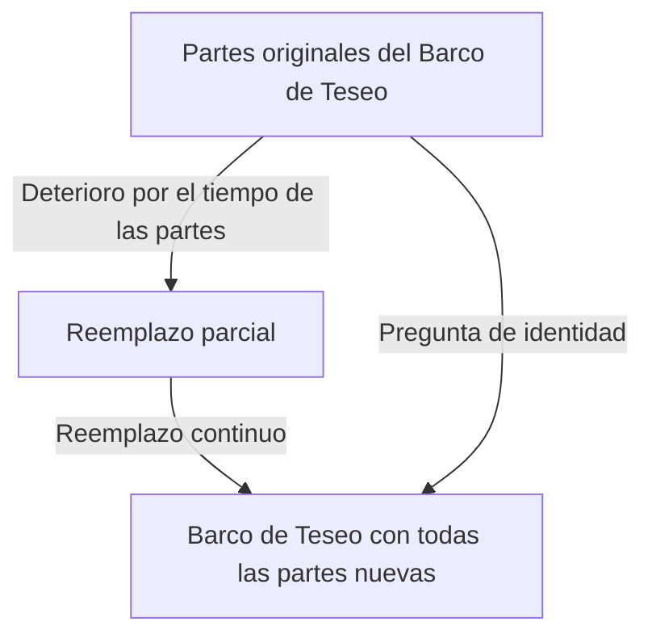
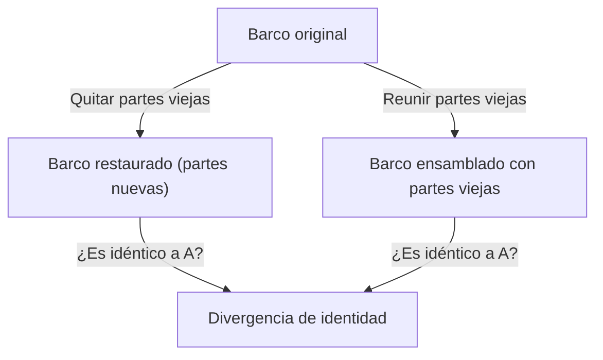

# El Barco de Teseo: El experimento mental definitivo que cuestiona los límites de la identidad

¿Eres "tú" la misma persona que eras hace 10 años?

Se dice que la mayoría de las células humanas se reemplazan en unos pocos años. Cuando los componentes físicos se vuelven completamente diferentes, ¿cuál es la base para que creamos que somos "el mismo yo"? Esta profunda pregunta no fue provocada por la ciencia y la tecnología modernas, sino que se reduce a una paradoja filosófica que ha sido debatida sin fin desde los tiempos de la antigua Grecia. Ese es el "Barco de Teseo".

En este artículo, utilizando este famoso experimento mental del "Barco de Teseo" como punto de apoyo, exploraremos de manera exhaustiva y profunda la identidad personal (identidad), la materia y la forma, hasta llegar a la identidad digital en la sociedad moderna.

## 1. ¿Qué es el "Barco de Teseo"?

El origen del "Barco de Teseo" se remonta a "Vidas paralelas", escrita por el antiguo filósofo griego Plutarco (c. 46 - 119 d.C.). Plutarco dejó la siguiente descripción sobre el barco que montaba el héroe ateniense Teseo al regresar de Creta.

> "El barco en el que Teseo y los jóvenes de Atenas regresaron tenía treinta remos, y fue conservado por los atenienses hasta la época de Demetrio Falereo, ya que retiraban las tablas viejas a medida que se pudrían, colocando madera nueva y más fuerte en su lugar. Como resultado, este barco se convirtió en un ejemplo permanente entre los filósofos para la cuestión lógica de las cosas que crecen; un lado sostenía que el barco seguía siendo el mismo, y el otro argumentaba que ya no era el mismo."

Este es el núcleo de la paradoja.
Los barcos de madera se pudren con el tiempo. Supongamos que quitamos una tabla vieja y clavamos una nueva para repararlo. En este punto, todos responderían "este sigue siendo el Barco de Teseo". Sin embargo, si pasan décadas o siglos y **toda la madera original se reemplaza por completo por otras nuevas**, ¿todavía se le puede llamar el "Barco de Teseo"?

Esta pregunta golpea fuertemente la ambigüedad de la palabra "mismo" que usamos a diario.

## 2. La extensión de Thomas Hobbes: La aparición del segundo barco

El filósofo inglés del siglo XVII, Thomas Hobbes, añadió un giro más a esta paradoja. En su libro "De Corpore", presentó el siguiente escenario extremo:

**"Si alguien reuniera toda la madera vieja extraída del Barco de Teseo y la ensamblara exactamente como antes para construir otro barco con la misma forma, ¿cuál es el verdadero Barco de Teseo?"**

Con este experimento mental, el problema se vuelve aún más complejo.

En el escenario presentado por Hobbes, hay dos candidatos.
1. **El Barco de la Continuidad (Barco Restaurado)**: El barco que siempre ha estado amarrado en el puerto de Atenas, continuó funcionando y siguió siendo llamado el "Barco de Teseo" por la gente (todos los materiales son nuevos).
2. **El Barco del Material (Barco Reconstruido)**: El barco compuesto exactamente por los mismos materiales físicos que el barco original.

Si "tener los mismos materiales" es la condición de identidad, el último es el real. Sin embargo, si la "continuidad espacial y temporal" es la condición, el primero es el real. Dado que es lógicamente imposible que dos "Barcos de Teseo" existan al mismo tiempo, debemos elegir uno.

## 3. El enfoque de Aristóteles mediante las Cuatro Causas

Para desentrañar este problema, apliquemos la filosofía del gigante griego antiguo Aristóteles, las "Cuatro Causas". Aristóteles categorizó las razones por las que las cosas existen en cuatro causas.

1. **Causa Material**: De qué está hecho (madera, clavos, etc.)
2. **Causa Formal**: Su forma, plano o estructura (diseño y forma del barco)
3. **Causa Eficiente**: El agente o proceso que lo hizo (carpinteros de barcos, trabajos de restauración)
4. **Causa Final**: El propósito para el que existe (para navegar, como monumento al héroe)

Pensando en este marco, la paradoja del "Barco de Teseo" puede reformularse como la pregunta: "¿Buscamos la identidad de una cosa en su causa material, o en sus causas formal y final?"

Aquellos que argumentan "es diferente porque toda la materia ha sido reemplazada" enfatizan la **Causa Material**.
Por otro lado, aquellos que argumentan "es el mismo barco porque la forma y estructura son las mismas, y el propósito de conmemorar a Teseo también es el mismo" enfatizan la **Causa Formal** y la **Causa Final**. La intuición humana a menudo apoya la causa formal. Imagina el flujo de un río. Las moléculas de agua que fluyen en el "Río Kamo" nunca son las mismas ni por un segundo. Siempre está entrando agua nueva. Sin embargo, siempre llamamos a ese río el "Río Kamo". Esto se debe a que la identidad del río no reside en el "agua (materia)" que lo compone, sino en su "camino de flujo (forma)".

## 4. El "Barco de Teseo" en los tiempos modernos: Células y conciencia

Esta paradoja aparece como el problema más apremiante en nada menos que "nosotros mismos".

Como hecho biológico, las células humanas están constantemente sometidas a un metabolismo. Las células de la mucosa gástrica se reemplazan en unos pocos días, las células de la piel en unas pocas semanas y los glóbulos rojos en aproximadamente 120 días. En unos 7 a 10 años, la mayor parte de la materia que compone nuestros cuerpos ha sido reemplazada por átomos y moléculas completamente diferentes a las de nuestro yo pasado.

Entonces, ¿eres la misma persona que eras hace 10 años? ¿Por qué estamos convencidos de que "yo soy yo mismo" a pesar de que nuestros materiales físicos son completamente diferentes?

Aquí es donde entra el concepto de **"Continuidad Psicológica"**. El filósofo inglés John Locke argumentó que la identidad de una persona no está garantizada por la materia (el cuerpo), sino por la continuidad de la memoria y la conciencia. En otras palabras, mientras recordemos quiénes éramos ayer y nuestras experiencias pasadas afecten nuestro yo actual, y mientras esa cadena no se rompa, seguimos siendo "el mismo yo".

## 5. La identidad en la sociedad: Corporaciones, bandas y Shikinen Sengu

La paradoja del Barco de Teseo se puede observar en diversas situaciones de la sociedad.

### Cambio de miembros en una banda musical
¿Es una banda la misma banda si todos los miembros fundadores originales se han ido y consta solo de nuevos miembros? Mientras la "forma" del nombre del grupo y las canciones se hereden, los fanáticos a menudo la reconocen como la misma banda.

### Shikinen Sengu del Santuario Ise
En Japón, hay una hermosa respuesta cultural al Barco de Teseo. Es el "Shikinen Sengu" del Santuario Ise. En el Santuario Ise, cada 20 años, se construye un nuevo edificio de santuario con el mismo diseño exacto en un sitio adyacente, y se desmantela el antiguo edificio. Este ritual se ha continuado durante más de 1300 años.
Desde una perspectiva materialista, parece convertirse en algo diferente cada 20 años, pero existe una profunda filosofía de que heredar técnicas y espíritu (forma) es precisamente el medio para mantener la continuidad eterna.

## 6. La era digital y la identidad personal

En la era moderna, los datos no implican desgaste físico, pero crean una nueva paradoja de copia y movimiento. Además, cuando la "carga mental (transferencia de conciencia a una computadora)" se realice en el futuro, la paradoja llegará a su extremo. Cuando las células cerebrales sean reemplazadas gradualmente por chips de silicio y todo esté finalmente mecanizado, ¿podrá la conciencia allí ser llamada "tú"?

## 7. Conclusión: ¿Es "mismo" simplemente un acuerdo?

La mayor lección que nos enseña el Barco de Teseo es que **"la identidad no es una propiedad absoluta inherente a las cosas, sino simplemente un acuerdo o concepto de cómo lo percibimos"**.

Como indica el concepto budista de "la impermanencia de todas las cosas (Shogyo Mujo)", todo en este mundo está en el flujo del cambio. La paradoja surge porque tratamos de buscar entidades fijas como "el mismo barco" o "el mismo yo". Lo que llamamos "mismo" es solo una etiqueta convenientemente adherida a un proceso en constante cambio.

Vivir es como navegar en un viaje donde, como el Barco de Teseo, descartamos constantemente nuestro viejo yo e incorporamos nuestro nuevo yo, y sin embargo continuamos tejiendo la historia de "mí".
