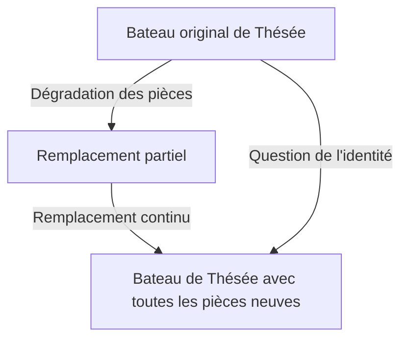
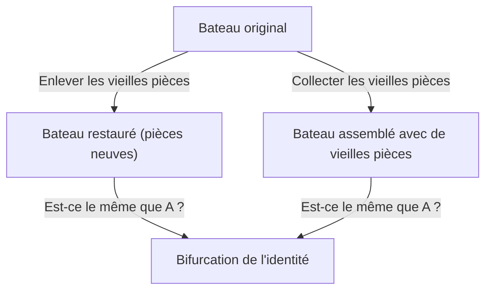

# Le Bateau de Thésée : L'Ultime Expérience de Pensée Questionnant les Frontières de l'Identité

"Vous" êtes-vous la même personne que le "vous" d'il y a 10 ans ?

On dit que la plupart des cellules humaines sont remplacées en quelques années. Lorsque les composants physiques deviennent complètement différents, sur quoi nous basons-nous pour croire que nous sommes toujours "la même personne" ? Cette question profonde ne vient pas de la technologie moderne, mais d'un paradoxe philosophique débattu depuis la Grèce antique : le "[Bateau de Thésée](/fr/p/ship-of-theseus/)".

Dans cet article, nous explorerons en profondeur l'identité personnelle, la matière et la forme, et même l'identité numérique dans la société moderne, en utilisant la célèbre expérience de pensée du "[Bateau de Thésée](/fr/p/ship-of-theseus/)".

## 1. Qu'est-ce que le "Bateau de Thésée" ?

L'origine du "[Bateau de Thésée](/fr/p/ship-of-theseus/)" remonte aux *Vies parallèles* du philosophe grec Plutarque (vers 46 - 119 après J.-C.). Concernant le navire sur lequel le héros athénien Thésée est revenu de Crète, Plutarque a écrit ce qui suit :

> "Le navire à trente rames sur lequel Thésée a navigué avec les jeunes d'Athènes et est revenu sain et sauf fut conservé par les Athéniens jusqu'à l'époque de Démétrios de Phalère, car ils enlevaient les vieux bois à mesure qu'ils pourrissaient, et y mettaient des bois neufs et solides. Le navire devint ainsi un exemple constant parmi les philosophes pour la question logique des choses qui grandissent (ou changent) ; une partie soutenant que le navire restait le même, et l'autre soutenant qu'il n'était plus le même."

C'est l'essence du paradoxe.
Un bateau en bois pourrit avec le temps. Supposons qu'une vieille planche soit enlevée pour réparation et qu'une nouvelle planche soit clouée. À ce stade, tout le monde répondra : "C'est toujours le [bateau de Thésée](/fr/p/ship-of-theseus/)." Mais si des décennies ou des siècles passent, et que **tous les bois originaux ont été remplacés par des neufs**, peut-il toujours être appelé le "[Bateau de Thésée](/fr/p/ship-of-theseus/)" ?

Cette question pointe l'ambiguïté du mot "même" que nous utilisons au quotidien.

## 2. L'Extension de Thomas Hobbes : L'Apparition du Second Bateau

Le philosophe anglais du 17ème siècle, Thomas Hobbes, a ajouté une tournure supplémentaire à ce paradoxe. Dans son livre *De Corpore*, il a présenté le scénario extrême suivant :

**"Et si quelqu'un rassemblait tout le vieux bois enlevé du [bateau de Thésée](/fr/p/ship-of-theseus/) et l'assemblait pour construire un deuxième navire de la même forme, lequel serait le vrai [bateau de Thésée](/fr/p/ship-of-theseus/) ?"**

Avec cette expérience de pensée, le problème devient encore plus complexe.

Dans le scénario de Hobbes, il y a deux candidats :
1. **Le bateau de la continuité (bateau restauré)** : Le navire qui a été amarré dans le port d'Athènes, qui a continué à fonctionner et qui a toujours été appelé "Le [Bateau de Thésée](/fr/p/ship-of-theseus/)" par les gens (bien que les matériaux soient tous neufs).
2. **Le bateau matériel (bateau reconstruit)** : Le navire composé exactement du même matériau physique que le navire d'origine.

Si "avoir les mêmes matériaux" est la condition de l'identité, ce dernier est le vrai. Mais si "la continuité spatio-temporelle" est la condition, le premier l'est. Comme il est logiquement impossible pour deux "Bateaux de Thésée" d'exister en même temps, nous devons en choisir un.

## 3. L'Approche par la Théorie des Quatre Causes d'Aristote

Pour résoudre ce problème, appliquons la théorie des "Quatre Causes" du philosophe grec antique Aristote. Aristote a classé les raisons pour lesquelles les choses existent en quatre causes.

1. **La cause matérielle** : De quoi c'est fait (bois, clous, etc.)
2. **La cause formelle** : La forme, le plan ou la structure de la chose (conception du bateau, forme)
3. **La cause efficiente** : Le sujet ou le processus qui l'a fait (charpentiers, travaux de restauration)
4. **La cause finale** : Le but pour lequel il existe (naviguer, comme mémorial au héros)

Dans ce cadre, le paradoxe du "[Bateau de Thésée](/fr/p/ship-of-theseus/)" se traduit par la question : "Recherchons-nous l'identité d'une chose dans sa cause matérielle, ou dans ses causes formelles et finales ?"

Ceux qui soutiennent que "c'est une chose différente parce que toute la matière a été remplacée" mettent l'accent sur la **cause matérielle**.
D'autre part, ceux qui affirment que "c'est le même navire parce que la forme et la structure sont les mêmes, et que le but de commémorer Thésée est le même" mettent l'accent sur la **cause formelle** et la **cause finale**. L'intuition humaine soutient souvent la cause formelle. Imaginez le courant d'une rivière. Les molécules d'eau qui coulent dans la rivière Kamo ne sont jamais les mêmes à aucun moment. De la nouvelle eau coule constamment. Cependant, nous appelons toujours cette rivière "la rivière Kamo". L'identité de la rivière ne réside pas dans "l'eau (matière)" qui la compose, mais dans "le chemin de son écoulement (forme)".

## 4. Le "Bateau de Thésée" à l'Ère Moderne : Cellules et Conscience

Ce paradoxe apparaît comme un problème très réel en ce qui concerne "nous-mêmes".

C'est un fait biologique que les cellules humaines sont constamment remplacées. Les cellules de l'estomac sont remplacées en quelques jours, les cellules de la peau en quelques semaines, et les globules rouges en environ 120 jours. En 7 à 10 ans, la plupart de la matière qui compose notre corps a été remplacée par des atomes et des molécules complètement différents de ceux de notre passé.

Alors, êtes-vous la "même" personne que vous étiez il y a 10 ans ? Pourquoi sommes-nous sûrs que "nous sommes nous-mêmes" alors que notre matériau physique est complètement différent ?

C'est ici que le concept de **"continuité psychologique"** entre en jeu. Le philosophe anglais John Locke soutenait que l'identité personnelle n'est pas garantie par la matière (le corps), mais par la continuité de la mémoire et de la conscience. En d'autres termes, tant que nous nous souvenons de ce que nous étions hier, et que nos expériences passées influencent notre moi actuel sans rompre la chaîne, nous restons "la même personne".

## 5. L'Identité dans la Société : Sociétés, Groupes de Musique, Shikinen Sengu

Le paradoxe du [bateau de Thésée](/fr/p/ship-of-theseus/) peut être observé dans divers aspects de la société.

### Changement des Membres d'un Groupe de Musique
Si tous les membres originaux quittent un groupe et ne sont remplacés que par de nouveaux membres, est-ce toujours le même groupe ? Tant que la "forme" (nom du groupe, chansons) est héritée, les fans le perçoivent souvent comme le même groupe.

### Le Shikinen Sengu du Sanctuaire d'Ise
Au Japon, il existe une belle réponse culturelle au Bateau de Thésée : le "Shikinen Sengu" du Sanctuaire d'Ise. Au Sanctuaire d'Ise, tous les 20 ans, un nouveau bâtiment de sanctuaire avec exactement le même design est construit sur un site adjacent, et l'ancien est démantelé. Ce rituel se poursuit depuis plus de 1300 ans.
D'un point de vue matérialiste, il semble devenir une chose différente tous les 20 ans, mais il y a là une profonde philosophie : hériter de la technologie et de l'esprit (la forme) est le moyen de maintenir une continuité éternelle.

## 6. L'Ère Numérique et l'Identité Personnelle

Aujourd'hui, les données ne subissent pas d'usure physique, mais la copie et le déplacement créent un nouveau paradoxe. De plus, lorsque le "téléchargement de l'esprit" (le transfert de la conscience dans un ordinateur) sera réalisé à l'avenir, le paradoxe atteindra son paroxysme. Lorsque les cellules cérébrales seront progressivement remplacées par des puces de silicium, et qu'à la fin tout sera mécanisé, la conscience qui s'y trouvera pourra-t-elle toujours être appelée "vous" ?

## 7. Conclusion : Le "Même" n'est-il qu'un Accord ?

La plus grande leçon que nous enseigne le [Bateau de Thésée](/fr/p/ship-of-theseus/) est que **"l'identité n'est pas une propriété absolue inhérente aux choses, mais simplement un accord ou un concept sur la façon dont nous les percevons"**.

Comme le souligne le concept bouddhiste d'impermanence, tout dans ce monde est dans un flux de changement. Le paradoxe survient parce que nous essayons de trouver une entité fixe appelée "le même bateau" ou "le même moi". Ce que nous appelons "le même" n'est qu'une étiquette de commodité appliquée à un processus en perpétuelle évolution.

Vivre, c'est comme le [Bateau de Thésée](/fr/p/ship-of-theseus/) : un voyage au cours duquel nous nous débarrassons constamment de notre ancien moi, incorporons de nouveaux éléments, tout en continuant à tisser l'histoire de "je".
