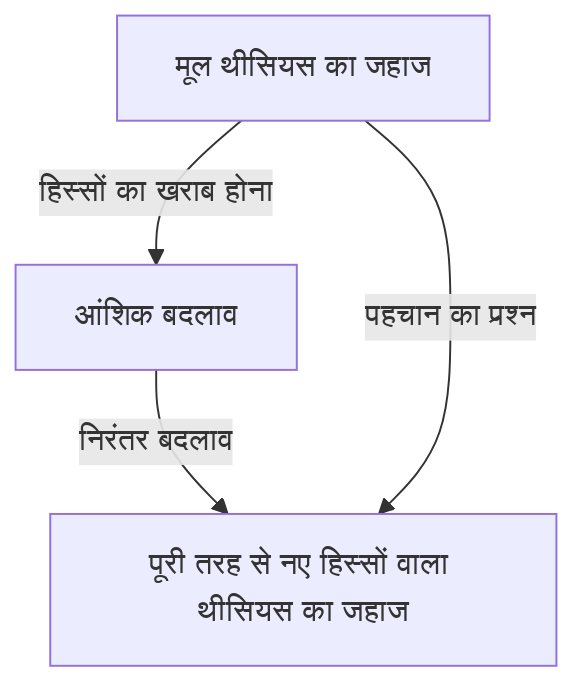
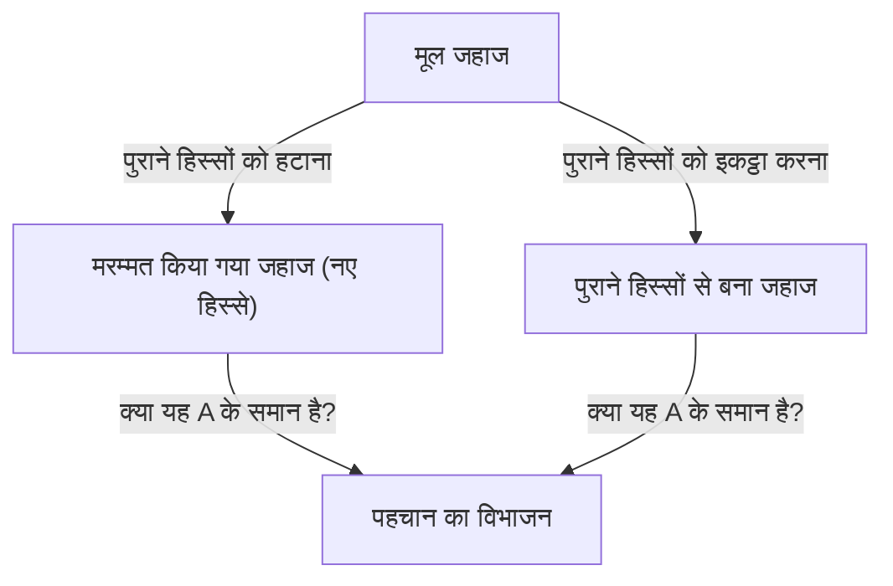

# थीसियस का जहाज: पहचान की सीमाओं पर सवाल उठाने वाला अंतिम विचार प्रयोग

क्या "आप" वही व्यक्ति हैं जो 10 साल पहले थे?

ऐसा कहा जाता है कि मानव शरीर की अधिकांश कोशिकाएं कुछ ही वर्षों में बदल जाती हैं। जब भौतिक घटक पूरी तरह से अलग हो जाते हैं, तो हम किस आधार पर यह मानते हैं कि हम "वही व्यक्ति" हैं? यह गहरा सवाल आधुनिक तकनीक से नहीं आया है, बल्कि यह प्राचीन ग्रीस के समय से चर्चा में रहे एक दार्शनिक विरोधाभास पर आधारित है, जिसे "थीसियस का जहाज" कहा जाता है।

इस लेख में, हम "थीसियस के जहाज" के इस प्रसिद्ध विचार प्रयोग को आधार बनाकर आत्म-पहचान, पदार्थ और रूप, और आधुनिक समाज में डिजिटल पहचान तक के विषयों पर बहुत गहराई से विचार करेंगे।

## 1. "थीसियस का जहाज" क्या है?

"थीसियस के जहाज" की उत्पत्ति प्राचीन यूनानी दार्शनिक प्लूटार्क (लगभग 46 - 119 ईस्वी) की कृति *द लाइफ ऑफ थीसियस* से हुई है। एथेंस के नायक थीसियस जिस जहाज पर क्रीट से लौटे थे, उसके बारे में प्लूटार्क ने निम्नलिखित बातें लिखीं:

> "वह तीस पतवारों वाला जहाज जिस पर थीसियस एथेंस के युवाओं के साथ रवाना हुए और सुरक्षित लौटे, एथेनियंस द्वारा डेमेट्रियस फलेरियस के समय तक सुरक्षित रखा गया था। उन्होंने पुरानी लकड़ियों को हटा दिया क्योंकि वे सड़ गई थीं, और उनकी जगह नई और मजबूत लकड़ियाँ लगा दीं। परिणामस्वरूप, यह जहाज दार्शनिकों के बीच 'विकास (या परिवर्तन) के तर्क' के बारे में बहस के लिए एक आदर्श उदाहरण बन गया। कुछ लोगों ने तर्क दिया कि 'जहाज वही रहा,' जबकि दूसरों ने कहा कि 'यह अब वही जहाज नहीं था।'"

यही विरोधाभास का मूल है।
लकड़ी का जहाज समय के साथ सड़ने लगता है। मान लीजिए कि मरम्मत के लिए एक पुरानी लकड़ी को हटा दिया जाता है और उसकी जगह एक नई लकड़ी लगा दी जाती है। इस बिंदु पर, हर कोई यही जवाब देगा कि "यह अभी भी थीसियस का जहाज है।" लेकिन अगर दशकों या सदियों बीत जाते हैं, और **सभी मूल लकड़ियों को पूरी तरह से नए से बदल दिया जाता है**, तो क्या इसे अभी भी "थीसियस का जहाज" कहा जा सकता है?

यह प्रश्न उस अस्पष्टता को उजागर करता है जो हम हर दिन "समान" या "वही" शब्द का उपयोग करते समय करते हैं।

## 2. थॉमस हॉब्स का विस्तार: दूसरे जहाज का आना

17वीं सदी के अंग्रेजी दार्शनिक, थॉमस हॉब्स ने इस विरोधाभास में एक नया मोड़ जोड़ा। उन्होंने अपनी पुस्तक *डी कॉर्पोर* में निम्नलिखित चरम परिदृश्य प्रस्तुत किया:

**"अगर कोई थीसियस के जहाज से निकाली गई सभी पुरानी लकड़ियों को इकट्ठा करे और उनसे बिल्कुल उसी आकार का एक दूसरा जहाज बनाए, तो असली थीसियस का जहाज कौन सा होगा?"**

इस विचार प्रयोग के साथ समस्या और भी जटिल हो जाती है।

हॉब्स के परिदृश्य में, दो विकल्प मौजूद हैं:
1. **निरंतरता का जहाज (मरम्मत किया गया जहाज)**: वह जहाज जो एथेंस के बंदरगाह पर बंधा रहा, काम करता रहा, और जिसे लोगों ने "थीसियस का जहाज" कहना जारी रखा (भले ही सामग्री सभी नई हो)।
2. **सामग्री का जहाज (पुनर्निर्मित जहाज)**: मूल जहाज के बिल्कुल समान भौतिक सामग्री से बना जहाज।

यदि "समान सामग्री होना" पहचान की शर्त है, तो दूसरा असली है। लेकिन अगर "स्थानिक और लौकिक निरंतरता" पहचान की शर्त है, तो पहला असली है। चूंकि एक ही समय में दो "थीसियस के जहाजों" का होना तार्किक रूप से असंभव है, इसलिए हमें किसी एक को चुनना होगा।

## 3. अरस्तू के चार कारण सिद्धांत द्वारा दृष्टिकोण

इस समस्या को हल करने के लिए, आइए प्राचीन यूनानी दार्शनिक अरस्तू के "चार कारण" (Four Causes) के सिद्धांत को लागू करें। अरस्तू ने चीजों के अस्तित्व के कारणों को चार श्रेणियों में बांटा:

1. **भौतिक कारण (Material Cause)**: यह किस चीज से बना है (लकड़ी, कीलें आदि)
2. **औपचारिक कारण (Formal Cause)**: चीज का आकार, ब्लूप्रिंट या संरचना (जहाज का डिजाइन, आकार)
3. **कुशल कारण (Efficient Cause)**: वह विषय या प्रक्रिया जिसने इसे बनाया (बढ़ई, मरम्मत कार्य)
4. **अंतिम कारण (Final Cause)**: वह उद्देश्य जिसके लिए यह मौजूद है (पालने के लिए, नायक के स्मारक के रूप में)

इस ढांचे में, "थीसियस के जहाज" के विरोधाभास को इस सवाल में बदला जा सकता है: "क्या हम किसी चीज की पहचान उसके भौतिक कारण में खोजते हैं, या उसके औपचारिक और अंतिम कारण में?"

जो लोग यह दावा करते हैं कि "चूंकि सभी पदार्थ बदल गए हैं, इसलिए यह एक अलग चीज है," वे **भौतिक कारण** पर जोर देते हैं।
दूसरी ओर, जो लोग यह तर्क देते हैं कि "चूंकि आकार और संरचना समान है, और थीसियस को याद करने का उद्देश्य भी समान है, इसलिए यह वही जहाज है," वे **औपचारिक कारण** और **अंतिम कारण** पर जोर देते हैं। मानव अंतर्ज्ञान अक्सर औपचारिक कारण का समर्थन करता है। नदी के प्रवाह की कल्पना करें। कामो नदी में बहने वाले पानी के अणु एक सेकंड के लिए भी समान नहीं होते हैं। हमेशा नया पानी बहता रहता है। फिर भी, हम हमेशा उस नदी को "कामो नदी" कहते हैं। नदी की पहचान उसे बनाने वाले "पानी (पदार्थ)" में नहीं, बल्कि उसके "प्रवाह के मार्ग (रूप)" में है।

## 4. आधुनिक युग में "थीसियस का जहाज": कोशिकाएं और चेतना

यह विरोधाभास सबसे अधिक प्रासंगिक समस्या के रूप में तब सामने आता है जब बात "हमारे" अस्तित्व की होती है।

एक जैविक तथ्य के रूप में, मानव कोशिकाएं लगातार बदलती रहती हैं। पेट के अस्तर की कोशिकाएं कुछ ही दिनों में, त्वचा की कोशिकाएं कुछ हफ्तों में, और लाल रक्त कोशिकाएं लगभग 120 दिनों में बदल जाती हैं। लगभग 7 से 10 वर्षों में, हमारे शरीर को बनाने वाले अधिकांश पदार्थ पूरी तरह से अलग परमाणुओं और अणुओं द्वारा बदल दिए जाते हैं।

तो, क्या आप वही व्यक्ति हैं जो आप 10 साल पहले थे? भले ही भौतिक सामग्री पूरी तरह से अलग है, हमें यह विश्वास क्यों है कि "हम, हम ही हैं"?

यहीं पर **"मनोवैज्ञानिक निरंतरता (Psychological Continuity)"** की अवधारणा सामने आती है। ब्रिटिश दार्शनिक जॉन लोके ने तर्क दिया कि व्यक्तिगत पहचान की गारंटी पदार्थ (शरीर) द्वारा नहीं, बल्कि स्मृति और चेतना की निरंतरता द्वारा दी जाती है। दूसरे शब्दों में, जब तक हम कल के अपने आप को याद रखते हैं, और हमारे पिछले अनुभव हमारे वर्तमान को प्रभावित करते हैं, बिना उस श्रृंखला के टूटे, हम "वही व्यक्ति" बने रहते हैं।

## 5. समाज में पहचान: निगम, बैंड, शिकिनेन सेंगू

थीसियस के जहाज का विरोधाभास समाज के विभिन्न पहलुओं में देखा जा सकता है।

### संगीत बैंड के सदस्यों का बदलना
यदि गठन के समय के सभी मूल सदस्य बैंड छोड़ दें और केवल नए सदस्य रह जाएं, तो क्या वह वही बैंड है? जब तक समूह का नाम और गीत (रूप) विरासत में मिलते हैं, तब तक प्रशंसक अक्सर इसे उसी बैंड के रूप में पहचानते हैं।

### इसे श्राइन का शिकिनेन सेंगू
जापान में, थीसियस के जहाज का एक सुंदर सांस्कृतिक उत्तर मौजूद है। इसे जिंगू (Ise Jingu) का "शिकिनेन सेंगू" (Shikinen Sengu)। इसे जिंगू में, हर 20 साल में, बिल्कुल उसी डिज़ाइन का एक नया मंदिर बगल की जमीन提示 जमीन पर बनाया जाता है, और पुराने मंदिर को नष्ट कर दिया जाता है। यह अनुष्ठान 1300 से अधिक वर्षों से जारी है।
भौतिकवादी दृष्टिकोण से, यह हर 20 साल में एक अलग चीज बनती हुई प्रतीत होती है, लेकिन इसके पीछे एक गहरी फिलॉसफी है: तकनीक और भावना (रूप) को विरासत में पाना ही शाश्वत निरंतरता बनाए रखने का साधन है।

## 6. डिजिटल युग और आत्म-पहचान

आधुनिक समय में, डेटा भौतिक रूप से खराब नहीं होता है, लेकिन प्रतिलिपि बनाने और स्थानांतरित करने से एक नया विरोधाभास उत्पन्न होता है। इसके अलावा, भविष्य में जब "माइंड अपलोडिंग" (कंप्यूटर पर चेतना का स्थानांतरण) साकार हो जाएगा, तो विरोधाभास चरम पर पहुंच जाएगा। जब मस्तिष्क की कोशिकाओं को धीरे-धीरे सिलिकॉन चिप्स द्वारा बदल दिया जाता है, और अंततः सब कुछ मशीनीकृत हो जाता है, तो क्या वहां मौजूद चेतना को "आप" कहा जा सकता है?

## 7. निष्कर्ष: क्या "वही" केवल एक समझौता है?

थीसियस का जहाज हमें जो सबसे बड़ा सबक सिखाता है वह यह है कि **"पहचान (Identity) चीजों में निहित कोई पूर्ण गुण नहीं है, बल्कि यह केवल एक समझौता या अवधारणा है कि हम इसे कैसे समझते हैं"**।

जैसा कि बौद्ध धर्म का "अनित्यता" का सिद्धांत सिखाता है, इस दुनिया में सब कुछ परिवर्तन के प्रवाह में है। विरोधाभास इसलिए उत्पन्न होता है क्योंकि हम "वही जहाज" या "वही मैं" नामक एक निश्चित इकाई को खोजने का प्रयास करते हैं। जिसे हम "वही" कहते हैं, वह एक निरंतर बदलती प्रक्रिया पर सुविधा के लिए लगाया गया एक लेबल मात्र है।

हमारा जीवन थीसियस के जहाज की तरह है: एक ऐसी यात्रा जहां हम लगातार अपने पुराने स्वरूप को छोड़ते हैं, नई चीजों को शामिल करते हैं, और फिर भी "मैं" नामक कहानी बुनना जारी रखते हैं।
