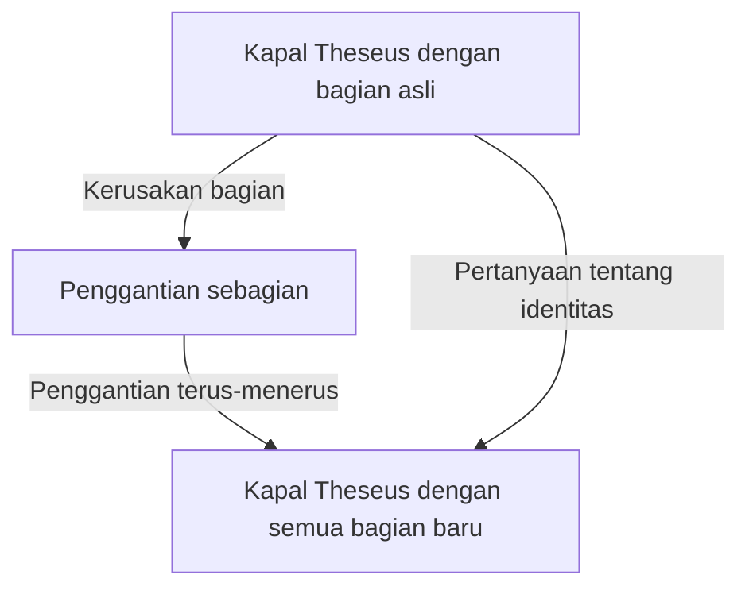
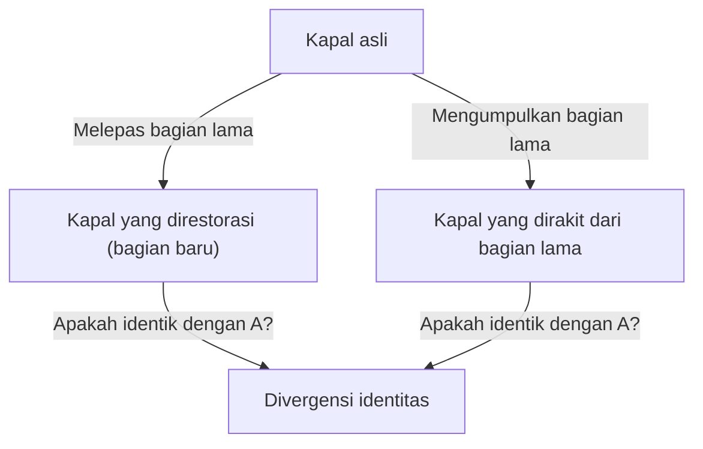

# Kapal Theseus: Eksperimen Pemikiran Pamungkas yang Mempertanyakan Batas Identitas

Apakah "Anda" adalah orang yang sama dengan "Anda" 10 tahun yang lalu?

Dikatakan bahwa sebagian besar sel manusia diganti dalam beberapa tahun. Ketika komponen fisik menjadi sama sekali berbeda, di mana dasar bagi kita untuk percaya bahwa kita masih "diri yang sama"? Pertanyaan mendalam ini tidak dibawa oleh sains dan teknologi modern, melainkan bermuara pada paradoks filosofis yang telah diperdebatkan sejak zaman Yunani Kuno. Itulah "Kapal Theseus" (Ship of Theseus).

Dalam artikel ini, kita akan menggunakan eksperimen pemikiran "Kapal Theseus" yang terkenal ini sebagai batu loncatan untuk menguji secara mendalam dan terperinci tentang identitas diri, materi dan bentuk, hingga identitas digital dalam masyarakat modern.

## 1. Apa itu "Kapal Theseus"?

Asal usul "Kapal Theseus" ditelusuri kembali ke "Kehidupan Paralel" yang ditulis oleh filsuf Yunani Kuno, Plutarch (sekitar 46 - 119 M). Plutarch meninggalkan deskripsi berikut tentang kapal tempat pahlawan Athena, Theseus, kembali dari Kreta:

> "Kapal dengan tiga puluh dayung di mana Theseus kembali bersama para pemuda Athena dipelihara oleh orang Athena sampai masa Demetrius Phalereus. Mereka membuang kayu yang lapuk dan menggantinya dengan kayu yang baru dan kuat. Sebagai hasilnya, kapal ini menjadi subjek debat yang sangat baik di antara para filsuf mengenai logika 'pertumbuhan (atau perubahan)'. Beberapa orang berpendapat bahwa 'itu adalah kapal yang sama', dan yang lain berpendapat bahwa 'itu bukan lagi kapal yang sama'."

Inilah akar paradoksnya.
Kapal kayu akan membusuk seiring waktu. Misalkan kita mencabut papan tua untuk perbaikan dan memaku papan baru. Pada titik ini, semua orang akan menjawab, "Ini masih Kapal Theseus." Namun, jika puluhan atau ratusan tahun berlalu, dan **semua kayu asli telah sepenuhnya diganti dengan kayu baru**, apakah masih bisa disebut "Kapal Theseus"?

Pertanyaan ini dengan tajam menunjukkan ambiguitas dari kata "sama" yang kita gunakan sehari-hari.

## 2. Perluasan Thomas Hobbes: Munculnya Kapal Kedua

Pada abad ke-17, filsuf Inggris Thomas Hobbes menambahkan tikungan pada paradoks ini. Dalam bukunya "De Corpore", ia menyajikan skenario ekstrem berikut:

**"Bagaimana jika seseorang mengumpulkan semua kayu tua yang dilepas dari Kapal Theseus, menyusunnya kembali persis seperti semula dan membangun kapal lain dengan bentuk yang sama persis, manakah yang merupakan Kapal Theseus yang asli?"**

Eksperimen pemikiran ini semakin memperumit masalah.

Ada dua kandidat dalam skenario Hobbes.
1. **Kapal kontinuitas (Kapal yang direstorasi)**: Kapal yang ditambatkan di pelabuhan Athena, terus berfungsi, dan terus disebut "Kapal Theseus" oleh orang-orang (semua materinya baru).
2. **Kapal materi (Kapal yang dibangun kembali)**: Kapal yang terdiri dari materi fisik yang sama persis dengan kapal asli.

Jika "memiliki bahan yang sama" adalah kondisi untuk identitas, yang terakhir adalah yang asli. Namun, jika "kontinuitas ruang dan waktu" adalah kondisi untuk identitas, yang pertama adalah yang asli. Karena tidak mungkin secara logis bagi dua "Kapal Theseus" untuk ada pada saat yang sama, kita harus memilih salah satu.

## 3. Pendekatan dengan Empat Sebab Aristoteles

Untuk memecahkan masalah ini, mari kita terapkan filosofi dari Aristoteles, sang raksasa Yunani Kuno, "Empat Sebab" (Four Causes). Aristoteles mengklasifikasikan alasan mengapa hal-hal ada ke dalam empat sebab:

1. **Sebab Material (Material Cause)**: Terbuat dari apa (kayu, paku, dll.)
2. **Sebab Formal (Formal Cause)**: Bentuk, cetak biru, atau struktur benda tersebut (desain, bentuk kapal)
3. **Sebab Efisien (Efficient Cause)**: Subjek atau proses yang membuatnya (tukang kayu kapal, pekerjaan restorasi)
4. **Sebab Final (Final Cause)**: Tujuan keberadaannya (untuk berlayar, sebagai monumen pahlawan)

Berpikir dalam kerangka kerja ini, paradoks "Kapal Theseus" dapat diungkapkan kembali menjadi pertanyaan, "Apakah kita mencari identitas suatu benda pada sebab materialnya, atau pada sebab formal dan finalnya?"

Mereka yang berpendapat bahwa "itu adalah hal yang berbeda karena semua materi telah diganti" menekankan **sebab material**.
Di sisi lain, mereka yang berpendapat bahwa "itu adalah kapal yang sama karena bentuk dan strukturnya sama, dan memiliki tujuan yang sama untuk memperingati Theseus" menekankan **sebab formal** dan **sebab final**. Intuisi manusia sering kali mendukung sebab formal. Bayangkan aliran sungai. Molekul air yang mengalir di "Sungai Kamogawa" tidak sama sedetik pun. Air baru selalu mengalir masuk. Namun, kita selalu menyebut sungai itu "Sungai Kamogawa". Ini karena identitas sungai tidak terletak pada "air (materi)" yang menyusunnya, melainkan pada "jalur alirannya (bentuk)".

## 4. "Kapal Theseus" di Era Modern: Sel dan Kesadaran

Tempat di mana paradoks ini muncul sebagai masalah yang paling mendesak tidak lain adalah pada "diri kita sendiri".

Sebagai fakta biologis, sel-sel manusia secara konstan mengulangi metabolisme. Sel-sel mukosa lambung diganti dalam beberapa hari, sel-sel kulit dalam beberapa minggu, dan sel darah merah dalam sekitar 120 hari. Dalam sekitar 7 hingga 10 tahun, sebagian besar materi yang menyusun tubuh kita diganti dengan atom dan molekul yang sangat berbeda dari kita di masa lalu.

Lalu, apakah Anda yang 10 tahun lalu, dan Anda yang sekarang, adalah orang yang "sama"? Mengapa kita yakin bahwa "saya adalah saya" meskipun materi fisiknya sangat berbeda?

Di sinilah konsep **"Kontinuitas Psikologis" (Psychological Continuity)** berperan. Filsuf Inggris John Locke berpendapat bahwa identitas diri tidak dijamin oleh materi (tubuh), melainkan oleh kontinuitas memori dan kesadaran. Dengan kata lain, selama kita mengingat diri kita kemarin, dan pengalaman masa lalu kita memengaruhi diri kita saat ini, dan rantai itu tidak putus, kita terus menjadi "diri yang sama".

## 5. Identitas dalam Masyarakat: Perusahaan, Band, dan Shikinen Sengu

Paradoks Kapal Theseus dapat diamati di berbagai situasi dalam masyarakat.

### Pergantian Anggota Band Musik
Apakah band di mana semua anggota aslinya keluar dan hanya anggota baru yang tersisa masih band yang sama? Selama "bentuk" dari nama grup dan lagu-lagunya diwariskan, hal ini sering kali diakui oleh penggemar sebagai band yang sama.

### Shikinen Sengu di Kuil Ise
Di Jepang, ada jawaban budaya yang indah untuk Kapal Theseus. Itu adalah "Shikinen Sengu" di Kuil Ise. Di Kuil Ise, setiap 20 tahun sekali, sebuah bangunan kuil baru dengan desain yang sama persis dibangun di tanah yang berdekatan, dan bangunan lama dibongkar. Ritual ini telah berlanjut selama lebih dari 1.300 tahun.
Dari perspektif materialistis, tampaknya itu menjadi sesuatu yang berbeda setiap 20 tahun, tetapi ada filosofi tingkat tinggi di sana yang menyatakan bahwa mewariskan teknologi dan semangat (bentuk) adalah sarana untuk mempertahankan kontinuitas abadi.

## 6. Era Digital dan Identitas Diri

Saat ini, data tidak melibatkan keausan fisik, tetapi menciptakan paradoks baru tentang penyalinan dan pemindahan. Selain itu, di masa depan, ketika "mind uploading (transfer kesadaran ke komputer)" terwujud, paradoks ini akan mencapai titik ekstremnya. Ketika sel otak secara bertahap digantikan oleh chip silikon dan pada akhirnya semuanya menjadi mekanis, dapatkah kesadaran di sana disebut "Anda"?

## 7. Kesimpulan: Apakah "Sama" Hanya Sebuah Kesepakatan?

Pelajaran terbesar yang diajarkan oleh Kapal Theseus kepada kita adalah bahwa **"identitas bukanlah sifat mutlak yang melekat pada sesuatu, melainkan hanya kesepakatan atau konsep tentang bagaimana kita memandangnya"**.

Seperti yang ditunjukkan oleh "Ketidakkekalan (Impermanence)" dalam agama Buddha, segala sesuatu di dunia ini berada dalam aliran perubahan. Paradoks muncul karena kita mencoba mencari entitas yang tetap seperti "kapal yang sama" atau "aku yang sama". Apa yang kita sebut "sama" hanyalah label yang disematkan untuk kenyamanan pada proses yang terus berubah.

Kenyataan bahwa kita hidup adalah, seperti Kapal Theseus, sebuah pelayaran di mana kita terus-menerus membuang diri kita yang lama, menggabungkan diri yang baru, dan namun tetap terus merajut kisah tentang "aku".
