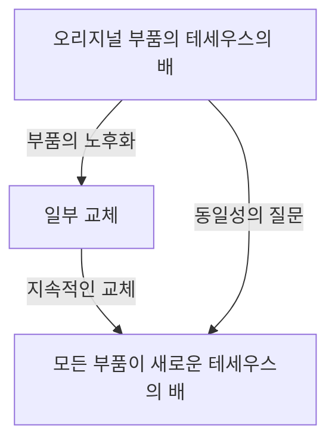
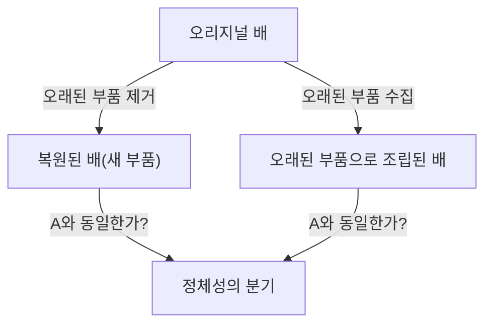

# 테세우스의 배: 정체성의 경계를 묻는 궁극의 사고 실험

'당신'은 10년 전의 '당신'과 같은 사람입니까?

인간의 세포는 몇 년 만에 대부분이 교체된다고 합니다. 물리적인 구성 요소가 완전히 다른 것이 되었을 때, 그럼에도 우리가 '같은 나'라고 믿을 수 있는 근거는 어디에 있을까요? 이 심오한 질문은 현대의 과학 기술이 가져온 것이 아니라, 고대 그리스 시대부터 끊임없이 논의되어 온 철학상의 역설로 귀결됩니다. 그것이 바로 '테세우스의 배(Ship of Theseus)'입니다.

본 기사에서는 이 '테세우스의 배'라는 유명한 사고 실험을 발판 삼아, 자기 동일성(정체성), 물질과 형상, 그리고 현대 사회의 디지털 정체성에 이르기까지 지극히 상세하고 철저하게 고찰해 보겠습니다.

## 1. '테세우스의 배'란 무엇인가?

'테세우스의 배'의 기원은 고대 그리스의 철학자 플루타르코스(기원후 46년 - 119년경)가 저술한 『영웅전(대비열전)』으로 거슬러 올라갑니다. 플루타르코스는 아테네의 영웅 테세우스가 크레타섬에서 귀환할 때 타고 있던 배에 대해 다음과 같은 기록을 남겼습니다.

> "테세우스가 아테네의 젊은이들과 함께 귀환했던 30개의 노가 달린 배는, 아테네인들에 의해 데메트리오스 팔레레우스의 시대까지 보존되어 있었다. 그들은 썩은 목재를 떼어내고, 그곳에 새롭고 튼튼한 목재를 조립해 넣었다. 그 결과, 이 배는 철학자들 사이에서 '성장(혹은 변화)의 논리'에 관한 논쟁의 좋은 소재가 되었다. 어떤 이는 '같은 배이다'라고 주장했고, 다른 이는 '더 이상 같은 배가 아니다'라고 주장했던 것이다."

이것이 역설의 근간입니다.
목조 배는 시간이 지나면 썩어갑니다. 수리를 위해 낡은 널빤지를 한 장 떼어내고 새 널빤지를 하나 못 박았다고 합시다. 이 시점에서는 누구나 "이것은 테세우스의 배 그대로이다"라고 대답할 것입니다. 하지만 수십 년, 수백 년의 세월이 흘러 **원래의 목재가 완전히 모두 새것으로 교체되었다**면, 그것은 여전히 '테세우스의 배'라고 부를 수 있을까요?

이 질문은 우리가 일상적으로 사용하고 있는 '같다'라는 말의 모호함을 날카롭게 찌르고 있습니다.

## 2. 토머스 홉스의 확장: 두 번째 배의 등장

17세기 영국의 철학자 토머스 홉스는 이 역설에 한층 더 비틀기를 더했습니다. 그는 저서 『물체론(De Corpore)』에서 다음과 같은 극단적인 시나리오를 제시했습니다.

**"만약, 누군가가 테세우스의 배에서 떼어낸 낡은 목재를 모두 주워 모아, 그것들을 원래대로 조립하여 완전히 똑같은 모양의 배를 한 척 더 만들었다면, 어느 쪽이 진짜 테세우스의 배인가?"**

이 사고 실험으로 인해 문제는 더욱 복잡해집니다.

홉스가 제시한 시나리오에는 두 가지 후보가 존재합니다.
1. **연속성의 배 (복원된 배)**: 아테네 항구에 계속 정박해 있으며, 계속해서 기능했고, 사람들로부터 '테세우스의 배'라고 계속 불려 온 배 (소재는 모두 새것).
2. **소재의 배 (재구축된 배)**: 원래의 배와 완전히 동일한 물리적 소재로 구성된 배.

만약 '소재가 같다는 것'이 정체성의 조건이라면 후자가 진짜가 됩니다. 하지만, 만약 '공간적·시간적인 연속성'이 정체성의 조건이라면 전자가 진짜가 됩니다. 동시에 두 개의 '테세우스의 배'가 존재하는 것은 논리적으로 불가능하기 때문에, 우리는 어느 한쪽을 선택해야만 합니다.

## 3. 아리스토텔레스의 4원인설에 의한 접근

이 문제를 풀어내기 위해, 고대 그리스의 거성 아리스토텔레스의 철학, '4원인설(Four Causes)'을 응용해 봅시다. 아리스토텔레스는 사물이 존재하는 이유를 4가지 원인으로 분류했습니다.

1. **질료인(Material Cause)**: 그것이 무엇으로 만들어졌는가 (목재, 못 등)
2. **형상인(Formal Cause)**: 그 사물의 형태나 설계도, 구조 (배의 설계, 모양)
3. **동력인(Efficient Cause)**: 그것을 만든 주체나 과정 (배 목수, 복원 작업)
4. **목적인(Final Cause)**: 그것이 존재하는 목적 (항해하기 위해, 영웅의 기념비로서)

이 틀에서 생각해보면, '테세우스의 배'의 역설은 "우리는 사물의 정체성을 질료인에서 찾는가, 아니면 형상인이나 목적인에서 찾는가"라는 문제로 바꿔 말할 수 있습니다.

"물질이 모두 바뀌었으니 다른 것이다"라고 주장하는 사람은 **질료인**을 중시하고 있습니다.
반면에, "형태도 구조도 같고, 테세우스를 기념한다는 목적도 같으니 같은 배다"라고 주장하는 사람은 **형상인**과 **목적인**을 중시하고 있습니다. 인간의 직관은 종종 형상인을 지지합니다. 강물의 흐름을 상상해 보십시오. '가모가와(鴨川)'를 흐르는 물 분자는 단 1초도 같지 않습니다. 끊임없이 새로운 물이 흘러들어옵니다. 하지만 우리는 그 강을 항상 '가모가와'라고 부릅니다. 강의 정체성은 구성하는 '물(질료)'이 아니라, 그 '흐름의 경로(형상)'에 있기 때문입니다.

## 4. 현대에 있어서의 '테세우스의 배': 세포와 의식

이 역설이 가장 절실한 문제로서 나타나는 곳은 다름 아닌 '우리 자신'에게서입니다.

생물학적인 사실로서, 인간의 세포는 끊임없이 신진대사를 반복하고 있습니다. 위 점막 세포는 며칠 만에, 피부 세포는 몇 주 만에, 적혈구는 약 120일 만에 교체됩니다. 약 7년에서 10년이면, 우리 몸을 구성하는 물질의 대부분은 과거의 자신과는 완전히 다른 원자나 분자로 대체되어 있습니다.

그렇다면, 10년 전의 당신과 지금의 당신은 '같은' 사람입니까? 물리적인 소재가 완전히 다름에도 불구하고, 우리가 '나는 나이다'라고 확신할 수 있는 이유는 무엇일까요?

여기서 등장하는 것이 **'심리적 연속성(Psychological Continuity)'**이라는 개념입니다. 영국의 철학자 존 로크는 인격의 동일성은 물질(신체)이 아니라, 기억이나 의식의 연속성에 의해 담보된다고 주장했습니다. 즉, 어제의 자신을 기억하고 있는 것, 과거의 경험이 현재의 자신에게 영향을 주고 있는 것, 그 사슬이 끊어지지 않는 한 우리는 '같은 나'로 계속 존재한다는 것입니다.

## 5. 사회 속의 정체성: 법인, 밴드, 식년천궁

테세우스의 배의 역설은 사회의 다양한 장면에서 관찰할 수 있습니다.

### 음악 밴드의 멤버 교체
결성 당시의 원년 멤버가 전원 탈퇴하고 새 멤버로만 채워진 밴드는 같은 밴드일까요? 그룹명이나 곡이라는 '형상'이 계승되는 한, 팬들에게는 같은 밴드로 인식되는 경우가 많습니다.

### 이세 신궁의 식년천궁
일본에는 테세우스의 배에 대한 아름다운 문화적 해답이 존재합니다. 이세 신궁의 '식년천궁(式年遷宮)'입니다. 이세 신궁에서는 20년에 한 번, 인접한 부지에 완전히 같은 설계의 신전을 새로 짓고 낡은 신전은 해체합니다. 이 의식은 1300년 이상에 걸쳐 계속되어 왔습니다.
물질주의적인 시각에서는 20년마다 다른 것이 되어있는 것처럼 보이지만, 기술이나 정신(형상)을 계승하는 것이야말로 영원한 연속성을 유지하는 수단이라는 고도의 철학이 그곳에는 존재합니다.

## 6. 디지털 시대와 자기 동일성

현대 사회에서 데이터는 물리적인 마모를 수반하지 않지만, 복사와 이동이라는 새로운 역설을 낳습니다. 나아가 미래에 '마인드 업로딩(의식의 컴퓨터로의 전송)'이 실현되었을 때, 역설은 극에 달합니다. 뇌의 세포를 서서히 실리콘 칩으로 교체하여, 최종적으로 모든 것이 기계화되었을 때, 그곳에 있는 의식은 '당신'이라고 부를 수 있을까요?

## 7. 결론: '같다'라는 것은 합의에 불과한 것인가

테세우스의 배가 우리에게 가르쳐 주는 최대의 교훈은, **"동일성(정체성)이란, 사물에 내재하는 절대적인 성질이 아니라, 우리가 그것을 어떻게 인식할 것인가 하는 합의나 개념에 불과하다"**라는 것입니다.

불교의 '제행무상(諸行無常)'이 나타내듯이, 이 세상의 모든 것은 변화의 흐름 속에 있습니다. '같은 배', '같은 나'라는 고정된 실체를 찾아내려 하기 때문에 역설이 발생하는 것입니다. 우리가 '같다'고 부르는 것은, 계속해서 변화하는 과정에 대해 편의상 붙여진 라벨에 불과합니다.

우리가 살아간다는 것은, 테세우스의 배처럼 끊임없이 낡은 자신을 버리고 새로운 자신을 조립해 넣으면서도, 그럼에도 '나'라는 이야기를 계속해서 자아내는 항해와 같은 것입니다.
