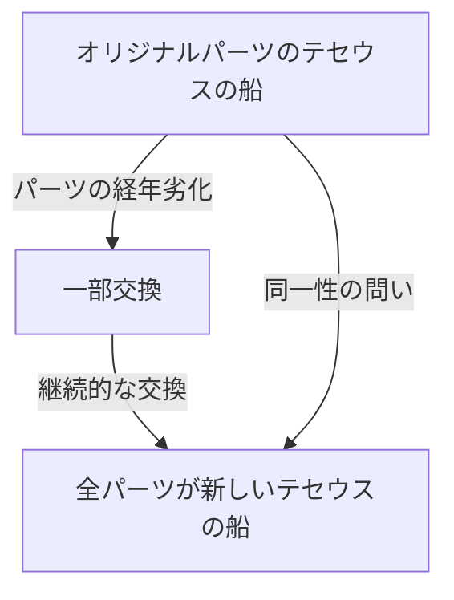
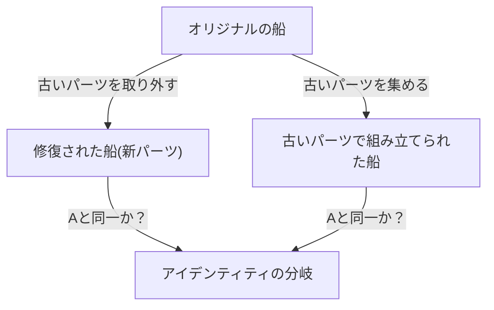

# テセウスの船：アイデンティティの境界線を問う究極の思考実験

「あなた」は、10年前の「あなた」と同じ人物でしょうか？

人間の細胞は数年でほとんどが入れ替わると言われています。物理的な構成要素が完全に別物になったとき、それでも私たちが「同じ自分」であると信じられる根拠はどこにあるのでしょうか。この深遠なる問いは、現代の科学技術によってもたらされたものではなく、古代ギリシャの時代から延々と議論されてきた哲学上のパラドックスに帰結します。それが、「テセウスの船（Ship of Theseus）」です。

本記事では、この「テセウスの船」という有名な思考実験を足がかりに、自己同一性（アイデンティティ）、物質と形相、そして現代社会におけるデジタル・アイデンティティに至るまで、極めて詳細かつ徹底的に考察していきます。

## 1. 「テセウスの船」とは何か？

「テセウスの船」の起源は、古代ギリシャの哲学者プルタルコス（紀元46年 - 119年頃）が著した『英雄伝（対比列伝）』に遡ります。プルタルコスは、アテナイの英雄テセウスがクレタ島から帰還した際に乗っていた船について、次のような記述を残しました。

> 「テセウスがアテナイの若者たちと共に帰還した30櫂の船は、アテナイ人によってデメトリオス・ファレレウスの時代まで保存されていた。彼らは朽ちた木材を取り除き、そこに新しく丈夫な木材を組み込んでいった。その結果、この船は哲学者たちの間で『成長（あるいは変化）の論理』に関する議論の格好の題材となった。ある者は『同じ船である』と主張し、別の者は『もはや同じ船ではない』と主張したのである」

これがパラドックスの根幹です。
木造の船は、時間が経てば朽ちていきます。修理のために古い板を一枚剥がし、新しい板を一枚打ち付けたとしましょう。この時点では、誰もが「これはテセウスの船のままである」と答えるはずです。しかし、数十年、数百年の歳月が流れ、**元の木材が完全にすべて新しいものに交換された**としたら、それはまだ「テセウスの船」と呼べるのでしょうか？

この問いは、私たちが日常的に使っている「同じ」という言葉の曖昧さを鋭く突いています。

## 2. トマス・ホッブズの拡張：第二の船の登場

17世紀のイギリスの哲学者、トマス・ホッブズはこのパラドックスにさらなる捻りを加えました。彼は著書『物体論（De Corpore）』の中で、次のような極端なシナリオを提示しました。

**「もし、誰かがテセウスの船から取り外された古い木材をすべて拾い集め、それらを元の通りに組み立てて全く同じ形の船をもう一隻造ったとしたら、どちらが本物のテセウスの船なのか？」**

この思考実験により、問題はさらに複雑化します。

ホッブズの提示したシナリオには、二つの候補が存在します。
1. **継続性の船（修復された船）**：アテナイの港にずっと係留され、機能し続け、人々から「テセウスの船」と呼ばれ続けてきた船（素材はすべて新しい）。
2. **素材の船（再構築された船）**：元の船と全く同じ物理的素材から構成された船。

もし「素材が同じであること」がアイデンティティの条件だとすれば、後者が本物になります。しかし、もし「空間的・時間的な連続性」がアイデンティティの条件であれば、前者が本物になります。同時に二つの「テセウスの船」が存在することは論理的に不可能であるため、私たちはどちらかを選ばなければなりません。

## 3. アリストテレスの四原因説によるアプローチ

この問題を解き明かすために、古代ギリシャの巨星アリストテレスの哲学、「四原因説（Four Causes）」を応用してみましょう。アリストテレスは、事物が存在する理由を4つの原因に分類しました。

1. **質料因（Material Cause）**：それが何からできているか（木材、釘など）
2. **形相因（Formal Cause）**：そのものの形や設計図、構造（船の設計、形状）
3. **動力因（Efficient Cause）**：それを作った主体やプロセス（船大工、修復作業）
4. **目的因（Final Cause）**：それが存在する目的（航海するため、英雄の記念碑として）

この枠組みで考えると、「テセウスの船」のパラドックスは、「私たちは事物のアイデンティティを、質料因に求めるのか、それとも形相因や目的因に求めるのか」という問題に言い換えられます。

「物質がすべて入れ替わったのだから別物だ」と主張する人は、**質料因**を重視しています。
一方で、「形も構造も同じであり、テセウスを記念するという目的も同じだから同じ船だ」と主張する人は、**形相因**と**目的因**を重視しています。人間の直感は往々にして形相因を支持します。川の流れを想像してください。「鴨川」を流れる水分子は一秒たりとも同じではありません。常に新しい水が流れ込んでいます。しかし、私たちはその川を常に「鴨川」と呼びます。川のアイデンティティは、構成する「水（質料）」ではなく、その「流れの経路（形相）」にあるからです。

## 4. 現代における「テセウスの船」：細胞と意識

このパラドックスが最も切実な問題として立ち現れるのは、他ならぬ「私たち自身」においてです。

生物学的な事実として、人間の細胞は絶えず新陳代謝を繰り返しています。胃の粘膜細胞は数日で、皮膚の細胞は数週間で、赤血球は約120日で入れ替わります。約7年から10年で、私たちの身体を構成する物質のほとんどは、過去の自分とは全く異なる原子や分子に置き換わっています。

では、10年前のあなたと、今のあなたは「同じ」人物でしょうか？物理的な素材が完全に異なっているにもかかわらず、私たちが「自分は自分である」と確信できるのはなぜでしょうか。

ここで登場するのが、<strong>「心理的連続性（Psychological Continuity）」</strong>という概念です。イギリスの哲学者ジョン・ロックは、人格の同一性は物質（身体）ではなく、記憶や意識の連続性によって担保されると主張しました。つまり、昨日の自分を覚えていること、過去の経験が現在の自分に影響を与えていること、その鎖が途切れない限りにおいて、私たちは「同じ自分」であり続けるというのです。

## 5. 社会におけるアイデンティティ：法人、バンド、式年遷宮

テセウスの船のパラドックスは、社会の様々な場面で観察することができます。

### 音楽バンドのメンバー交代
結成時のオリジナルメンバーが全員脱退し、新メンバーのみになったバンドは同じバンドでしょうか？グループ名や楽曲という「形相」が引き継がれている限り、ファンにとっては同じバンドとして認識されることが多くあります。

### 伊勢神宮の式年遷宮
日本には、テセウスの船に対する美しい文化的解答が存在します。伊勢神宮の「式年遷宮」です。伊勢神宮では、20年に一度、隣接する敷地に全く同じ設計の社殿を新しく建て、古い社殿は解体されます。この儀式は1300年以上にわたって続けられてきました。
物質主義的な視点では20年ごとに別物になっているように見えますが、技術や精神（形相）を継承することこそが永遠の連続性を保つ手段であるという、高度な哲学がそこには存在します。

## 6. デジタル時代と自己同一性

現代、データは物理的な摩耗を伴いませんが、コピーと移動という新たなパラドックスを生み出します。さらに、将来的に「マインドアップロード（意識のコンピュータへの転送）」が実現したとき、パラドックスは極地に達します。脳の細胞を徐々にシリコンチップに置き換え、最終的にすべてが機械化されたとき、そこにある意識は「あなた」と呼べるのでしょうか。

## 7. 結論：「同じ」とは合意に過ぎないのか

テセウスの船が私たちに教えてくれる最大の教訓は、<strong>「同一性（アイデンティティ）とは、事物に内在する絶対的な性質ではなく、私たちがそれをどう認識するかという合意や概念に過ぎない」</strong>ということです。

仏教の「諸行無常」が示す通り、この世のすべてのものは変化の流れの中にあります。「同じ船」「同じ私」という固定された実体を探し求めようとするから、パラドックスが生じるのです。私たちが「同じ」と呼んでいるものは、変化し続けるプロセスに対して便宜上付けられたラベルに過ぎません。

私たちが生きるということは、テセウスの船のように、常に古い自分を捨て去り、新しい自分を組み込みながら、それでも「私」という物語を紡ぎ続ける航海のようなものなのです。
