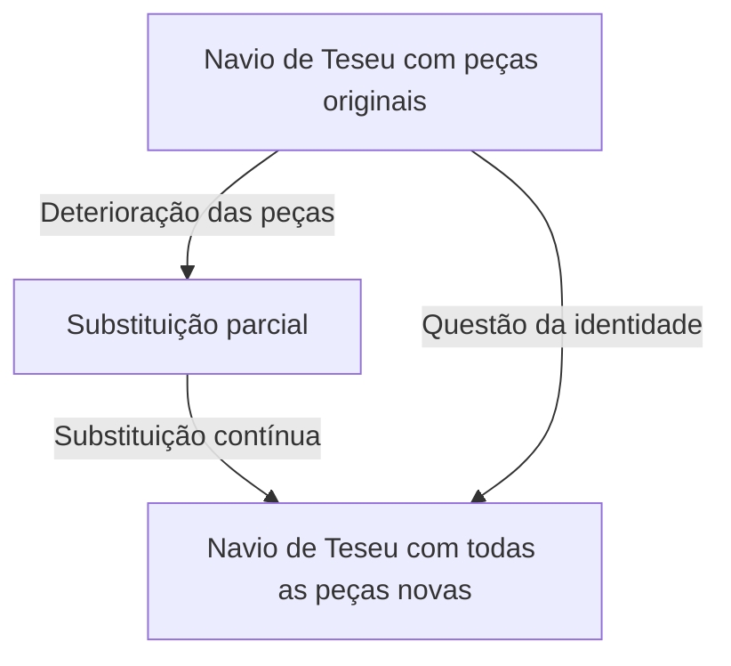
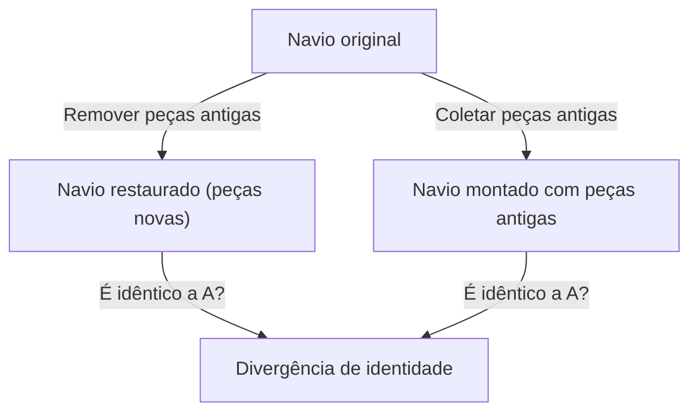

# O Navio de Teseu: O Experimento Mental Final Que Questiona as Fronteiras da Identidade

"Você" é a mesma pessoa que o "você" de 10 anos atrás?

Diz-se que a maioria das células humanas é substituída em poucos anos. Quando os componentes físicos se tornam completamente diferentes, onde está a base para acreditarmos que ainda somos o "mesmo eu"? Essa questão profunda não foi trazida pela ciência e tecnologia modernas, mas resulta de um paradoxo filosófico que tem sido debatido desde os tempos da Grécia Antiga. Esse é o "[Navio de Teseu](/pt/p/ship-of-theseus/)" (Ship of Theseus).

Neste artigo, usaremos este famoso experimento mental do "[Navio de Teseu](/pt/p/ship-of-theseus/)" como ponto de partida para examinar a fundo e em detalhes a identidade pessoal (identidade), a matéria e a forma, e até a identidade digital na sociedade moderna.

## 1. O que é o "Navio de Teseu"?

A origem do "[Navio de Teseu](/pt/p/ship-of-theseus/)" remonta a "Vidas Paralelas", escrito pelo filósofo da Grécia Antiga Plutarco (c. 46 - 119 d.C.). Plutarco deixou a seguinte descrição sobre o navio em que o herói ateniense Teseu retornou de Creta:

> "O navio de trinta remos no qual Teseu retornou com os jovens de Atenas foi preservado pelos atenienses até o tempo de Demétrio de Faleros. Eles removeram a madeira apodrecida e colocaram madeira nova e resistente em seu lugar. Como resultado, este navio se tornou um excelente tema para debates entre os filósofos sobre a lógica do 'crescimento (ou mudança)'. Alguns argumentavam que 'é o mesmo navio', e outros argumentavam que 'não é mais o mesmo navio'."

Esta é a raiz do paradoxo.
Um navio de madeira apodrecerá com o tempo. Suponha que tiremos uma tábua velha para consertá-la e preguemos uma tábua nova. Neste ponto, todos responderiam: "Este ainda é o [navio de Teseu](/pt/p/ship-of-theseus/)". No entanto, se décadas ou séculos se passarem, e **toda a madeira original for completamente substituída por madeira nova**, ainda poderá ser chamado de "[Navio de Teseu](/pt/p/ship-of-theseus/)"?

Esta pergunta aponta nitidamente para a ambiguidade da palavra "mesmo" que usamos no dia a dia.

## 2. A Expansão de Thomas Hobbes: O Surgimento do Segundo Navio

No século 17, o filósofo inglês Thomas Hobbes acrescentou mais uma reviravolta a este paradoxo. Em seu livro "De Corpore", ele apresentou o seguinte cenário extremo:

**"E se alguém juntasse toda a madeira velha removida do [Navio de Teseu](/pt/p/ship-of-theseus/), a remontasse exatamente como era e construísse outro navio da mesma forma, qual seria o verdadeiro [Navio de Teseu](/pt/p/ship-of-theseus/)?"**

Este experimento mental complica ainda mais o problema.

Existem dois candidatos no cenário apresentado por Hobbes.
1. **Navio da continuidade (Navio restaurado)**: Um navio que ficou atracado no porto de Atenas, continuou a funcionar e continuou a ser chamado de "[Navio de Teseu](/pt/p/ship-of-theseus/)" pelas pessoas (todo o material é novo).
2. **Navio do material (Navio reconstruído)**: Um navio composto exatamente dos mesmos materiais físicos que o navio original.

Se "ser do mesmo material" é a condição para a identidade, o último é o verdadeiro. No entanto, se a "continuidade espacial e temporal" for a condição para a identidade, o primeiro é o verdadeiro. Como é logicamente impossível que dois "Navios de Teseu" existam ao mesmo tempo, devemos escolher um ou outro.

## 3. Abordagem pelas Quatro Causas de Aristóteles

Para desvendar esse problema, vamos aplicar a filosofia de Aristóteles, o gigante da Grécia Antiga, a "Teoria das Quatro Causas". Aristóteles classificou as razões pelas quais as coisas existem em quatro causas:

1. **Causa Material**: Do que é feito (madeira, pregos, etc.)
2. **Causa Formal**: A forma, planta ou estrutura da coisa (projeto e formato do navio)
3. **Causa Eficiente**: O sujeito ou processo que o fez (carpinteiro naval, trabalho de restauração)
4. **Causa Final**: O propósito para o qual existe (para navegar, como um monumento a um herói)

Pensando neste quadro, o paradoxo do "[Navio de Teseu](/pt/p/ship-of-theseus/)" pode ser traduzido no problema de "buscamos a identidade de uma coisa na sua causa material, ou na sua causa formal ou final?".

Aqueles que argumentam que "é uma coisa diferente porque toda a matéria foi substituída" enfatizam a **causa material**.
Por outro lado, aqueles que argumentam que "é o mesmo navio porque tem a mesma forma e estrutura, e tem o mesmo propósito de comemorar Teseu" enfatizam a **causa formal** e a **causa final**. A intuição humana muitas vezes apoia a causa formal. Imagine o fluxo de um rio. As moléculas de água que fluem no "Rio Kamogawa" não são as mesmas por um único segundo. Água nova está sempre fluindo. No entanto, sempre chamamos esse rio de "Rio Kamogawa". Isso ocorre porque a identidade do rio não reside na "água (matéria)" que o compõe, mas no "caminho de seu fluxo (forma)".

## 4. "O Navio de Teseu" nos Tempos Modernos: Células e Consciência

O lugar onde este paradoxo surge como o problema mais premente é em "nós mesmos".

Como um fato biológico, as células humanas estão constantemente renovando o metabolismo. As células da mucosa do estômago são substituídas em poucos dias, as células da pele em poucas semanas e os glóbulos vermelhos em cerca de 120 dias. Em cerca de 7 a 10 anos, a maior parte da matéria que compõe nossos corpos foi substituída por átomos e moléculas completamente diferentes do que éramos no passado.

Então, você de 10 anos atrás e você de agora são a "mesma" pessoa? Por que temos certeza de que "eu sou eu", embora o material físico seja completamente diferente?

Aqui entra o conceito de **"Continuidade Psicológica"**. O filósofo inglês John Locke argumentou que a identidade pessoal não é garantida pela matéria (corpo), mas pela continuidade da memória e da consciência. Em outras palavras, enquanto lembrarmos de quem éramos ontem e nossas experiências passadas influenciarem quem somos hoje, e essa corrente não for quebrada, continuaremos a ser o "mesmo eu".

## 5. Identidade na Sociedade: Corporações, Bandas e Shikinen Sengu

O paradoxo do [Navio de Teseu](/pt/p/ship-of-theseus/) pode ser observado em diversas situações da sociedade.

### Mudança de Membros em uma Banda Musical
Uma banda onde todos os membros originais da época de sua formação saíram e apenas novos membros permanecem ainda é a mesma banda? Contanto que a "forma" do nome do grupo e das músicas seja herdada, ela costuma ser reconhecida pelos fãs como a mesma banda.

### O Shikinen Sengu do Santuário de Ise
No Japão, há uma bela resposta cultural ao Navio de Teseu. É o "Shikinen Sengu" do Santuário de Ise. No Santuário de Ise, a cada 20 anos, um novo edifício com o mesmo projeto exato é construído no terreno adjacente, e o prédio antigo é desmontado. Este ritual tem continuado por mais de 1.300 anos.
De uma perspectiva materialista, parece ser uma coisa diferente a cada 20 anos, mas há uma filosofia profunda lá que sugere que herdar a tecnologia e o espírito (forma) é o próprio meio de manter a continuidade eterna.

## 6. A Era Digital e a Identidade Pessoal

Hoje, os dados não envolvem desgaste físico, mas criam um novo paradoxo de cópia e movimento. Além disso, no futuro, quando o "mind uploading (transferência de consciência para um computador)" for realizado, o paradoxo atingirá seu extremo. Quando as células cerebrais forem gradualmente substituídas por chips de silício e tudo for finalmente mecanizado, a consciência que lá estiver poderá ser chamada de "você"?

## 7. Conclusão: "Mesmo" é Apenas um Acordo?

A maior lição que o [Navio de Teseu](/pt/p/ship-of-theseus/) nos ensina é que **"a identidade não é uma propriedade absoluta inerente às coisas, mas apenas um acordo ou conceito de como a percebemos"**.

Como o "impermanência" do Budismo mostra, tudo neste mundo está no fluxo da mudança. O paradoxo surge porque tentamos buscar uma entidade fixa, "o mesmo navio" ou "o mesmo eu". O que chamamos de "mesmo" é apenas um rótulo anexado por conveniência a um processo em constante mudança.

O fato de vivermos é como uma viagem, tal como o [Navio de Teseu](/pt/p/ship-of-theseus/), onde constantemente descartamos o nosso antigo eu, incorporamos um novo eu e, no entanto, continuamos a tecer a história do "eu".
