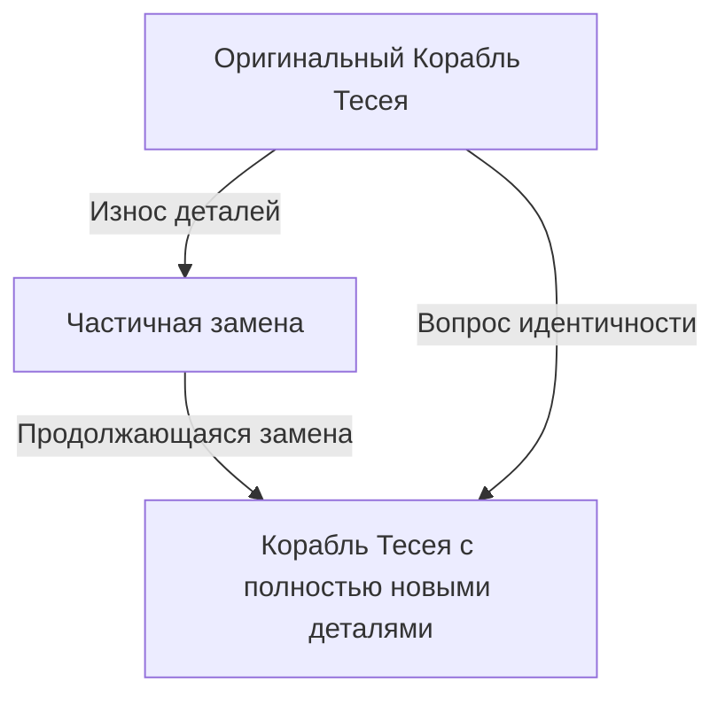
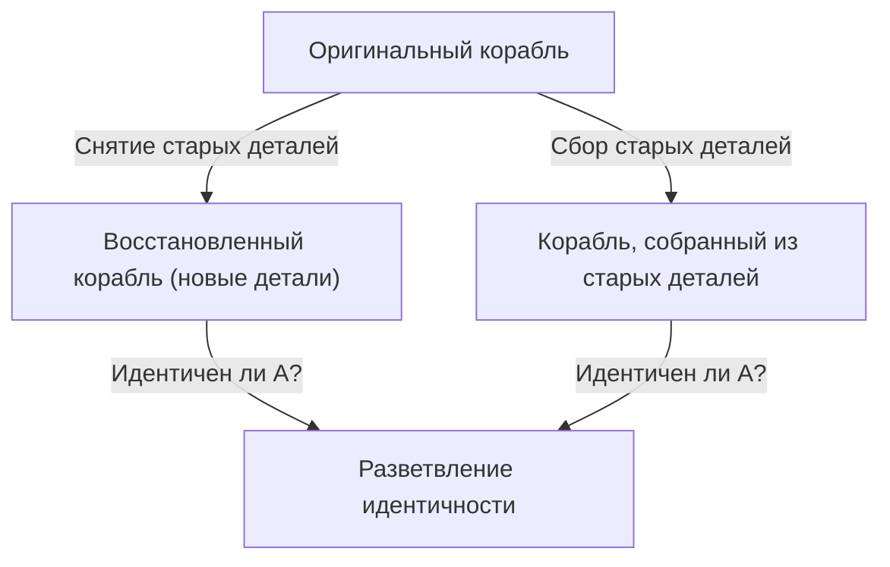

# Корабль Тесея: Абсолютный мысленный эксперимент, ставящий под сомнение границы идентичности

Являетесь ли «вы» тем же самым человеком, которым были 10 лет назад?

Считается, что большинство клеток человеческого тела заменяются в течение нескольких лет. Когда физические составляющие становятся совершенно иными, на чем мы основываем нашу уверенность в том, что мы по-прежнему «тот же человек»? Этот глубокий вопрос возник не благодаря современным технологиям, а восходит к философскому парадоксу, который обсуждается со времен Древней Греции — к «Кораблю Тесея».

В этой статье мы подробно и основательно рассмотрим самоидентичность, материю и форму, вплоть до цифровой идентичности в современном обществе, используя знаменитый мысленный эксперимент о «Корабле Тесея».

## 1. Что такое «Корабль Тесея»?

Происхождение «Корабля Тесея» восходит к труду «Сравнительные жизнеописания» древнегреческого философа Плутарха (около 46 - 119 гг. н.э.). Относительно корабля, на котором афинский герой Тесей вернулся с Крита, Плутарх оставил следующую запись:

> «Корабль с тридцатью веслами, на котором Тесей отправился вместе с афинскими юношами и благополучно вернулся, афиняне хранили до времен Деметрия Фалерского, удаляя старые доски по мере их гниения и вставляя новые, крепкие. В результате этот корабль стал постоянным примером среди философов в спорах о "логике роста (или изменения)": одни утверждали, что корабль остался тем же самым, а другие — что это уже не тот же корабль».

В этом и заключается суть парадокса.
Деревянный корабль со временем гниет. Предположим, что для ремонта была снята старая доска и прибита новая. На этом этапе все ответят: «Это все еще корабль Тесея». Но если пройдут десятилетия или столетия, и **все оригинальные деревянные части будут заменены на новые**, можно ли по-прежнему называть его «Кораблем Тесея»?

Этот вопрос остро указывает на двусмысленность слова «тот же самый», которое мы используем повседневно.

## 2. Расширение Томаса Гоббса: Появление второго корабля

Английский философ 17-го века Томас Гоббс добавил в этот парадокс еще один поворот. В своей книге «О теле» (De Corpore) он представил следующий экстремальный сценарий:

**«А что, если бы кто-то собрал все старые доски, снятые с корабля Тесея, и собрал из них второй корабль точно такой же формы, какой из них был бы настоящим кораблем Тесея?»**

С этим мысленным экспериментом проблема становится еще сложнее.

В сценарии Гоббса есть два кандидата:
1. **Корабль непрерывности (восстановленный корабль)**: Корабль, который был пришвартован в гавани Афин, продолжал функционировать и который люди по-прежнему называли «Кораблем Тесея» (хотя все материалы в нем новые).
2. **Материальный корабль (реконструированный корабль)**: Корабль, сделанный из точно такого же физического материала, что и первоначальный корабль.

Если «идентичность материалов» является условием идентичности, то последний является подлинным. Но если условием является «пространственно-временная непрерывность», то первый. Поскольку логически невозможно существование двух «Кораблей Тесея» одновременно, мы должны выбрать один из них.

## 3. Подход через учение Аристотеля о четырех причинах

Чтобы раскрыть эту проблему, давайте применим философию «Четырех причин» древнегреческого мыслителя Аристотеля. Аристотель классифицировал причины существования вещей на четыре категории.

1. **Материальная причина**: Из чего это сделано (дерево, гвозди и т.д.)
2. **Формальная причина**: Форма, чертеж или структура вещи (дизайн корабля, форма)
3. **Действующая причина**: Субъект или процесс, создавший это (плотники, реставрационные работы)
4. **Целевая причина**: Цель, ради которой это существует (для плавания, как памятник герою)

В этих рамках парадокс «Корабля Тесея» можно перефразировать как вопрос: «Ищем ли мы идентичность вещи в ее материальной причине, или же в формальной и целевой?»

Те, кто утверждает, что «это другая вещь, потому что все материалы были заменены», подчеркивают **материальную причину**.
С другой стороны, те, кто утверждает, что «это тот же самый корабль, потому что его форма и структура одинаковы, и цель — увековечить Тесея — та же», подчеркивают **формальную причину** и **целевую причину**. Человеческая интуиция часто поддерживает формальную причину. Представьте себе течение реки. Молекулы воды, текущие в реке Камо, никогда не бывают теми же самыми ни на секунду. Все время поступает новая вода. Однако мы всегда называем эту реку «река Камо». Идентичность реки заключается не в составляющей ее «воде (материи)», а в «русле ее течения (форме)».

## 4. «Корабль Тесея» в современности: Клетки и сознание

Этот парадокс предстает как самая насущная проблема, когда речь заходит о «нас самих».

Биологический факт заключается в том, что человеческие клетки постоянно обновляются. Клетки слизистой оболочки желудка заменяются за несколько дней, клетки кожи — за несколько недель, а эритроциты — примерно за 120 дней. Через 7-10 лет большинство веществ, составляющих наше тело, заменяются атомами и молекулами, совершенно отличными от нашего прошлого.

Итак, являетесь ли вы тем же «самым» человеком, что и 10 лет назад? Почему мы уверены в том, что «мы — это мы», хотя наш физический материал совершенно другой?

Здесь на сцену выходит концепция **«психологической непрерывности»**. Английский философ Джон Локк утверждал, что личностная идентичность гарантируется не материей (телом), а непрерывностью памяти и сознания. Другими словами, пока мы помним вчерашнего себя, и прошлый опыт влияет на наше настоящее без разрыва этой цепи, мы продолжаем оставаться «тем же самым человеком».

## 5. Идентичность в обществе: Корпорации, группы, Сикинэн Сэнгу

Парадокс Корабля Тесея можно наблюдать в различных сферах жизни общества.

### Смена участников в музыкальной группе
Если все первоначальные участники покидают группу, и остаются только новые, является ли это той же группой? Пока наследуется «форма» в виде названия группы и песен, фанаты часто воспринимают ее как ту же группу.

### Сикинэн Сэнгу в святилище Исэ
В Японии существует прекрасный культурный ответ на Корабль Тесея: «Сикинэн Сэнгу» в святилище Исэ. Каждые 20 лет на соседнем участке возводится новое здание святилища точно такой же конструкции, а старое демонтируется. Этот ритуал продолжается уже более 1300 лет.
С материалистической точки зрения кажется, что каждые 20 лет появляется нечто новое, но в этом заключается глубокая философия: передача технологий и духа (формы) — это и есть способ поддержания вечной непрерывности.

## 6. Цифровая эпоха и самоидентичность

В наше время данные не подвергаются физическому износу, но копирование и перемещение создают новый парадокс. Более того, когда в будущем будет реализована «загрузка сознания» (перенос сознания в компьютер), парадокс достигнет своего апогея. Когда клетки мозга будут постепенно заменяться кремниевыми чипами, и в конечном итоге все будет механизировано, можно ли будет назвать сознание, находящееся там, «вами»?

## 7. Заключение: Является ли «то же самое» просто соглашением?

Самый большой урок, который преподносит нам Корабль Тесея, заключается в том, что **«идентичность — это не абсолютное свойство, присущее вещам, а просто соглашение или концепция того, как мы это воспринимаем»**.

Как учит буддийская концепция непостоянства, все в этом мире находится в потоке изменений. Парадокс возникает потому, что мы пытаемся найти фиксированную сущность, называемую «тот же самый корабль» или «тот же самый я». То, что мы называем «тем же самым», — это просто удобный ярлык, прикрепленный к постоянно меняющемуся процессу.

Жить — это как плыть на Корабле Тесея: путешествие, в котором мы постоянно отбрасываем свои старые сущности, включаем новые, и при этом продолжаем плести историю «я».
