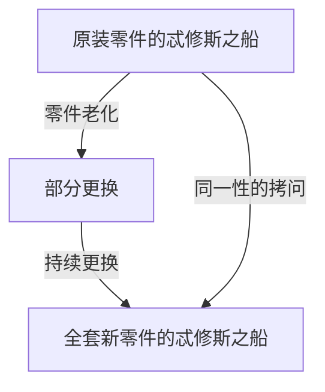
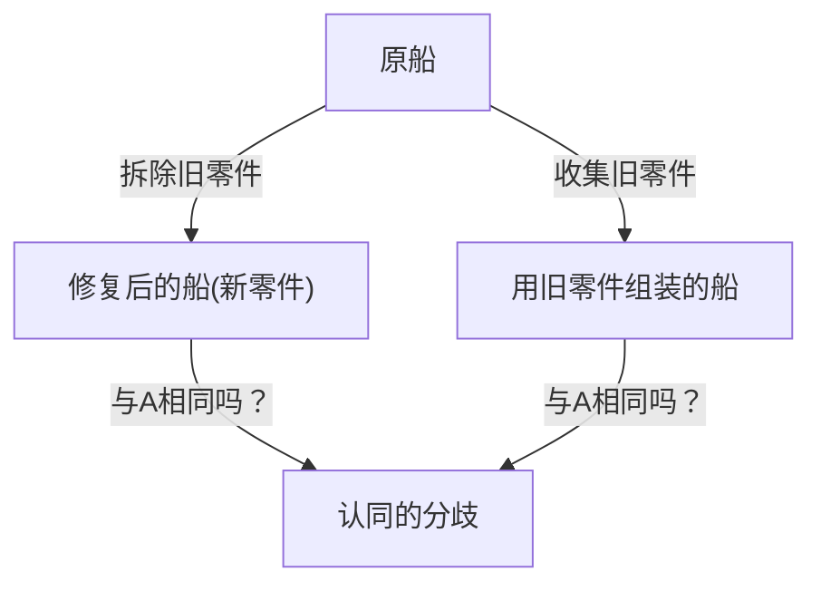

# 忒修斯之船：拷问认同边界的终极思想实验

“你”和10年前的“你”是同一个人吗？

据说人体的大部分细胞在几年内就会更替一遍。当物理构成要素完全变成另一套东西时，我们还能相信自己是“同一个自己”的根据究竟在哪里？这个深奥的问题并非现代科技带来的，而是归结于一个从古希腊时代起就被无休止争论的哲学悖论。那就是“忒修斯之船（Ship of Theseus）”。

在本文中，我们将以“忒修斯之船”这个著名的思想实验为立足点，极其详尽且透彻地探讨自我认同（同一性）、物质与形式，乃至现代社会中的数字身份等问题。

## 1. 什么是“忒修斯之船”？

“忒修斯之船”的起源可以追溯到古希腊哲学家普鲁塔克（约公元46年 - 119年）所著的《希腊罗马名人传》。关于雅典英雄忒修斯从克里特岛归来时乘坐的船，普鲁塔克留下了这样的记载：

> “忒修斯与雅典的年轻人们归来时乘坐的三十桨木船被雅典人保存下来，一直留存到德米特里·法勒雷乌斯的时代。他们拆掉腐朽的木板，换上坚固的新木材。结果，这艘船成了哲学家们探讨‘成长（或变化）的逻辑’的绝佳题材。有人主张‘它还是同一艘船’，而另一些人则主张‘它已经不再是同一艘船了’。”

这就是悖论的根源。
木造的船随着时间流逝会腐朽。假设为了修理，我们拆掉一块旧木板，钉上一块新木板。在此时，每个人都会回答“这依然是忒修斯之船”。然而，如果几十年、几百年过去，**原本的木材被完全更换为全新的木材**，那它还能被称为“忒修斯之船”吗？

这个问题尖锐地指出了我们日常使用的“相同”一词的模糊性。

## 2. 托马斯·霍布斯的扩展：第二艘船的出现

17世纪英国哲学家托马斯·霍布斯给这个悖论增添了进一步的曲折。他在其著作《论物体》（De Corpore）中提出了以下极端的设想：

**“如果有人把忒修斯之船上拆下来的旧木材全部收集起来，并按照原来的样子重新组装成一艘形状完全相同的船，那么哪一艘才是真正的忒修斯之船？”**

通过这个思想实验，问题变得更加复杂。

在霍布斯提出的设想中，存在两个候选者：
1. **连续性之船（修复后的船）**：一直停泊在雅典港口，持续发挥功能，并一直被人们称为“忒修斯之船”的船（材质全是新的）。
2. **材质之船（重建后的船）**：由与原船完全相同的物理材质构成的船。

如果“材质相同”是同一性的条件，那么后者才是真正的船。然而，如果“空间与时间的连续性”是同一性的条件，那么前者就是真正的船。由于不可能同时存在两艘“忒修斯之船”，我们必须做出选择。

## 3. 亚里士多德四因说的解释

为了解开这个问题，让我们运用古希腊巨星亚里士多德的哲学——“四因说”（Four Causes）。亚里士多德将事物存在的原因分为四类：

1. **质料因（Material Cause）**：它是由什么制成的（木材、钉子等）
2. **形式因（Formal Cause）**：它的形状、蓝图或结构（船的设计、形状）
3. **动力因（Efficient Cause）**：制造它的主体或过程（船匠、修复工作）
4. **目的因（Final Cause）**：它存在的目的（为了航海、作为英雄的纪念碑）

在这个框架下思考，“忒修斯之船”的悖论就可以转化为这样一个问题：“我们是去从质料因中寻找事物的同一性，还是从形式因和目的因中寻找？”

主张“物质全换了所以是另一个东西”的人，重视的是**质料因**。
另一方面，主张“形状和结构相同，纪念忒修斯的目的也相同，所以是同一艘船”的人，重视的是**形式因**和**目的因**。人类的直觉往往倾向于支持形式因。想象一下河流。流经“鸭川”的水分子每一秒都不一样，总是有新的水流涌入。然而，我们始终称那条河为“鸭川”。这是因为河流的同一性不在于构成它的“水（质料）”，而在于它的“流动路径（形式）”。

## 4. 现代的“忒修斯之船”：细胞与意识

这个悖论作为最迫切的问题浮现的地方，正是“我们自身”。

作为一个生物学事实，人类的细胞在不断进行新陈代谢。胃黏膜细胞几天就会更换，皮肤细胞几周就会更换，红细胞大约120天就会更换。在大约7到10年内，构成我们身体的绝大多数物质都被与过去完全不同的原子和分子所取代。

那么，10年前的你和现在的你，是“同一个”人吗？尽管物理材质完全不同，我们为何还能确信“自己就是自己”？

这就引出了<strong>“心理连续性（Psychological Continuity）”</strong>的概念。英国哲学家约翰·洛克主张，人格的同一性不是由物质（身体）来担保的，而是由记忆和意识的连续性来担保的。也就是说，只要你记得昨天的自己，过去的经验在影响着现在的自己，只要这条锁链不断，我们就依然是“同一个自己”。

## 5. 社会中的同一性：法人、乐队、式年迁宫

忒修斯之船的悖论可以在社会的许多场合中观察到。

### 乐队成员的更替
如果成立时的所有创始成员都已退出，只剩下新成员，这支乐队还是同一支乐队吗？只要乐队名称和乐曲这种“形式”被继承下来，粉丝通常会认为它是同一支乐队。

### 伊势神宫的式年迁宫
在日本，对忒修斯之船存在一个优美的文化解答。那就是伊势神宫的“式年迁宫”。在伊势神宫，每隔20年，就会在相邻的场地上新建一座设计完全相同的神殿，并拆除旧神殿。这个仪式已经持续了1300多年。
从唯物主义的视角来看，每隔20年它似乎就变成了一个不同的东西；但其中蕴含着一种高度的哲学：传承技术和精神（形式）才是保持永恒连续性的手段。

## 6. 数字时代与自我认同

在现代，数据不会产生物理磨损，但却催生了复制和移动的新悖论。进一步来说，如果未来实现了“意识上传（将意识转移到计算机）”，这个悖论将达到极点。当脑细胞逐渐被硅芯片取代，最终一切都机械化时，那里的意识还能被称为“你”吗？

## 7. 结论：“相同”只是一种共识吗？

忒修斯之船教给我们最大的教训是：**“同一性（认同）并非事物内在的绝对属性，只不过是我们如何认知它的一种共识或概念。”**

正如佛教的“诸行无常”所昭示的那样，世间万物都处于变化的洪流中。正是因为我们试图寻找“同一艘船”、“同一个我”这样固定不变的实体，才会产生悖论。我们所说的“相同”，只不过是为了方便而贴在一个不断变化的过程上的标签而已。

我们的人生，就像忒修斯之船一样，不断抛弃旧的自我，融入新的自我，但依然在这场航行中持续编织着名为“我”的故事。
