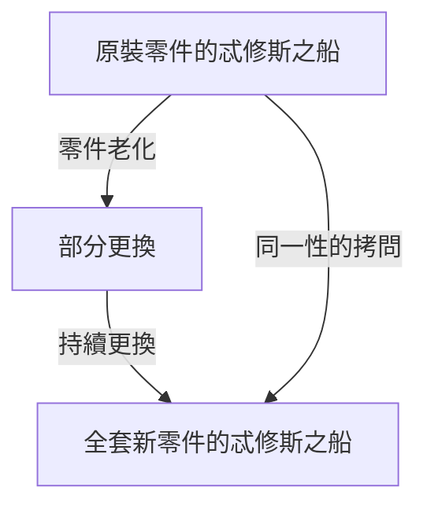
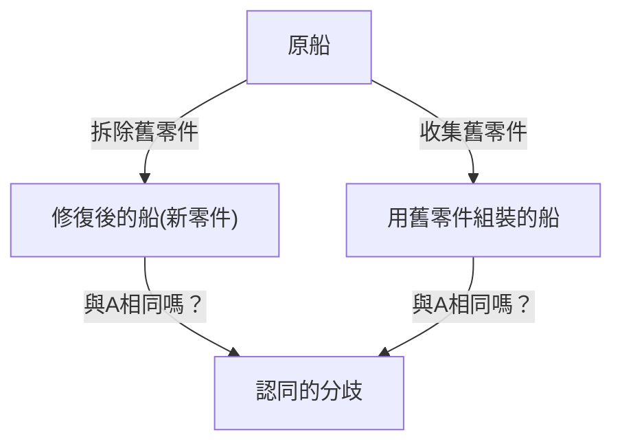

# 忒修斯之船：拷問認同邊界的終極思想實驗

「你」和10年前的「你」是同一個人嗎？

據說人體的大部分細胞在幾年內就會更替一遍。當物理構成要素完全變成另一套東西時，我們還能相信自己是「同一個自己」的根據究竟在哪裡？這個深奧的問題並非現代科技帶來的，而是歸結於一個從古希臘時代起就被無休止爭論的哲學悖論。那就是「忒修斯之船（Ship of Theseus）」。

在本文中，我們將以「忒修斯之船」這個著名的思想實驗為立足點，極其詳盡且透徹地探討自我認同（同一性）、物質與形式，乃至現代社會中的數位身分等問題。

## 1. 什麼是「忒修斯之船」？

「忒修斯之船」的起源可以追溯到古希臘哲學家普魯塔克（約西元46年 - 119年）所著的《希臘羅馬名人傳》。關於雅典英雄忒修斯從克里特島歸來時乘坐的船，普魯塔克留下了這樣的記載：

> 「忒修斯與雅典的年輕人們歸來時乘坐的三十槳木船被雅典人保存下來，一直留存到德米特里·法勒雷烏斯的時代。他們拆掉腐朽的木板，換上堅固的新木材。結果，這艘船成了哲學家們探討『成長（或變化）的邏輯』的絕佳題材。有人主張『它還是同一艘船』，而另一些人則主張『它已經不再是同一艘船了』。」

這就是悖論的根源。
木造的船隨著時間流逝會腐朽。假設為了修理，我們拆掉一塊舊木板，釘上一塊新木板。在此時，每個人都會回答「這依然是忒修斯之船」。然而，如果幾十年、幾百年過去，**原本的木材被完全更換為全新的木材**，那它還能被稱為「忒修斯之船」嗎？

這個問題尖銳地指出了我們日常使用的「相同」一詞的模糊性。

## 2. 托馬斯·霍布斯的擴展：第二艘船的出現

17世紀英國哲學家托馬斯·霍布斯給這個悖論增添了進一步的曲折。他在其著作《論物體》（De Corpore）中提出了以下極端的設想：

**「如果有人把忒修斯之船上拆下來的舊木材全部收集起來，並按照原來的樣子重新組裝成一艘形狀完全相同的船，那麼哪一艘才是真正的忒修斯之船？」**

透過這個思想實驗，問題變得更加複雜。

在霍布斯提出的設想中，存在兩個候選者：
1. **連續性之船（修復後的船）**：一直停泊在雅典港口，持續發揮功能，並一直被人們稱為「忒修斯之船」的船（材質全是新的）。
2. **材質之船（重建後的船）**：由與原船完全相同的物理材質構成的船。

如果「材質相同」是同一性的條件，那麼後者才是真正的船。然而，如果「空間與時間的連續性」是同一性的條件，那麼前者就是真正的船。由於不可能同時存在兩艘「忒修斯之船」，我們必須做出選擇。

## 3. 亞里斯多德四因說的解釋

為了解開這個問題，讓我們運用古希臘巨星亞里斯多德的哲學——「四因說」（Four Causes）。亞里斯多德將事物存在的原因分為四類：

1. **質料因（Material Cause）**：它是由什麼製成的（木材、釘子等）
2. **形式因（Formal Cause）**：它的形狀、藍圖或結構（船的設計、形狀）
3. **動力因（Efficient Cause）**：製造它的主體或過程（船匠、修復工作）
4. **目的因（Final Cause）**：它存在的目的（為了航海、作為英雄的紀念碑）

在這個框架下思考，「忒修斯之船」的悖論就可以轉化為這樣一個問題：「我們是去從質料因中尋找事物的同一性，還是從形式因和目的因中尋找？」

主張「物質全換了所以是另一個東西」的人，重視的是**質料因**。
另一方面，主張「形狀和結構相同，紀念忒修斯的目的也相同，所以是同一艘船」的人，重視的是**形式因**和**目的因**。人類的直覺往往傾向於支持形式因。想像一下河流。流經「鴨川」的水分子每一秒都不一樣，總是有新的水流湧入。然而，我們始終稱那條河為「鴨川」。這是因為河流的同一性不在於構成它的「水（質料）」，而在於它的「流動路徑（形式）」。

## 4. 現代的「忒修斯之船」：細胞與意識

這個悖論作為最迫切的問題浮現的地方，正是「我們自身」。

作為一個生物學事實，人類的細胞在不斷進行新陳代謝。胃黏膜細胞幾天就會更換，皮膚細胞幾週就會更換，紅血球大約120天就會更換。在大約7到10年內，構成我們身體的絕大多數物質都被與過去完全不同的原子和分子所取代。

那麼，10年前的你和現在的你，是「同一個」人嗎？儘管物理材質完全不同，我們為何還能確信「自己就是自己」？

這就引出了<strong>「心理連續性（Psychological Continuity）」</strong>的概念。英國哲學家約翰·洛克主張，人格的同一性不是由物質（身體）來擔保的，而是由記憶和意識的連續性來擔保的。也就是說，只要你記得昨天的自己，過去的經驗在影響著現在的自己，只要這條鎖鏈不斷，我們就依然是「同一個自己」。

## 5. 社會中的同一性：法人、樂團、式年遷宮

忒修斯之船的悖論可以在社會的許多場合中觀察到。

### 樂團成員的更替
如果成立時的所有創始成員都已退出，只剩下新成員，這支樂團還是同一支樂團嗎？只要樂團名稱和樂曲這種「形式」被繼承下來，粉絲通常會認為它是同一支樂團。

### 伊勢神宮的式年遷宮
在日本，對忒修斯之船存在一個優美的文化解答。那就是伊勢神宮的「式年遷宮」。在伊勢神宮，每隔20年，就會在相鄰的場地上新建一座設計完全相同的神殿，並拆除舊神殿。這個儀式已經持續了1300多年。
從唯物主義的視角來看，每隔20年它似乎就變成了一個不同的東西；但其中蘊含著一種高度的哲學：傳承技術和精神（形式）才是保持永恆連續性的手段。

## 6. 數位時代與自我認同

在現代，數據不會產生物理磨損，但卻催生了複製和移動的新悖論。進一步來說，如果未來實現了「意識上傳（將意識轉移到電腦）」，這個悖論將達到極點。當腦細胞逐漸被矽晶片取代，最終一切都機械化時，那裡的意識還能被稱為「你」嗎？

## 7. 結論：「相同」只是一種共識嗎？

忒修斯之船教給我們最大的教訓是：**「同一性（認同）並非事物內在的絕對屬性，只不過是我們如何認知它的一種共識或概念。」**

正如佛教的「諸行無常」所昭示的那樣，世間萬物都處於變化的洪流中。正是因為我們試圖尋找「同一艘船」、「同一個我」這樣固定不變的實體，才會產生悖論。我們所說的「相同」，只不過是為了方便而貼在一個不斷變化的過程上的標籤而已。

我們的人生，就像忒修斯之船一樣，不斷拋棄舊的自我，融入新的自我，但依然在這場航行中持續編織著名為「我」的故事。
