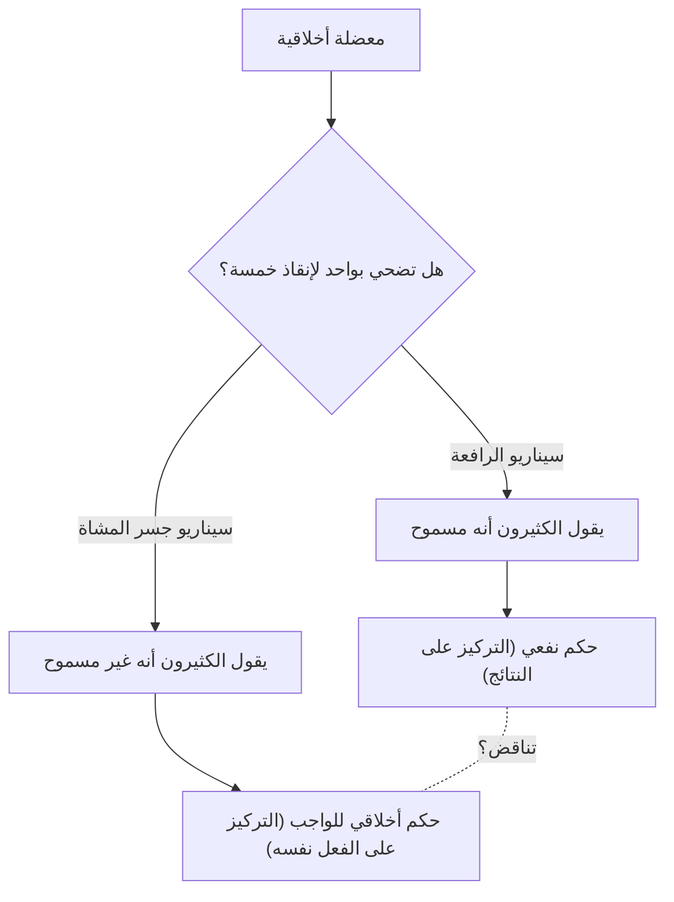
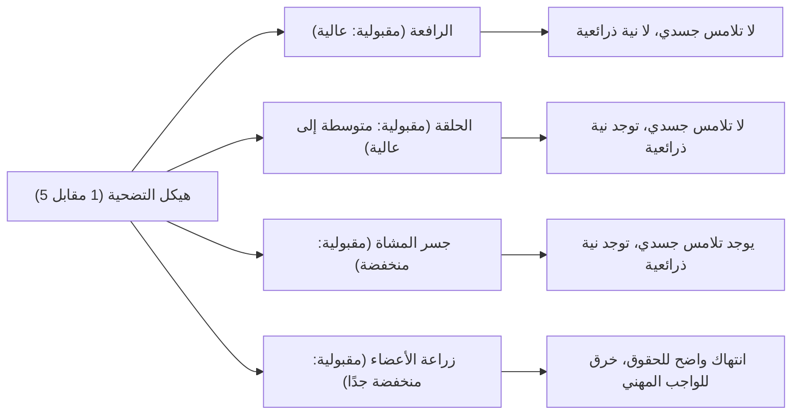

# مشكلة العربة: الخيار الأخلاقي المطلق وهاوية الحدس الأخلاقي البشري

## مقدمة: المعضلة الأخلاقية المطلقة

تخيل أنك تقف بجوار مسارات السكة الحديد. تسمع هديراً من بعيد، وتتجه نحوك عربة (ترام) فقدت السيطرة مسرعةً نحوك. إذا نظرت للأمام، سترى خمسة عمال على المسار، غير مدركين لاقتراب العربة. إذا استمرت الأمور على هذا النحو، فمن المؤكد أن الخمسة سيتعرضون للدهس حتى الموت.

ومع ذلك، يوجد بجوارك مباشرة رافعة لتبديل المسار (المحول). إذا سحبت هذه الرافعة، ستغير العربة مسارها إلى المسار الفرعي. ولكن، يوجد عامل آخر بمفرده على المسار الفرعي.

**"هل ستسحب الرافعة وتضحي بشخص واحد لإنقاذ خمسة؟ أم ستتجاهل الأمر وتترك الخمسة يموتون؟"**

هذا هو الشكل الأساسي لـ "مشكلة العربة" (Trolley Problem)، وهي تجربة التفكير الأكثر شهرة وإثارة للجدل في علم الأخلاق. بحسابات بسيطة، ينبغي أن يكون "إنقاذ خمسة أرواح أفضل من إنقاذ روح واحدة"، لكن الأمر ليس بهذه البساطة. في هذا المقال، ومن خلال هذه المعضلة المطلقة، سنستكشف بعمق عالم الحدس الأخلاقي البشري، بدءًا من النفعية وعلم الواجب، وصولاً إلى أحدث أبحاث علم الأعصاب وأخلاقيات الذكاء الاصطناعي في السيارات ذاتية القيادة.

## 1. ولادة مشكلة العربة: طرح فيليبا فوت

طُرحت مشكلة العربة لأول مرة في عام 1967 في ورقة بحثية بعنوان "مشكلة الإجهاض وعقيدة التأثير المزدوج" للفيلسوفة البريطانية فيليبا فوت (Philippa Foot). في الأصل، تم ابتكارها كتجربة فكرية مساعدة لتوضيح النقاش الأخلاقي حول الإجهاض.

في السيناريو الذي قدمته فوت (سيناريو الرافعة المذكور أعلاه)، يجيب غالبية الناس بأنه "يجب سحب الرافعة". السبب الشائع هو أن "موت شخص واحد أقل ضرراً من موت خمسة أشخاص". هذه الفكرة مدعومة بقوة بالموقف الأخلاقي المعروف بـ "النفعية" (Utilitarianism)، الذي دافع عنه جيريمي بنثام وجون ستيوارت ميل، والذي يعتبر أن "أكبر قدر من السعادة لأكبر عدد من الناس" هو الخير.

## 2. التطور بواسطة جوديث جارفيس طومسون: مفارقة الرجل البدين

لكن في عام 1985، قدمت الفيلسوفة الأمريكية جوديث جارفيس طومسون (Judith Jarvis Thomson) نسخة جديدة زادت من تعقيد النقاش بشكل كبير. وهو سيناريو "الرجل البدين" (The Fat Man).

### الرجل البدين على جسر المشاة

أنت تقف على جسر مشاة يمر فوق مسارات السكة الحديد. تحتك تقترب العربة المسرعة، وأمامها لا يزال هناك خمسة عمال. في هذه المرة، لا توجد رافعة. ولكن يقف بجوارك "رجل بدين" ذو بنية ضخمة جداً. إذا دفعته من فوق الجسر إلى المسار، سيشكل جسده الضخم عقبة توقف العربة، وسيتم إنقاذ أرواح الخمسة (ومع ذلك، من المؤكد أن الرجل الذي دُفع سيموت. بالمناسبة، وزنك خفيف جداً ولا يكفي لإيقاف العربة).

**"هل ستدفع الرجل البدين وتضحي بشخص واحد لإنقاذ خمسة؟"**

هيكل الضرر الرياضي مطابق تماماً للسيناريو الأول: "التضحية بواحد لإنقاذ خمسة". ومع ذلك، وبشكل مثير للدهشة، في هذا السيناريو تجيب الغالبية العظمى من الناس بأنه "لا ينبغي دفعه (غير مسموح)".

لماذا يُعتبر سحب الرافعة لقتل شخص واحد أمراً مقبولاً، في حين يُعتبر قتل شخص واحد بيديك عن طريق دفعه أمراً غير مقبول؟ هذا التناقض في الحدس هو الصعوبة الحقيقية (المفارقة) في مشكلة العربة.

## 3. النفعية مقابل علم الواجب: المعسكران الرئيسيان في علم الأخلاق

لتفسير هذا التناقض في الحدس، نحتاج إلى فهم نهجين رئيسيين في علم الأخلاق.

### النفعية (Utilitarianism)
هو الموقف الذي يقيم أخلاقية الفعل بناءً على "نتائجه". يعتبر الخيار الذي يؤدي إلى أكبر قدر من السعادة (أو تقليل الألم) خياراً صحيحاً. نظرًا لأن "موت خمسة أشخاص نتيجة أسوأ من موت شخص واحد"، فإن كلاً من سحب الرافعة ودفع الرجل البدين يُعتبران "أفعالاً صحيحة".

### علم الواجب (Deontology)
هو الموقف الذي يمثله إيمانويل كانط، والذي يقيم الأخلاق ليس بناءً على "نتائج" الفعل، ولكن بناءً على "طبيعة الفعل نفسه" أو "الدوافع". جادل كانط بأنه "يجب دائمًا معاملة البشر كغاية في حد ذاتهم، وليس كمجرد وسيلة".
إن فعل دفع الرجل البدين يعني استخدام إنسان واحد كـ "وسيلة (أداة)" لإنقاذ خمسة أشخاص، مما ينتهك كرامة الإنسان ويُعتبر شراً مطلقاً. من ناحية أخرى، في سيناريو الرافعة الأول، قد يُفسر موت الشخص الواحد على أنه "أثر جانبي متوقع (نتيجة عرضية)" كان يُرغب في تجنبه، وليس كـ "وسيلة مقصودة" لإنقاذ الخمسة (وهو ما يُعرف بعقيدة التأثير المزدوج التي سنناقشها لاحقاً).

## 4. متغيرات إضافية: الحلقة وزراعة الأعضاء

لا يتوقف بحث الفلاسفة هنا. فمن خلال تغيير شروط التجربة الفكرية بمهارة، يحاولون استكشاف حدود حدسنا الأخلاقي بشكل أعمق.

### سيناريو الحلقة (طومسون)
إنه سيناريو حيث يعود المسار الفرعي ليندمج مع المسار الرئيسي مكوناً حلقة. إذا سحبت الرافعة، ستدخل العربة المسار الفرعي. يوجد عامل ضخم على المسار الفرعي، وسيؤدي اصطدام العربة به إلى توقفها، مما ينقذ الخمسة على المسار الرئيسي. إذا لم يكن هذا الشخص موجوداً، ستمر العربة عبر الحلقة وتعود إلى المسار الرئيسي لتدهس الخمسة من الخلف.
في هذه الحالة، لا يُعد موت الشخص الواحد مجرد "أثر جانبي"، بل هو "وسيلة لا غنى عنها" لإنقاذ الخمسة (لأنه لولاه لما أمكن إنقاذهم). ومع ذلك، حتى في هذا السيناريو، يجيب الكثيرون بأن "سحب الرافعة أمر مسموح به". هذا يزعزع التفسير الكانطي المطبق على سيناريو الرجل البدين (الذي يمنع الاستخدام كوسيلة).

### سيناريو زراعة الأعضاء (فوت)
ينتقل المشهد إلى المستشفى. هناك خمسة مرضى سيموتون اليوم إذا لم يتلقوا عملية زراعة أعضاء بسبب فشل مميت في أعضاء مختلفة (القلب، الرئتين، الكلى، إلخ). ثم جاء شاب سليم لإجراء فحص طبي. أعضاؤه متوافقة مع جميع المرضى الخمسة. كطبيب، إذا قتلت هذا الشاب السليم سراً واستخرجت أعضائه لزراعتها في الخمسة، يمكنك التضحية بشخص واحد لإنقاذ خمسة.
في هذا السيناريو، يجيب 100% تقريباً من الناس بأنه "غير مسموح به على الإطلاق". ومع ذلك، فإن معادلة الضرر مطابقة تماماً لمشكلة العربة.

## 5. عقيدة التأثير المزدوج (Doctrine of Double Effect)

"عقيدة التأثير المزدوج"، التي تعود جذورها إلى اللاهوتي في العصور الوسطى توماس الأكويني، هي إطار قوي لتفسير تناقضات مشكلة العربة. وفقاً لهذا المبدأ، إذا كان الفعل يؤدي إلى كل من "نتيجة جيدة" و "نتيجة سيئة"، فإنه يُعتبر مسموحاً به إذا استوفى الشروط التالية:

1. أن يكون الفعل نفسه خيراً، أو على الأقل محايداً أخلاقياً.
2. أن تكون النتيجة الجيدة فقط هي المقصودة، وأن تكون النتيجة السيئة مجرد أثر متوقع وغير مقصود.
3. ألا تكون النتيجة السيئة وسيلة لتحقيق النتيجة الجيدة.
4. أن يكون هناك سبب كافٍ (التناسب) لتفوق النتيجة الجيدة على النتيجة السيئة.

في سيناريو الرافعة، فإن فعل "تحويل [مسار](/ar/p/windows-%E3%81%A7%D9%85%D8%B3%D8%A7%D8%B1%E3%81%AE%E9%80%9A%E3%81%A3%E3%81%9F%D9%85%D9%84%D9%81-%D8%AA%D9%86%D9%81%D9%8A%D8%B0%D9%8A%E3%81%AE%E5%A0%B4%E6%89%80%E3%82%92%E8%A6%8B%E3%81%A4%E3%81%91%E3%82%8B%E6%96%B9%E6%B3%95/) العربة" بحد ذاته محايد، وموت الشخص الواحد متوقع ولكنه غير مقصود، وليس وسيلة. ومع ذلك، في سيناريو جسر المشاة، يوجد فعل إيذاء مباشر يتمثل في "دفع شخص"، وموته (أو استخدام جسده كدرع) مقصود بحد ذاته كوسيلة لإنقاذ الخمسة، ولذلك يُعتبر غير مسموح به وفقاً لهذا المبدأ.

## 6. نهج علم الأعصاب وعلم النفس التطوري: نظرية العملية المزدوجة لجوشوا جرين

مع دخول القرن الحادي والعشرين، غادرت مشكلة العربة مقاعد الفلاسفة لتنتقل إلى مختبرات علوم الدماغ وعلم النفس. قدم عالم النفس في جامعة هارفارد جوشوا جرين (Joshua Greene) سيناريوهات مختلفة لمشكلة العربة للمشاركين في التجربة، وقام بمسح نشاط أدمغتهم باستخدام الرنين المغناطيسي الوظيفي (fMRI).

كانت النتائج مذهلة.
- عند التفكير في **سيناريو جسر المشاة** (ضرر ينطوي على اتصال جسدي مباشر)، تم تنشيط المناطق في أدمغة المشاركين المسؤولة عن **العواطف والحدس** (مثل اللوزة الدماغية) بقوة.
- عند التفكير في **سيناريو الرافعة** (ضرر لا ينطوي على اتصال جسدي)، أو عند محاولة اتخاذ قرار نفعي (خلافاً للحدس) بـ "وجوب الدفع" في سيناريو جسر المشاة، تم تنشيط المناطق المسؤولة عن **التفكير المنطقي والتحكم المعرفي** (مثل قشرة الفص الجبهي) بقوة في أدمغة المشاركين، واستغرقوا وقتاً أطول للإجابة.

من هنا اقترح جرين "نظرية العملية المزدوجة" (Dual-process theory).
يجادل بأن الأحكام الأخلاقية البشرية لا يحددها نظام منطقي واحد، بل تنشأ من التنافس بين نظامين: "نظام عاطفي وحدسي" قديم تطورياً، و"نظام معرفي وعقلاني" حديث تطورياً.
بالنسبة لأسلافنا في العصر الحجري، كان دفع أو ضرب رفيق باليد بشكل مباشر تهديداً يومياً، ولذلك تطوروا ليشعروا بنفور شديد (كابح عاطفي) تجاهه. ومع ذلك، فإن الضرر غير المباشر المتمثل في "سحب رافعة لقتل شخص بعيد" لم يكن موجوداً في عملية التطور، لذلك لا يعمل الكابح الحدسي بقوة. ونتيجة لذلك، في سيناريو الرافعة، تنتصر حسابات قشرة الفص الجبهي (1 < 5)، بينما في سيناريو جسر المشاة، يتغلب النفور العاطفي على هذه الحسابات.

أثار هذا الاكتشاف سؤالاً فلسفياً جديداً: "هل حدسنا الأخلاقي ليس حقيقة مطلقة، بل مجرد نتاج عرضي (أو خطأ) للتطور؟"

## 7. التطبيق في العالم الحقيقي: السيارات ذاتية القيادة وأخلاقيات الذكاء الاصطناعي

لم تعد مشكلة العربة مجرد تجربة فكرية بحتة، بل أصبحت تحدياً واقعياً للغاية في المجتمع الحديث. وأبرز مثال على ذلك هو تطوير "السيارات ذاتية القيادة (AI)".

عندما تواجه سيارة ذاتية القيادة حادثاً لا مفر منه بسبب عطل في الفرامل، كيف يجب برمجة الذكاء الاصطناعي؟
- هل يجب أن تستمر في السير للأمام وتدهس خمسة مشاة يعبرون ممر المشاة؟
- أم يجب أن تنحرف وتصطدم بجدار، مضحية بحياة المالك الذي يركبها (شخص واحد)؟

في استطلاع ضخم عبر الإنترنت بعنوان "الآلة الأخلاقية" (Moral Machine) أجرته جامعة معهد ماساتشوستس للتكنولوجيا (MIT)، تم تقديم سيناريوهات مختلفة لملايين الأشخاص حول العالم لتحديد من يجب أن تعطيه السيارة ذاتية القيادة الأولوية لإنقاذه (الشباب أم كبار السن، البشر أم الحيوانات، المشاة الملتزمون بالقانون أم المشاة الذين يتجاهلون الإشارات، إلخ).
ونتيجة لذلك، على الرغم من أن وجهة النظر النفعية القائلة بـ "ضرورة إنقاذ عدد أكبر من الأرواح" كانت قوية عالمياً، أصبح من الواضح أيضاً وجود اختلافات كبيرة حسب الخلفية الثقافية. على سبيل المثال، في الثقافات الشرقية، كان هناك ميل قوي لاحترام كبار السن، بينما في الغرب كان هناك ميل لإعطاء الأولوية للشباب والأطفال.

هل ينبغي لشركات تطوير الذكاء الاصطناعي أن تنفذ برامج في سياراتها "تنقذ الآخرين حتى لو كان ذلك على حساب المالك"؟ وإذا تم تنفيذ ذلك، هل سيشتري المستهلكون "سيارة قد تقتلهم"؟ (في العديد من الاستطلاعات، أجاب الناس بأنه "من المستحسن أن تتصرف السيارات ذاتية القيادة بشكل نفعي لصالح المجتمع ككل"، بينما قدموا إجابات متناقضة تفيد بأنهم "لا يريدون شراء سيارة كهذه لأنفسهم (يريدون شراء سيارة تحميهم كأولوية قصوى)").

لم تعد مشكلة العربة لعبة في الفصول الدراسية للفلسفة، بل أصبحت قضية عملية ملحة يواجهها المهندسون وعلماء القانون وصناع السياسات.

## 8. تطبيقات ومتغيرات واقعية أخرى

إلى جانب القيادة الذاتية، هناك العديد من الحقائق التي تحمل بنية شبيهة بمشكلة العربة.

### الفرز الطبي (Triage) في الطب
أثناء الكوارث واسعة النطاق أو الأوبئة (مثل بداية تفشي فيروس كورونا المستجد)، عندما يكون هناك نقص في الموارد الطبية مثل أجهزة التنفس الصناعي، يُجبر الأطباء على اتخاذ قرار بشأن من سيتم تخصيص الموارد له ومن سيتم التخلي عنه. إن قرار "تركيز الموارد على الشباب الذين لديهم فرص أكبر للبقاء على قيد الحياة، وتأجيل كبار السن الذين لديهم فرص أقل للنجاة" هو بالضبط ممارسة لمشكلة العربة بناءً على النفعية.

### الهجمات الموجهة بالطائرات العسكرية بدون طيار
إذا تم قصف مبنى يختبئ فيه زعيم إرهابي بطائرة بدون طيار، يمكن منع العديد من الهجمات الإرهابية في المستقبل، ولكن في الوقت نفسه سيسقط مدنيون أبرياء في الجوار كأضرار جانبية. كيف يجب على القائد العسكري حساب توازن هذه التضحيات؟

## خاتمة: معنى مواجهة الأسئلة التي ليس لها إجابات

في النهاية، لا توجد "إجابة صحيحة مطلقة" لمشكلة العربة. فكل من سحب الرافعة وعدم سحبها يحتوي على أسس أخلاقية قوية، وعيوب قاتلة.

الهدف الحقيقي من التجارب الفكرية ليس تقديم إجابة واحدة صحيحة. بل هو زعزعة افتراضاتنا عن القيم الأخلاقية التي نحملها دون وعي، وكشف حدودها وتناقضاتها في وضح النهار.
نحن جميعاً نؤمن بعدة قواعد أخلاقية في نفس الوقت، مثل "الأرواح متساوية"، و"القتل شر"، و"يجب إنقاذ عدد أكبر من الناس". ولكن في المواقف القصوى التي تتصادم فيها هذه القواعد، ندرك لأول مرة مدى ضحالة أخلاقنا ومدى تعقيد الوجود البشري.

في مجتمع المستقبل، قد يقترب اليوم الذي تتخذ فيه تقنيات الذكاء الاصطناعي قرارات معقدة نيابة عنا. ومع ذلك، فإن نحن البشر من يقرر نوع الأخلاق التي سُتُعلّم لهذا الذكاء الاصطناعي. إن رافعة العربة المسرعة موجودة الآن في أيدي مجتمعنا بأسره.
